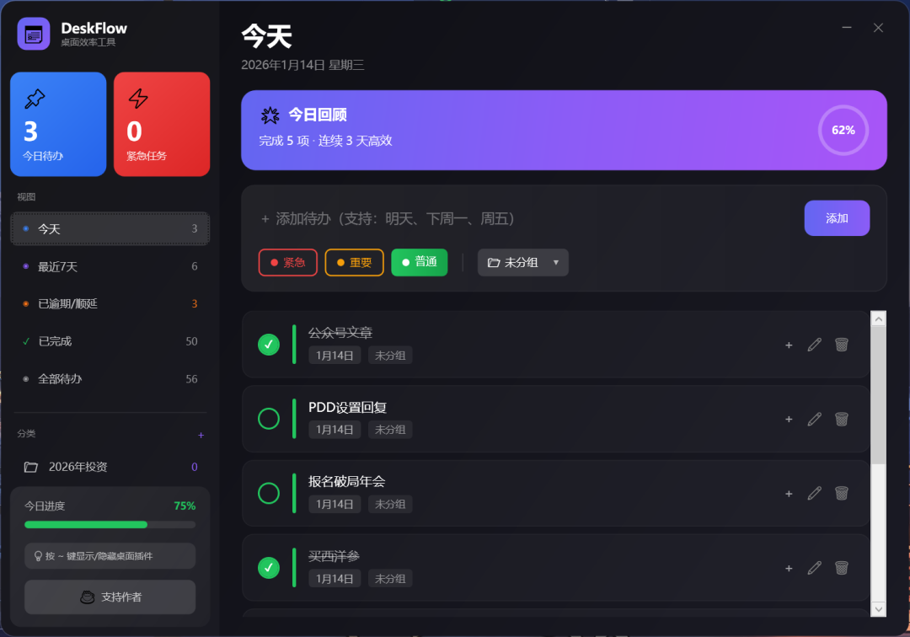
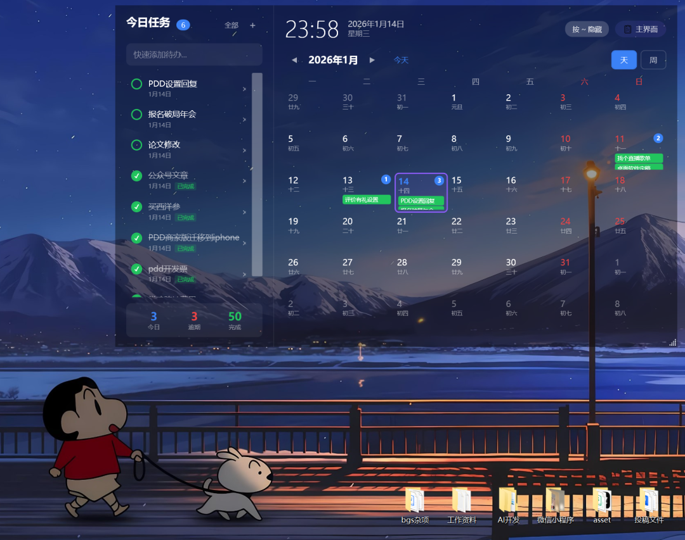
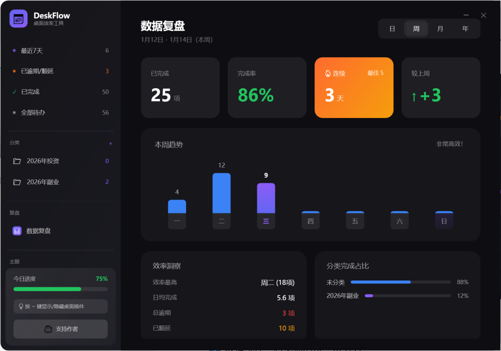
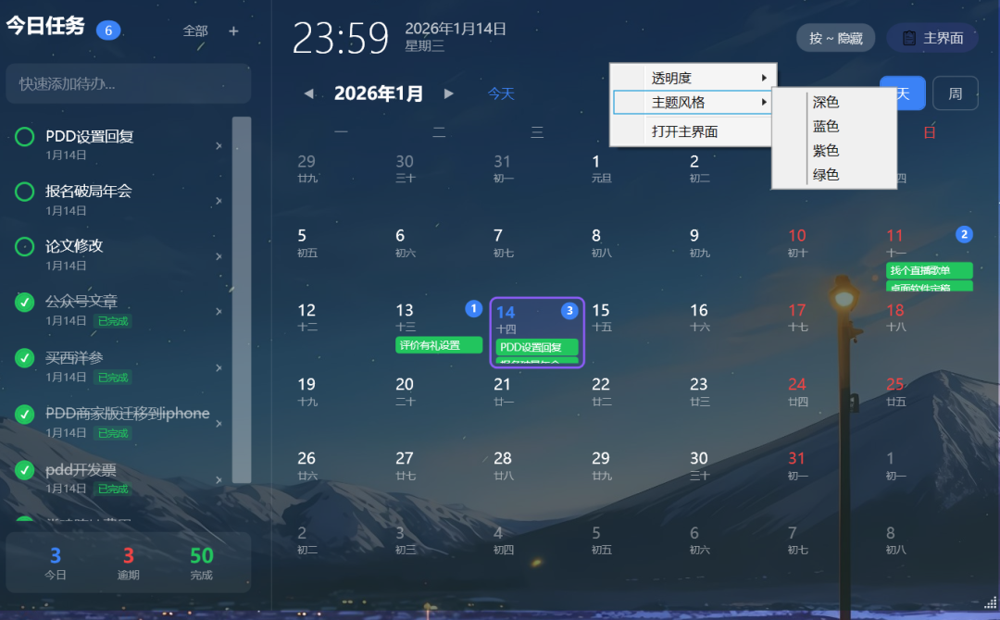

# 桌面代办清单DeskFlow

> 早上打开电脑，便利贴密密麻麻贴满屏幕边缘；手机待办 APP 里躺着上百条未完成事项，越看越焦虑；开了好几个浏览器标签页，生怕漏了今天的关键任务。

你有没有这样的经历？

早上打开电脑，便利贴密密麻麻贴满屏幕边缘；手机待办 APP 里躺着上百条未完成事项，越看越焦虑；开了好几个浏览器标签页，生怕漏了今天的关键任务。
结果呢？

我自己就是一个极其健忘的人，经常一天下来，最重要的事一件没做，倒是在各种工具之间反复横跳，越忙越乱。
为了找一款趁手的待办工具，我试了不少热门款，却总不尽人意：
Notion

 — 功能太全太笨重，打开要等 3 秒，记个待办像写论文，复杂到劝退

滴答清单

 — 功能强大但冗余，我日常只用得到 10%，剩下的全是负担；

Windows 便签

 — 界面简陋，关机容易丢记录，完全没安全感；

手机 APP

 — 电脑办公时，还要掏手机看待办，来回切换太割裂。

🤦‍♂️ 踩遍工具坑后，我决定自己做一个产品

✨ 它叫 DeskFlow，我的第一个产品(主界面如下)

🎯 核心功能：解决待办管理的核心痛点

1️⃣ 桌面小部件，一眼看清所有事

不用打开任何窗口，待办事项直接悬浮在桌面角落。按~键，随时隐藏 / 显示，丝毫不影响工作界面。

2️⃣ 分类管理，杂乱任务变有序

工作、学习、生活、健身……不同事项放进不同 “抽屉”，再也不会把 “下班买菜” 和 “提交报告” 混在一起。

思路清晰了，做事效率自然翻倍。

3️⃣ 数据统计，看见你的每一份努力

数据不会骗人，你的坚持和付出，值得被看见。

4️⃣ 主题切换，熬夜办公也护眼

纯黑背景搭配低饱和度渐变色，颜值在线且不刺眼。
程序员、设计师、夜猫子再也不用担心长时间使用伤眼睛。

好看的工具，才会让人更愿意坚持用下去。

🔜 下一步：即将上线，邀你共同期待

1 月 14 日，DeskFlow 核心功能已全部完成，现在进入最后的优化调试阶段，很快就能正式上线和大家见面！
拼尽全力在三天内完成！！
后续我还会持续打磨更多实用功能，您的需求就是我的方向，欢迎在评论区告诉我，你最想要什么功能？每一条建议，我都会认真参考。

💰 关于使用：完全免费，无任何套路

DeskFlow从一开始就是为了解决痛点而生，上线后完全免费：没有广告，没有会员，没有隐藏收费，大家可以放心使用。
如果后续你觉得它帮到了你，愿意请我喝杯咖啡 ☕，我会特别开心；不请也没关系，你能把它用起来，就是对我最大的支持。
作为我的第一篇公众号文章、第一个产品，DeskFlow可能还有不完美的地方，但我会带着诚意持续打磨。
做产品的初心很简单：用简单的工具解决真实的痛点。如果它能帮你告别待办混乱，提高哪怕一点点效率，我所有的付出都值得。
上线后，也欢迎大家多提建议，让我们一起把 DeskFlow 变得更好用～
我们上线见 👋
