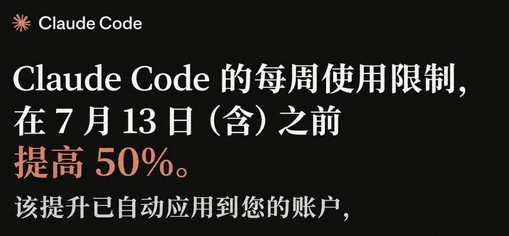
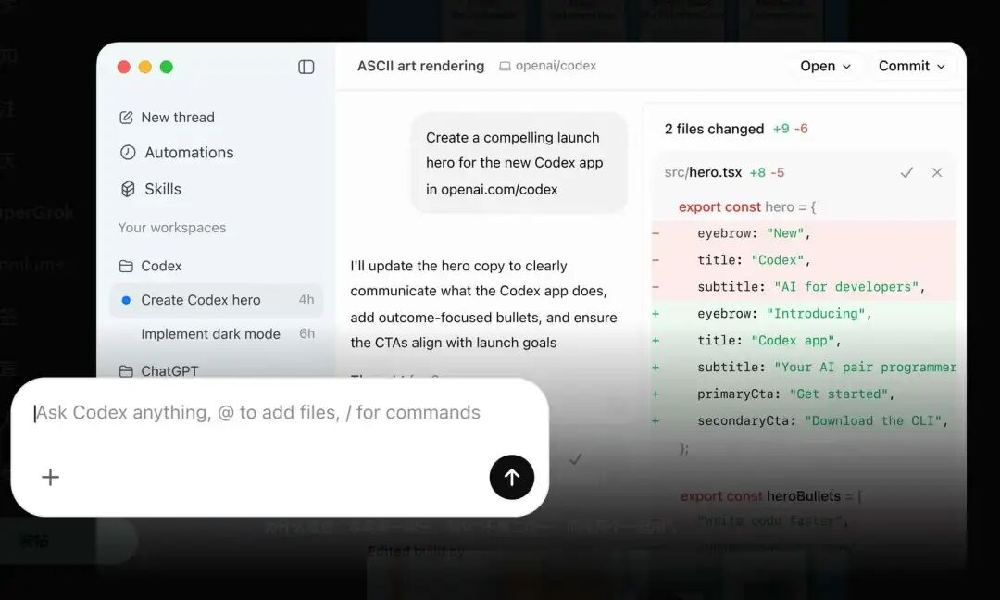
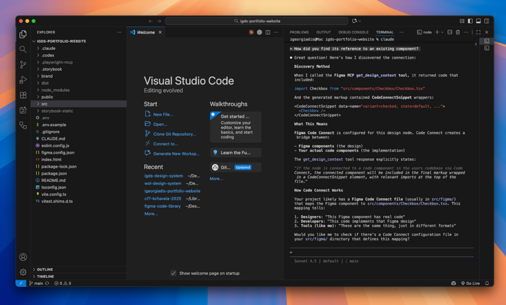
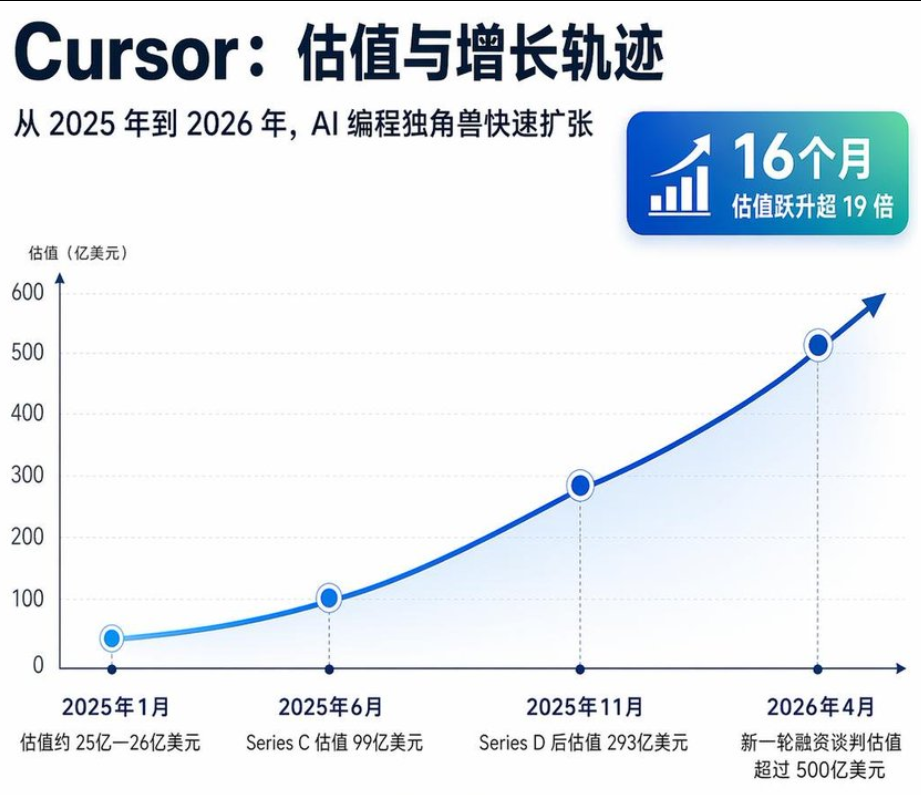
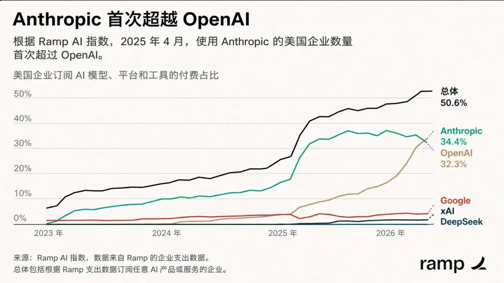
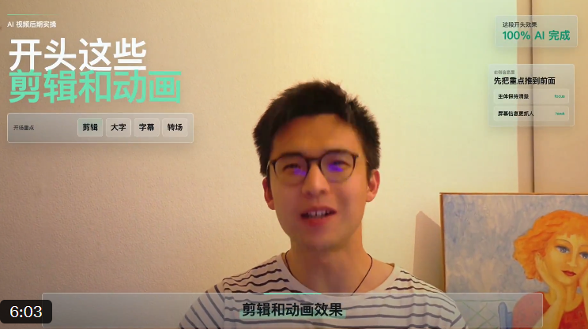

# 方鑫一人公司日报 No.100 | 一人公司纪实继续更新 | Claude 限额与 Codex 思考

> 我思考了几天，我决定还是把一人公司纪实坚持下去，这个内容对我来说很重要，很多读者也给我反馈希望能坚持历下去。

我思考了几天，我决定还是把一人公司纪实坚持下去，这个内容对我来说很重要，很多读者也给我反馈希望能坚持历下去。

我觉得之前还是有些在意流量和结果，其实如果这个专栏的目的是为了分享和提升自己，限流其实意义也不大，不必在意。

不过我还是做了一个调整，就是我每天都会更新，但是更新时间不固定。

之前每天的日报我大概写作时间在2-3个小时左右，有时候晚上写很容易熬夜写到很晚，很伤身体，所以我调整为每天随机时间写，得空我就写，这样能给我更多的时间去书写更高的质量。

板块还是固定的111，一个信息差，一人公司纪实，一个想法。

一、Claude周限额提升50%

今天看到一张图。

Claude Code 的周限额提升 50%，从现在开始持续到 7 月 13 日。

已经面向 Pro、Max、Team，以及按席位计费的企业用户生效。

看来 Anthropic 应该是真的感受到来自 Codex 的压力了。

最近这段时间，我能明显感觉到，Codex 的声量开始起来了。

而且不是那种营销层面的声量，是很多真实开发者在用完之后，开始很认真地说，诶，这玩意好像真的挺能干。

我自己也是其中一个。

以前我用 Claude Code 的时候，经常有一种感觉，东西是好东西，但你得伺候它。

额度要省着用。

任务要拆得很小心。

动不动就担心它突然把你封了。

但 Codex 给我的感觉完全不一样。

它对下沉市场，对普通开发者，对非专业程序员，其实更友好。

Codex 像一个高效执行的实习生，快，准，省，能批量干活。

Claude Code 更像深度思考的资深工程师，擅长复杂重构、架构判断、工程思考。

所以很多真正高频用 AI 编程的人，最后大概率不是二选一，而是两个一起用。

复杂的、需要深度判断的东西，交给 Claude Code。

大量执行、批量修改、日常推进，交给 Codex。

这其实才是现在最真实的 AI 编程状态。

不是谁彻底打死谁，而是分工开始出现了。

回头看 Cursor 为什么之前那么火，也很有意思。

因为 Cursor 是少数真正打爆 C 端的 AI 产品，估值简直在飞。

大部分现在能稳定赚钱的 AI 大厂产品，其实还是偏 To B。

Anthropic就是典型的to B企业。

为什么他们敢明目张胆的封个人用户？

因为他们根本不在乎C端用户花的钱，多几万个20美金订阅一个月有什么意义呢？

他们要的是稳定挣企业，开发团队，组织的钱。

策略也确实非常成功，在今年4月的时候，Anthropic的企业订阅率已经超过OpenAI。

而 Cursor 在很短的时间里，让大量独立开发者、学生、创业者愿意自己掏钱。C 端用户其实比 B 端要现实多了。

体验要好。

价格要能接受。

限额不能太憋屈。

更重要的是，成本要算得过来。

这也是我最近转向 Codex 最明显的感受。

不只是便利性提升了。

还有成本下降了。

如果你用过中转，或者你真的认真看过 token 消耗，你会非常明显地感受到，GPT-5.5 的价格比 Opus 4.7 低太多了（我指的低价通道）。

五月到现在，我在 AI Token 上花的钱只有四月的十分之一。

但背后其实是一个很真实的趋势。

AI 编程工具已经从「谁最聪明」进入到「谁更好用、谁更稳定、谁更便宜、谁更适合高频使用」的阶段了。

用户不会永远为信仰付费。

尤其是一人公司这种状态，每一块钱、每一次调用、每一个小时，都要算账。

所以 Claude Code 提升周限额这件事，我觉得它表面上是福利。

但往深一点看，是竞争开始真的打起来了。

这对用户当然是好事。

工具越卷，我们越爽。

二、今日行动——AI剪辑

今天除了日常产品更新维护，我主要在研究一个东西。

AI 剪辑。

为什么突然研究这个？

很简单，因为我自己的剪辑能力其实非常差。

这也是为什么我起号的时候，更多选择口播形式。

口播对我来说最省事。

打开手机，想清楚要说什么，录下来，剪掉废话，加个字幕，基本就能发。

它便捷，快速，也适合我。

但我心里很清楚，如果后面想往上走，只靠口播是不够的。

更精细的画面。

更紧凑的视频节奏。

更好的教程结构。

更有设计感的课程呈现。

这些东西一定会把内容专业度往上拉一个台阶。

问题是，我没有太多时间去系统学习剪辑。

轻度学习我可以接受。

比如知道基本概念，知道怎么判断一个视频好不好，知道怎么跟工具协作。

但如果让我重度学习 Pr、AE，从头开始啃剪辑体系，我会觉得这有点开倒车。

我宁愿花 1 到 2 万块钱请一个剪辑，也不愿意自己硬学。

所以我的眼光自然就放到了 AI 剪辑上。

我现在有一个判断，AI 剪辑这个领域还处在未爆发阶段。

AI 对话已经爆发了。

AI 生图已经爆发了。

AI 视频也已经爆发了。

但 AI 剪辑，还没有真正爆发。

为什么？

因为剪辑这件事太主观了。

它不是简单地把素材拼起来。

剪辑里面有节奏，有取舍，有画面切换，有字幕位置，有音乐情绪，有转场，有重点强调，还有创作者自己的表达意图。

你想想看，这就很复杂。

AI 生图，你给 prompt，它出图。

AI 视频，你给画面描述，它生成一段。

但剪辑不一样。

剪辑更像是在做判断。

哪里该停。

哪里该切。

哪里该放大。

哪里该加字幕。

哪里该用音乐顶一下。

哪里该突然安静。

这些东西非常细。

而且很吃审美。

所以 AI 剪辑现在没有像 AI 生图那样一下子炸开，我觉得是正常的。

但如果你最近有心留意一些 AI 博主的视频，你会发现，简单的 AI 剪辑其实已经开始进入视频制作了。

最明显的就是在视频画面里复现 HTML，我觉得这种文字复现的效果还是非常棒的。

也就是把一个网页、一个小组件、一个可视化界面，直接叠到视频里。

这个效果单独看，可能不算什么黑科技。

但放到视频里，它能立刻把专业度拉起来。

再配一点音乐，节奏稍微收紧一点，整个视频的质感就完全不一样。

当然，AI 剪辑这个东西，对大部分普通人来说可能没什么用。

如果你不做视频，不做课程，不做内容分发，那它跟你关系不大。

但对我这种人来说，它的价值非常直接。

一方面，它可以提高我自己的自媒体专业度。

另一方面，如果后面我真的把 AI 剪辑这套流程玩得比较熟，跑出一套稳定方法，我也可能会把它沉淀成付费课程或者答疑。

我自己也还在摸索。

但我觉得这个方向值得长期盯。

因为每一次内容生产工具的变化，都会重新分配一批人的优势。

以前会剪辑的人，有优势。

后来会写 prompt、生图、做视频的人，有优势。

下一步，可能就是会把 AI 视频、AI 剪辑、HTML 动效、口播表达整合起来的人，有优势。

我现在就在看，这个优势能不能被我抓住。

三、能动性

今天想聊一个词。

能动性。

做 AI 自媒体这几个月，我越来越明显地看出人与人之间的差距。

而且这个差距，不完全来自智商，也不完全来自资源。

它很大程度上来自能动性。

有些人看到一个工具，第一反应是，怎么用它搞点东西出来。

有些人看到一个工具，第一反应是，等别人把教程做出来。

有些人看到一个机会，马上去试，试错，复盘，再试。

有些人看到一个机会，先收藏，先转发，先说以后有空研究。

然后就没有然后了。

这就是能动性的差距。

AI 很有意思的地方在于，它不会自动让所有人变强。

很多人以为 AI 是一种平权工具。

好像有了 AI，大家都站在同一起跑线上了。

AI 当然降低了门槛。

但它同时也在放大差距。

低能动性的人用 AI，会进一步丧失能动性。

因为大部分人会越来越习惯把问题丢给 AI。

帮我想一个选题。

帮我写一篇文章。

帮我做一个方案。

帮我看看怎么赚钱。

这种人用 AI，最后不是更强了，而是更依赖了。

高能动性的人完全不一样。

他会把 AI 当成放大器。

想到一个东西，立刻让 AI 拆解。

拆完之后马上做。

做完之后继续问，哪里不行，怎么改，能不能自动化，能不能批量化，能不能产品化。

他不会停在「AI 给我一个答案」那里。

他会把 AI 变成腿，变成手，变成临时员工，变成研究员，变成复盘工具。

所以同样是用 AI，结果完全不一样。

能动性具有自我强化的特性。

以前没有 AI 的时候，能动性强的人就已经更容易跑出来。

因为他愿意学，愿意试，愿意丢脸，愿意把事情往前推。

现在有了 AI，这个差距被进一步放大了。

高能动性的人，本来一天只能试 1 个想法，现在一天能试 5 个。

本来一个人只能做一件事，现在可以同时推进写作、产品、剪辑、代码、运营。

本来很多事情要卡在不会上，现在可以先让 AI 推着往前走。

这太恐怖了。

但另一边，低能动性的人也被放大了。

他以前只是拖延。

现在他可以用 AI 包装自己的拖延。

看起来每天都在问 AI。

每天都在收藏工具。

每天都在研究提示词。

但真实世界里，什么都没有发生。

没有发布。

没有产品。

没有内容。

没有用户。

没有收入。

只有一堆对话记录。

我说这个其实不是为了批评别人。

我自己也会掉进这个坑。

有时候我也会沉迷于和 AI 聊，觉得自己好像推进了很多东西。

但只要最后没有落到一个文件、一个页面、一个视频、一个产品、一个发布动作上，那其实都不算数。

所以第 100 天，我反而更想提醒自己这件事。

今天动一点，明天动一点，后天再动一点。

而只要还在动，就还有机会。
