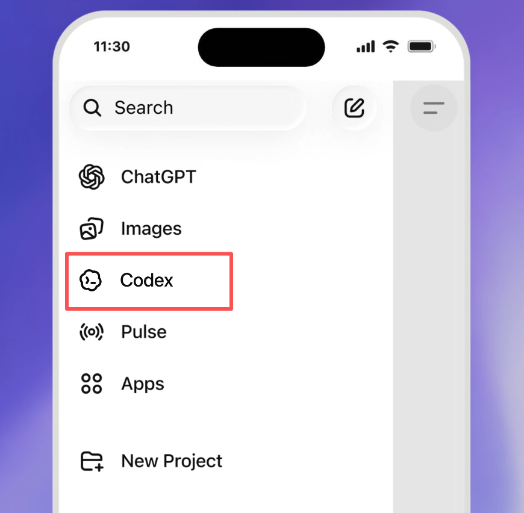
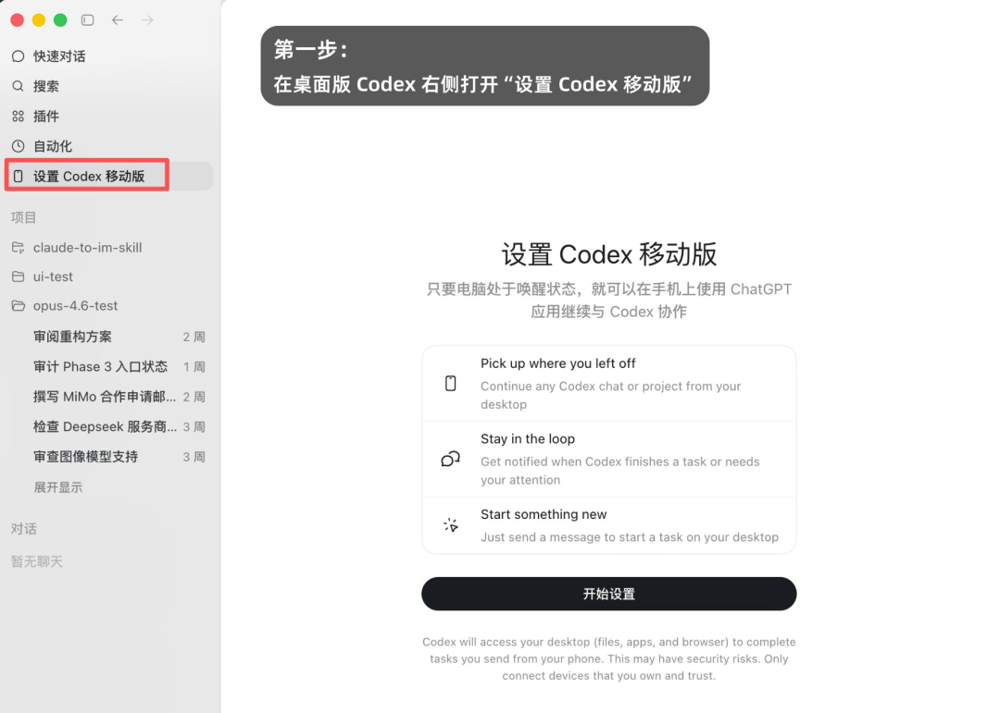
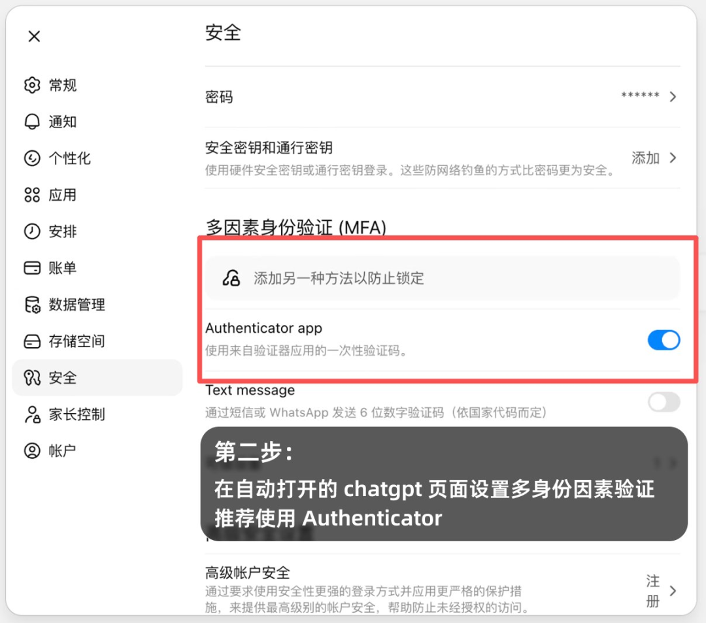
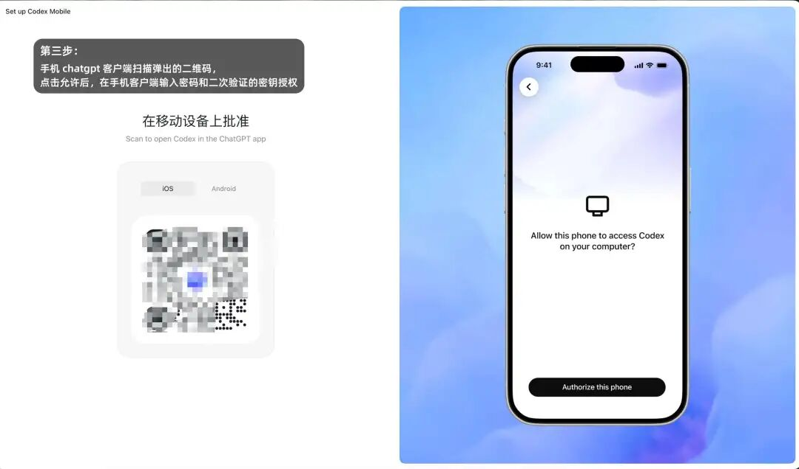
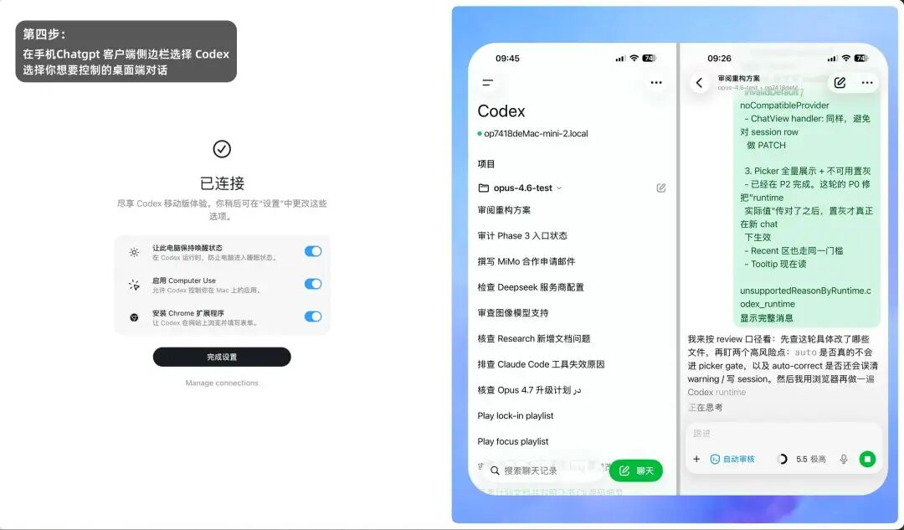
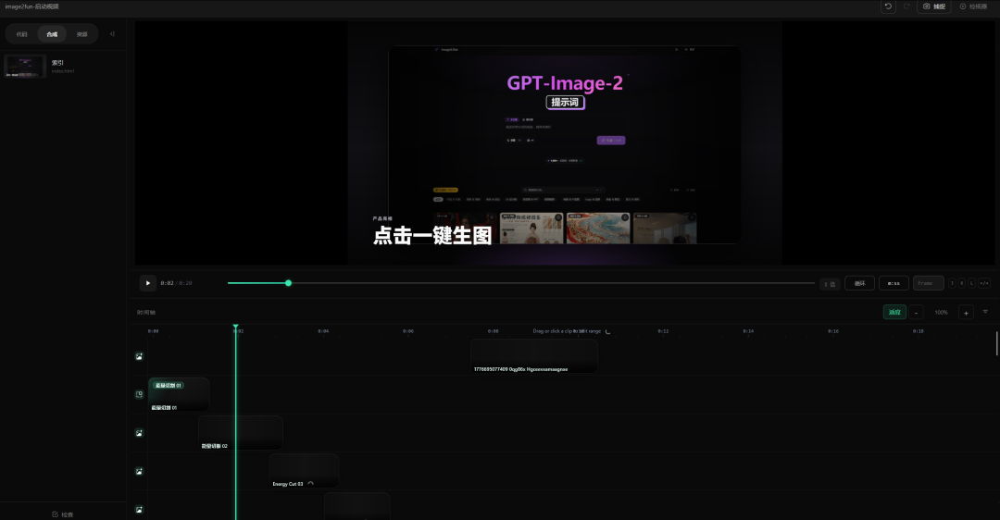
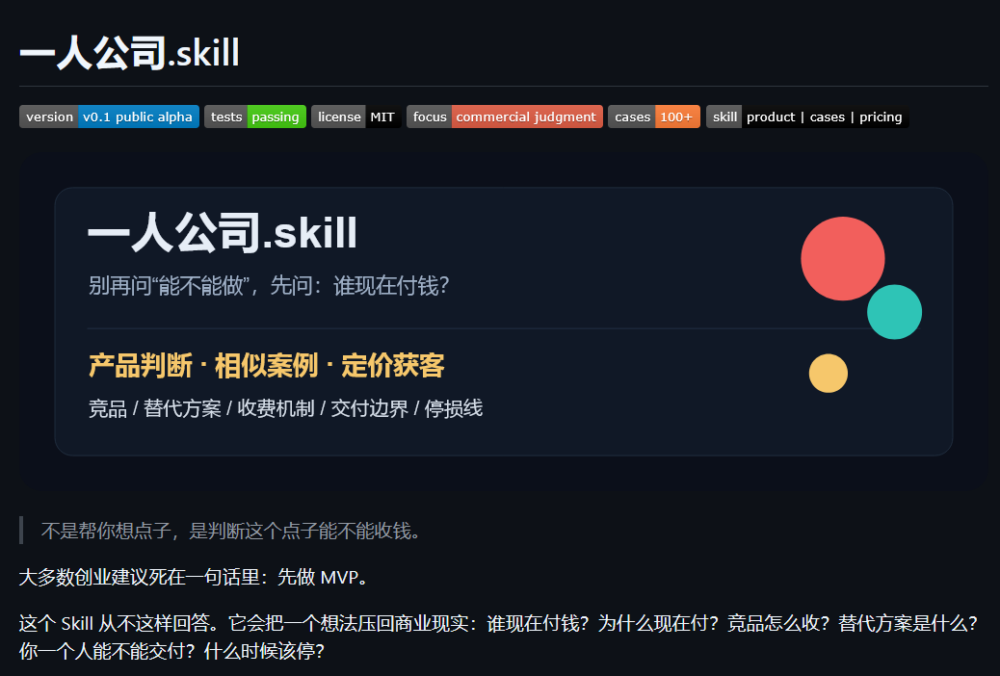

# 方鑫一人公司日报 No.101 | Codex 手机端 | HyperFrames 视频与 AI 剪辑

> 原文：<https://fxin.cc/journal/day-101>

> 大家好，我是方鑫，今天是一人公司第 101 天。

大家好，我是方鑫，今天是一人公司第 101 天。

本文约 2000 字，预计阅读时间 7 分钟。

一、Codex上线手机端

OpenAI 把 Codex 放进 ChatGPT 手机 App 里了。

注意，不是很多人之前以为的独立 App，而是直接内置在 ChatGPT 移动端。

简单理解就是：你可以在手机上远程查看和控制 Codex。

它依然是在你的笔记本电脑、Mac mini 或开发机上运行，但你不在电脑前的时候，也能通过手机查看它正在写什么代码、跑什么任务、卡在哪一步，甚至可以直接批准它继续执行。

这对重度 Coding Agent 用户来说，确实是一个很大的变化。

因为 Codex 原来更像一个必须守在电脑前使用的工具，现在它开始变成一个可以被远程管理的 AI 工程师。

设置方式（内容来源：歸藏）：

第一步，在桌面端 Codex 客户端左侧点击“设置 Codex 移动版”。

第二步，如果你的 ChatGPT 账号没有设置多重因素验证，系统会要求你先设置 MFA。这里我更推荐用 Google Authenticator，不太建议用手机短信。

第三步，系统会要求你用手机 ChatGPT 客户端扫码。如果你直接打开手机端 App，很多时候也会自动弹出授权请求，直接点击允许就可以。

第四步，绑定完成后，你会在手机 ChatGPT 上看到 Codex 侧边栏。进去之后，就能看到当前绑定桌面设备里的 Codex 对话，点击任意对话就可以继续发送命令。

不过目前有一个限制：现在主要支持 Mac 版 Codex，Windows 端的手机远程还在开发中。

所以如果你是 Windows 用户，或者你平时主要用中转 API 跑 Codex，那短期内可能还是得继续用爱马仕、ToDesk 这一类远程控制工具。

二、一人公司纪实

给大家看一下我用 AI 剪辑做的视频。

这次用的完全是 HyperFrames，全程我没有自己手动剪辑，都是它自主完成的。

我把素材和方向给它，它自己找素材、做配乐、做动画、做节奏，最后生成了一条我给自己网站做的宣传动画。

我个人觉得效果还是非常不错的。

当然，它还不是那种高剪辑水准，但是对于一个一人公司来说，这个意义很大。

因为以前我想做一个稍微专业一点的视频，背后其实意味着很多成本：要会剪辑，要会包装，要会卡节奏，要会找素材，要懂一点设计，还要懂一点视频语言。

但现在 AI 剪辑正在把这些东西往前推。

这段时间我准备认真学习 AI 剪辑。

我的目标很明确：让一人公司的自媒体创业者，也能做出接近专业团队的视频质感。

因为很多一人公司不是不会表达，而是表达的媒介太单薄了。

除了 AI 剪辑，今天我还优化了一下 Image2 的网站体验。

我把首页首屏的 24 张图片改成了随机替换。

这样用户每次进入网站，看到的图片都会有一点变化，不会觉得首页是一成不变的，是能看到我在更新的。

这个改动不复杂，但对用户的新鲜感会有帮助。

另外，我最近也在基于自己这一百多天做一人公司的所有稿子、素材、复盘，打造一个“一人公司 Skill”。

我收集了上千个网上一人公司的案例，只为打造一个避坑指南。

因为我这一路踩过很多坑，也验证过一些方法，如果能把这些东西沉淀成一个可复用的写作、选题、产品、运营系统，后面也许能帮很多同样在做一人公司的朋友少走弯路。

还有一个欠债也快还完了。

我之前承诺小报童读者的《中转站大揭秘》快写好了。

这次我采用的是一问一答的形式，因为我发现大家关于中转站的问题实在太多了。

与其写一篇大而全的说明书，不如把最常见、最真实、最容易踩坑的问题，一个一个讲清楚，总共大约有五六十个问答。

今天基本就是这几件事：

研究 AI 剪辑，优化 Image2，沉淀一人公司 Skill，把小报童的内容债往前推进。

很琐碎，但都是在往系统里加东西。

三、太便利也不是好事

Codex 开放手机端，对我们来说当然是便利的。

你可以在手机上看它跑到哪一步了，可以看 diff，可以批准命令，可以继续给它下指令。听起来很美好，好像人终于可以不坐在电脑前，也能远程管理自己的 AI 员工。

我觉得这件事未必完全是好事。

因为作为一个重度 Vibe Coding 用户，我觉得不在电脑面前的时间，其实非常宝贵。

现在这个时代已经太容易被工作渗透了。

以前你离开电脑，至少意味着某种程度的下班。

现在不一样了，手机也可以接管 Codex，手机也可以看任务，手机也可以批准执行。

你人在外面吃饭、散步、旅游、约会，看起来离开了电脑，但脑子里可能还在想：

那个任务跑完了吗？
测试过了吗？
它有没有卡住？
我要不要批准它继续？

表面上看，是 AI 变成了你的员工。

但如果你每隔几分钟就要掏出手机，看它有没有干活，看它有没有报错，看它有没有把事情做对，那到底是谁在被谁管理？

你以为自己买了一个数字员工，结果最后可能是自己变成了这个系统的中层管理者。

更可怕的是，这种焦虑会被包装成效率。

你不是在休息，你是在“远程推进任务”。
你不是在分心，你是在“保持项目流动”。
你不是停不下来，你是在“利用碎片时间”。

但人不能永远处在这种状态里。

AI 工具越强，我们越需要重新定义边界。不是所有时间都应该被生产填满，也不是所有空隙都应该拿来检查进度。

VibeCoding固然重要，但生活更重要。
