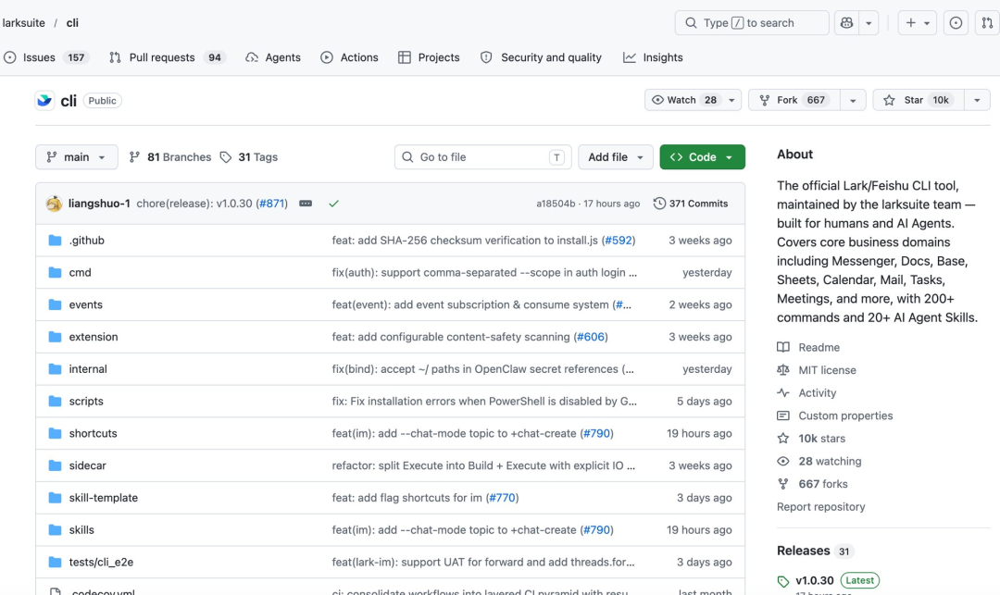
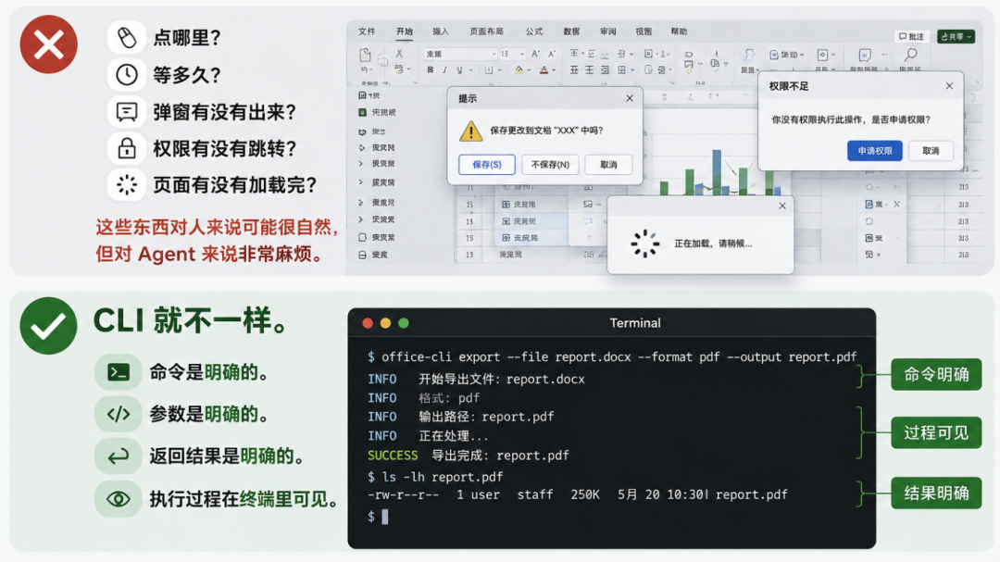
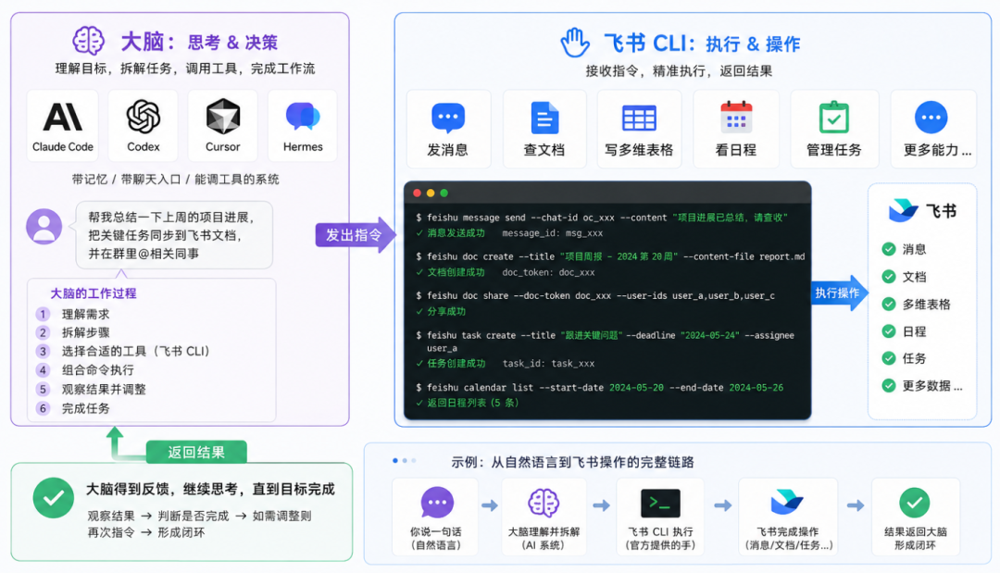
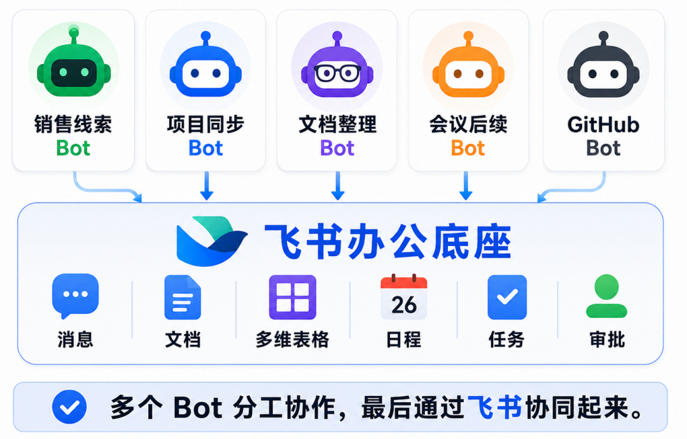
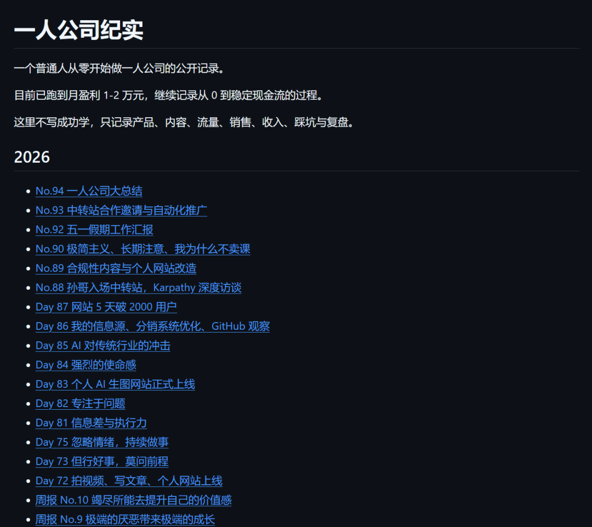
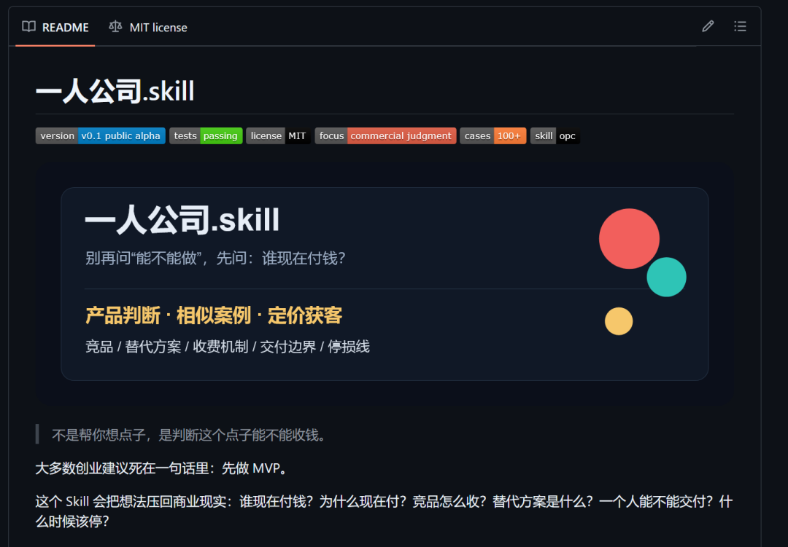
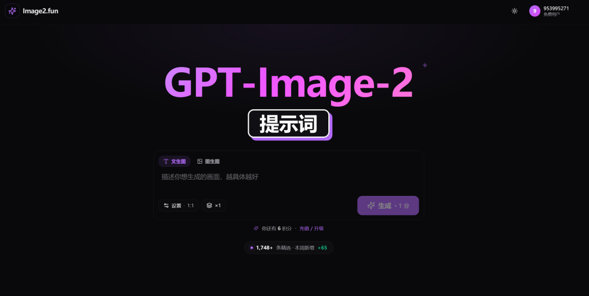
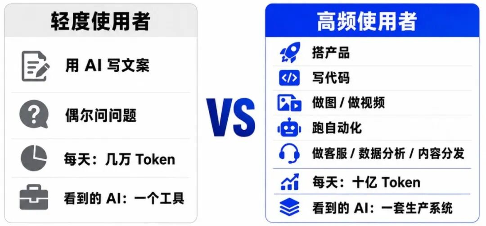

# 方鑫一人公司日报 No.102 | 飞书 CLI | 一人公司系统化与 AI 平权

> 大家好，我是方鑫，今天是一人公司第 102 天。

大家好，我是方鑫，今天是一人公司第 102 天。

今天这篇主要聊三件事：飞书 CLI 为什么突然火了，我今天在一人公司系统化上做了哪些动作，以及为什么我越来越觉得，AI 时代的平权正在变得不平权。

本文约 4100 字，预计阅读时间 6-8 分钟。

一、今日信息差

今天想聊一个最近突然火起来的东西。

飞书 CLI。

说实话，我之前真的不太了解这个东西。

以前我对飞书的印象，更多还是停留在一个办公套件，一个企业协作工具，一个国内少数做得比较克制、比较完整的 SaaS 产品。

但这两天我刷到它的时候，发现不太一样了。

飞书官方的 larksuite/cli 已经冲到了万星级别。

我查了一眼 GitHub，截至今天大概是 10.8k stars。

官方 README 里写得也很直接，它是飞书 / Lark 官方 CLI 工具，由 larksuite 团队维护，覆盖消息、文档、多维表格、表格、日历、邮箱、任务、会议等核心业务域，提供 200+ 命令和 24 个 AI Agent Skills。

这就有点意思了。

因为它不是单纯给程序员做一个命令行工具。

它真正有价值的地方，是对 AI Agent 友好。

以前 AI 想操作一个办公软件，最大的问题是什么？

界面太复杂。

点哪里、等多久、弹窗有没有出来、权限有没有跳转、页面有没有加载完，这些东西对人来说可能很自然，但对 Agent 来说非常麻烦。

CLI 就不一样。

命令是明确的。
参数是明确的。
返回结果是明确的。
执行过程在终端里可见。

这对 AI Agent 来说，太重要了。

你可以把飞书 CLI 理解成飞书官方提供的一双手。

这双手专门负责操控飞书。

发消息、查文档、写多维表格、看日程、管理任务，这些原本需要人在界面里点来点去的事情，现在都可以变成终端命令。

那大脑是谁？

可以是 Claude Code，可以是 Codex，可以是 Cursor，也可以是 Hermes 这种带记忆、带聊天入口、能调工具的系统。

这也是我最近越来越感兴趣的方向，飞书 + Hermes。

飞书 CLI 是双手。
Hermes 是大脑和聊天机器人外壳。

如果这两者能打通，我就可以在飞书 App 里直接 @ 一个机器人，或者私聊它，让它帮我整理今天的日程，记录开销，更新项目进度，把某个想法写进文档，把某个任务放进待办，把某个战略目标拆成周计划。

这听起来像什么？

像一个小型公司的内部系统。

但它服务的不是一个公司。

是我自己。

我最近越来越觉得，一人公司不能只靠脑子硬扛。

你每天做了什么，花了多少钱，接下来要做什么，哪个项目卡住了，哪个产品需要更新，哪个内容要发布，哪个付费承诺还没交付，这些东西如果全靠脑子记，迟早会乱。

所以我对飞书 CLI 的兴趣，不只是因为它火。

而是因为它让我看到了一种可能性——我可以像运营一家公司一样，运营我自己。

财务状况、日程安排、待办情况、战略目标、项目进展、内容排期、产品路线图，都沉淀在飞书里。然后通过 CLI 和 Agent，让这些数据不只是躺在那里，而是真的能被调用、被更新、被执行。

对企业来说，这个空间就更大了。

比如一个团队已经沉淀了大量重复流程，客户跟进、日报周报、项目状态同步、会议纪要、资料归档、GitHub 协同、绩效管理、OKR 追踪，这些事情本质上都可以拆给不同的 bot。

一个 bot 负责销售线索。
一个 bot 负责项目同步。
一个 bot 负责文档整理。
一个 bot 负责会议后续。
一个 bot 负责 GitHub issue 和 PR 流转。

最后它们通过飞书这个办公底座协同起来。

这就不是传统意义上的自动化了。

这是把公司内部的知识、流程和权限，交给一组能执行的 Agent。

当然，这里面也有风险。

飞书官方 README 里也提醒得很清楚，AI Agent 调用飞书权限之后，本质上是在你的授权范围内替你执行操作。如果模型幻觉、提示词注入、权限没管好，就可能出现敏感数据泄露、越权操作这些问题。

所以这东西不能乱用。

但方向是对的。

AI Agent 真正要进入办公场景，不能只靠聊天框。它必须有手，有权限，有可见的执行路径，有能被审计的记录。

未来最值钱的办公系统，不是界面做得多漂亮，而是谁能让 AI 更安全、更稳定、更可控地进入真实工作流。

二、一人公司纪实

今天主要的工作，是继续写《中转站一百问》。

这篇内容我准备明天发在小报童上。

说实话，这篇写得比我想象中要久。因为中转站这个东西，表面看是一个很简单的问题，怎么买，怎么用，怎么选，怎么避坑。

但真写起来会发现，背后其实是一整套问题。

价格问题。
稳定性问题。
安全性问题。
模型选择问题。
账号风险问题。
售后问题。
适合谁，不适合谁。

我这次选择用一问一答的形式来写。

原因也很简单，因为我收到的问题太多了。如果写成一篇传统长文，很容易写着写着就变成教程，读者看完还是不知道自己的具体问题该怎么解决。

一问一答反而更适合。

你问什么，我就答什么。

这也是我现在做付费内容越来越明确的一个方向，不要装，不要绕，不要写一堆正确但没用的话。大家付费进来，不是为了看我做宏大叙事，是为了少踩坑。

除了写《中转站一百问》，今天我还搭了三个 GitHub 仓库。

第一个，是我的一人公司纪实。

后面每天的文章，我都会同步一份到 GitHub 上。

（最近的还没更过去，晚上导过去）

做的原因也很简单，因为公众号文章最近限流了，然后我也想让更多人看见我的纪实，所以就同步进Github了。

第二个，是一人公司 Skill 项目。

这个我最近会重点做。

我想把自己这 100 多天的一人公司实践，慢慢沉淀成一套可复用的 Skill。

它不只是写作模板，而是包括选题、产品、定价、交付、复盘、内容分发、工具使用、AI 协作这些东西。

说白了，就是把我自己踩过的坑，拆成别人可以直接调用的方法。

目前我已经导入几十个案例了，还在测试优化中！

第三个，是 VibeCoding 产品周刊。

这个想法是仿照阮一峰老师的科技爱好者周刊。

我准备每周收录 10 个我觉得非常优秀的 VibeCoding 项目，做成一期周刊。

明天是周日，我会发布第一期。

为什么要做这个？

因为现在 VibeCoding 项目太多了，但真正值得研究的项目其实没那么多。

很多项目只是套壳，很多项目只是 demo，很多项目看起来热闹，但没有产品判断。

我想做的是把那些真正有启发的项目记录下来。

不是单纯转发链接，而是告诉大家，这个项目为什么值得看，它解决了什么问题，它的产品结构有什么意思，它适不适合一人公司学习。

这件事对我自己也有价值。

因为我每天都在看项目，但如果只是看，很快就忘了。写成周刊，等于逼自己做筛选、做判断、做归档。

再说回 Image2网站。

今天我本来想给 Image2 接入邮箱登录。

原因是有一些其他地区的用户反馈，手机号登录不进去。这个问题确实存在，如果只支持手机号登录，对海外用户或者部分地区用户是不友好的。

但我做着做着，遇到了一个非常现实的商业问题。

我的网站注册和邀请用户都会送积分。

积分可以用来生图。

生图是有成本的。

这三句话连在一起，问题就来了。

如果我开放邮箱注册，理论上就会有人批量注册邮箱，恶意刷积分。刷出来的积分又可以直接消耗我的生图成本。

也就是说，我以为自己是在优化登录体验，结果可能是在打开一个成本漏洞。

我今天弄了一早上，最后还是决定暂时不接入邮箱注册。

这个决定有点遗憾，但我觉得是对的。

产品不是功能越多越好。

尤其是一人公司，很多时候你加一个功能，看起来是在提升体验，但背后可能会带来风控、成本、客服、滥用、数据清洗一整串问题。

大公司可以靠风控团队解决。

我不行。

我只能在功能和风险之间做取舍。

所以今天的结论就是，邮箱登录先放一放，等我有更好的防刷机制，再考虑接入。

三、AI到底平权吗？我现在不这么认为了

我虽然不推荐大家去做中转站。

但我越来越觉得，对一人公司来说，使用中转站几乎是一个现实问题。

这个话可能有点绕。

我不是说每个人都应该去碰这个东西，更不是建议大家去做中转站业务。这个里面有很多复杂问题，稳定性、合规性、售后、上游、支付、风控，任何一个点没处理好，都会很麻烦。

但如果你是一个重度 AI 用户，尤其是像我这样每天大量写代码、大量测模型、大量跑任务的人，你会很快遇到一个问题。

成本。

我现在每天的 Token 消耗大概在 5 亿到 10 亿左右。

这个量如果全部走官方订阅或者官方价格，我一天的花销可能就是大几百。

但中转服务能给我一个更低的使用成本，让我可以放开手脚去试错。

这对一人公司太重要了。

因为一人公司最怕的不是犯错，而是不敢试。

你每天都要算成本，每次调用模型都肉疼，每个项目都要犹豫，那你最后一定会变保守。

而 AI 时代，保守其实是一件很危险的事。

所以我最近越来越明显地感受到一个趋势，AI 平权正在慢慢变得不平权。

刚开始大家都觉得，AI 把能力变便宜了。

一个普通人也能写代码，一个小团队也能做产品，一个个体也能拥有过去大公司才有的工具。

这当然是真的。

但另一面也在发生。

顶级模型越来越贵。
高质量推理越来越贵。
长上下文越来越贵。
视频、生图、语音、多模态都越来越贵。

如果你只是偶尔用一下，可能感觉不明显。

但你一旦把 AI 当成生产资料，每天高频使用，你就会发现成本差距非常刺眼。

有的人只是用 AI 写一篇文案。

有的人是用 AI 搭产品、写代码、做图、做视频、跑自动化、做客服、做数据分析、做内容分发。

这两种人使用的是同一个 AI 吗？

表面上是。

但实际不是。

一个人每天调用几万 Token，另一个人每天调用十亿 Token，他们看到的 AI 世界完全不同。

这让我想到一个很现实的问题。

AI 不是天然平权的。

它一开始看起来平权，是因为门槛被降低了。你不用懂代码，也能做东西。你不用有团队，也能启动项目。你不用有很强的专业背景，也能借助模型补齐很多能力。

但越往后走，真正拉开差距的，可能不是会不会用 AI。

而是谁能持续、低成本、大规模地使用 AI。

这就像工业时代的电。

电确实让很多普通人和小企业获得了生产能力，但如果一个工厂的电价更低、设备更好、供应更稳定，它和普通小作坊就不是一个竞争层级。

AI 也是一样。

未来的竞争，很可能不是有没有 AI，而是谁的 AI 使用成本更低，谁的工作流更密，谁的试错频率更高。

所以我现在看中转站，看的不是便宜几个点。

我看的是它背后的试错空间。

它让我可以一天跑很多次 Codex。
可以反复测试 Image2 的功能。
可以让 Agent 多写几个方案。
可以让视频、文章、代码、产品一起滚动起来。

说得直白一点，它买的不是 Token。

它买的是不心疼。

而一人公司最需要的，就是这种不心疼。

当然，这里一定要补一句。

便宜不是唯一标准。

稳定性、安全性、透明度、售后、数据风险，这些都要看。不能为了便宜，把自己的账号、业务数据、客户信息全部暴露在不清楚的链路里。

省钱如果省出更大的风险，那就不是省钱。

那是埋雷。

所以我对中转站的态度是不做，但是要用。

这就是 AI 时代很真实的一面。

口号上，AI 让人人都有机会。

现实里，机会也有成本。

谁能更便宜、更稳定、更持续地调用智能，谁就有更多试错次数。

而很多时候，创业拼到最后，拼的就是试错次数。
