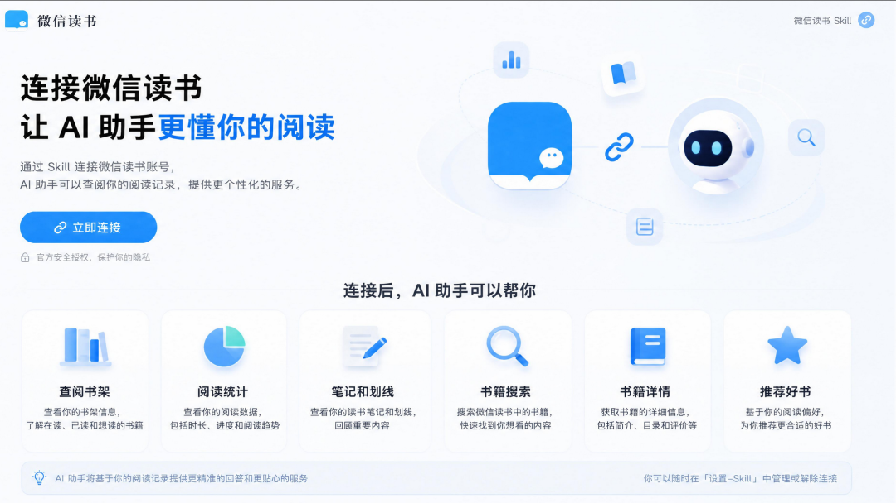
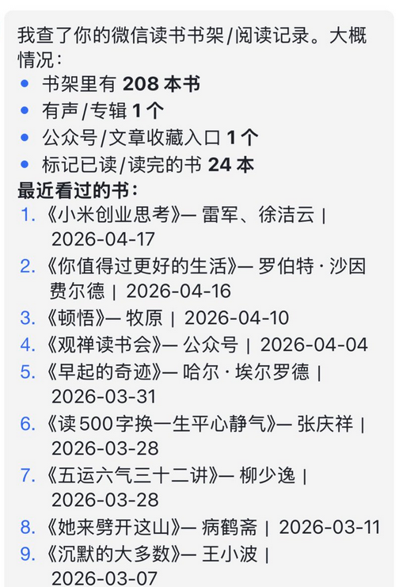
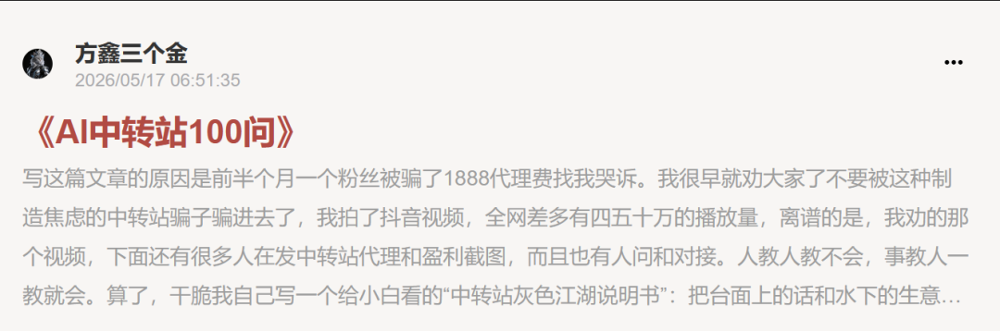

# 方鑫一人公司日报 No.103 | 微信读书 Skill | AI 中转站 100 问与系统学习

> 大家好，我是方鑫，今天是一人公司第 103 天。

大家好，我是方鑫，今天是一人公司第 103 天。

今天这篇主要聊三件事：微信读书开放官方 Skill；《AI 中转站 100 问》改完并发布；“系统学习 AI”是悖论。

本文约 2500 字，预计阅读时间 3-5 分钟。

一、今日信息差

今天看到一个让我有点惊讶的消息。

微信读书推出了面向 Agent 的官方 Skill。

在我的印象里，腾讯系产品一直都比较保守。尤其是涉及用户数据、阅读记录、笔记、划线这些东西，一般不会轻易开放给外部工具。

具体可以看看Qclaw限制到了什么地步。

但微信读书这次确实往前迈了一步。

根据微信读书官方页面，现在可以通过 Skill 连接微信读书账号，让 AI 助手查阅你的阅读记录。官方页面里列出来的能力包括查阅书架、阅读统计、笔记和划线、书籍搜索、书籍详情，以及基于阅读偏好推荐好书。

这个范围其实不小了。

以前我们用微信读书，所有数据都在 App 里。

你读过哪些书，最近在看什么，哪些地方划线了，哪本书读了一半，哪本书读完了，哪类书你读得最多，这些信息都在，但它们很难自然地进入你的个人知识库。

现在不一样了。

直接问 Agent，它就能基于微信读书的数据，整理出最近阅读、已读书单、阅读偏好，还有一些阅读统计。

（图片来自苍何）

它不是让 AI 替你读书。

如果你没有读书，它也不能凭空变出你的阅读积累。它真正做的事情，是把你已经产生过的阅读数据，变成 Agent 可以调用的上下文。

书架是上下文。
划线是上下文。
笔记是上下文。
阅读进度也是上下文。

这才是它的价值。

配置也不复杂。

官方页面给出的核心路径是，先安装微信读书 Skill，然后获取 API Key。API Key 用来连接你的微信读书账号，安装之后，Agent 就知道该怎么调用这些能力。

如果你使用的是配套 CLI 或类似封装，逻辑大概就是：

获取微信读书 API Key。
安装 CLI，比如 npm install -g weread-agent-cli。
配置 key，比如 weread config set-key "wrk-..."。
再把 Skill 装到 Agent 里。

CLI 负责稳定调用接口。

Skill 负责告诉 Agent，什么时候该用这些能力，怎么理解返回结果，怎么把书架、笔记、划线、阅读统计组织成有用的回答。

这也是我觉得官方 Skill 最有价值的地方。

过去很多工具虽然有接口，但 Agent 不一定知道该怎么用。它可能不知道什么时候该查书架，什么时候该拿划线，什么时候该根据阅读偏好推荐书。

Skill 的价值就在这里。

它相当于给 Agent 写了一份操作说明书。

你可以把它理解成，微信读书终于开始把你的阅读数据，从一个封闭 App 里的个人记录，变成可以进入 AI 工作流的知识资产。

这对我这种微信读书深度用户来说，意义很大。

因为我一直觉得，读书最可惜的地方不是读得少。

而是读过之后，没有被重新组织。

一本书读完，划线了很多句，写了几条想法，当时觉得特别有触动。结果过了几个月，除非你刻意回去翻，不然这些东西基本就沉下去了。

但如果 Agent 可以随时读取这些数据，事情就变了。

你可以问它，我最近半年读书的兴趣有什么变化。
你可以让它把某本书的划线整理成一篇文章素材。
你可以让它结合你的历史阅读，推荐下一本该读什么。
你也可以让它从你读过的书里，找和某个创业问题相关的观点。

这就不是简单的导出笔记了。

这是让读书数据重新参与思考。

二、一人公司纪实

今天的一人公司纪实其实没什么复杂的。

我一整天基本都在写《AI 中转站 100 问》。

晚上终于改完稿了。

现在已经发布在小报童里面。

这篇内容我写得很慢，因为中转站这个话题看起来简单，但真要讲清楚，里面全是细节。

很多人问的问题也很真实。

中转站到底是什么。
为什么比官方便宜。
稳不稳定。
会不会封号。
怎么选。
怎么避坑。
适合什么人。
不适合什么人。
能不能长期用。
出了问题怎么办。

如果只是写一篇科普文章，其实很容易。

但我这次不太想写成那种宏大科普。

因为大家真正需要的不是“中转站是什么”这种定义，而是“我现在遇到这个问题，该怎么办”。

所以我最后还是用了问答形式。

一百个问题，一个一个答。

这个方式很笨，但很有效。

因为它更接近真实使用场景。读者不需要从头到尾理解一整套理论，只要找到自己关心的问题，就能直接看答案。

这也是我现在做小报童内容越来越明确的一点。

付费内容不要装。

读者付费不是来看我炫知识结构的，也不是来看我把一个简单问题包装成复杂理论的。

这件事做完之后，我其实松了一口气。

因为我之前承诺过读者要写这个内容，一直拖着心里也不舒服。今天发出去，至少算是把一个内容债还掉了。

三、一个想法

最近很多人问我，怎么系统学习 AI。

这个问题我其实很难回答。

不是我不想回答。

而是我越来越觉得，系统学习 AI 这件事本身，可能就是一个悖论。

如果放在以前，系统学习一门技术是成立的。

比如古法编程时代，你要学 Java，要学 Python，要学前端，要学数据库，这些东西虽然也会更新，但整体节奏没那么夸张。

你可以找一本书，找一门课，按目录从第一章学到最后一章。

基础语法，框架原理，项目实战，部署上线。

它是有路径的。

因为技术本身相对稳定。

但 AI 时代不一样。

你今天刚学会一个工作流，明天一个新模型出来，整个流程可能就变了。

你今天刚把某个工具研究明白，过两周它可能已经被另一个工具替代了。

你今天刚买了一门课程，里面讲的模型、插件、Prompt、平台，也许一个月后就已经过时。

所以我现在对“系统学习 AI”这句话非常警惕。

它听起来很让人安心。

因为系统两个字，本身就能缓解焦虑。

你不知道从哪开始，有人告诉你，我这里有一套完整体系。
你害怕自己跟不上，有人告诉你，跟着我从零到一学完。
你觉得信息太碎，有人告诉你，我帮你整理好了。

这当然有市场，而且市场很大。

但问题是，AI 不是一门可以被完全装进课程目录里的学科。

至少现在不是。

它更像一条正在暴涨的河。

你不可能先在岸上把游泳理论系统学完，再下水。

等你学完，河道已经变了。

所以我现在更认同一种学习方式，叫围绕真实问题学。

你要做公众号，就学 AI 写作、选题、排版、素材整理。
你要做产品，就学 Codex、Claude Code、数据库、部署、支付。
你要做视频，就学 AI 剪辑、脚本、字幕、分镜、素材管理。
你要做知识库，就学 Obsidian、飞书、微信读书 Skill、Agent 调用。

我的建议很朴素。

先选一个你真的要解决的问题。

然后为了这个问题，去学 1-2 个最关键的工具。

把它用深，用熟，用到能帮你真实产出东西。

这比收藏 100 门系统课程有用得多。
