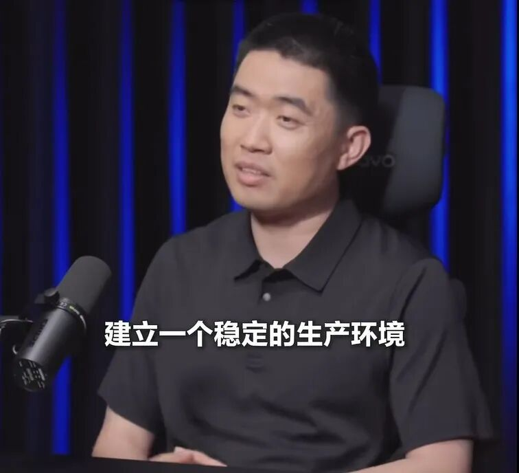

# 方鑫一人公司日报 No.105 | 对一人公司新的感悟

> 最近几天，我一直没有拍视频。

最近几天，我一直没有拍视频。

原因是前几天看了李想x罗永浩的播客。

李想在里面聊到一人公司，其中提到了一个词语，引起了我的反思。

生产环境。

很多人做一人公司，最后做着做着，其实还是在做自媒体。

每天讲工具更新，讲行业新闻，讲某个产品又解决了什么 bug，看起来很忙，看起来也在输出，但自己的公司生产环境并没有真正搭起来。

诚然，做自媒体可以获取很多流量，这些流量你可以通过卖课、咨询等形式进行售卖从而获得利润。

但是如果只做到这个地步，我认为充其量也只是一个副业吧。

他当然也在生产内容。

但问题是：内容生产，不等于公司生产。

公司生产环境是什么？

它不是一个单点工具，也不是某一个爆款视频，更不是某一个会涨粉的选题，而是一个组织架构的运转。

随着我手上的项目越来越多（超过10个独立项目），我感觉到越来越吃力，运维，宣传，维护。

我开始思索，吃力的原因是什么？

是我不会用AI，不会用Agent吗。

还真不是，我每天用AI，每天学习AI，我用AI的能力算不上顶尖，但肯定是中等偏上的水平。

我仔细反思了一下，关键在于我没有一套能像公司一样运转的体系流程。

一个正常公司，会有产品系统，会有财务系统，会有项目管理，会有客户反馈，会有数据监控，会有内容营销，会有研发流程，会有复盘机制。

哪怕只有一个人，也应该有这些东西的缩小版。

一人公司不是把公司所有岗位都用肉身硬扛一遍。

而是要把这些岗位背后的流程，用工具、AI、自动化、知识库重新搭起来。

所以我这几天没有拍视频，很大一部分原因，是我在搭生产环境。

我想要的是一个真正能参与公司运转的系统。

它能帮我每天监控我手上的五个网站。

它能盯着服务器状态，发现异常及时提醒。

它能管理我的六个 GitHub 项目，知道哪个项目在推进，哪个项目停住了，哪个 issue 该处理。

它能帮我整理每天写作的素材，知道哪些东西适合写公众号，哪些东西适合拍视频，哪些东西适合沉淀成小报童内容。

它能帮我远程操作一些固定流程，比如检查部署、拉取日志、整理数据、生成日报。

它最好还能接入我的知识库、飞书、Obsidian、GitHub、服务器、产品后台。

它最好还能接入我的财务，自动监控今天赚了多少钱，花了多少钱。

这才是我理解的一人公司生产环境。

不是我每天在镜头前讲了什么。

而是镜头背后，有没有一套系统在持续运转。

没有这个东西，我越拍视频，可能越焦虑。

因为内容平台天然会把人训练成追热点的人。

你今天拍一个热点，有流量。

明天不拍，数据掉了。

后天别人讲得更快，你开始着急。

久而久之，大家就误以为一人公司的核心能力就是更新频率。

涨粉是不务正业，这句话虽然略显片面，但我觉得还是有道理在的。

一人公司的判断应该——是你的产品有没有变好？

你的系统有没有变厚？

你的交付有没有沉淀？

你的用户反馈有没有被处理？

你的工作流有没有越来越自动化？

不然算什么公司？
