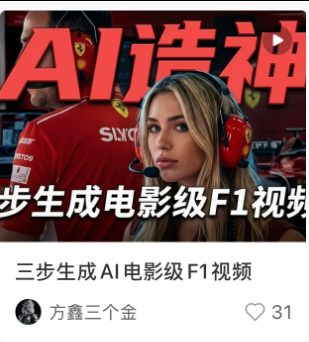

# 方鑫一人公司日报 No.109 | 不确定感 | 专注

> 我最近觉得自己仿佛身处AI时代的洪流之中，被满天飞的AI新闻带着走。

我最近觉得自己仿佛身处AI时代的洪流之中，被满天飞的AI新闻带着走。

我自认为还是个有自省人格的人，我每天都在反思，读书，学习。

即使在保持高强度学习的情况之下，我仍然会感觉到焦虑、迷茫和困惑。

我每天都在想新的机会、新的业务、新的产品，今天觉得 AI 剪辑有机会，明天觉得一人公司 Skill 可以做，后天又觉得抖音视频优化也不错。

直到痛苦的我今天中午和Gemini打了两个小时电话，我慢慢意识到。

我太过于追逐新的项目，反而忽略了手上已经有的项目。

AI赋予我们创造力，看上去我们好像能抓住很多很多东西，做很多很多项目。

但能抓住的东西，真的很少很少。

先给大家讲一下我现在的主力营收，再慢慢给大家讲困惑。

目前我的收入主要有两块。

第一块是 Image2 网站。

这个网站现在每个月大概能给我带来 8000 元以上的收入。

第二块是我自用的中转服务。

大概每个月 4000 到 5000 元，勉强覆盖我的 AI 成本。

这个东西我也没怎么推广，更多是自己用。

没有接那些乱七八糟的反代或者限时号，就是自己拿稳定的Pro号池在用。

包括我在抖音千人群里，也基本是有人问我，我才给他。

一方面是担心合规性的问题，我觉得不能大范围推广，但是我又觉得中转这个东西会长期存在，未来也是很多AI重度用户的必需品。

另一方面也确实有很多人用不上满血的 GPT-5.5。

所以如果有人问，我就小范围放一下，但我没想靠这个赚很多钱。

关键问题是，除了这两个已经产生现金流的东西，我手上其实还有差不多十个项目。

AI 剪辑。

一人公司 Skill。

短剧设计。

自动化Agent。

抖音视频优化。

各种小工具。

听起来都挺有意思。

但这些项目大多数没有经过市场验证，很多时候只是我觉得用户需要。

前段时间，我在小红书发了一个帖子。

那个帖子讲的是我如何做 F1 模拟视频。

其实曝光很低，也就 1000 左右。

但带来的效果很直接。

大概有 10 个人私聊我，想做这个东西。

我报价 99 元，最后成交了 6 个。

六个人转钱非常利索，说明这个确实是存在的需求。

这件事让我想了很久。

因为这才是市场的反馈。

不是我坐在电脑前想象用户需要什么，而是用户真的来问，真的愿意付钱。

尤其是小红书这种平台，对精品图片和视频的需求非常高。

好看的照片，好看的视频，能让自己变得更有表达力、更有质感的内容，本质上是非常稳定的需求。

以前有位大佬跟我说过，什么都比不上虚荣心赚钱。

当然，这里的虚荣心不是贬义。

更准确地说，是人对“被看见”“被认可”“被羡慕”的需求。

朋友圈为什么强？

小红书为什么强？

很多时候底层都是这个东西。

人希望把自己更好的一面展示出来。

人希望自己的生活、作品、形象、审美，被别人看见。

这不是短期需求。

这是长期需求。

所以当我做了很多失败的产品，浪费了大量时间之后，我意识到一个问题。

我是不是正在舍弃手上已经有的金子，去追逐那些虚无缥缈的东西？

至少 Image2 这个网站是经过市场验证的。

它有人用。

有人付费。

能产生现金流。

但我这段时间并没有把足够多的精力放在它身上。

我只是给它做了一套自动化流程，然后就开始寻找下一个机会。

结果是什么？

网站增长开始慢慢下滑。

我自己每天也处在一种担忧和烦躁里。

烦躁的是找新思路。

烦躁的是找新产品。

烦躁的是设计、写代码、测试、上线。

人真的还是有些痛苦的。

没有刚开始做一人公司时那么快乐了。

我最早做视频的时候说过一句话。

好奇心是 AI 时代最强有力的武器。

这句话我现在仍然认同。

但我开始意识到，在商业世界里，过于旺盛的好奇心也可能是一种问题。

它会让你不断追新的东西。

新的模型。

新的工具。

新的赛道。

新的项目。

看起来你一直在前进，但其实你可能只是在横跳。

真正的问题是——当你已经有一个盈利产品之后，好奇心应该放在哪里？

我现在的答案是——应该放在优化上。

反复问自己：

怎么让这个产品更好？

怎么让体验更顺？

怎么让用户更愿意留下来？

怎么让它更能吸引用户？

怎么打造社群？

怎么提高变现？

怎么让它从一个工具，慢慢变成一个平台？

所以我现在决定，砍掉手上绝大多数分散的业务。

接下来六个月，我只专注一件事：

把 Image2 网站改造为一站式 AI 创作平台与社区。

同时，我只保留几件必须长期做的内容：

小报童周更。

每天的口播视频。

公众号日更。

Prompt和网站宣传。

除此之外，我不会再开新的坑。

我要大幅度做减法。

神笔 AI 未来会做几件事。

第一，持续接入最新的图像和视频模型。

包括 GPT Image 2、Kling、Wan 2.1、Seedance 等等，让用户可以用一句话生成高质量图片和视频。

第二，做模板化视频生成。

比如前段时间全网爆火的 AI 棒球转播，用户只需要导入自己的授权照片，就能生成类似现场转播质感的视频。

灯光、镜头、观众席、运动感、氛围感，都由模板完成。

用户不需要懂复杂工具，也能快速出片。

第三，做专属角色系统。

用户上传自己的授权照片后，可以创建一个稳定的 AI 角色，后续用在图片、视频、剧情短片里，尽量保持同一张脸、同一种风格。

这里我会特别注意合规边界。

所有涉及真人形象的功能，都必须基于本人授权和明确用途，不能做侵犯他人肖像权的事情。

第四，做合规的视频合成工具。

比如动作参考、表情同步、角色一致性、风格化视频生成这些能力。

但它的前提一定是授权素材和合规模板。

我不想把这个产品做成一个灰色工具。

这件事短期可能少赚一点钱，但长期一定更稳。

第五，做社区模板市场。

用户可以发布自己调好的工作流、提示词、模板。

其他人可以一键套用。

如果某个模板真的受欢迎，创作者也可以从中获得收益。

这件事我觉得非常重要。

因为未来 AI 创作平台不能只是工具。

工具解决的是效率。

社区解决的是灵感、模仿、传播和交易。

我希望神笔 AI 最后不是一个冷冰冰的网站，而是一个普通人也能做出好作品的地方。

小白可以一键出片。

重度玩家可以深度调参。

创作者可以发布模板赚钱。

用户可以在社区里找到灵感、作品和同类。

到27年之前，我将用六个月去做这件事情。

六个月后，我再回头看这件事到底能不能成立。

欢迎大家监督我。
