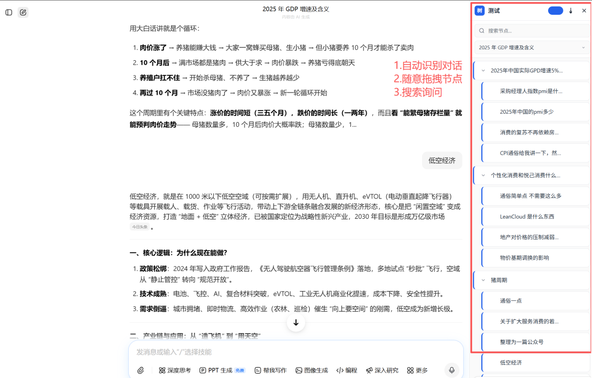

# 解决AI对话繁琐问题

> 痛点直击：用AI干活，一半时间都在翻对话？

痛点直击：用AI干活，一半时间都在翻对话？

如果你每天用AI干活（豆包、kimi、GPT、DeepSeek都算），不管是写文案、做方案、写代码，还是梳理思路，一定被同一个问题折磨过——对话越久，越乱，越浪费时间。

你有没有过这种情况？用AI梳理一个复杂思路，先问A方向，聊两句发现不对，回头问B方向，中途又插个细节追问；十几条、几十条对话堆在页面上，没有分类、没有逻辑，像一团乱线。

等你过一会儿想找回之前的某个关键思路，比如那段被你否定又优化的方案细节、某个代码调试的关键提问，只能握着鼠标疯狂上下翻页，翻来翻去十几分钟，眼睛都看花了，好不容易找到，原本的思路也被彻底打断。

更头疼的是，我们每天用AI的时间本来就有限，却要浪费大量时间在“找对话、理思路”上——明明可以用这些时间做更有价值的事，却被这种低效内耗拖垮。

痛点解药：「树知」来了，帮你省时间

我太懂这种感受了，作为重度AI用户，每天被这个问题困扰，忍了很久之后，索性动手做了一款工具，专门解决这个痛点——它叫「树知」，今天，它终于进入初步测试阶段✨

做「树知」，没有任何复杂的初衷，核心就一个：帮你解决“AI对话乱、找思路难”的问题，帮你省时间、不内耗，把浪费在翻对话上的时间，真正用在能产生价值的事上。

核心价值：不玩噱头，只解决真问题

它不搞花里胡哨的功能，不玩噱头，全程围绕“实用、高效”，精准解决你用AI的核心困扰：

不用再翻来翻去查对话——杂乱的AI对话，会被自动整理成清晰的逻辑框架，想找哪段找哪段，点击就能直达，不用浪费一分钟翻页； 不用再手动整理思路——不管你是多发散的提问、多杂乱的对话，都能帮你梳理分层，形成清晰的思路脉络，避免思路被打断； 不用再被冗余信息干扰——大段代码、长文档会自动折叠，既保留完整上下文，又能让页面保持干净，专注核心思路。

今日进度：Chrome端成功跑通，进入测试阶段

今天的核心进度：「树知」已经在Chrome上成功跑通✅

从需求梳理、功能开发，到测试调试，全程深耕用户痛点，中途也踩了两个小坑：一是初期适配Chrome插件时，出现功能卡顿，反复调试3个多小时才找到问题根源；二是简化功能时，差点删掉“快速导出逻辑框架”这个核心刚需，还好测试时及时发现，临时调整了方案。

目前测试阶段，核心功能已经能正常使用：可以快速搭建逻辑框架、分层梳理AI对话，支持一键编辑、快速检索，最关键的是，已经能无缝衔接豆包，后续不管你用豆包做什么，都能通过「树知」快速整合思路，不用再切换工具、堆砌零散对话。

虽然现在还只是初步测试版，UI还有些粗糙，部分细节功能也需要优化，但我始终相信，好工具的核心是解决问题——先帮你搞定“找对话难、思路乱”的核心痛点，再逐步优化体验，比纠结细节、迟迟不上线更有意义。

后续规划：只为让你用得更省心

接下来的核心规划（全程围绕帮你更好用展开）：

多平台适配：优先搞定kimi、元宝、GPT等主流AI平台，实现多平台无缝切换，不管你习惯用哪个AI，都能用上「树知」，彻底摆脱对话杂乱的困扰；

UI与体验优化：简化界面设计，去掉所有冗余元素，主打极简风，同时优化操作流畅度，做到零学习成本，上手就能用，真正帮你省时间、不内耗。

我始终觉得，好的工具是帮人省时间、提效率，而不是增加负担。如果你也被AI对话杂乱、找思路难的问题困扰，不妨关注「树知」的测试进度，后续它会慢慢完善，帮你省出更多时间，专注做更有价值的事❤️
