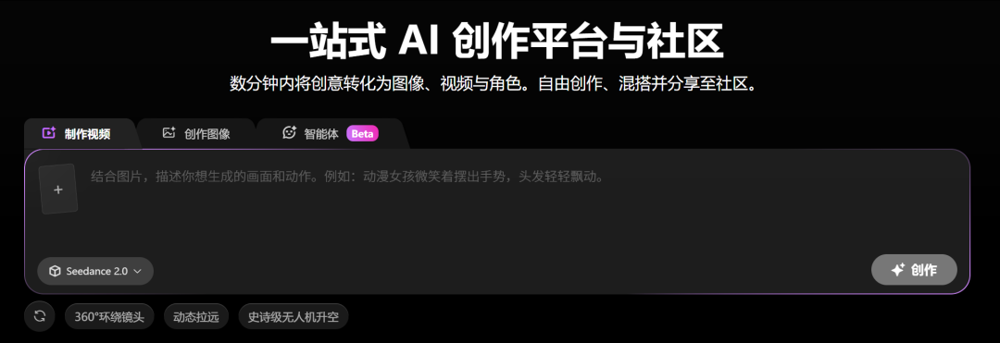
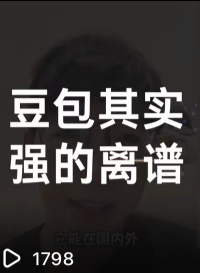
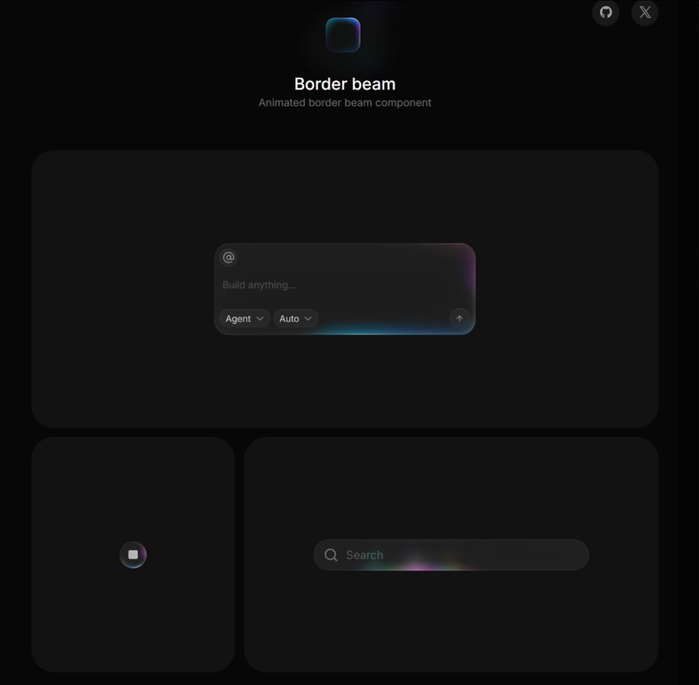

# 方鑫一人公司日报 No.110 | 明确目标后的好心情

> 不是那种特别兴奋的好，而是一种很轻松的好。

这几天心情尤其好。

不是那种特别兴奋的好，而是一种很轻松的好。

轻松的点在于，我终于明确了目标。

VibeCoding 现在只瞄准一个方向：视频一体化创作平台与社区。

每天不用再想七想八了。

不用一会儿想这个项目，一会儿想那个产品，一会儿又觉得是不是还有别的机会。

现在很简单。

专注网站就行。

每天就琢磨一件事：

怎么把我的网站优化得更好。

等待结果的过程中，我就顺手优化一下自己用的中转服务，提高 Codex 的编程速度，尽量把延迟拉低。

这种感觉太舒服了。

因为脑子里少了很多Coding噪音，我感觉压力小了很多，思路也更清晰了。

找回刚开始拍视频的感觉

这两天在拍视频这件事上，我也慢慢想通了。

我好像找回了刚开始做视频时的感觉。

今天我就是举着手机，边走边拍，往沙发一坐就开始拍。

很随意，张口就来，拍了一段我认为豆包是国内最接地气的AI产品。

没想太多。

反而感觉特别轻松。

之前我一直执着于视频效果、视频教程、视频文案，甚至还想搞个提词器。

我太想把这件事情做好了。

但有时候，越想做好，动作越容易变形。

我最开始为什么想做这些？

不是为了把每条视频都拍成标准答案。

而是因为我对这些东西好奇。

因为我觉得它们好玩。

因为我在做的过程中是快乐的。

今天我就很快乐。

写文章。

优化网站。

拍视频。

看英伟达财报。

甚至还健了个身，打了一会儿游戏。

但很神奇的是，今天的产出结果一点不比之前高强度的时候少。

甚至更让我满足。

因为今天做的都是实际优化。

今天做了哪些实际优化

今天我重点优化了首页 UI。

之前我在推上看到一个非常好看的按钮特效，就一直记着。

今天把它用到了网站里。

直通地址：beam.jakubantalik.com

结果有好几个用户反馈说，网页首页的按钮感觉很高级。

这种反馈特别直接。

它会让我感觉：

好，这个优化是有价值的。

不是我一个人在自嗨。

除了首页 UI，我今天还优化了 Image2 生图网站的多渠道接口。

明天准备继续接入各大平台的视频接口。

同时也会尝试开发 Image2 的 API。

现在方向已经非常清楚了：

让图像生成、视频生成、接口能力和社区内容慢慢连成一个整体。

也顺手把服务器 Git 整理了一遍

除此之外，我还重构了服务器的 Git。

以前有一堆不该进 Git 的东西混在里面。

比如日志、输出图片、备份 env、临时目录。

今天把这些东西都ignore了。

然后把本地已有的大量改动，按业务分成多次提交保存起来。

分别整理了几个模块：

支付

登录账号

生图链路

首页 UI

后台

运维脚本

这样以后回看也更清楚。

每次改了什么，为什么改，都能追得回来（主要是个人主页服务器丢失，一下给我醒了神，现在我全部做备份）。

把事情都做完好像也才11点，睡个早觉。

大家晚安。
