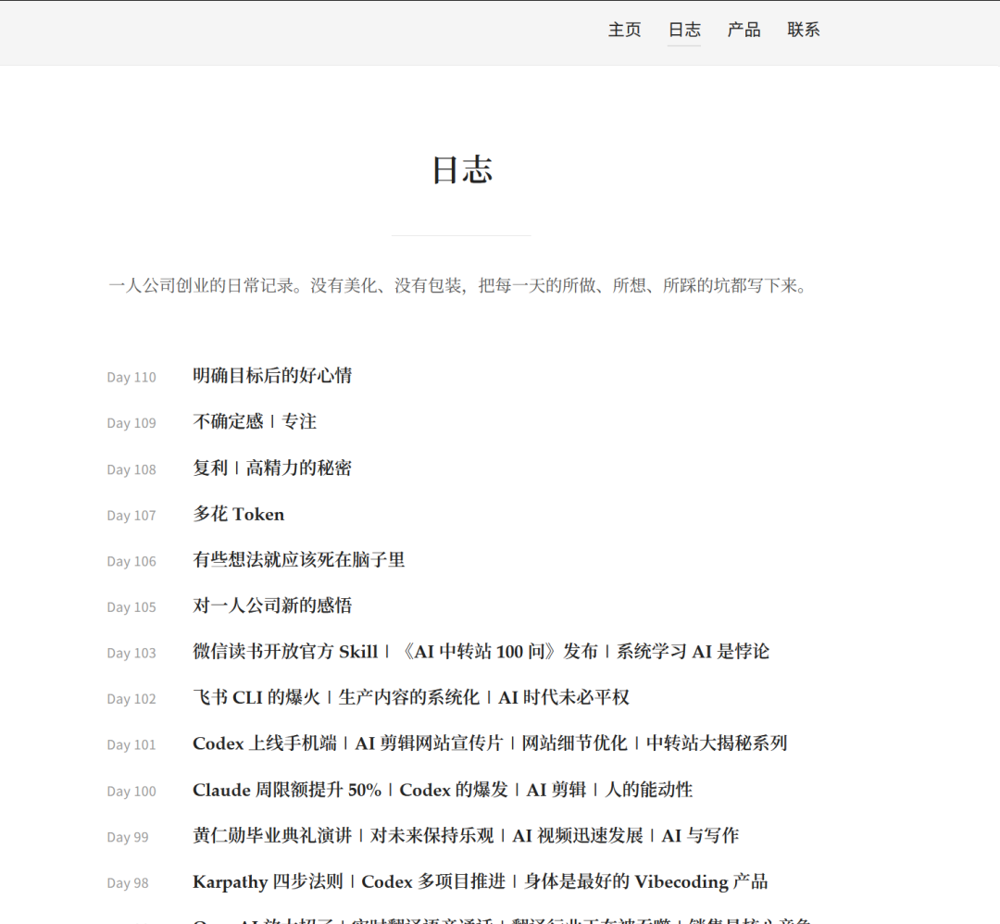
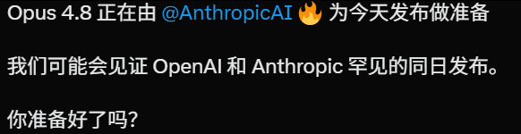

# 方鑫一人公司日报 No.111 | 个人网站恢复 | 一人公司赚到钱的三类人 | Opus4.8 即将发布 | 网站优化推进

> 今天第一件比较开心的事，是把我的个人网站 fxin.cc 修回来了。

今天第一件比较开心的事，是把我的个人网站 fxin.cc 修回来了。

前段时间因为各种服务器、项目、部署环境混在一起，一不小心把个人网站清除了。

而且我印象里是没备份的。

结果今天翻服务器的时候，发现Codex已经自动备份了！

必须点个赞！

这次也提醒我了，以后每个项目最好单独部署个服务器，而且要做好备份。

继续写 Image2 的网站代码

除了修个人网站，今天主要还是继续写 Image2 的网站代码。

给大家看一下现在的界面，比之前简陋的样子强多了。

它后面要长成的是一个图 / 视频一体化创作平台。

现在图、视频都可以稳定制作。
但为了稳定性，估计过几天才会上线，确保上线无明显bug。
虽然中途遇到了很多困难，但是目前这个地步我还是比较满意的。
每天往前推一点，感觉人还慢踏实的，我比较喜欢这样。

视频也继续拍

最近拍视频拍的很轻松

想到什么说什么，基本上就是张口就来，也不需要打稿子。
今天我讲的内容是我观察到的，目前一人公司赚钱的三类人靠什么盈利。
第一类是自媒体人+卖课
第二类是做产品
第三类是靠信息差
感兴趣的可以去看一看明天准备发小报童

还有一件事，是明天准备发小报童。

文章已经写得差不多了，标题是：

《如何用 AI 读财报——以英伟达为例》

这篇文章我自己都学习到了不少东西。

因为财报这个东西，很多人其实想看，但一打开就会被各种数字、术语、业务线劝退。

收入、毛利率、数据中心、库存、资本开支、指引、现金流。

每个词都认识，但连在一起就很容易不知道重点在哪里。

所以我想写一篇实用的东西——不是教大家变成专业分析师。

而是教普通人怎么用 AI 把财报读懂。

先抓主线。

再看关键数字。

再看管理层到底在暗示什么。

最后形成自己的判断。

我选英伟达做案例，也是因为它足够典型。

它不只是一个财报样本，还是当下 AI 产业链最核心的观察窗口之一。

看英伟达，某种程度上就是在看 AI 基础设施的温度。

听说明天要发布opus4.8和gpt5.6？

明天如果发布了第一时间用，顺便给大家一个使用体验反馈

我要狠狠蹬起来，期待。

十二点了~

大家晚安
