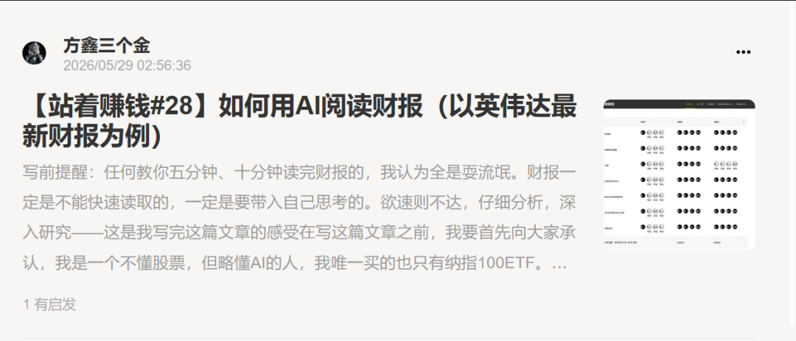
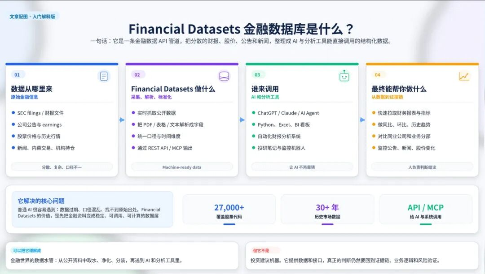
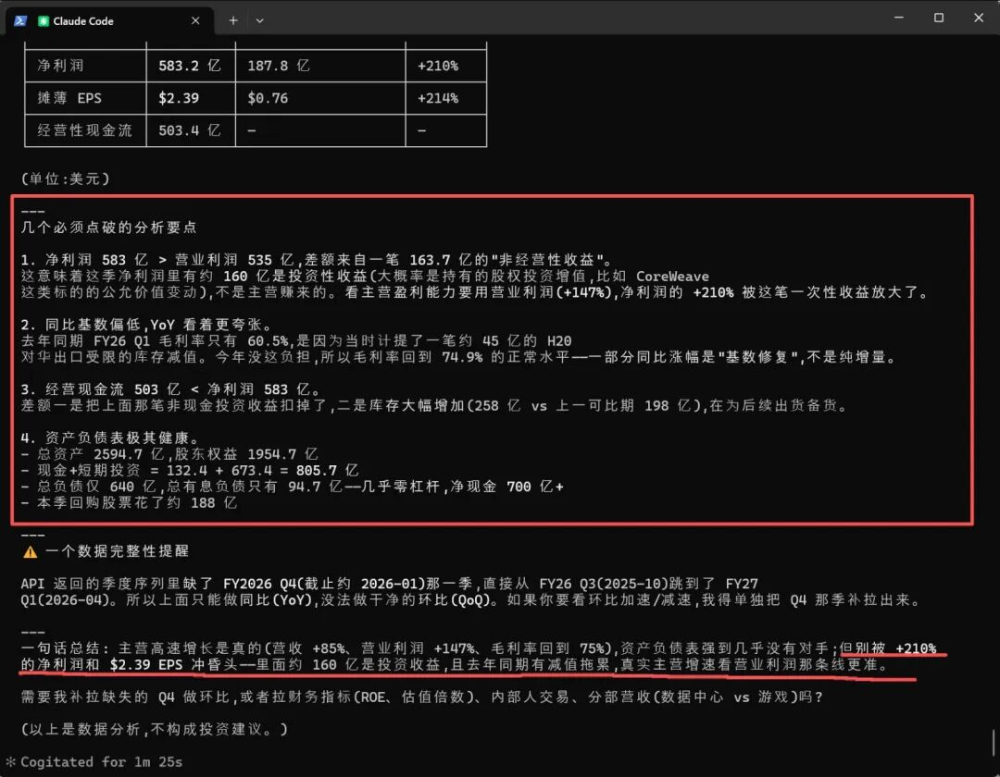
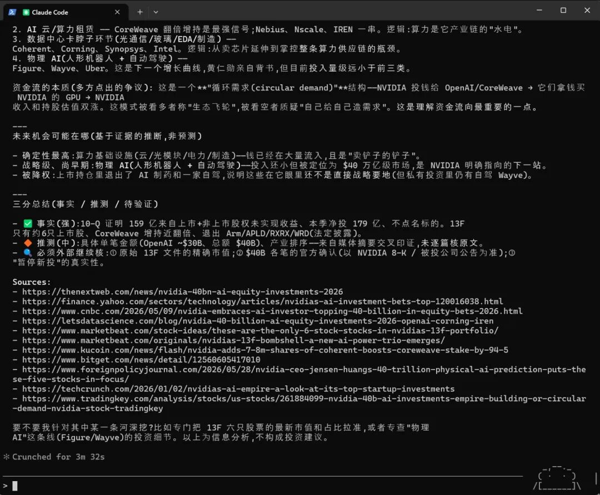
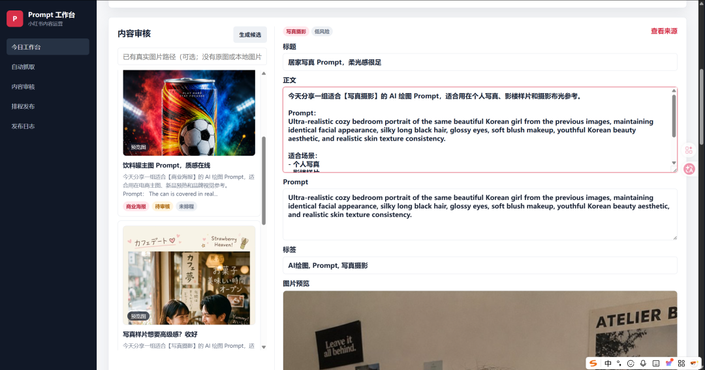
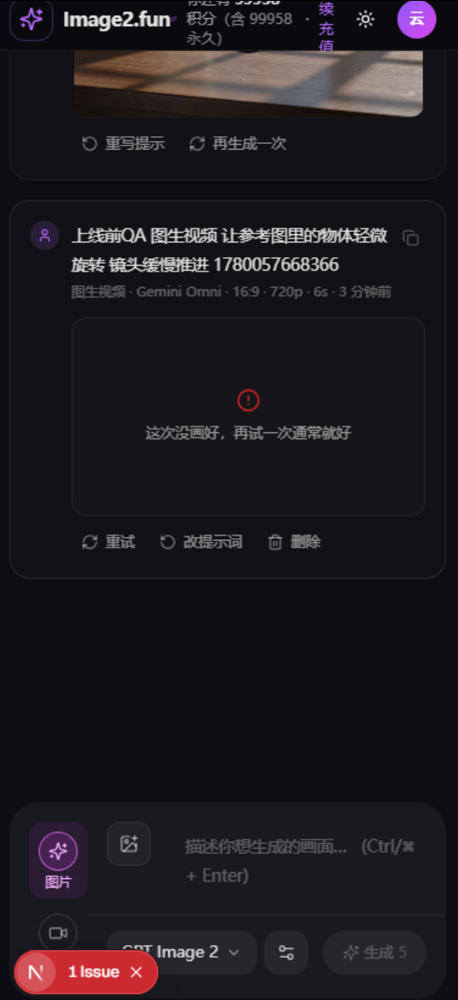

# 如何用AI阅读财报 | 小红书自动发布平台搭建 | Image2手机端优化

> 大家好，我是方鑫，今天是一人公司第 112 天。

大家好，我是方鑫，今天是一人公司第 112 天。

今天还是做了不少事情的，分别是完稿小报童文章——如何用AI读财报，小红书自动发布系统搭建，Image2网页手机端优化。

用 AI 读财报，我终于找到了零幻觉的方法

先说第一件事。

今天我发布了小报童的新文章：如何用 AI 阅读财报（以英伟达最新财报为例）。

这篇文章我憋了整整一个星期。

不是因为选题难，而是因为我一直在跟幻觉抬杠。

这个星期我测试了很多方法和模型去读财报。

结果很糟糕。

数字会漂。

年份会串。

毛利率能算出 120%。

营收增长率有时候是正的，有时候是负的，同一个数据点问两次，给两个完全不同的答案。

后来我尝试把财报内容先粘贴到对话框里，再让它分析。

准确率稍微高了一点，但还是很危险。

因为只要财报稍微长一点，页码一多，表格一复杂，模型就开始脑补。

它会用非常自信的语气，告诉你一个完全错误的数据。

但一核对原文，全是窟窿。

所以这一个星期，我其实挺沮丧的。

我开始怀疑，AI 读财报这件事到底能不能成立。

直到我找到了 Financial Datasets。

Financial Datasets 是一个专门的金融数据库，它把各家公司的财报数据做了结构化处理。

不是 PDF。

不是网页。

不是自然语言。

是干净的、结构化的金融数据。

收入、毛利、净利、现金流、资本开支、研发费用、每股收益、营收指引、历史股价、历史财务比率，全部是精确的数字，有来源，有时间戳，有可追溯性。

但这还不够。

光有数据，没有分析能力，还是一堆数字。

所以我又把 Claude Code 接了进来。

Claude Code 负责调用 Financial Datasets 的接口，把数据拉出来，然后按照我设定的分析框架，一步一步拆解。

收入增长趋势、利润率变化。

现金流健康状况。

研发投入占比。

资本开支方向。

管理层指引和实际业绩的偏差。

历史估值区间。

跨公司对比。

整个流程跑通之后，我自己的感受是四个字：

如释重负。

因为终于不用再跟幻觉搏斗了。

数据是数据库给的，不是模型编的。模型只是做分析，做对比，做可视化，做解读。它不再需要记忆数字，因为数字都在数据库里躺着。

这也是我目前认为，个人做金融分析最好的组合：

Claude Code + Financial Datasets。

Claude Code 本身的 reasoning 能力足够强，能处理复杂的分析逻辑。Financial Datasets 的数据足够干净，没有幻觉空间。两者配合，既能做到深度分析，又能保证数据准确。

当然，我要提前声明一件事。

我是一个不懂股票，但略懂 AI 的人。

我唯一买的也只有纳指 100 ETF。

但正因为不懂，我反而觉得这是我的优势。

因为我可以完全从一个普通人的视角，去思考怎么把财报读明白。

面对财报，我也是一头雾水。

营收、毛利、净利、EBITDA、Non-GAAP、自由现金流、递延收入、资本回报率、库存周转天数。

这些词我都要一个一个查。

但正因为我要查，我才知道哪些地方最容易卡住，哪些概念最容易被误解，哪些数字最关键但最容易被忽略。

所以这期内容的定位很清楚：

不是教大家变成专业分析师。

而是教普通人，怎么用 AI 把财报真正读懂。

这期内容我自己觉得挺有价值的。

对金融感兴趣的朋友，我强烈建议去看看。

二、小红书自动化引流：Prompt 不只是内容，也是获客手段

今天第二件事，是跑通了小红书自动发布流程。

这件事说起来其实不复杂。

我最近开了一个小红书小号，专门做 Prompt 内容。

目的很简单，通过Prompt，引流到网站。

内容来源是全网上抓取的优质 Prompt，我在网页后台里可以统一浏览，看到我觉得有流量潜力的 Prompt，直接一键发布到小红书。

整个过程非常轻。

我不需要每天花时间去想选题，不需要做图，不需要排版，不需要手写文案。

Prompt 本身就是最好的文案。

一个高质量的 Prompt，配上几张效果图，再附上一句使用方式，就是一条完整的小红书笔记。

而且小红书对 Prompt 类内容的接受度其实非常高。

他们有很强的需求，想看别人是用了什么 Prompt，怎么调参，怎么出图的。

这也是我选择用 Prompt 做引流内容的底层逻辑。

不是泛流量。

而是精准的、对生图有需求、愿意尝试、愿意付费的用户。

小红书的付费率我也测试过，确实还可以。

至少比很多其他平台强。

现在这条链路是这样的：

小红书发 Prompt → 用户看到 → 想自己生成 → 来到 Image2 网站 → 直接复制 Prompt 上手 → 生成满意图片 → 付费升级或持续使用。

现在这条流程已经可以在网页里一站式完成。我只需要做一件事：浏览 Prompt 库，看到好内容，点发布。

三、Image2 手机端大优化：新版本周末上线

第三件事，是我今天一整天都在做的事情。

优化 Image2 手机端。

说实话，手机端的问题真的太多了，因为我相当于重构了整个网页。

加载速度慢。

排版混乱。

按钮位置奇怪。

生图的时候经常超时。

有些机型显示白屏。

返回键逻辑莫名其妙。

今天就专门盯着这些问题，一个一个改。

我预估这个周末可以上线新版本。

而且不只是修 bug，我还接入了最新的生图和生视频模型。

最近有几个新的开源模型，生成质量和速度都很好，尤其是视频模型的进步非常大。不只是画面细节上去了，更重要的是稳定性上去了

以前用 AI 生成视频，同一个 prompt 生成三次，三次结果差距很大。现在的一致性好了很多，有些模型甚至能保证同一角色在多个镜头里保持面部稳定。

用户不需要懂复杂参数，不需要学剪辑，不需要学调参。

只需要说一句话，就能生成高质量图片。

再点一次，就能把图片变成视频。

再点一次，就能下载分享。

整个流程越短越好，越简单越好。

手机端是这个平台非常重要的一环。

刷小红书看到一个好看的图，想知道怎么做的。如果这个时候打开 Image2 是流畅的，按钮是清晰的，生成是快的，结果是好看出片的，那这个人很可能就留下来了。

但如果打开之后白屏、卡顿、生成失败、排版乱掉，这个用户大概率就永远流失了。

四、写在最后

今天做的事情看起来不轰轰烈烈。

发了一篇文章。

跑通了一条引流流程。

修了一天的手机端。

但我觉得这些东西放在一起，正好是一人公司比较重要的三个能力。

第一个，是内容能力。

能不能写出真正有用的东西。

不只是追热点，不只是翻来覆去说别人说过的话，而是真的有自己的实践、自己的踩坑、自己的方法、自己的判断。

《如何用 AI 读财报》这篇文章，我花了一周时间，换了十几个方法，踩了无数幻觉的坑，最后才找到 Financial Datasets 这条路。

写出来可能就几千字，但背后是真实的实验和筛选。

这个，ChatGPT 写不出来。

第二个，是系统能力。

能不能把重复的事情变成流程，能不能让机器替你干活。

小红书自动发布就是这样。

我不需要每天花精力想选题，不需要手动作图，不需要手动发布。

系统帮我跑完，我只需要做最后的质量判断。

这个能力越强，一人公司能做的事就越多。

第三个，是产品能力。

能不能盯着一个产品反复优化。

手机端的问题是小事，加载慢是小事，排版乱是小事，生成失败是小事。

但一百个小问题堆在一起，就是一个坏产品。

我不奢求一步到位。

但每天改一点，每天优化一点，这个产品就会慢慢变得更好。

这就是第 102 天的全部内容。

明天见。
