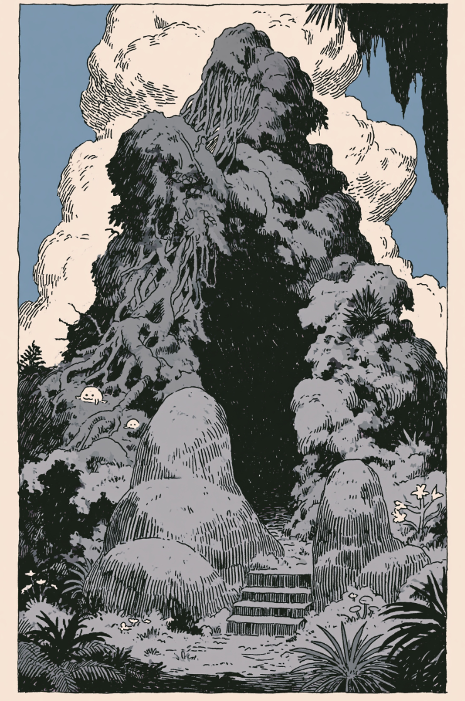

# 把一件小事做好，已经很不容易

> 我是方鑫，今天是一人公司第 113 天。

我是方鑫，今天是一人公司第 113 天。

ps：明后天Image2网站会经历一次大更新！！我已经打磨了半个月了。

这两天周末出去玩得很开心。

人确实需要从电脑前离开一下，去走走，去吃点东西，去和现实世界重新接上电。

这两天整体状态挺轻松的，心情也很好。

唯一美中不足的是，昨天 Image2 网站被攻击刷爆了。

网站短暂停运了几个小时。

说实话，刚看到的时候还是有点烦。

本来是周末出去玩，结果手机一看，网站不太对劲，流量和请求都明显异常。

你人坐在车上，心还在路上，但脑子已经被服务器拉回来了。

没办法，我就临时在车上 VibeCoding，把问题先修掉了。

先把网站恢复起来，再顺手加强了一下安全防御。

这件事挺有一人公司味道的。

不是坐在办公室里，开着大屏幕，有完整的排查流程，有人帮你盯日志，有人帮你处理风控。

现实往往是：

你在车上。

网络不一定稳定。

电脑不一定在最舒服的位置。

但问题已经发生了。

用户打不开网站。

你就得先把它修好。

这也是我越来越喜欢 VibeCoding 的原因。

它不是只在理想工作环境里有用。

很多时候，它真正有价值的地方，是在你不方便、时间紧、状态没那么完美的时候，仍然能帮你把事情往前推。

昨天 Image2 能比较快恢复，就是这种感觉。

先止血。

再补防御。

再回头继续过周末。

一人公司不是只做一个网页，这次小事故之后，我越来越觉得。

一人公司想把一件小事做好，其实已经非常不容易了。

很多人看一个网站，会觉得它只是一个网页。

点进去，能生成图片，能生成视频，能付款，能打开后台，好像就这么回事。

但如果你自己真的去做一个简简单单的网站，就会发现后面有一长串事情。

我要做安全防御。

我要做网站监控和运营。

我要每天查看网站运行是否稳定。

我要扩充内容，扩充 Prompt，持续让用户进来之后有东西可看、有东西可用。

我要做网站的细节优化。

这个其实非常难。

有时候只是一个按钮、一个小弹窗、一个生成结果的展示框，都会优化很久。

按钮放在哪里？

文案要不要改？

点击之后反馈够不够清楚？

失败的时候用户知不知道发生了什么？

生成等待的时候会不会焦虑？

这些都不是“大功能”，但每一个都会影响用户体验。

后面还有一堆看不见的事情 除了产品页面，我还要不断优化支付系统。

如果后续要开拓海外，还要继续考虑海外支付、风控、汇率、失败回调、订单状态同步这些问题。

我还要维护售后。

用户遇到问题要有人回复。

充值不到账要查。

生成失败要解释。

有人想接生图、生视频 API，也要对接后台、沟通额度、确认稳定性。

我还要做宣传。

要在各个平台发自己的 Prompt。

要拍视频。

要写内容。

要让更多人知道 Image2 到底能做什么。

同时，我还要时刻测试上游 API 的稳定性和余额。

哪个渠道速度快？

哪个渠道最近失败率高？

哪个模型效果更好？

哪个接口突然抽风？

这些都需要持续盯。

网站速度也要优化。

不同地区的访问路线要优化。

接口延迟要优化。

Codex 编程速度也要想办法提高。

再往后，还要扩展新的功能。

我的终极目标是打造一个一体化创作平台。

数字人。

模板视频。

图片编辑。

图生视频。

视频社区。

GEO 和 SEO。

我说都说不完。

我每天都在优化我的网站 所以我现在越来越能接受一件事：

做好一个业务流程，真的不是三五天，也不是一两个月就能打造得很完美。

它是一个长期过程。

我基本上每天都在优化我的网站。

有时候优化的是一个很明显的功能。

有时候只是一个很小的细节。

有时候甚至是用户完全看不到的东西，比如安全策略、接口兜底、日志、监控、缓存、线路、支付回调。

但这些东西叠在一起，才会慢慢变成一个真正可用、可运营、可持续的产品。

一人公司最难的不是开始。

也不是做出一个能跑的页面。

真正难的是，把一个小业务长期稳定地跑下去。

每天修一点。

每天补一点。

每天优化一点。

把安全、监控、支付、内容、速度、售后、宣传、上游稳定性、用户体验这些事情都慢慢接起来。

这才是真正的产品。

做好一件小事，已经很不容易了。

但也正因为不容易，才值得慢慢做。
