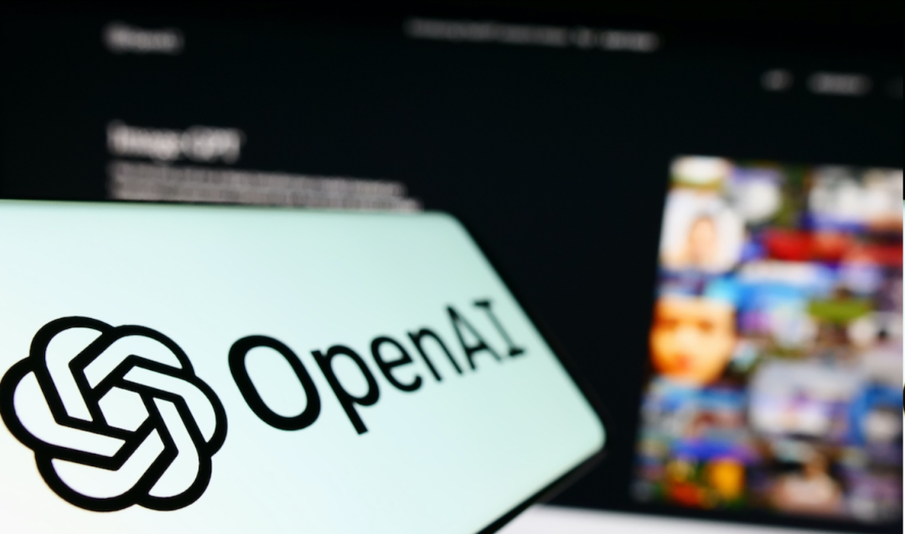
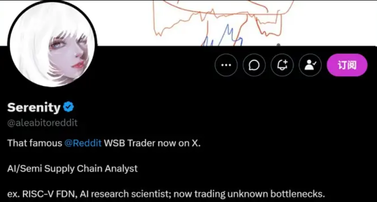
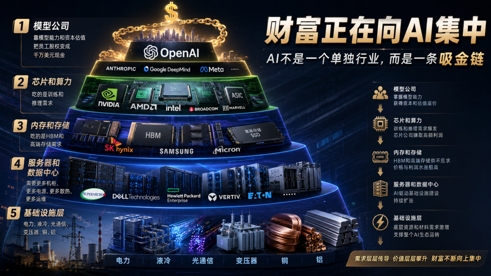

# 财富正在向AI集中

> 财富正在向AI集中。

（文章思路来自于：Ruanyf）

财富正在向AI集中。

AI 的财富效应，已经不只停留在公司估值、股价和资本市场里。

最早涨的是模型和芯片，后来涨的是算力和云服务器。再往后，人们发现，AI 不只是需要 GPU，它还需要内存、存储、CPU、服务器、光模块、液冷、电力、变压器、铜、铝，甚至需要土地、水和电网。

到最后，开始流到具体的人身上了。

而且不是一点点流。

是以一种非常夸张、非常不讲道理的速度，流到模型公司员工、芯片公司员工、内存厂员工，甚至保安、司机、前台这些普通岗位的工资卡里。

钱正在换方向。

OpenAI：还没上市，员工已经先套现了

OpenAI 去年做了一次员工股票回购。

根据媒体报道，超过 600 名现任和前员工卖出了总计 66 亿美元的股票。

平均算下来，一个人大概能拿到 1000 万美元级别的现金。

注意，这不是上市公司员工减持。

OpenAI 到现在都还没有 IPO，预计是今年。

也就是说，这些员工不是等公司上市之后才财富自由，而是在公司仍然是私有公司的时候，就已经把纸面财富换成了真金白银。

还有报道提到，部分员工单人套现金额甚至达到 3000 万美元上限。

这个数字放在任何行业都很离谱。

一个普通互联网从业者，努力十年、二十年，可能都很难积累到这种级别的财富。

但在 AI 模型公司里，它变成了一次内部股票交易。

这说明什么？

说明 AI 第一层财富分配，已经发生在模型公司内部。

谁站在模型公司的股权池里，谁就先被重新定价。

SK 海力士：内存厂员工也被 AI 改命了

第二条新闻更有冲击力。

SK 海力士预计给员工发放创纪录奖金。

媒体报道称，约 3.5 万名员工可能拿到人均 6 亿韩元左右的奖金。

换成人民币，是几百万元级别。

更关键的是，SK 海力士不是一家 AI 应用公司。

它是内存厂。

它赚的是 HBM，是高带宽内存，是 AI 服务器离不开的基础零件。

过去很多人讲 AI，注意力都在模型、应用、产品体验上。

但真正先赚大钱的，往往是卖“底层铲子”的公司。

AI 模型越大，推理越多，训练越多，对高带宽内存的需求就越恐怖。

所以 OpenAI 的员工发财，是因为他们在模型层。

SK 海力士的员工发财，是因为他们在 AI 基础设施层。

前者离用户更近。

后者离钱也很近。

三星：芯片员工平均奖金也到了百万人民币级别

三星也出现了类似的情况。

有报道称，三星内存芯片部门员工因为 AI 带来的利润增长，可能拿到平均约 31 万英镑奖金。

换成人民币，也已经是数百万元级别。

这件事的戏剧性在于，三星前两年还因为半导体业务承压，被市场质疑。

但 AI 一来，整个行业的利润曲线突然被改写。

以前内存是周期行业。

价格涨涨跌跌，厂商经常要面对库存、需求和周期波动。

现在 AI 把高端内存重新变成了战略资源。

它不再只是电脑和手机里的零件。

它变成了大模型训练和推理时代的核心耗材。

所以你会看到一个非常现实的结果：

模型公司赚大钱。

芯片公司赚大钱。

内存公司赚大钱。

服务器、电力、液冷、光通信这些公司也开始被重新估值。

这也是为什么X上最近有一个博主股票收益率达到了45倍，而她的投资逻辑其实就是按这个来的。

AI 不是只让“会写 Prompt 的人”赚钱。

它首先让“拥有关键生产资料的人”赚钱。

连劳资谈判都被 AI 改写了

更有意思的是，这些钱不只是资本市场里的纸面财富。

它还进入了劳资谈判。

三星芯片工人投票接受高额奖金，结束了长达数月的罢工威胁。

这说明 AI 带来的利润已经大到什么程度？

大到员工、工会、公司管理层都要重新谈判分配方式。

过去很多行业的员工很难参与公司利润增长。

公司赚了钱，主要体现在股东回报、管理层奖金、资本开支上。

但在 AI 内存和芯片这种高利润、高需求、强周期反转的行业里，员工开始有更强的议价权。

这就是 AI 财富再分配最具体的一幕。

不是一句“科技改变世界”。

而是工人、工程师、前台、司机、保安都开始参与 AI 订单带来的利润分配。

这种画面，比任何宏观分析都更真实。

AI 不是一个行业，而是一条吸金链

把这些新闻放在一起看，会发现 AI 根本不是一个单独行业。

它是一条吸金链。

最顶层是模型公司。

OpenAI 这样的公司，靠模型能力和资本估值，把员工股权变成千万美元现金。

第二层是芯片和算力。

英伟达、AMD、各类 ASIC、GPU 供应链，吃的是训练和推理需求。

第三层是内存和存储。

SK 海力士、三星、美光这些公司，吃的是 HBM 和高端存储需求。

第四层是服务器和数据中心。

AI 需要更多机柜、更多电源、更多散热、更多运维。

第五层是电力、液冷、光通信、变压器、铜、铝。

这些东西以前听起来和 AI 没关系。

但现在全部被拉进来了。

因为 AI 不只是一个 App。

AI 是一整套物理世界的消耗系统。

你在网页里输入一句话，背后消耗的是电、芯片、内存、服务器、网络和冷却系统。

你生成一张图，背后不是魔法，是算力。

你生成一段视频，背后更是巨大的基础设施成本。

所以 AI 越强，越不是纯软件。

它越像新一代工业基础设施。

最危险的误判

普通人最容易犯的错误，是以为自己不用 AI，就不会被 AI 影响。

这是不可能的。

你不用 AI，但你的电脑内存会涨价。

你不用 AI，但你的手机存储可能更贵。

你不用 AI，但你公司买服务器、买云服务、买电子元件的成本可能会上升。

你不用 AI，但资本可能从你所在的传统行业流向 AI。

你不用 AI，但你的岗位可能会被一个“会用 AI 的人”重新竞争。

所以 AI 的影响不是你点不点开 ChatGPT 决定的。

它是通过成本、资本、人才和生产效率传导到每个人身上。

AI 创造了很多财富。

但它不是平均创造财富。

它先奖励最靠近新生产资料的人。

然后，才轮到应用层、创业者、普通公司和普通人慢慢适应。
