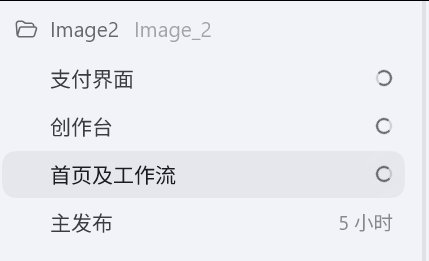
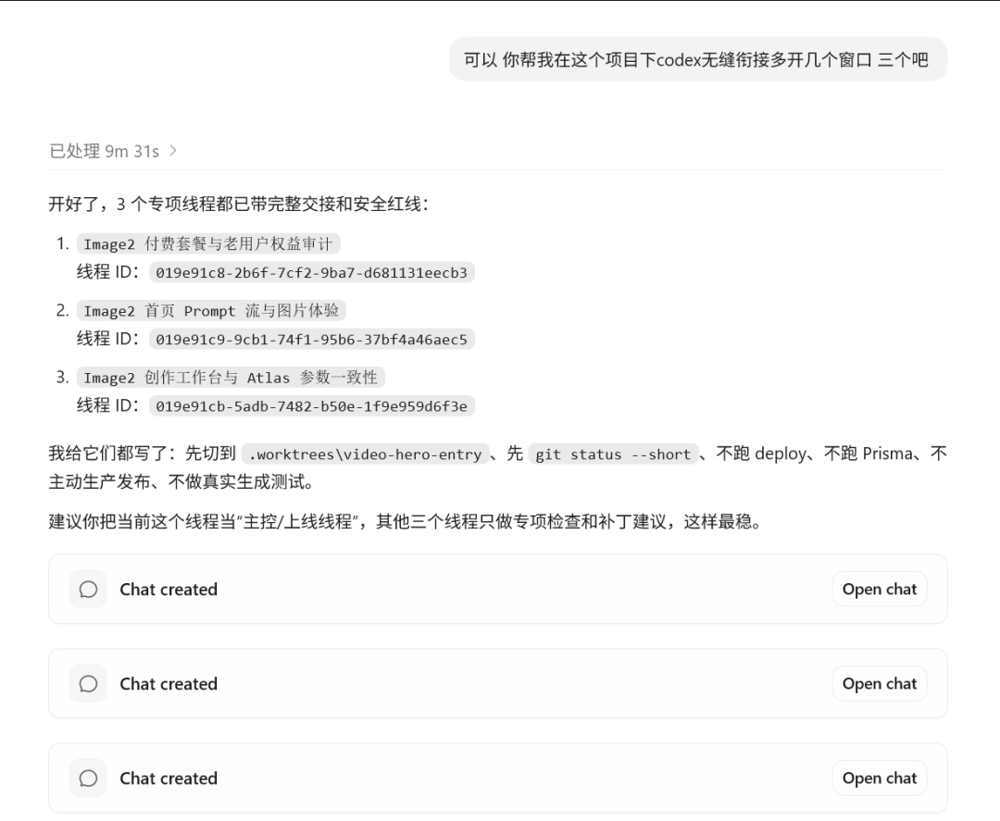

# 分享两个Codex小技巧

> 今天实在太忙了，想了下没有特别想写的思路

今天实在太忙了，想了下没有特别想写的思路
干脆给大家分享两个codex的小技巧吧
1、Codex大型项目应该分工作流进行制作
如果你是做一个大型项目，现在更好的方法是开启多个对话。
例如我的Image2网站，我现在会同时开启四个对话框。

也就是三个网页同时进行修改，xhigh模式，加速跑。
这样的好处是可以对冲一些Codex的速度慢。
本地先测试，留主目录对话框进行统一的测试和发布。
2、Codex可以无缝衔接对话，不需要专门清理上下文的项目了
直接告诉Codex无缝衔接另一个对话框就可以。

