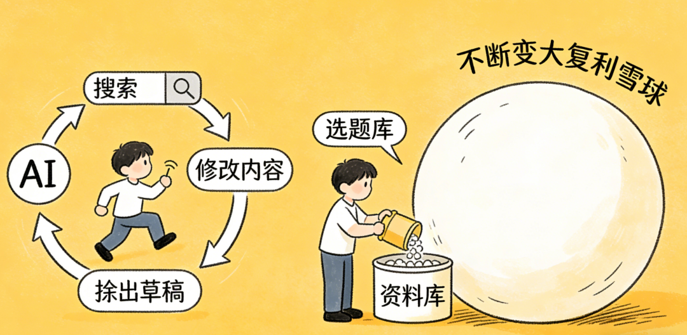
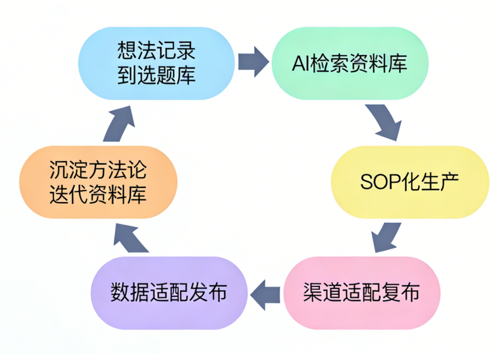

# 从AI碎片化内耗，到内容生产结构化闭环｜解锁长期复利的核心逻辑

> 原文：<https://fxin.cc/journal/day-12>

> 绝大多数人用AI，很容易陷入了「碎片化循环」的低效陷阱，看似每天都在靠AI产出内容、推进工作，实则只是机械重复，既无积累，也无复利，越忙越迷茫，越忙越没竞争力。

分享一个我踩过的雷

绝大多数人用AI，很容易陷入了「碎片化循环」的低效陷阱，看似每天都在靠AI产出内容、推进工作，实则只是机械重复，既无积累，也无复利，越忙越迷茫，越忙越没竞争力。

更扎心的是，这种碎片化的AI使用方式，不仅浪费时间和精力，还会让我们在「看似高效」的假象中，逐渐丧失搭建体系的能力，最终被AI的便捷性「绑架」，沦为「AI的工具人」，而非「驾驭AI的生产者」。

一、AI碎片化使用的3个核心问题，多数人都在忽视

我们先拆解一下用AI的常规路径，看似高效，实则全是低效内耗：

碎片化循环路径：想法闪现→立刻咨询AI→微调答案→发布→彻底忘记→新想法闪现→重复循环

这套路径，看似每一步都有产出，实则存在3个核心问题，不仅拉低效率、阻碍长期成长，也会间接影响商业变现的稳定性：

1. 无沉淀，无复利，越做越累

每一次AI内容产出，都是「一次性消耗」——没有记录想法的来源，没有留存AI给出的核心逻辑，没有沉淀可复用的素材，下次遇到类似需求，只能重新咨询AI、重新修改，相当于每次都在「从零开始」。

复利的核心是「可复用、可积累」，而碎片化使用AI，本质是「消耗式产出」，无法形成自己的内容资产、方法论资产，长期来看，时间成本越来越高，产出效率却无法提升，变现能力自然难以突破。

2. 人为内耗过多，效率被严重拉低

整个碎片化路径中，人为介入的「无效操作」太多：想法闪现后，没有经过筛选就急着找AI；拿到AI答案后，盲目微调，没有统一的标准；发布后不做复盘，仅凭主观感受判断内容好坏，导致大量时间浪费在「无意义的纠结和重复」中。

可现在的时代是效率决定变现速度，尤其是在内容变现、知识付费赛道，「单位时间产出量」直接决定收益上限。碎片化使用AI，看似快速出结果，实则单位时间的「有效产出」极低，无法实现规模化变现。

3. 陷入「想法博弈」，试错成本过高

这是最致命的一点——碎片化使用AI，本质是「灵感驱动」，而非「体系驱动」。今天觉得某个想法可行，靠着AI赶工两天，转头又觉得方向不对，推倒重来；明天又冒出新想法，重复同样的流程，时间和精力全浪费在无意义的试错里。

试错成本越高，商业变现的风险就越大。对于中小创业者、内容博主而言，时间和资金成本有限，频繁的想法摇摆和试错，会导致精力分散，难以形成稳定的产出和变现节奏。

反观我自己，也经常踩这个坑：靠着AI的便捷性，习惯性追求「快速出结果」，却忽略了「结果背后的积累」；沉迷于「单次内容的爆款可能性」，却放弃了「内容体系的复利效应」；有时也会陷入困惑——明明每天都在产出，变现能力和专业能力却没有明显提升。

AI的核心价值，从来不是帮我们解决「单次问题」，而是帮我们搭建「可复用的生产体系」；真正高效的AI使用方式，是从「碎片化索取」转向「结构化沉淀」，让每一次产出，都成为下一次的基础；真正的商业竞争力，从来不是「单次爆款」，而是「可复制、可放大的结构化体系」 。

二、核心解法：AI驱动的结构化内容生产闭环

跳出碎片化陷阱，搭建属于自己的「AI驱动型结构化内容生产闭环」，才是把AI用透、用出复利、提升商业变现能力的关键。

这个闭环不是复杂的流程，而是一套可落地、可复用、可优化的SOP。

核心是「让想法有留存、让生产有体系、让复盘有沉淀、让所有动作都有复利」，兼顾效率和积累，同时降低人为内耗和试错成本。整个闭环环环相扣，形成正向循环，每一步都有明确的目标、动作和商业价值，具体分为6个核心步骤：

第一步：想法落地→记录到选题库（拒绝灵感流失，搭建内容源头）

碎片化的起点，是「想法来了就用，用完就丢」；而结构化的第一步，是给所有想法一个「标准化的容身之所」——选题库。

✅ 具体动作：不管是突发的选题灵感、客户的需求痛点、行业的热点思考，还是自己的感悟总结，只要脑子里出现相关想法，第一时间不是急着去问AI，而是标准化记录到专属选题库。

✅ 选题库核心结构（可直接复用）：核心想法+适用领域+目标受众+初步落地方向+优先级（高/中/低），目的是把模糊的灵感变成清晰的待办项。

✅ 告别「灵感驱动」，走向「库存驱动」，让内容生产有源头、有选择，避免灵感转瞬即逝，同时降低「想法博弈」的内耗——选题库中的想法的经过筛选和排序，避免盲目试错，为后续规模化生产打下基础。

第二步：AI联动→搜寻对应资料库（拒绝重复造轮子，提升生产效率）

结构化的核心，是「不复用，不生产」；而碎片化的最大问题，是「每次都让AI从零开始」。当选题库有了明确的想法，下一步不是直接问AI「怎么写这个内容」，而是让AI联动自己的专属资料库，精准搜寻相关内容。

✅ 具体动作：搭建自己的专属资料库（包含过往产出的优质内容、已验证的干货、行业优质

案例、沉淀的方法论），让AI基于当前选题，从资料库中检索「可复用的素材、已验证的思路、避坑的经验」，形成初步的内容框架和素材包。

✅ 关键细节：给AI明确的检索指令（例：基于选题「AI碎片化使用的陷阱」，从资料库中检索相关案例、核心观点，整理成可复用的内容框架），减少人为介入，提升检索效率。

✅ 让AI从「答题工具」升级为「资料检索员」，避免每次提问都重复造轮子，降低生产的时间成本；同时，复用已有的优质素材，保证内容质量的稳定性，为后续变现（如知识付费、广告合作）奠定基础。

第三步：框架复用→SOP化生产（拒绝人为内耗，实现标准化产出）

碎片化生产的低效，很大程度来自「人为介入过多的无意义微调」；而结构化生产的关键，是「用已验证的框架，实现标准化产出」，把人从繁琐的生产细节中解放出来。

✅ 具体动作：基于AI检索到的资料，直接复用自己过往验证过的内容生产框架（比如干货文的「痛点-原因-方法-案例」、短文案的「钩子-价值-行动指令」、知识付费课程的「理论-实操-避坑」），让AI按照框架生产初稿。

✅ 关键细节：人为介入只做「框架确认」和「核心信息校准」，不做无意义的细节修改；搭建属于自己的内容生产SOP（标准作业流程），明确AI生产的格式、语气、核心要点，让每一次产出都符合自己的调性和标准。

✅ 实现内容生产的「标准化、规模化」，提升单位时间的有效产出；同时，降低人为内耗，把更多时间和精力放在「核心决策」（如选题筛选、渠道适配）上，为规模化变现提供可能。

第四步：高效发布→聚焦渠道适配（拒绝盲目发布，提升触达效率）

结构化生产的闭环，不是为了生产而生产，而是为了「结果而生产」；发布环节的核心，是「轻量化适配，精准触达」，避免因过度追求完美而拖延发布，同时提升内容的触达效率和转化效率。

✅ 具体动作：基于AI按SOP生成的初稿，根据不同发布渠道的特性（公众号的深度、小红书的轻量化、短视频的口语化、知识星球的干货感）做简单的渠道适配，无需做大量修改，快速发布。

✅ 关键细节：发布时同步记录「发布渠道、发布时间、核心标题、目标人群」，为后续的数据复盘提供基础。

✅ 轻量化发布，降低发布环节的时间成本，实现「多渠道同步产出」；精准的渠道适配，提升内容的阅读量、完读率，为后续的转化（如粉丝增长、产品成交）打下基础。

第五步：数据复盘→用结果做判断（拒绝主观博弈，优化生产方向）

碎片化生产的最大内耗，是「靠主观感受判断想法的好坏」；而结构化生产的关键，是「用数据复盘替代主观判断」，让每一次优化都有依据，避免无意义的试错。

✅ 具体动作：内容发布后，聚焦「核心数据指标」做复盘（不同渠道指标不同）：

公众号：阅读量、完读率、点赞在看率、转发率、转化率；

小红书：浏览量、点赞收藏率、评论率、关注率、引流转化率；

知识付费：课程报名率、内容完播率、复购率、客户反馈。

通过数据，明确哪些选题方向、内容框架、表达形式是受目标受众认可的，哪些是需要优化的，形成完整的复盘报告。

重要的是用数据替代主观判断，降低试错成本；明确内容生产的优化方向，让后续的产出更贴合目标受众的需求，提升内容的转化效率，进而提升商业变现能力。

第六步：沉淀方法论→迭代资料库（拒绝无积累产出，实现复利效应）

这是结构化闭环最核心的一步，也是区别于碎片化生产的关键——「让每一次产出，都成为下一次的复利基础」；这一步的核心，是「沉淀资产，实现迭代」，让内容生产成为「滚雪球」的过程。

✅ 具体动作：根据数据复盘的结果，把验证有效的内容框架、选题方向、表达方法、行业干货，沉淀为自己的「专属方法论」；同时，将优质的内容、素材、复盘报告同步更新到专属资料库，让资料库不断丰富、不断优化。

✅ 关键细节：方法论要标准化、可复用（例：「高转化干货文SOP」「小红书爆款选题方法论」），方便后续AI直接复用；资料库定期整理、分类，确保AI检索的精准度。

我们的终极目标是搭建属于自己的「内容资产和方法论资产」，实现「生产-复盘-沉淀-再生产」的正向复利；随着资料库和方法论的不断优化，AI生产的内容质量会越来越高，生产效率会越来越快，最终实现「规模化、自动化变现」。

三、从碎片化到结构化，本质是「资产思维」的升级

其实从AI的碎片化使用，到搭建结构化的内容生产闭环，背后不仅是使用方法的改变，更是商业思维的核心升级——从「追求单次收益」转向「追求长期复利」，从「靠体力驱动」转向「靠体系驱动」，从「消耗式产出」转向「积累式产出」 。

我们可以从两个维度，深化理解这套闭环的商业价值：

1. 降低成本：时间成本、试错成本、人力成本

结构化闭环的核心，是「复用」和「自动化」：复用已有的素材、框架、方法论，降低重复劳动的时间成本；用数据复盘替代主观判断，降低试错成本；让AI承担大部分的生产、检索工作，降低人力成本（甚至可以实现「一人规模化产出」）。

对于中小创业者、内容博主、知识付费从业者来说，成本的降低，就意味着利润空间的提升——同样的时间，能产出更多优质内容，能实现更多转化，变现能力自然会拉开差距。

2. 提升价值：搭建可放大的商业壁垒

在当下的AI时代，每个人都能靠AI快速产出内容，「单次内容的优质」已经不再是核心竞争力；真正的核心竞争力，是「你是否拥有可复用、可积累、可放大的内容体系和方法论体系」——这就是你的专属商业壁垒。

碎片化使用AI的人，只能停留在「低水平重复」的阶段，无法形成自己的壁垒，很容易被替代；而搭建结构化闭环的人，每一次产出都在积累资产，每一次复盘都在优化体系，随着时间的推移，壁垒会越来越高，变现能力也会越来越强（比如从「单次内容变现」升级为「知识付费、社群运营、产品带货」的多元化变现）。

四、总结：Day12的核心感悟，也是可落地的行动指南

AI的出现，本是为了提升效率、解放人力，但多数人在使用中，却陷入了碎片化的低效误区，忙碌却难有积累。

真正高效的AI使用方式，从来不是「靠AI快速出结果」，而是「用AI搭建结构化体系」；真正有价值的努力，从来不是「机械重复的产出」，而是「有积累、有复利的沉淀」 。

后续，我也会持续更新闭环的落地细节、SOP模板、资料库搭建方法，和大家一起，从AI碎片化使用，走向结构化高效变现，拒绝低水平重复，解锁长期复利的核心密码。

平庸的人靠灵感驱动单次产出，厉害的人靠体系实现持续变现；AI能帮你解决单次问题，但只有体系，能帮你实现长期成长。
