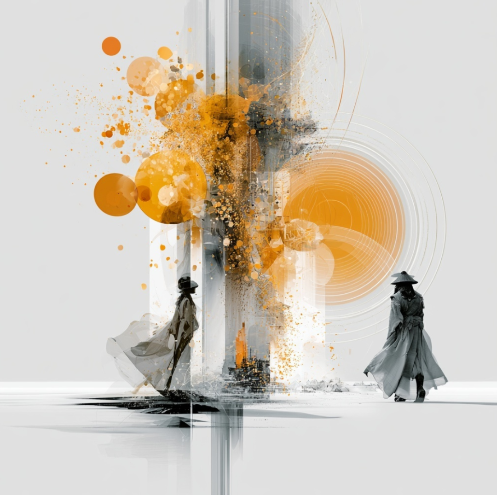
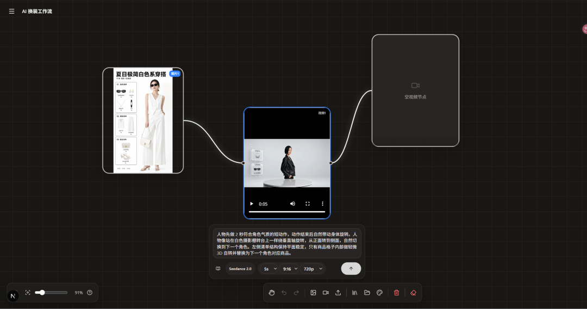

# 适度打游戏

> 大家好，我是方鑫，今天是一人公司第 121 天。

大家好，我是方鑫，今天是一人公司第 121 天。

最近感觉自己得稍微克制一下了，打游戏太多了。

白天基本上都在 VibeCoding。

一天差不多 8 个小时左右，一直在修改网站、调功能、改细节、排问题。

这个强度其实不低。

白天一直在高密度推进，到了晚上回家之后，人就会很自然地想放松一下。

最近这几天，回到家以后基本上就是和朋友打游戏。

一开始我觉得也没什么。

毕竟白天已经写了一整天代码，晚上稍微放松一下很正常。

但这一两个星期复盘下来，还是能明显感觉到，网站的进度被拖慢了。

以后一定要克制了！

周中最多打2次游戏。

无限画布做成功了，但还没有完全融合

今天还有一个比较重要的进展：

无限画布做成功了。

这个功能我其实已经想了很久。

它对 Image2 来说也挺重要。

因为如果只是单张图片生成，用户的操作路径会比较短。

但一旦进入无限画布，整个产品就会更像一个真正的创作工作台。

用户可以在一个更大的空间里整理图片、延展想法、继续编辑、对比不同结果。

这会让网站从“生成一次图片”慢慢变成“持续创作”。

所以我对这个功能是有期待的。

今天把基础能力做出来之后，我能明显感觉到，它开始有一点“AI 创作工作流”的样子了。

现在视频节点、图片生成节点、音频节点都已经做出来了。

从截图上看，图片可以作为输入，视频节点可以承接生成，后面还可以继续接空视频节点、音频节点、素材节点。

这已经不是一个单点生成工具，而是在往“节点式创作系统”靠近。

但问题也在这里。

基础节点做出来是一回事。

和 Image2 真正融合，是另一回事。

现在我还在思考几个问题：

图片生成节点应该怎么和原来的 Image2 生图体验结合？

视频节点是作为单独能力存在，还是嵌进一个完整的图生视频链路里？

音频节点未来是做配乐、旁白，还是做更完整的视频工作流？

素材库应该放在哪里？

视频模板库应该怎么呈现？

用户进来之后，是先看到一个画布，还是先看到模板，还是先从一张图开始？

这些问题都不是单纯写代码能解决的。

头痛。

最让我头痛的，其实不是技术。

是 UI。

功能做出来之后，最难的是怎么让它看起来舒服、好看、直观。

因为对用户来说，访问一个网站的第一感受往往不是“这个功能有多深”。

而是它好不好看？

它像不像一个值得信任的产品？

我愿不愿意继续点下去？

做得好看，才是用户访问的第一要义。

其次才是使用。

如果一个功能很强，但界面很乱、层级不清楚、节点不够精致、交互不够顺，用户可能根本不会给它第二次机会。

这件事还需要继续探索。
