# 自由画布上线 | 小报童更新 | 小红书自动化流程

> hello，今天是122天。

hello，今天是122天。
今天还是做了很多事的。
一、上线自由画布
现在还是测试版V1.0，大家遇到任何Bug问题随时联系我，我将第一时间修复并给你积分奖励！

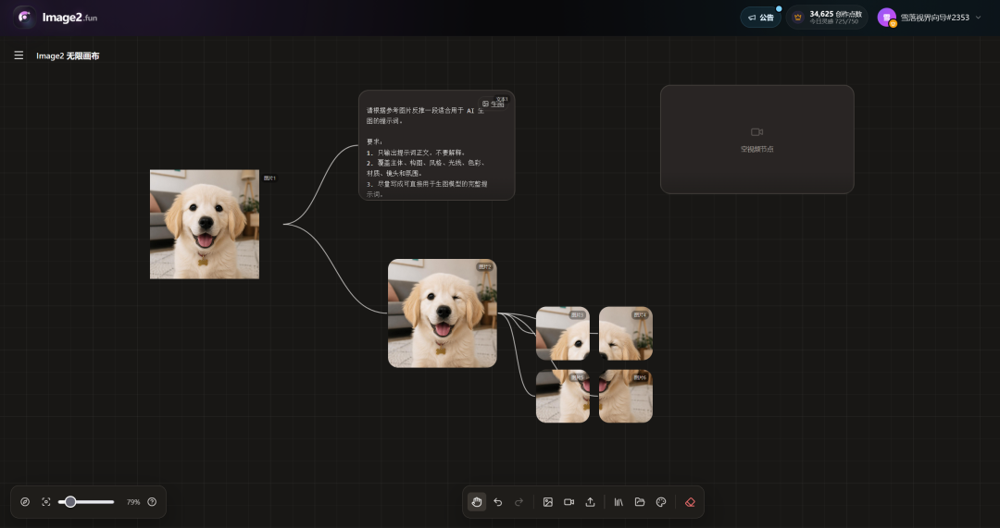

这个自由画布我打磨了很久，终于和我的Image2网站打通了，我自己试了下，操控非常方便。
下面给大家介绍一下功能。
1、生图，生视频

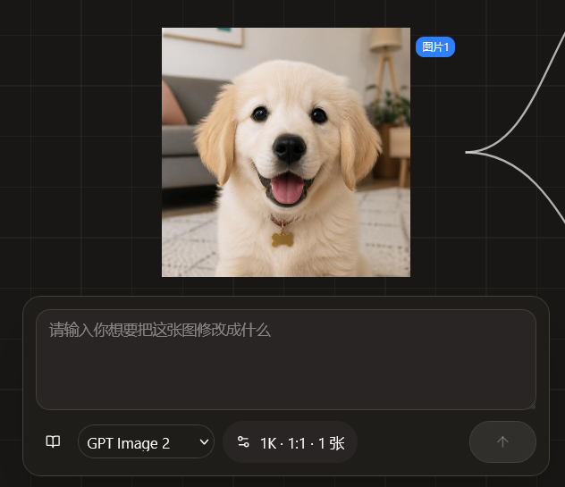

你可以自由选择你想要使用的图片模型和视频模型。
明天我会把提示词素材库也引入自由画布，这样大家在自由画布里就可以自由的选择风格、提示词进行创作了。
2、图片编辑

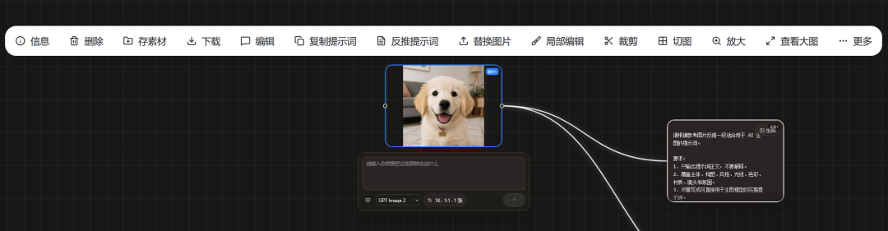

对于每一张你生成或者放进去的图片。
你可以存素材，复制提示词
3、反推提示词

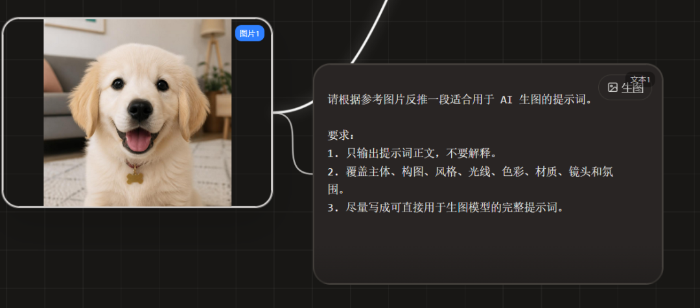

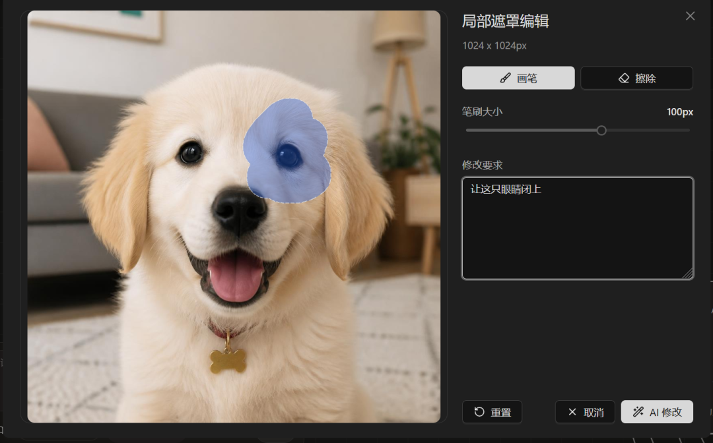

5、裁剪

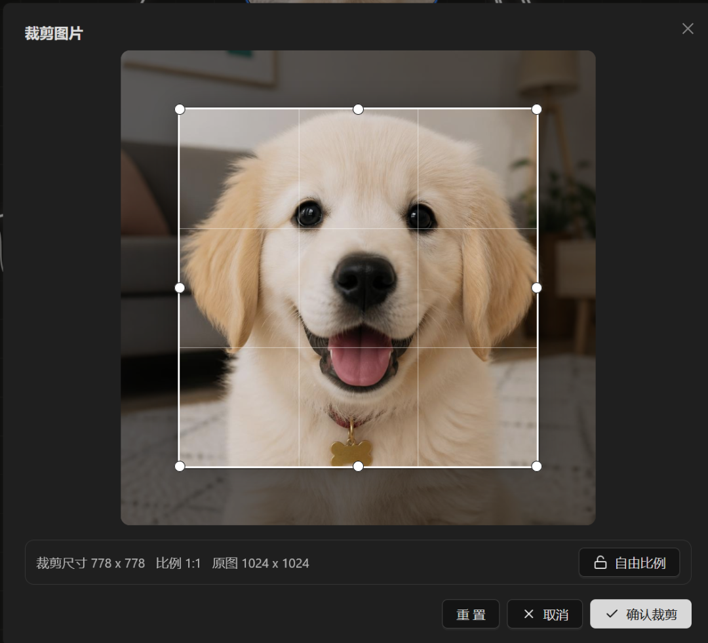

6、切分图片

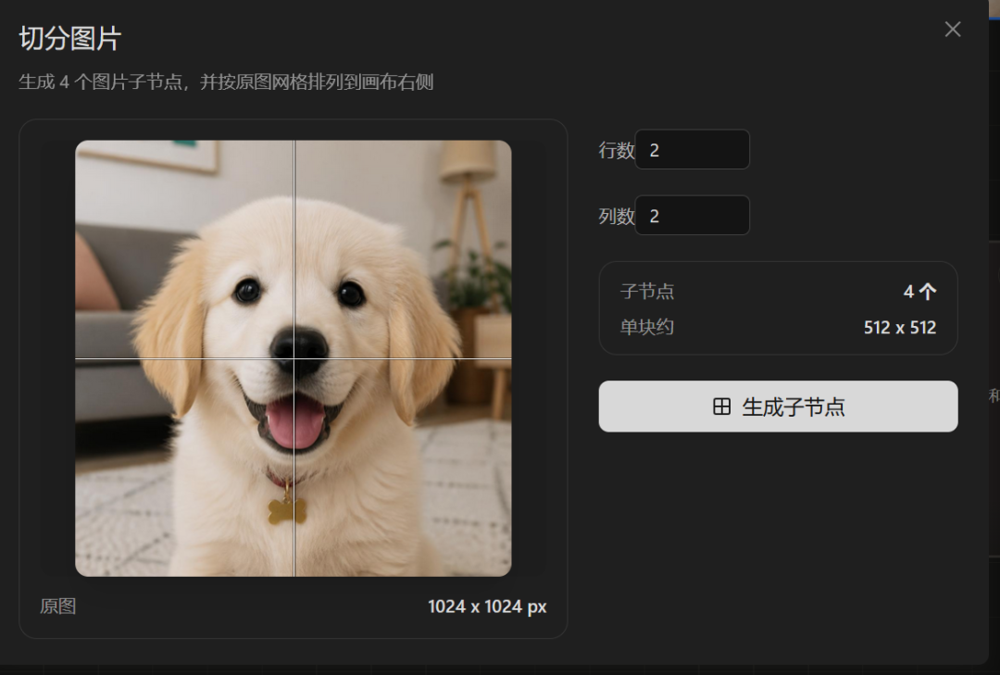

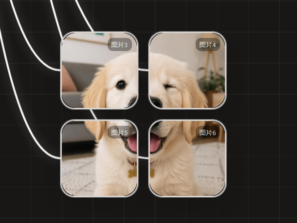

7、放大以及提高分辨率

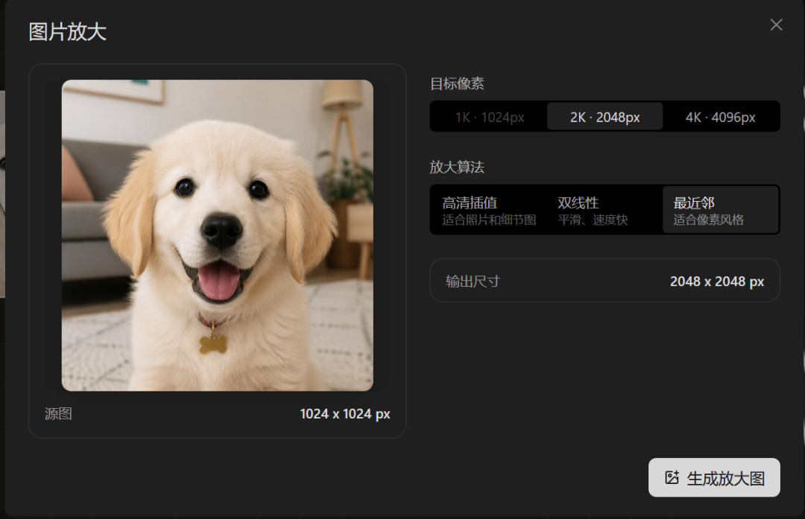

此外，你还可以自定义你的节点配置，可以添加锁比例、超分、多角度。

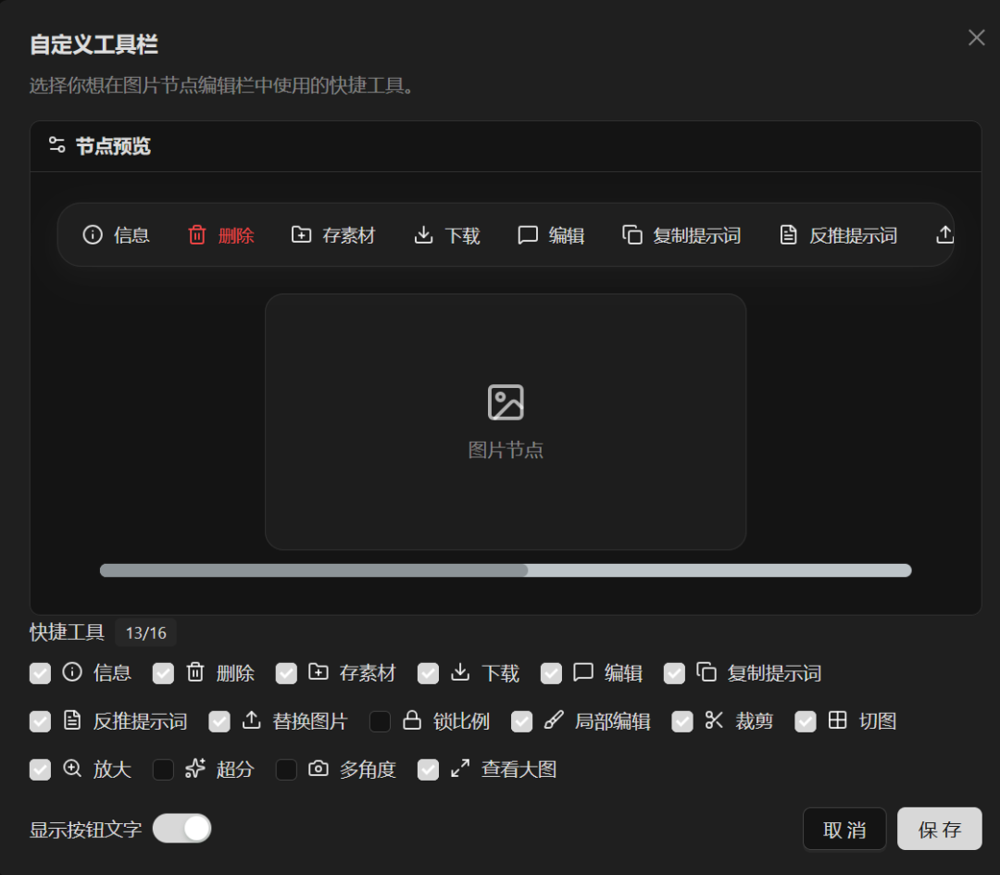

与此同时，明天我会把所有用户已经生成的图片素材全部导入他们自己的素材库里面去，把网站资源也放进公共数据库池。

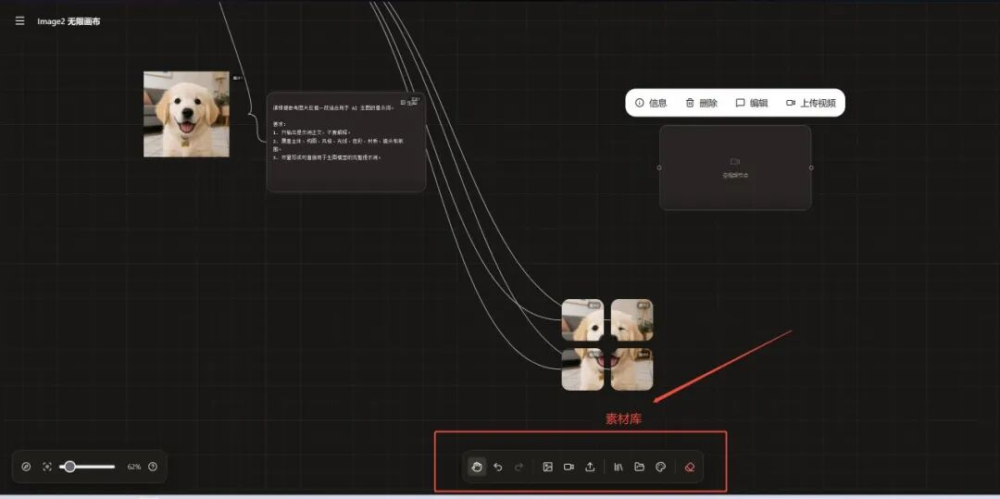

二、更新小报童
虽然有点拖更，但今天好在是完成了小红书自动化这篇文章，里面详细讲述了我如何使用一些开源项目改造并根据我自己的实际情况去自动化发布小红书Prompt图文。

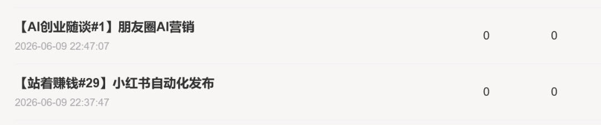

与此同时，有用户反馈我的小报童一周一更还是有点慢，希望我能更多的给予一些AI创业的思路，所以我又新增了一个栏目。
AI创业随谈。
我会把我看到的，想到的，别人告诉我的，可能做的AI项目全部写在里面。
好啦，11点了，今天也不多写了。
大家晚安~
