# 回归高强度工作 | AI撰写文章 | 引入素材库 | 拍摄短视频 | 图片编辑 | 如何提高AI水平

> 这两天状态还可以，回归到工作高强度作战的情况了。

这两天状态还可以，回归到工作高强度作战的情况了。
先简单阐述下今天做了什么，然后我再细说。
一、四小时完成了主业要求的4篇论文的撰写（行业内细分论文，质量中等）
关于论文这一块，我先是开通了Kimi的高级会员，然后用了他们的桌面端应用，我想看看Kimi的桌面端实力如何。
别的功能不讨论，就讨论我写论文的实际体验。

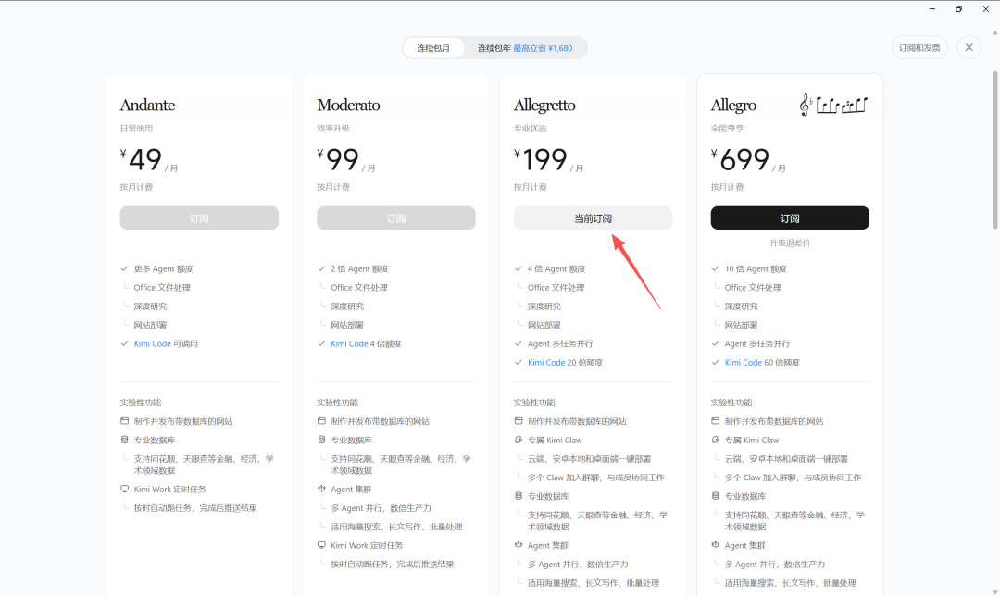

我认为Kimi最大的优势在于中文语义下强大的互联网数据库检索能力。
例如：我想写一篇行业内的文章。
我会先让他检索行业内顶尖50-100篇一等奖的论文文章，然后再根据风格进行撰写。
这个命令我同样发给了Codex和Kimi，从执行效果来看，Kimi的理解能力远胜于Codex，甚至于我都认为Codex根本就没看到一百篇（从执行过程来看）。
这种中文检索能力是Codex和ClaudeCode等外国顶尖大模型无法比拟的，因为他们的训练预料基本都是英文，天然差一截。
结论：写文章Kimi胜于国外大模型，国内未知。
而且Kimi还有个小窗口可以接入大A，学术数据库，天眼查等国内平台，这个也是属于独一档的。

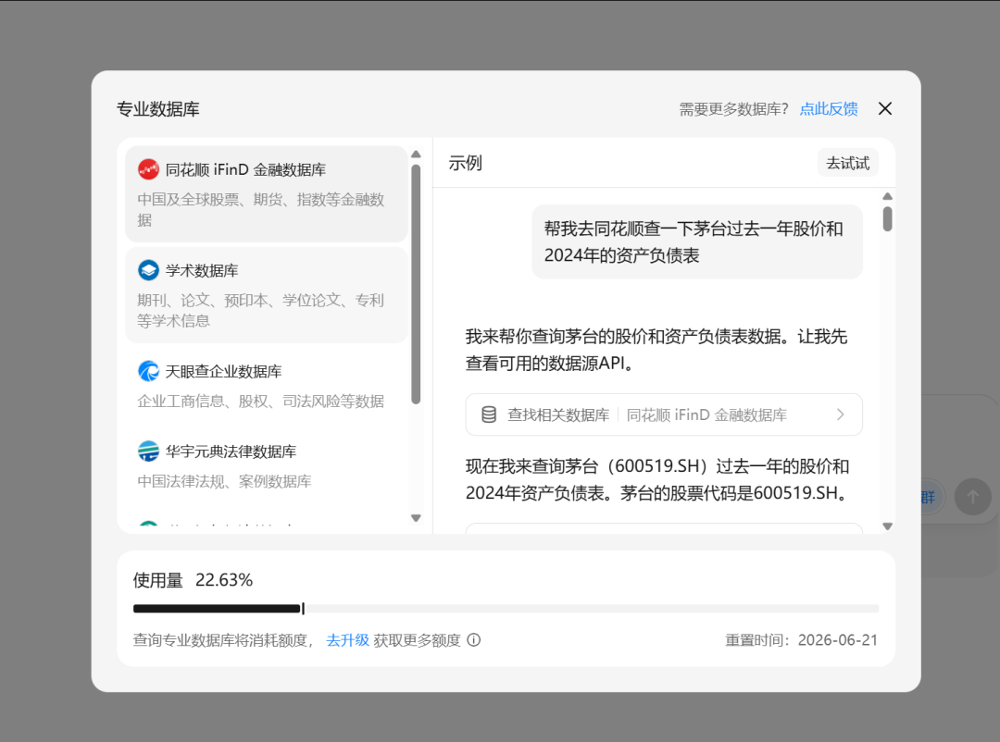

聊完了优点，我们聊聊缺点。
缺点也很明显，Kimi在执行颗粒度上不如Codex等顶尖大模型。
什么意思呢？
专业文章和论文一般都有格式要求，而且需要是Word版本的。
比如我需要正文宋体小四，然后标题黑体二号，参考文献小五等等……。

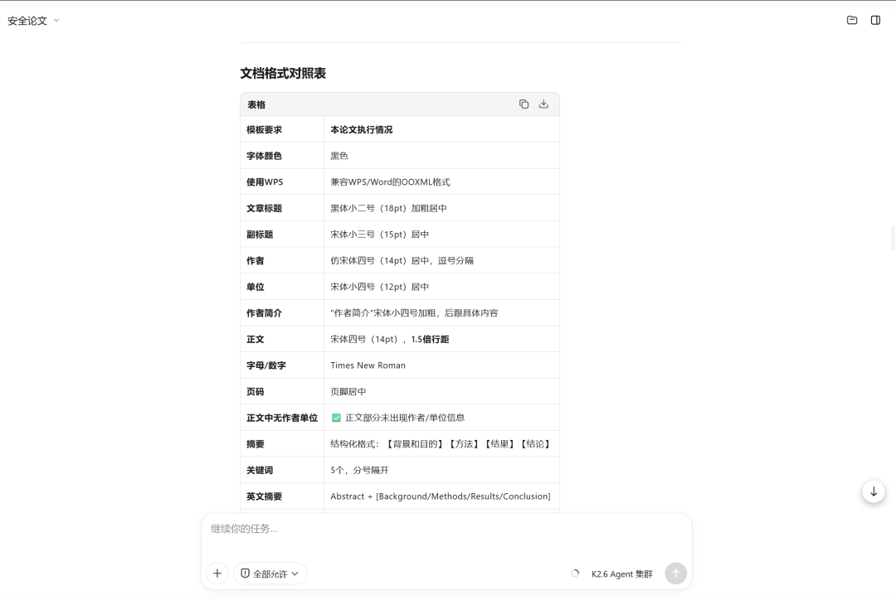

这个格式其实是很复杂的，你直接把格式发给Kimi，想让其调整到一个比较完美的状态，他的完成率是非常低的。
可能是与Word的衔接，也可能就是模型的能力不够，总而言之就是差口气。
Codex有一个Kimi无法比拟的优势，就是他是直接对接到Word。

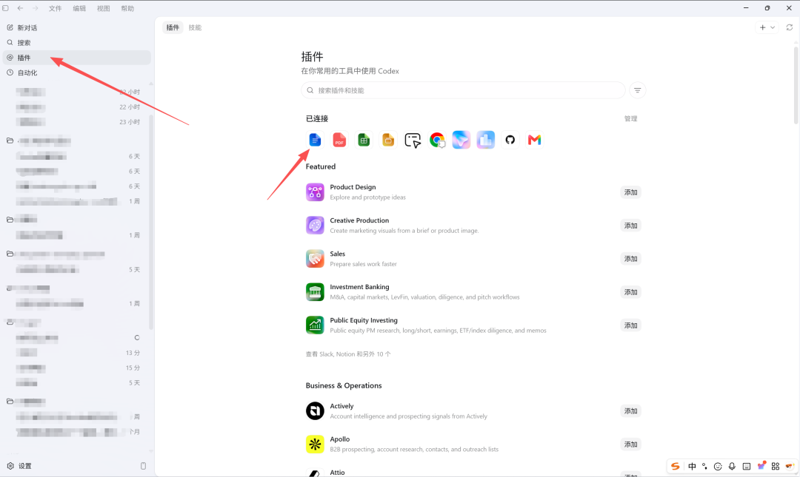

所以当我把论文格式要求直接发给Codex的时候，他可以直接给我完成90%的格式修改，然后我自己再微调一下就好了。
这一点必须点赞！
Codex还有一个优势就是可以直接调用Image2生图，就以科研图为例子吧。
给大家推荐一个Skill，是专门吸取的Nature的画图风格，你可以直接使用Codex安装skill然后用Image2生图。

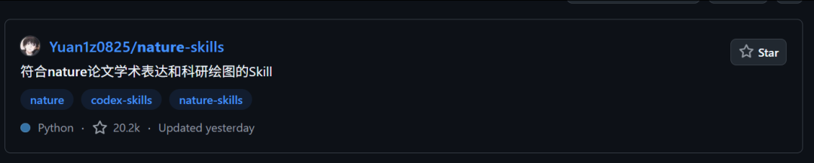

简直完美。
二、自由画布引入了全站的提示素材库
——这样大家在生图的时候可以搜索全站提示词直接使用。

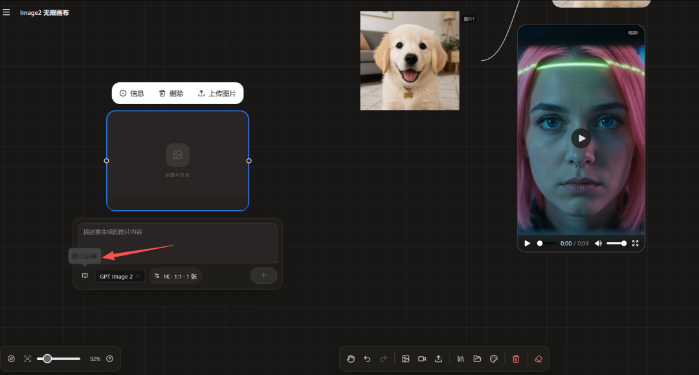

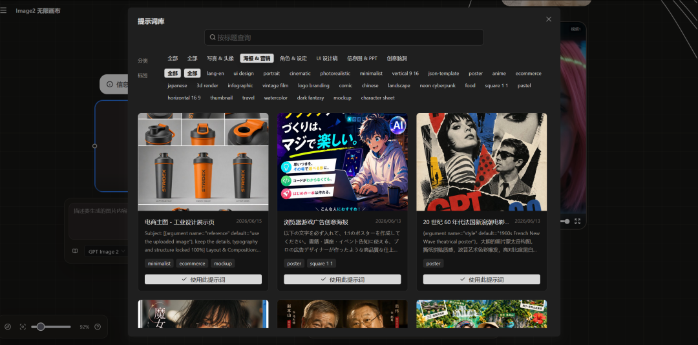

但是目前加载速度有点慢，我还没挂CDN，明天会抽出一点精力完成速度和路线优化。
三、优化支付页
我之前的支付页我自己看着都头痛，我觉得很难看很杂，但是我的ui水平也一般，所以关于支付的界面我一直在修改。
先给大家看看原界面，乱糟糟的，用户都给我反馈说抓不住重点。

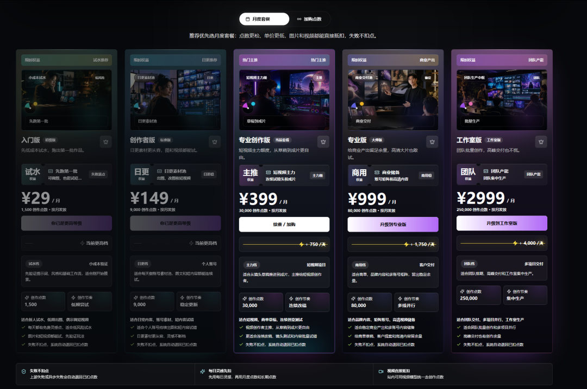

然后这是我修改后的界面，大家觉得有优化吗，欢迎给我提建议。
其实乍一看可能上面好一点？
但是结合整个页面来看，我还是感觉很乱，而且上面这个付费套餐我觉得废话太多了。

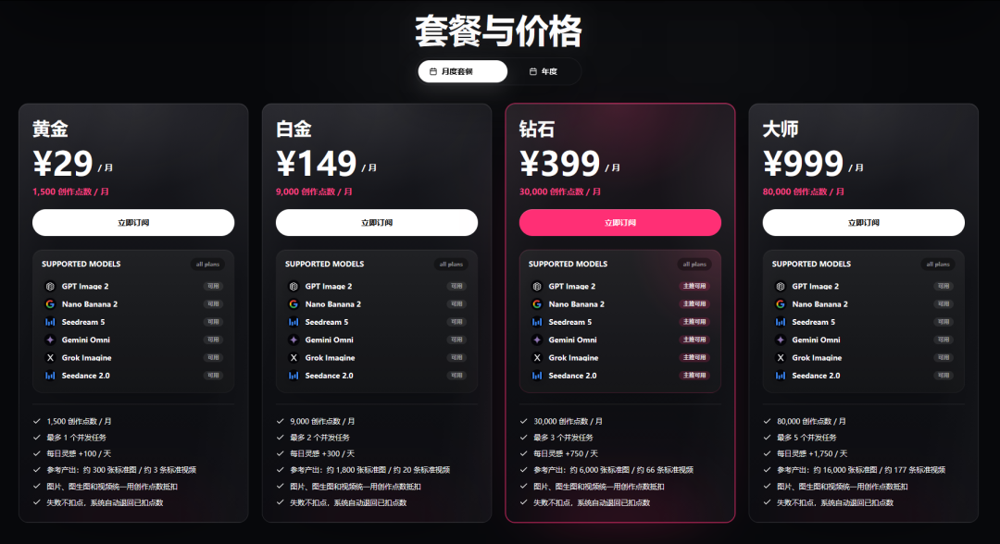

我个人比较喜欢第二种，简洁清晰易懂。
四、拍摄短视频

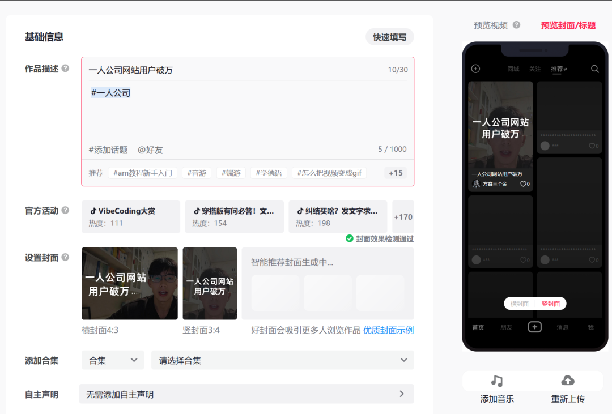

我给自己的Image2自由画布拍了一个简单的介绍视频，顺便让家来找bug，给我网站提更多的意见，然后吸引更多的用户。
每一个bug建议，我都会送500积分。
五、网站添加图片工具板块

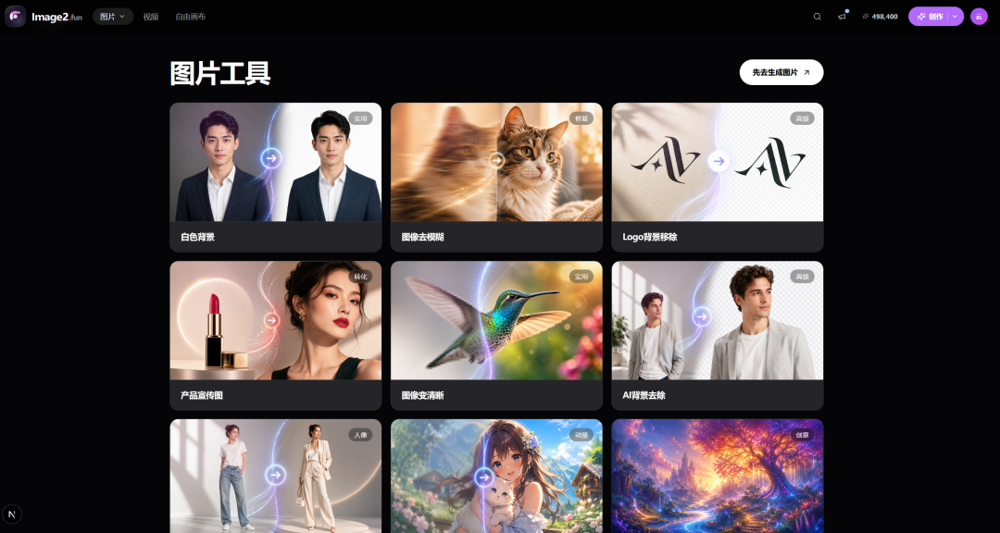

简而言之，我准备把全网对于图片编辑的功能全部融入进去。
现在还在测试，预估这周全面上线。
最后回答一个粉丝问题：我是怎么不断加强自己的AI协作能力的。
我之前说过，我最大的爱好就是玩AI，所以我会买各种各样的会员，尝试各种各样的新东西。
这就是我的爱好，只是这个爱好现在在不断加强我的能力。
现在主业的工作，基本上别人都要搞好几天甚至一周，我可能就半个小时。
我每个月花在AI上的钱应该是5000-10000，现在Image2网站基本上能覆盖。
随便举个例子，我今天为了让我的网站更好看，我就去买了一个设计网站的会员，里面有非常多网站的组件和优美的设计，花了我200刀。

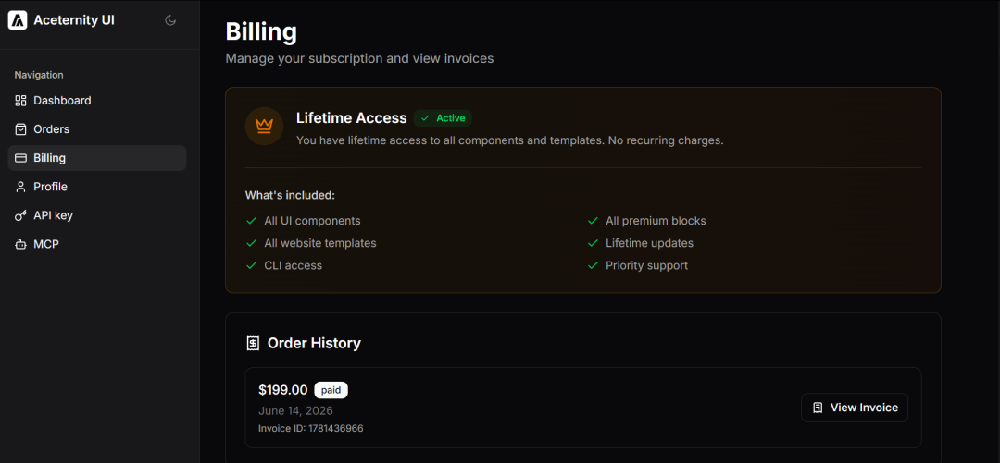

生活其他方面我其实欲望不大，花钱也不多。
但是对AI花钱，我是从不吝啬的。
一是爱好，二是我认为这是对未来的一种投资。
