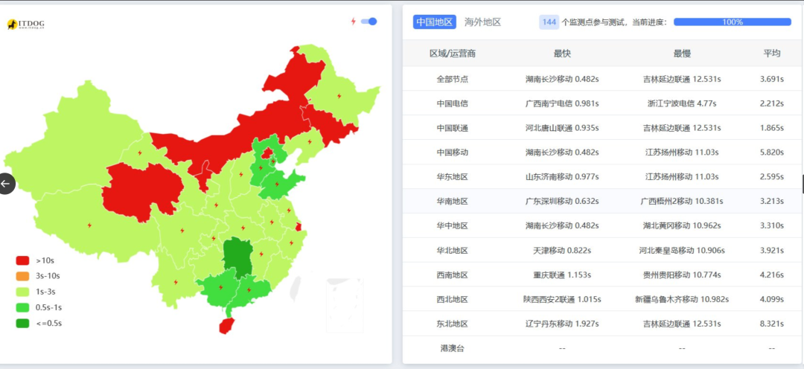
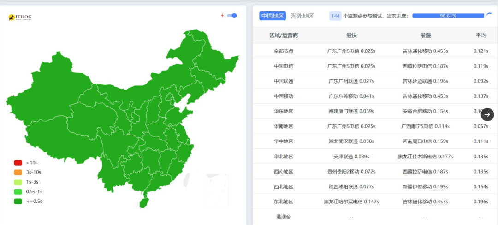

# 网站更换服务器，速度大幅加快

> 大家好，我是方鑫，今天是一人公司第 124 天。

大家好，我是方鑫，今天是一人公司第 124 天。
今天的主要工作，就是服务器迁移。

之前的服务器是阿里云的HK，4核8G，挂的是EdgeOne的CDN加速。

选择HK的原因是备案和网速问题，选择阿里云是因为方便。

现在越来越不方便了。

主要是用户变多之后，给我提建议说网站卡的越来越多了，我也觉得卡。

给大家看下测速，简直要爆炸。

今天狠狠调研了一下，决定换个服务器。

我的方案分享给大家。
架构：香港 CN2 GIA 高配 VPS（源站） + Cloudflare（CDN + 图片优化） + 对象存储（图片存放）

VPS：DMIT HKG.Pro（或同级别 CN2 GIA 商家，如 Cubecloud 高配）

配置：8核16GB（推荐）或 12核24GB

存储：200GB+ NVMe

带宽：20-50Mbps（固定带宽）

CDN：Cloudflare（Free 版起步，必要时上 Pro）

图片存储：Cloudflare R2（免费额度很大）或 Bunny Storage

预计总成本：¥1100-1450/月

然后Cloudflare我暂时没用，我感觉Edgeone可能更适合国内使用，我就把服务器换了下，还是挺贵的，一个月可能要1000左右。

直接上换完后的测速吧。

一片绿，简直不要太开心。
今天最开心的点，不只是网站变快了。

而是我越来越能感觉到，Image2 真的在从一个“能跑的网站”，变成一个“可以长期运营的产品”。

今天这次迁移，就是往后一个阶段迈了一步。

以前 Image2 更像是在旧服务器上不断堆功能。

现在换到新服务器、新链路、新 CDN 架构之后，它终于有一点“正式产品”的基础设施味道了。

当然，迁移完也不是就可以躺平了。

后面还要继续测登录、验证码、生成、支付、点数、自由画布、图片编辑。

也还要继续修 bug。

今天甚至还重新开了几个线程，分别准备处理首页、自由画布、图片编辑的问题。

但至少底座已经换好了。

路已经通了。

速度也起来了。

今天应该是一个挺重要的节点。
