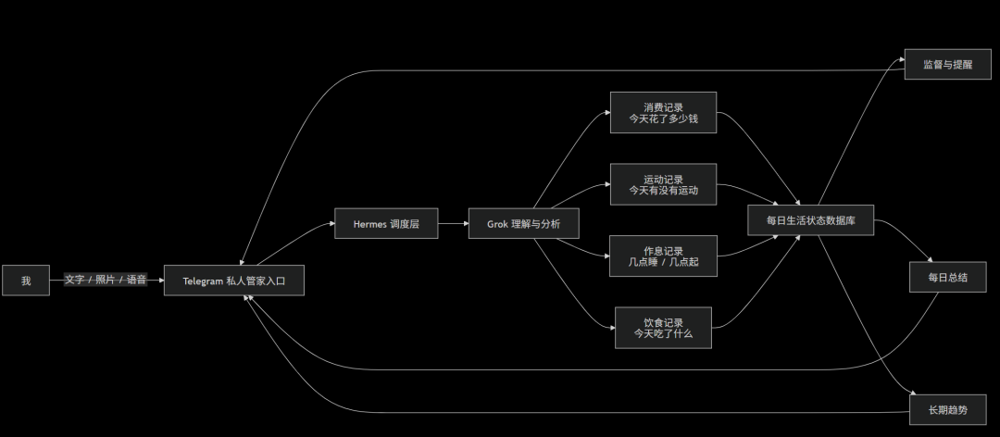
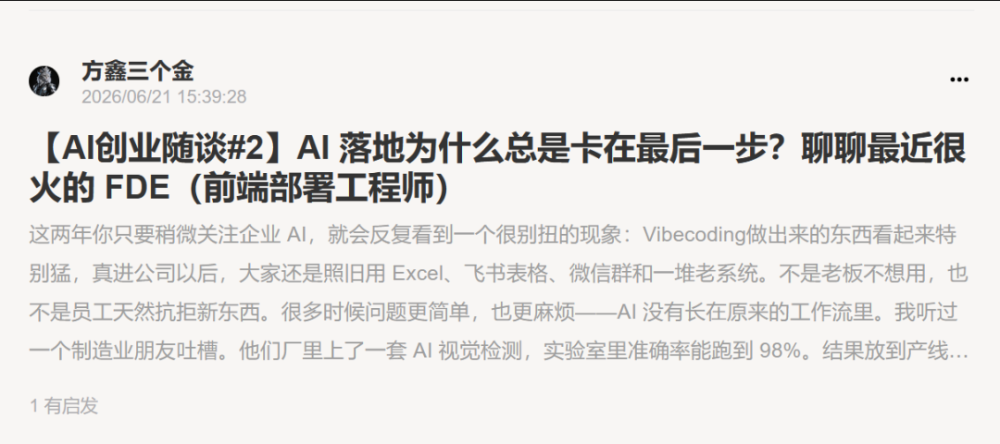
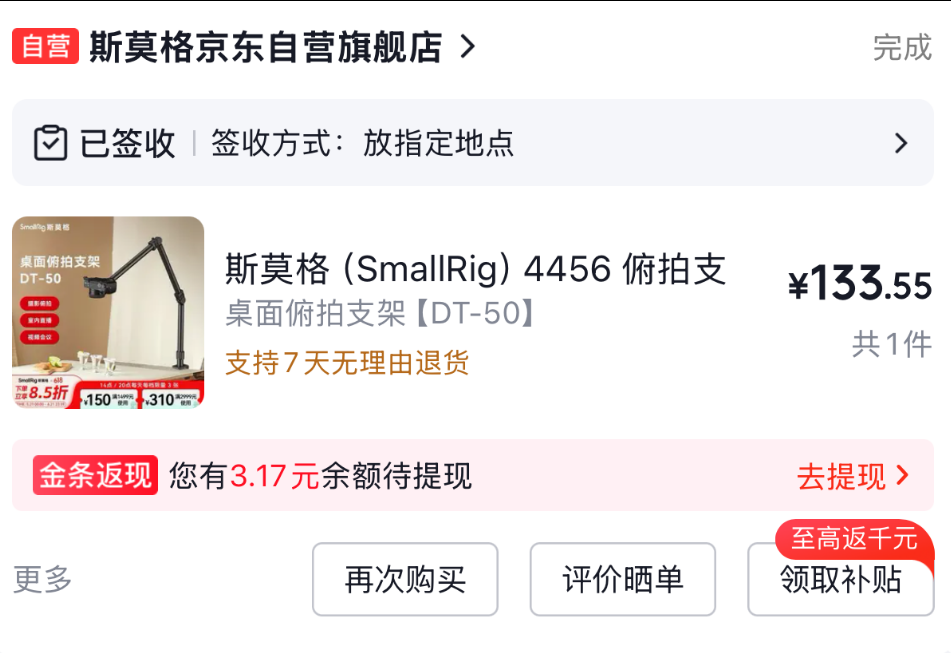
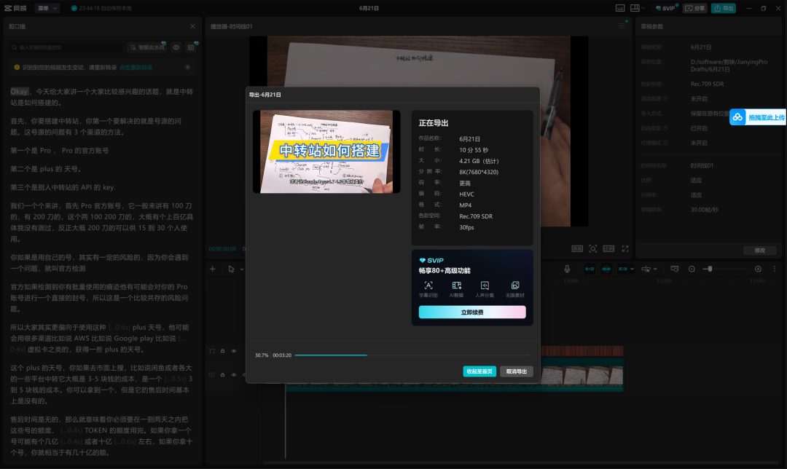

# 私人生活管家 | 拍摄视频 | FDE前端部署工程师 | 小报童更新

> 大家好，我是方鑫，今天是一人公司第 126 天。

大家好，我是方鑫，今天是一人公司第 126 天。

端午这两天出去旅游了一下。

玩得挺开心，人也稍微从之前连续工作的状态里抽出来了一点。

但今天回来之后， 我下定决心要收心了，以后我要疯狂更新，回归到之前的工作强度之中。

今天基本上工作了一整天，算个开头。

有产品、有内容、有拍摄，也有一点对自己状态的重新调整。

做了一个私人生活管家

今天比较有意思的一件事，是我给自己搭了一个私人管家。

目前是通过 Hermes + Grok + Telegram 连接起来的。

它现在可以记录和监督我每天的一些生活状态。

比如：

今天花了多少钱。

今天有没有运动。

几点睡觉，几点起床。

吃了什么东西。

这些内容我都可以直接拍给它，或者发给它。

我暂时没有把工作内容放进去。

因为之前我试过，把工作、生活、消费、运动、饮食全部混在一起，最后反而会变得很乱。

工作本身已经有很多系统和记录方式了。

如果再把生活状态也塞进去，一个私人管家很容易变成一个什么都管、但什么都管不好的大杂烩。

所以这次我把它定位得很清楚：

它主要管我的生活习惯和自我约束。

而且我给它设定的人格也挺好玩。

是一个毒舌人格。

如果我没运动，它会攻击我。

如果我吃垃圾食品，它会攻击我。

如果我睡太晚，它也会攻击我。

听起来好像有点离谱，但我今天用了一天，感觉还挺不错。

因为人有时候真的不是不知道该做什么。

而是缺一个随时在旁边提醒你、刺激你、把你从惯性里拉出来的东西。

它不一定要多温柔。

有时候凶一点、毒舌一点，反而更有效。

尤其是对我这种很容易一忙起来就忽略生活节奏的人来说。

我现在越来越觉得，一人公司不只是管理网站和业务，也是在管理自己。

如果我自己睡眠乱、饮食乱、运动少、消费也不复盘，那长期看一定会反过来影响工作。

所以这个私人管家，表面上是一个小工具。

但本质上是我给自己加的一套外部约束。

完成了小报童文章 FDE

今天第二件事，是把小报童的 FDE 文章完成了。

这篇文章其实我之前就想写。

因为最近 Forward Deployed Engineer 这个词越来越火。

很多 AI 公司都在讲这个岗位。

如果只从字面理解，很容易把它理解成一个普通的实施工程师，或者售前技术支持。

我觉得它真正有意思的地方在于：

它说明 AI 公司已经开始意识到，模型能力不是全部。

企业 AI 最后卡住的，往往不是模型不会回答，而是模型进不了真实流程。

客户的数据是乱的。

流程是乱的。

部门之间的协作是乱的。

很多经验甚至没有写在系统里，而是在老员工脑子里。

这种情况下，光给客户一个 API、一个后台、一个看起来很强的 Demo，其实远远不够。

必须有人真的跑到现场，把模型、数据、业务流程、人和系统一点点接起来。

FDE 做的就是这个事情。

它不是最酷的那种 AI 工作。

甚至很多时候很脏、很累、很琐碎。

但我觉得这类角色会越来越重要。

因为 AI 越强，大家对“落地”的期待就越高。

而期待越高，模型和现实之间的摩擦就越明显。

这篇文章写完之后，我自己也有一个感受：

其实我现在做 Image2网站，也有一点像在做自己的 FDE。

我要把上游模型、支付系统、用户体验、网站速度、安全防御、内容和真实用户需求全部接起来。

看起来是一个 AI 图片网站。

但背后是无数个脏活累活。

所以写 FDE 这篇文章，也像是在给自己做一次复盘。

拍了中转站搭建的手稿视频

第三件事，是今天拍了一个手稿视频。

主题是用通俗易懂的方式讲一下中转站怎么搭建。

为了这个视频，我还特意在京东买了一个架子。

因为我之前拍类似内容的时候，纸张角度和画面稳定性总是差一点。

如果画面不清楚，用户看起来会很累。

尤其是这种手稿讲解类视频，本来就是靠纸面上的结构图、箭头、流程来帮助理解。

所以画面稳定和纸张位置很重要。

因为今天下楼跑了个五公里，回来都九点多了，但是由于我中途写的时候会扒拉纸张，所以后半段视频有点歪，显示不全。

拍了两个视频都是歪的，但是已经 11 点了。

如果重新来一遍，今晚可能又要拖到很晚。

所以我最后还是先发了。

这件事让我有点不爽，但也能接受。

因为现在最重要的不是第一次就完美。

而是先把动作做起来。

不断改善不完美，直到接近完美。

这也是我现在做内容、做网站、做产品都很认同的一件事。

不要因为不完美就不做。

但也不要因为已经做了，就假装它没有问题。

先发出去。

再一版一版改。

把游戏彻底删除了

还有一件事，对我来说也挺重要。

这几天我基本上没怎么打游戏。

而且我已经把游戏彻底删除了。

以后最多周末出去和朋友打一下。

因为我最近明显感觉到，自己的工作强度不如刚开始前两个月了。

尤其是晚上回家之后，如果默认进入游戏状态，时间会很快被吃掉。

一两个晚上看起来没什么。

但连续几周下来，节奏就会松掉。

对现在的我来说，环境管理比意志力更可靠。

我不想每天靠“忍住不玩”来证明自己很自律。

我更愿意直接把干扰源拿掉。

今天就先这样，大家晚安。
