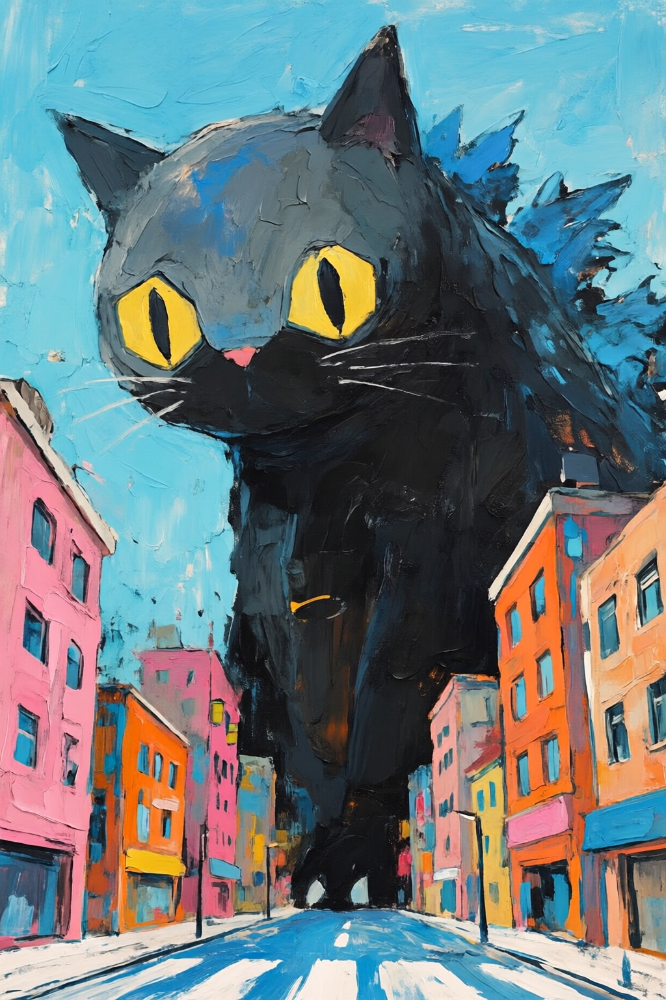
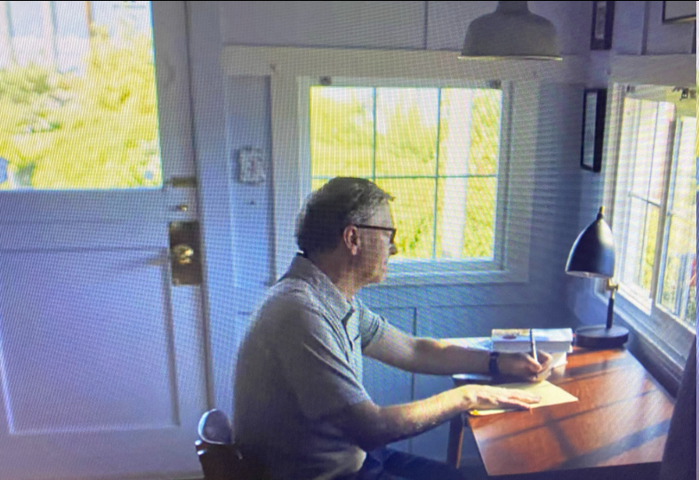

# 聊聊看书

> 大家好，我是方鑫，今天是一人公司第 127 天。

大家好，我是方鑫，今天是一人公司第 127 天。

今天想写得休闲一点，聊聊看书。

我以前其实挺喜欢看书的，每天都有保持一个小时的阅读习惯，但是自从VibeCoding做一人公司以来，我基本没怎么看书。

因为大部分时间都去研究如何做一人公司去了，而且我看书一直挺功利，一般不太会为了休闲去读书，从而这段时间完全没看书。

很多人看小说、看故事、看散文，是为了放松。

我有点做不到。

我只要拿起书，脑子里就会自动冒出一个问题：

这本书对我有什么用？

能不能让我更会赚钱？

能不能让我更懂产品？

能不能让我少走点弯路？

能不能让我更有动力？

所以我一直更喜欢看传记、商业、产品、技术、心理学、历史这类书。

有时候一本书只要给我一个观点，我就觉得值了。

那么不看书的后果是什么呢？最近我有一个很明显的感觉。

感悟变少了。

这个东西很难量化。

不是说我不会写东西了。

我每天还是能写。

但我能感觉到，很多内容是在从以前的库存里拿。

以前看书比较多的时候，我经常会突然有一些连接。

比如看某个企业家的传记，会想到自己做一人公司现在处在哪个阶段。

看一本产品书，会想到产品某个入口为什么不顺。

看一本心理学或者效率类的书，会突然意识到自己最近为什么拖延。

这种感觉挺重要的。

因为严肃阅读本质上是在扩宽自己的认知边界，通俗讲就是长脑子。

我有点像一直在输出，但没有新的东西进来。

很奇怪，我不是不想看书。

我是不知道看什么。

现在书太多了。

如果要去仔细辨别可能也要花一段时间，这个时间我甚至都可以去给网站改几个bug了。

于是我就一直拖。

拖的原因不管是因为不愿意看，还是觉得浪费时间，反正结果其实都一样。

我深受曾国藩的影响，一般情况下不把一本书读完，坚决不读另一本书，但这个习惯在互联网好像是一个很差的习惯。

曾国藩他在给弟弟们的家书中反复强调：

“读书不二：书未看完，决不翻看其他，每日须读十页。”

“读书不二：一书未看完断不看他书，东翻西阅，都是徇外为人。”

拿到一本书，我会觉得从第一页读到最后一页才算读过。

中途放下，好像亏了。

跳着读，好像不认真。

读得慢，又觉得自己没效率。

最后就变成，书还没开始读，心理负担先来了。

这个毛病挺蠢的。

一本书如果本来就只有三章对我有用，那我为什么非要把剩下的也硬啃完？

我今天也看了一点别人怎么读书。

比如 Bill Gates 那个 Think Week，专门找时间集中读材料和思考。

什么是Think Week？

简单来说，就是每年两次、每次持续一周的完全独处阅读与思考时间。

盖茨会彻底与外界隔绝，专注阅读大量材料、深度思考未来趋势，并产生创新想法。

我以前看这个只觉得很厉害。

今天再看，突然有点不一样。

这种大佬事情比我多太多。

但他反而要专门拿一段时间出来读东西。

这说明阅读不是闲人才做的事。

越忙的人，越容易被眼前的事情拖着走。

所以越要留一点时间，把自己从日常事务里拔出来。

Cal Newport 讲深度工作的时候，也经常说注意力切换会有残留。

这个我现在太有感受了。

我一天里面会在代码、网站后台、Telegram、视频、文章、支付、用户反馈之间来回切。

切来切去，看起来一直在忙。

但脑子其实很碎。

读书刚好反过来。

它没有那么刺激。

没有点赞。

没有数据。

没有一个按钮点下去马上看到结果。

你就坐在那里读二十分钟，好像什么都没发生。

但它会让脑子慢慢安静下来。

这可能就是我最近缺的东西。
