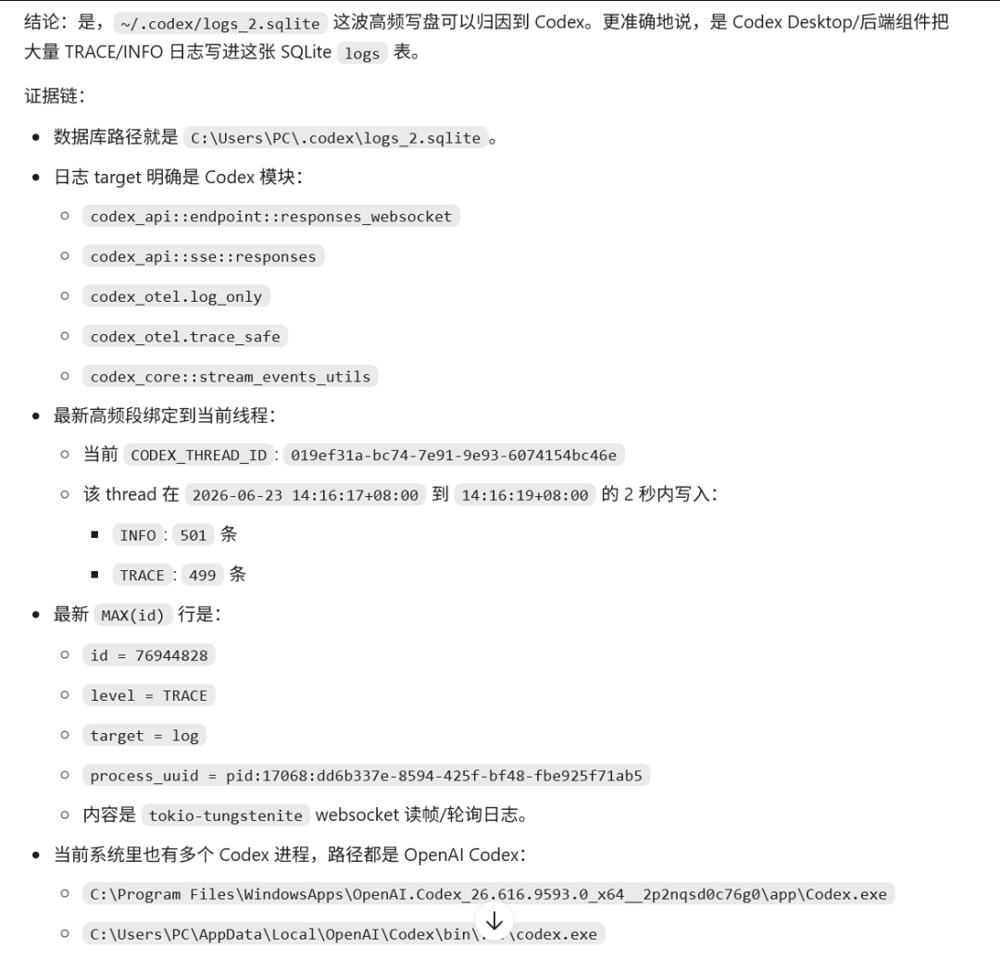

# Codex可能在持续读写你的硬盘，导致你的SSD硬盘转速暴跌并损坏

> 大家好，我是方鑫，今天是一人公司第 128 天。

大家好，我是方鑫，今天是一人公司第 128 天。

今天本来想写点正常的产品进度，结果晚上看到Codex出个大bug。

Codex可能在持续读写你的硬盘，导致你的SSD硬盘转速暴跌并损坏。

这件事让我想起前几个月的硬盘问题。

当时我的电脑开始明显卡顿，打开软件卡，切换窗口卡，有时候做事做到一半，系统会突然变得很迟钝。

我当时第一反应是笔记本用久了，虽然这台电脑也就买了一年多，但硬盘测速确实很难看，速度直接掉到一个离谱的水平（一两千的转速掉到100-200）。

我那时候没往软件写盘上想。

最后去千米维修换了一个固态硬盘，花了 1000 块。换完以后确实好了，但过了两三个月（也就上个月的事情），新硬盘速度又开始暴跌，从正常水平掉到 200、300 左右。电脑又开始卡。

当时我就觉得很奇怪。

一个新换的固态，怎么会这么快又出问题？

千米那边虽然说可以保修，但要返厂一个月。我现在电脑每天都要用，写代码、修网站、写文章、做内容、查资料都在这台机器上，所以一直拖着没修。

今天看到 Codex 这个日志写盘问题，我才突然觉得，之前那次硬盘问题可能不是单纯硬件倒霉。

直到看到官方承认这个bug。

我还特意让Codex去查了下，结果还真是。

这TM谁想的到啊！

你不会看到一个弹窗告诉你“我正在疯狂写 TRACE 日志”。你也不会每天去看 ~/.codex/logs_2.sqlite。正常人谁看这个？

你只会感觉电脑越来越卡，然后开始怀疑是不是电脑老了、系统垃圾太多、硬盘质量不行、自己开了太多软件。

如果它只是偶尔写几 KB、几 MB，那无所谓。但如果在长任务、流式输出、高频调用时持续写 TRACE，时间长了，对消费级 SSD 肯定不友好。

尤其是我现在基本把它放进日常工作流了。它会长时间读文件、改 Obsidian、查日志、跑命令、帮我排网站问题。它已经不是一个聊天工具，更像一个一直在旁边工作的开发助手。

如果你也高强度使用 Codex，可以先让它自己帮你查一下。

提示词可以直接写：

帮我检测 ~/.codex/logs_2.sqlite 是否因 TRACE 日志持续高频写盘？
重点不是只看文件大小，还要看几个指标：logs_2.sqlite-wal 有没有持续增长，logs 表里 TRACE 有多少，MAX(id) 有没有异常变大。最好隔几秒再采样一次，看 MAX(id) 和 WAL 还涨不涨。

如果真的在涨，那就别先研究半天原理了。先备份，再止损。

让它按这个方向处理：

中招了就直接先备份，再用 SQLite trigger 拦截 logs 表, 并 checkpoint/truncate WAL, 最后采样确认 MAX(id) 和 WAL 不再增长
这件事不要直接乱删。

先备份。

先确认路径。

再动数据库。

~/.codex 下面不只是一个日志文件，里面还有当前会话、配置、状态相关的东西。为了清一个日志，把 Codex 状态搞坏，也很烦。

但如果确认它还在高频写盘，我觉得止损优先级很高。日志没了可以接受，硬盘一直被打就不能接受。

我现在已经把本机的写入拦住了，WAL 暂时也没有继续增长。后面还要继续观察硬盘状态，也要看 Codex 后续有没有官方修复。

今天先把这个记录下来。

高强度用 Codex 的人，建议现在就查一下。
