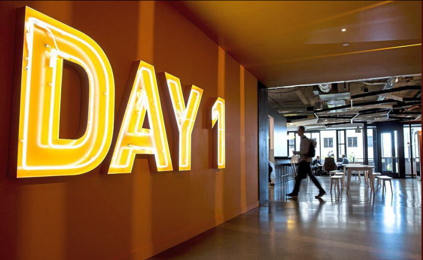
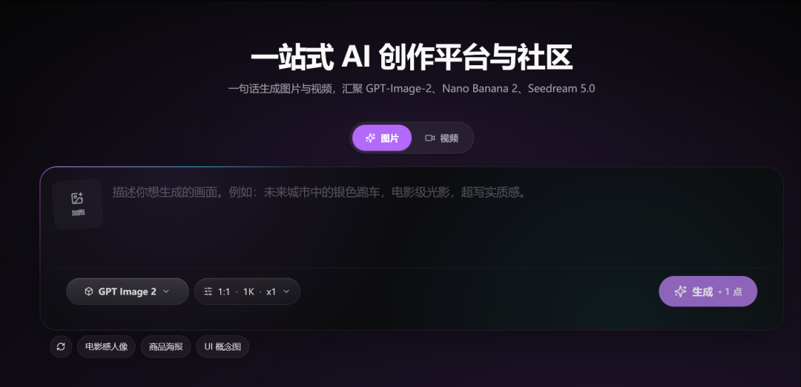

# 你产品的发愿心是什么呢？

> 今天是方鑫一人公司的第129天！

今天是方鑫一人公司的第129天！

今天难得白天写一个文章，主要是在看《置身钉内》这篇书籍太有感触了，尤其是我做了几个月的产品之后，才发现自己踩了那么多的坑，那么多事情没有想清楚，如果大家做产品，强烈推荐大家去看这本书。

我的个人主页已经转载了这篇文章：https://fxin.cc/reposts

今天的内容我会写一些自己的感悟以及文章内我觉得非常触动我的话，文章可能会有点长（因为原文已经几万字了，我是一字不落的啃下来了）。

为什么这篇文章我强烈推荐做产品的人看呢，因为里面包含了大厂一个完整项目的失败经验。

原文内容：

我想记录一个AI 产品从立项、发布、共创到收缩的过程中，理想如何被翻译成目标，目标如何被拆成需求，需求如何在组织里变形、落地，如何进入真实的用户现场 ⸺ 而退远镜头的景别，这一切究竟如何在钉钉、在时代的背景下发生。

我一直认为，如果想要做产品，不管你是做对标还是做创新，一定要看失败的经验，这往往是最宝贵的经历，里面包含了创业者踩过的坑，遇到的问题和压力。

为什么不去看成功的产品经验和案例呢？

因为他们太成功了，成功到他们的资源、经历、人脉、机遇都是你无法去复刻的。

我举一个最简单的例子，理想汽车现在很成功吧？

但是我在看李想访谈的时候，他们一度濒临破产，也就是他们遇到了无法逾越的问题——没有钱。

李想谈此经历一度落泪，受尽了无数投资者的白眼，还是没有融到资。

最后还是李想曾经拒绝过融资请求的王兴，以私人的名义投了了十亿美金。

我为什么要在这里举这个例子的原因是大部分成功都是会被美化的，不管是传记书籍、内部访谈等等。

他们或许遇到了当下无法解决的困难，或许是贵人，或许是机遇，总而言之是解决了问题。但是这些东西是学不来的，凡事都要有最坏的打算，尤其是创业或者做产品，更多的应该汲取那些已经踩过的坑，没有成功的案例。

乐观主义是一个很危险的事情。

你不可能去想当然的幻想你的用户会喜欢你的内容，不可能去拍脑袋的幻想觉得这个功能加上去后用户会喜欢，不可能的去幻想用户会自发的宣传你的产品，不可能去幻想用户会很有耐心的使用你产品的每个功能，不可能幻想用户会在你的产品上待上十秒钟以上，甚至不可能幻想你的运气会很好。

Stay Hungry是一项很重要的心理暗示，但也是创业路上必不可少的心理基础。

Jeff Bezos（亚马逊创始人）最著名的就是“Day 1”（永远是第一天）心态。

即使亚马逊已经是巨无霸，他每年股东信都强调：Day 2就是停滞 → 失去相关性 → 痛苦衰退 → 死亡。

所以要永远像初创公司一样：痴迷客户、勇于实验、接受失败、保持长期思维和饥饿感。

亚马逊总部甚至有个叫“Day 1”的建筑来提醒大家。

回归正题，作者在文中提到的“发愿心”我认为是整篇文章的核心。

任何一个做产品的人，我觉得都应该问问自己，你的产品“发愿心”是什么？

发心是行为的内在动机与根本誓愿，是一切工作、生活、实践、修行的起点、方向和动力源泉。一个理性善良人的行为的发心，往往在帮助世界、物质回报和成就自我之间逡巡。

举几个具体的例子：

    淘宝——发心是「提升解决商家对接客户销售地问题的效率」，也就是「让天下没有难做的生意」。

    安缦酒店——发心是「服务好度假的高净值人群」。

    番茄钟——发心是「推广 25min 专注 + 5min 休息的工作节奏的理念」。

虽然和人一样，一个产品也会混合以上多种发心，但大部分情况下，好产品只有一个主发心。大道至简，这也和许多投资人会提倡的「一句话说清产品价值」异曲同工。

当一个产品的发心又多又没有主次的时候，就会成为一个贪心而焦虑的产品。

回顾我的Image2网站，扪心自问，我的“发愿心”是什么呢？

从网站最开始做的时候，我想的就是汇集全网优质的Prompt提示词，让大家可以“方便”使用“顶级提示词”并结合“优质大模型”生成自己想象中的图像。

我把我认为关键的三个词勾选出来了，这也是我当时刚开始做时认定的三个痛点。

“方便”——意味着用户只需要输入内容一键生成，不需要多余复杂的操作。

“顶级提示词”——意味着用户不需要去其他地方找提示词，我这里全覆盖了。

“优质大模型”——意味着解决国内的网络问题。

回过头看，这三个问题我解决了吗？

我的评价是——解决了，但是解决的不深。

最大的问题，我认为是虽然我做了一个Hero，大家可以很方便的生图。

但是！！仅限于通用领域！

如果落在细分领域上呢，例如电商、教育、写真等领域，其实我并没有给大家做一个细分的入口或者说更方便的办法，例如一键生成模版 or Agent生图。

大家来到我的网站，确实可以输入提示词，然后生图，但是这和其他产品又有什么区别呢？

他其实也可以直接给豆包发，也可以给Chatgpt发，也可以给Grok发。生成的图片效果可能比我还好一些，而且还可以再图片上面调整。

从这个角度出发，那么我的目标人群定位从一开始就不清晰。

我的发愿心落到了优化模糊的实施效率方法上，而不是精准解决目标人群问题上。

我想方便用户使用，可这个用户到底是谁呢？我说不出来。

产品也有产品的发心。产品的发心就是它的发起人最原始的出发点，例如：

解决某个尚未被解决的具体问题，提升解决某个问题的效率，服务好某个具体的人群，推广某种理念，销售某种资源，等等。

我一开始做的是对标，对标Seaart，对标Pollo。

但是我现在发现我对标的只是产品，而不是理念，更不是方向。

诚然，现在这个产品确实可以给我带来一定的收入，但是就如我之前所说的，这个月可以给你带来1-2w的收入，下个月可能也是1-2w的收入，但是你不能指望他一直带来这个收入。

逆水行舟，不进则退。

不能指望自己一直运气好，更何况我现在的运气也不好，在用户达到1w后进入了一个缓慢的增长期，这个增长期也给了我极大的反思，我面临着以下几个方向：一是增加单个用户的付费值；二是继续增加用户数量。

如果增加单个用户的付费值，就意味着要提高产品网站的价值感，做细分领域。

如果增加用户群体数量，就意味着不断地去做产品推广和视频推广。

我的下意识反应是做细分领域，高客单价用户，原因也很简单，第二个技术壁垒太差了，随时都有可能被抄袭，随时都有可能被取代。

而且说实话，如果能在一万用户上继续推广到五万甚至十万，那么任何产品都能卖出钱，哪怕卖个文档教程都行。

我要做的应该是在这一万多个用户上清晰定位我的目标服务人群，保持旧有人群使用需求的同时，精准捕捉到潜在并未被满足的消费需求。

「发心」只是种子，到了后面的「定位」「设计」「用户」「敏捷」，它们会一层层萌芽、抽条、长叶、开花，结出完整的产品果实。

接下来的几天我会仔细思考一下，我的发心到底是什么？
