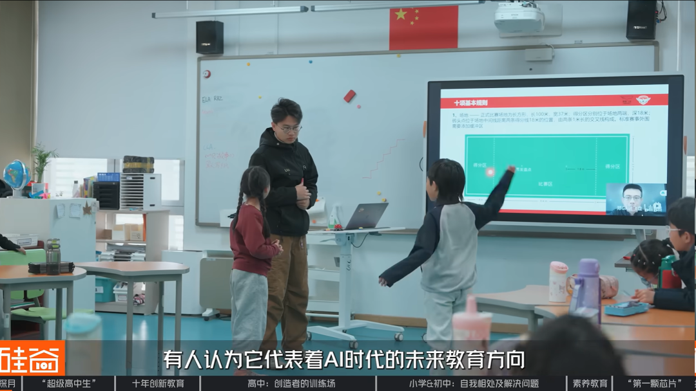

# AI 时代到底应该学什么？

> 我最近一直在想一个问题：在这个技术飞速发展的时代，每天到底应该学什么？什么才是真正适应新时代超级个体需求的能力？

我最近一直在想一个问题：在这个技术飞速发展的时代，每天到底应该学什么？什么才是真正适应新时代超级个体需求的能力？

在我本科和读研的时候，路径是很明确的。

Python、深度学习、CV、PyTorch，这些东西都是清晰且单一的。

你学一个东西，就能很明确地感觉到自己的能力边界和知识边界在拓展。你知道自己今天学了什么，也知道自己明天大概要补什么。

但是现在不一样了。

随着 AI 的不断发展，学技术我认为就是没有意义的，浪费时间。

有人说，真正想让 AI 做出东西，你还是应该熟悉框架，熟悉语言，熟悉整体架构，但我在实际做产品的时候，真的觉得这些东西没有想象中那么重要。

可能是我的编程水平确实不高，也可能是我做的业务需求并不复杂。

但退一万步讲，就算学习架构和编程框架仍然有价值，这个时间成本你是否吃得消？

架构和框架本质上是编程能力的整体体现，也是对项目的整体把控。它需要非常扎实的基本功。

但在这样一个高速变化的时代，有多少人真的能沉下心，把基本功扎扎实实打牢？更何况，这件事未来是否一定有用都不确定。

写到这里，我突然想到一个很重要的点：AI 在不断替代的东西，往往是具体、精准、可以被量化的东西；而人要学习的东西，可能越来越多是抽象的东西。

AI 为什么需要提示词？因为它需要精准的语言去实现精准的产物。

你说得越精准，它做得也就越精准。

代码就是这样，计算机就是二进制的东西，不是 0 就是 1，对大模型来说，它很喜欢这种结构明确、规则清晰、反馈直接的东西，所以它代码可以写得非常好。

那无法被替代的是什么？

恰恰是那些抽象的、短期无法见效的、不能直观带来收获的东西。（图片、视频、剪辑、设计等被替代的很慢，是因为这些东西在一定程度上还是比较抽象。）

以人为例，对于细分行业的判断能力，你的硬件 AI 能力，你的语言表达能力，你的写作能力，你的剪辑能力，你的控场能力，你的形象气质，你的销售能力，你自我学习和自我迭代的能力，还有你的心态、情绪、压力控制能力。

这些东西都不是看一篇教程、跑一个项目、装一个工具就能立刻获得的，它们要在生活里慢慢磨出来。

这些东西能被 AI 替代吗？我觉得不可能。

我读了一本书，有用吗？不知道。

我又知道那些AI工具更新迭代了，有用吗？我也不知道。

我今天看了一堆 GitHub 项目，也用这些项目做了点事情，算学到东西了吗？算学到知识了吗？我觉得严格意义上可能不能算。

因为这还是别人的东西，我只是又找到了一个趁手的新工具。

所以 AI 发展到最后，如果我们讨论的是“超级个体”，拼的可能不是某一项具体技能，而是一个人的综合能力——判断力、表达力、审美、销售、行动力、情绪稳定性、自我更新能力，这些东西最后会慢慢变得更重要。

今天我看了一个视频，讲的是北京的一所初高中学校，北京探月学校。它不完全追逐高考，而是专注于培养学生的思维能力、创造能力、AI 硬件能力，以及如何更好地和 AI 协作。

我感觉给我的启发还是蛮大的。

我在想，AI 给我们的变革，不只是传导到工作里。

它可能会以一种更深的方式改变生产力，再由生产力改变社会结构，最后慢慢影响我们的生活方式、文化方式，甚至影响我们每天真正经历的社会环境。

也许大学真的没有那么重要了。很多大学课程，我现在看也确实觉得落后很多。

如果这些东西都不重要，那我们到底应该学什么？又到底应该怎么学？

以论文为例，高质量的论文我觉得还是能学到一些东西的，但是读论文是一个很慢、很长的过程，而且我很反对用 AI 快速学习知识。

因为知识进入大脑的过程，本来就是痛苦的，是要思考的——没有自己的主动思考，知识不可能真正进脑子。

几千年来都是这样。我们的生理结构就是这样。我们的大脑不是硬盘，不是把东西存进去就结束了，它更像一套神经元之间慢慢建立连接的系统。

所以我们真正要学的东西，一定是抽象且无法量化的东西。认识到这一点之后，我也在想：真正有用的学习，可能往往无法快速复现，也无法立刻证明它有用。

学习得越具体，就越可能被替代。

今天我在 B 站看到一个视频，里面对于 AI 的运用真的超乎我的想象。

说是用AI做的，但是我也认为作者在整个制作过程中，AI最多算个奶妈辅助而不是ADC。

为什么？

这个作品强的根本就不是画面的质量，而是转场、镜头、节奏、语言、叙事的把控能力很强。

AI 是工具，但作者本身的导演能力、审美能力、表达能力、节奏能力，才是最终决定片子质量的东西。

写到这里，我还在想自己到底应该学什么。

或许剪辑我应该去学。影视飓风那个 49 块钱的剪辑课几个月前就出来了，我一直想学，但一直给自己找借口没有学。我现在有点后悔。

或许销售方面我也应该学。我觉得我的销售能力一直很差，和人沟通的能力也一般。可能本质上还是不够了解人。

或许英语我也应该学。好好加强下自己的英语能力，未来可以进行基本的英语对话和更流程阅读（哪怕现在翻译已经无所不能了）

我一直在学习，读书，看最新的东西。但问题是，我没有感觉到非常实质性的收获。这很痛苦，真的很痛苦。我也不知道自己到底哪里提升了，哪些能力真的加强了。

大家说，AI时代，你要提升创意，提升审美。

但我 TMD 真的很想问：这东西怎么提升？这真的很难啊。

如果有一条非常具体的路径，大家早就都去提升了。

问题就在于，这些东西没有标准路径。

它们不是刷题，不是看十节课，不是跑通一个项目就能获得——它们是和生活融在一起的。

你不可能天天去逛展，就为了提升审美。你也不可能天天去看什么创意金句，就真的把创意能力提升起来。这些东西太模糊了，真的太模糊了。

大家都在说要成长，要进化，要拥抱 AI，要成为超级个体。但具体怎么做？每天到底该学什么？学到什么程度才算真的有用？这些问题其实很少有人讲清楚。

我现在能想到的答案也很模糊。

这些东西没有进度条，也没有证书，更没有一个明确的完成按钮。它们可能就是在你每天读一点、写一点、做一点、见一点人、犯一点错、反思一点点的过程中，慢慢长出来。

这也是最痛苦的地方。

因为你不知道它什么时候生效。

但也可能正因为它无法被快速证明，才更值得学。
