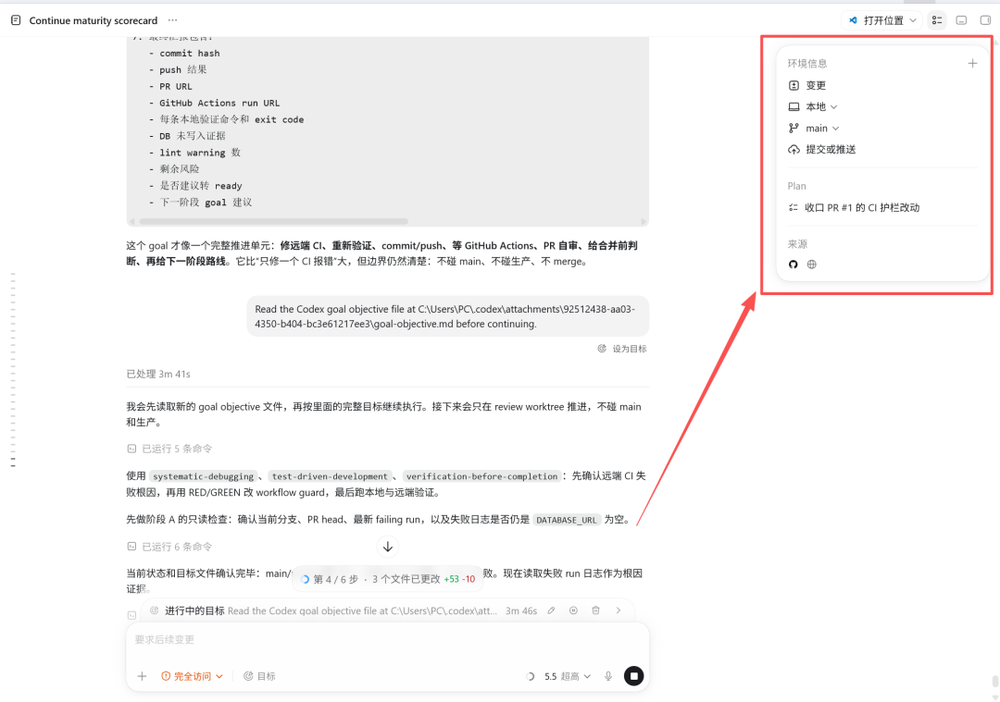
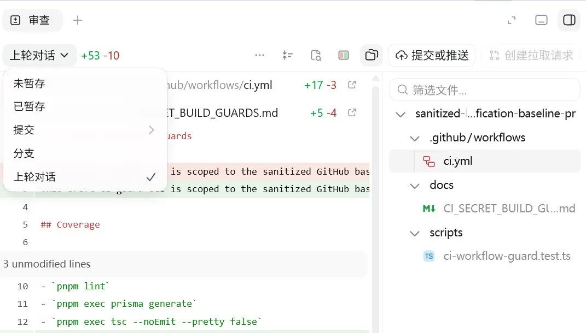
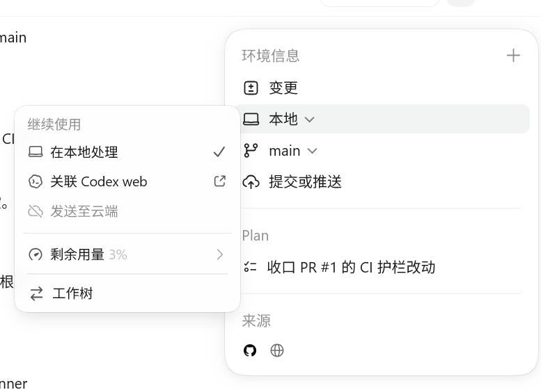
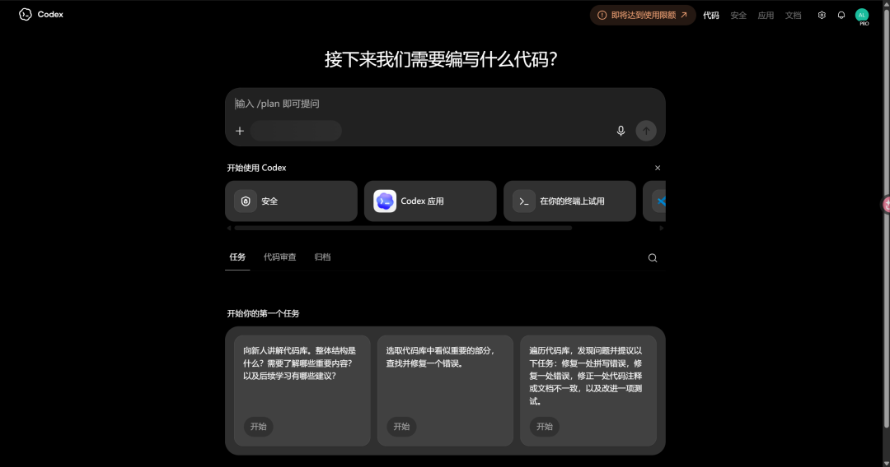
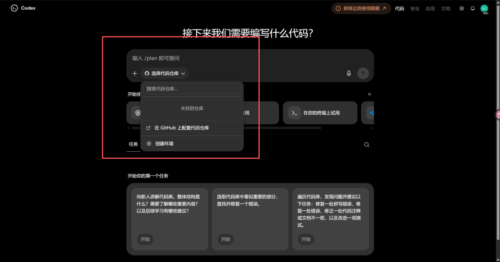
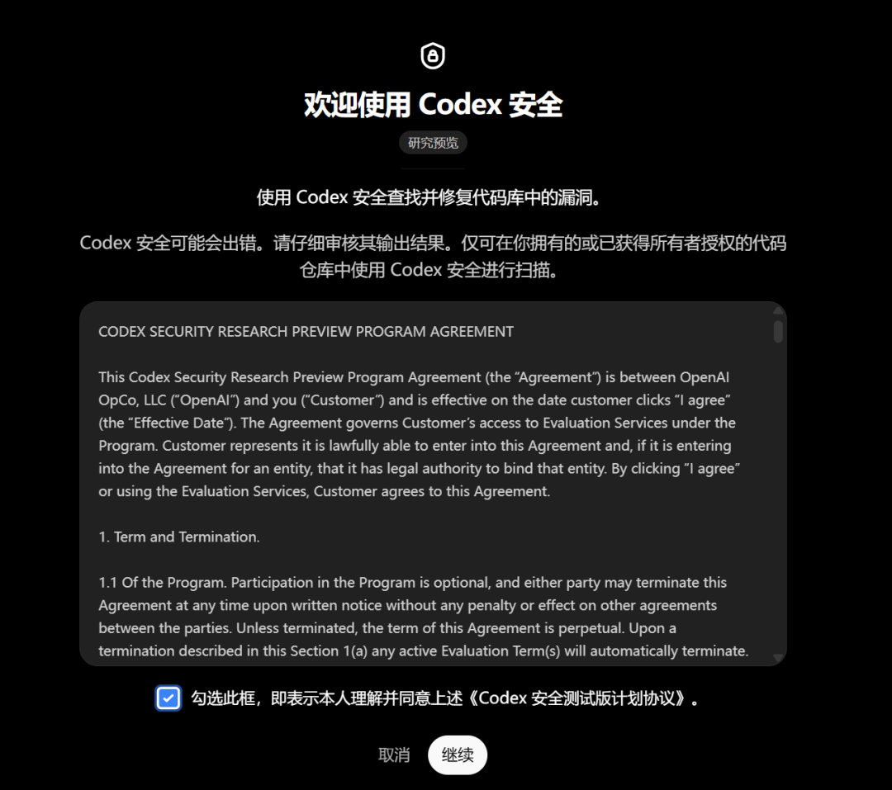
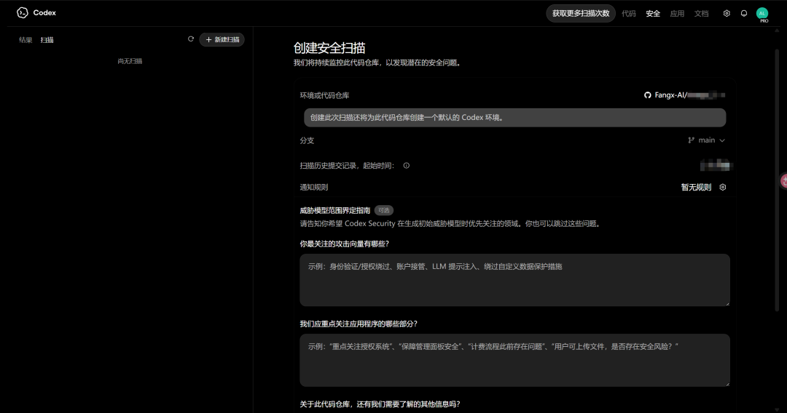
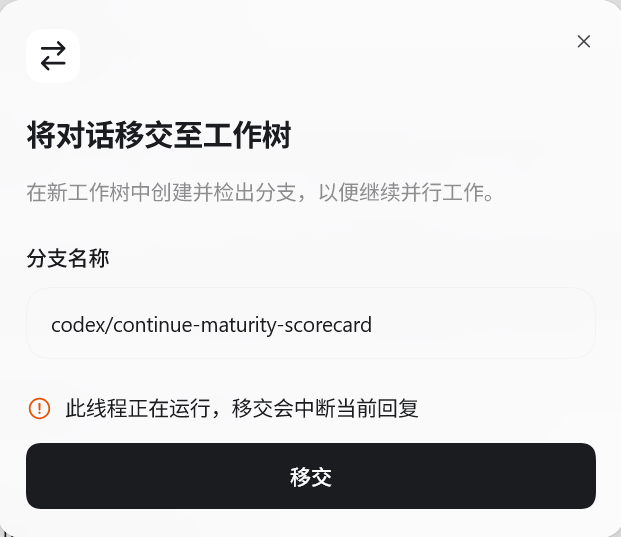
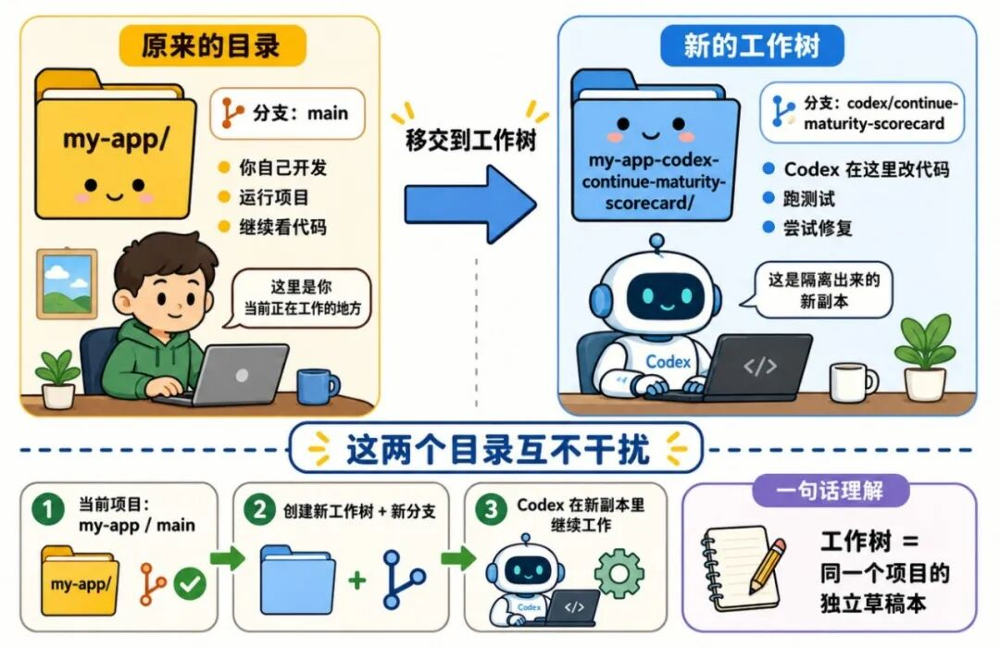
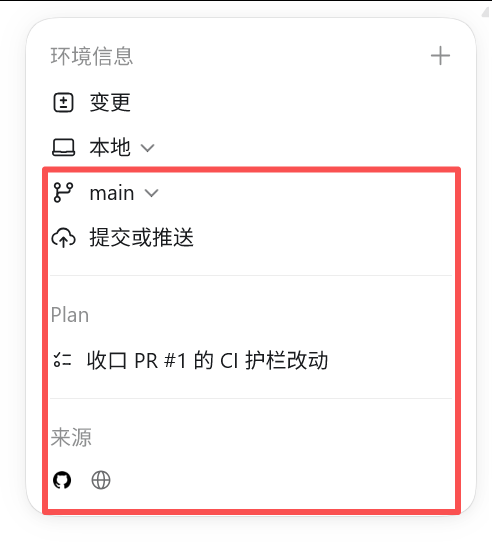

# 科普Codex的环境配置

> 可以看到变更的代码（其中包括未暂存，已暂存，提交，分支，上轮对话） 。

1、变更（审查）

可以看到变更的代码（其中包括未暂存，已暂存，提交，分支，上轮对话） 。

我个人觉得用处不大，通常我们直接一路yes下去就行了。 

我也确实是懒得看他做了什么，我只看结果，不看过程。 

2、环境 

这个我觉得还比较重要的 

比如你截图里显示 本地，意思是这个任务是在你电脑本地项目里跑的，不是纯聊天，也不是只在云端空想。

Codex 官方文档里把任务模式分成 Local、本地；Worktree、隔离工作区；Cloud、云端环境，其中 Local 会直接在当前项目目录里工作。

“关联 Codex Web” = 把你桌面版 Codex 和网页/云端 Codex 工作区打通。 

“发送至云端” = 把当前任务交给 OpenAI 的云端环境去继续跑。

很多人是不知道这个的，Codex是有网页版的，你可以配置代码仓库，然后让Codex云端来审查你的代码。

如果你要审查你的代码，或许你在这里直接使用时更方便的选择。 Codex Web有非常多的玩法，后期我会慢慢给大家讲一下。 

下面我们讲一下工作树是什么。

工作树就是：给同一个项目再开一个“独立副本”，让 Codex 在那个副本里改代码，不影响你现在这个主目录。

你可以把它想成：

你现在的项目 = 正在用的原稿；

工作树 = 复制出来的一份草稿本 Codex 去草稿本里随便改、跑测试、试方案；

目的是为了保证——你的主项目目录不会被它边改边干扰。

最后几个按钮一起讲。

3、Main就是分支，没什么好讲的。

4、提交或推送 

这个按钮要谨慎用。 

很多人会误会：以为不点提交，代码就没保存。

不是这样。 

如果是在本地模式下，AI 改文件时，文件本身可能已经被改了； 

提交 commit 是把这次改动记录进 Git 历史； 

推送 push  是把本地提交推到远端仓库；如果连着 GitHub，还可能创建 PR。

Codex 官方文档也说明，它可以在 App 内对本地或 worktree 任务进行 commit、push 和创建 pull request。 

所以这个按钮的正确使用顺序应该是： 先看 diff，确认改动合理。 再跑测试、lint、typecheck。 再决定要不要 commit。

最后才 push 或创建 PR。

5、Plan——就是你刚刚跑的计划模式详情

6、来源

看这次任务用了哪些上下文，下面有 GitHub 图标、网页图标之类的。 

这个区域的意思是：当前任务可能参考了哪些来源，比如本地项目、GitHub、网页、PR 上下文等。 

这个有什么用？ 

它能帮你判断 AI 的信息从哪来。 

比如你让它“修这个 PR 的 review comment”，那它最好能看到 GitHub PR 上下文。

如果当前项目在 PR 分支上，并且 GitHub 访问配置好了，App 可以在侧边栏显示 PR 上下文和 reviewer 反馈，review 面板也会把评论和 diff 放在一起，方便你让 Codex 继续处理。
