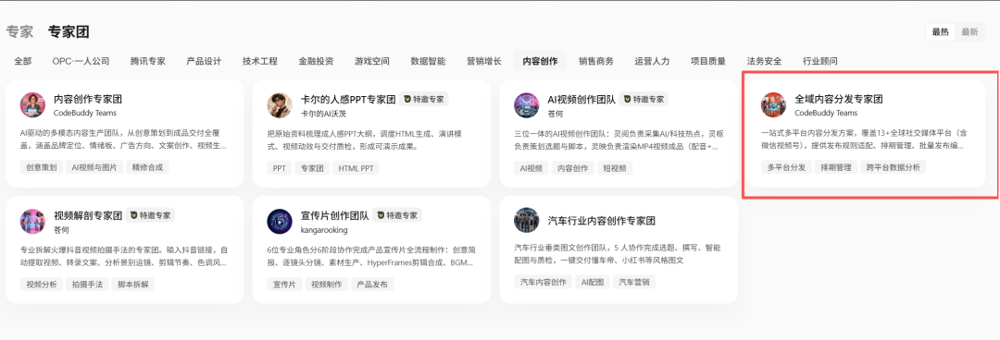
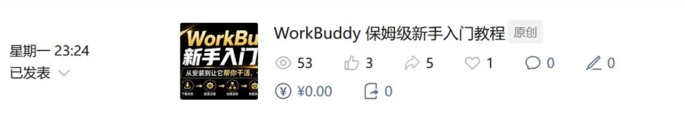
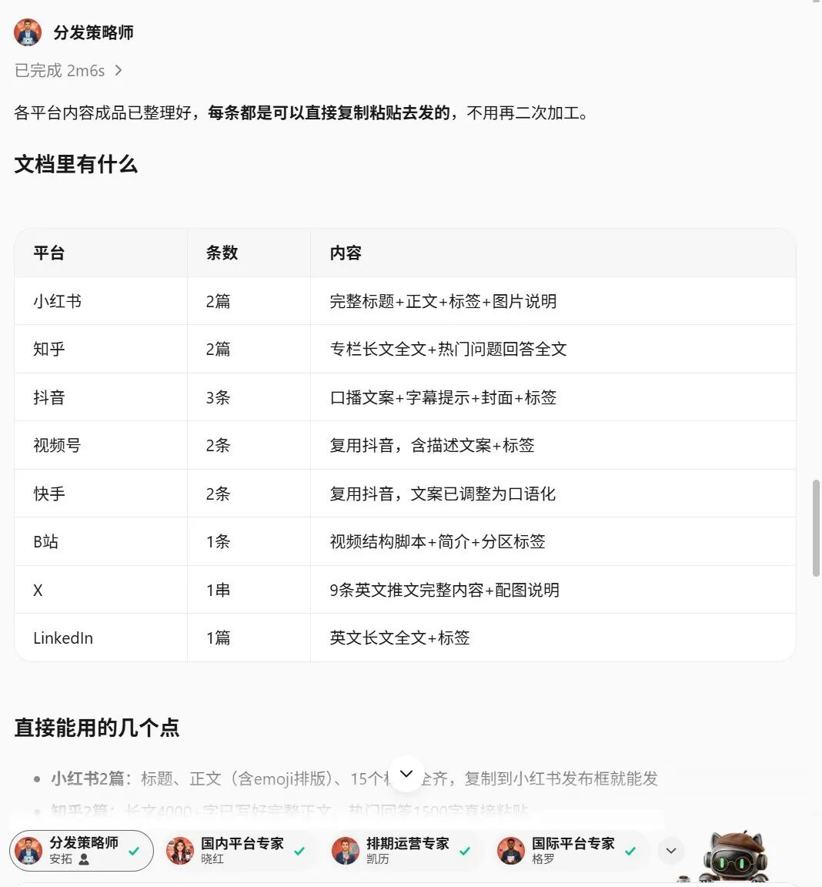
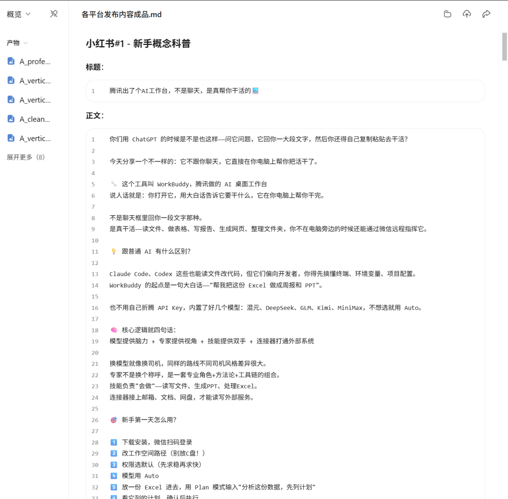
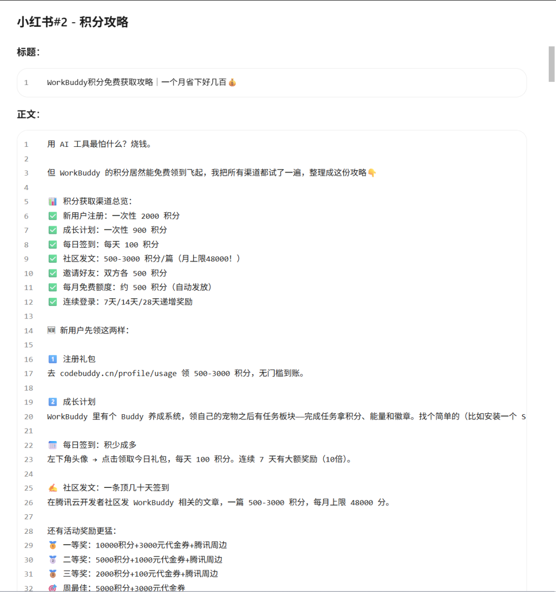
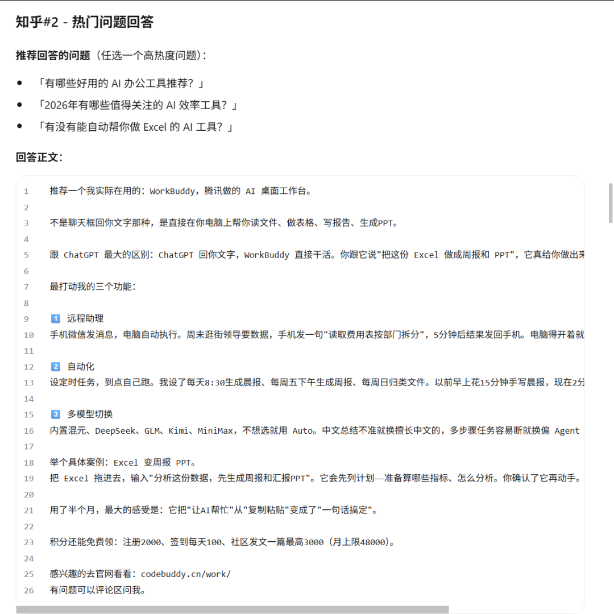
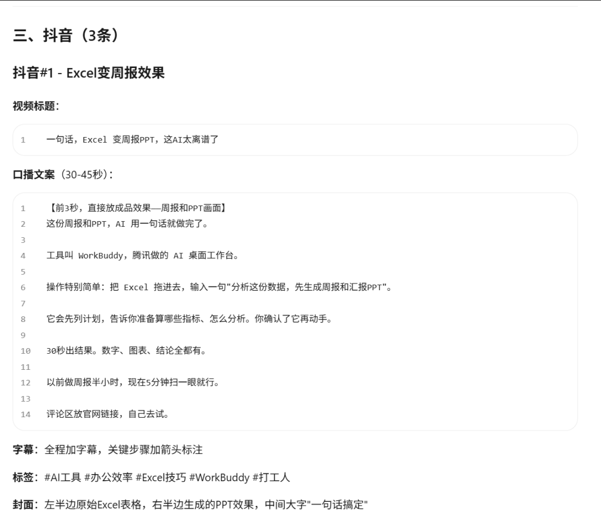
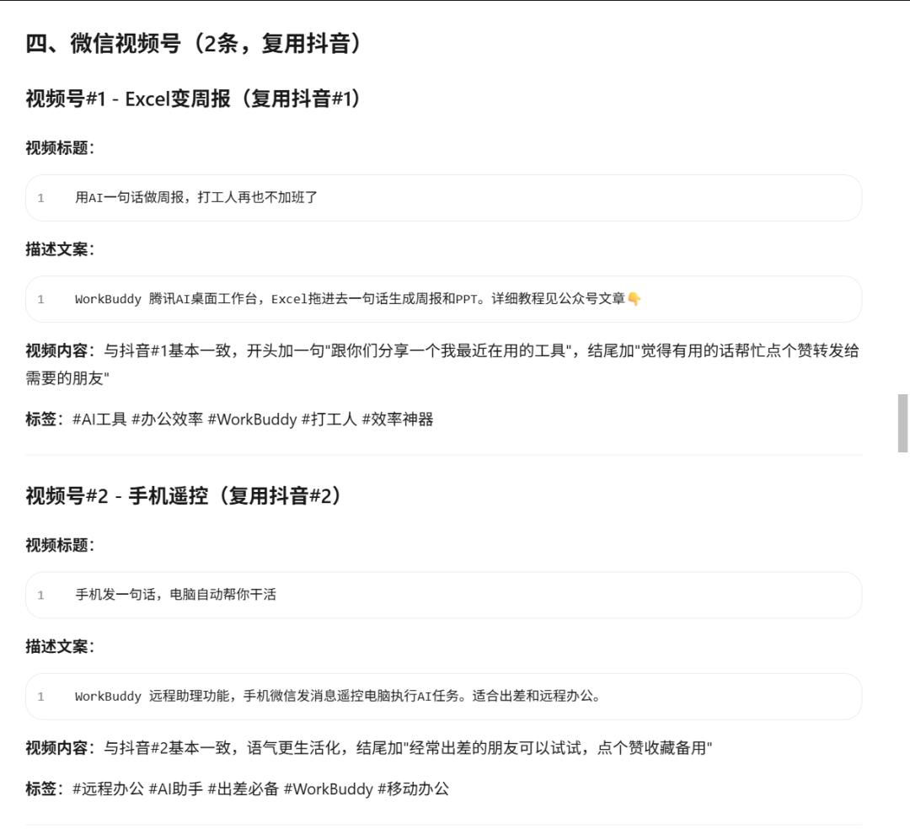
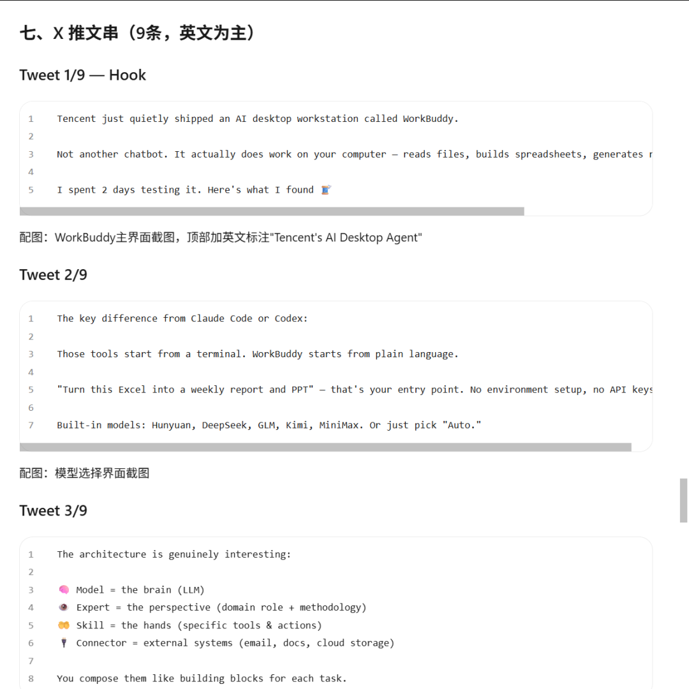

# WorkBuddy多专家模式夯爆了

> 我很少夸奖国内的软件，倒不是因为我有什么偏见，而是真的好用的我觉得很少。

我很少夸奖国内的软件，倒不是因为我有什么偏见，而是真的好用的我觉得很少。
腾讯系的我目前用的最多的是微信读书，我真的觉得这个产品简直太棒了，感觉是用来救赎口碑的。
今天我又不得不提WorkBuddy了，起因是我看到里面有一个专家团叫“全域内容分发专家团”。

做自媒体一定会面临一个问题叫做多平台发布，你做的内容实际上是可以根据各个平台的规则和风格进行微调的。
但是这个微调的过程非常麻烦，我自己平时就完全抽不出时间微调。
这个功能我认为智能体是完全可以做的，只是我自己没有找到合适的。
抱着试一试的心态，我尝试了这个专家团，结果比我想象的要好！
文章内容就以我前几天发的为例：

我直接把文章链接发给了专家团，这是他们返回给我的结果。

多图预警！下面是具体的内容！
小红书平台

我个人感觉还是非常不错的，非常符合小红书的文风
接下来是知乎

还有一篇太长了，不好截，我就不发了。
抖音

视频号

还有其他平台，我不一一截图了，总而言之，体感很好！
国内做的好我不意外，其实X做的好让我是非常意外的，不仅给我翻译为了比较引流的英文，而且还贴心做了钩子和时间线。

So good！
大家快去用起来吧！
