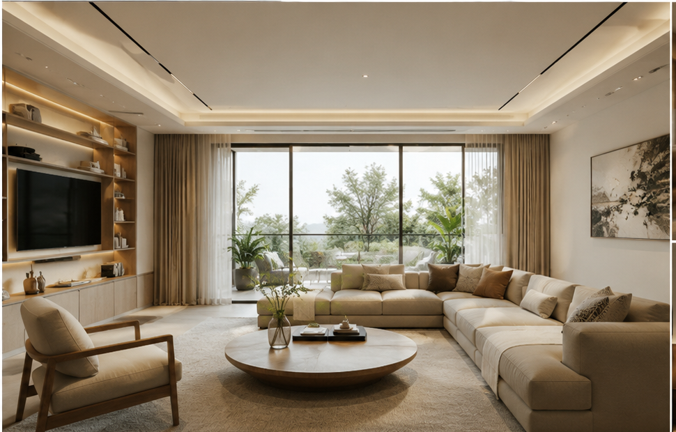

# 接了一个设计公司的单子

> 最近有一个设计公司找我设计一个智能体。

最近有一个设计公司找我设计一个智能体。
他们的需求是想让固定的室内设计图片变成动态视频。
我今天得空就在设计这个通用模版Prompt，用seedence2.0好歹做出来了。

下面是我生成的视频。

有特别多的需求找我推广，哪怕我粉丝量确实不多，最近也没怎么更新（可见AI赛道真的利润大）。
所以以后我可能会经常性的研究AI视频——偏向于实用类（如商品营销，封面设计，产品宣传视频，室内设计等等）
