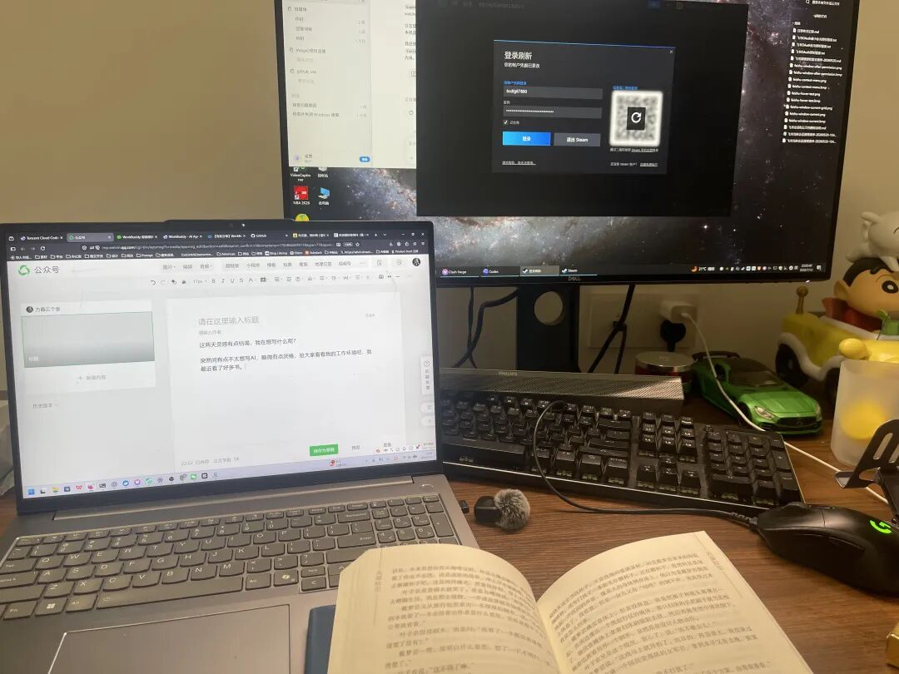

# 工作环境

> 这两天灵感有点枯竭，我在想写什么呢？

这两天灵感有点枯竭，我在想写什么呢？
突然间有点不太想写AI，略微有点厌倦，给大家看看我的工作环境吧。

台式电脑用于跑一些定时的项目，比如Hermes等等，笔记本电脑我会随身带着跑现有手上的项目。
我最近VibeCoding的时候基本上就在看书，尤其是出了Sol之后，额度消耗的很快，消耗完我就看书。
最近每周我大概能深度看完2-3本书。
我觉得我的生活模式和丁元英有点像（当然我的水平差他太多了），但是我本质上其实也就是想赚到让生活无忧的钱，然后静静的读书，钻研。
我觉得我感到快乐的方式还蛮简单的。
一是就是让我觉得自己没有在浪费时间。
二是接触更多新鲜的事物。
三是解决挑战。
我时常感到很幸运，因为我可能生活在最好的时代。
