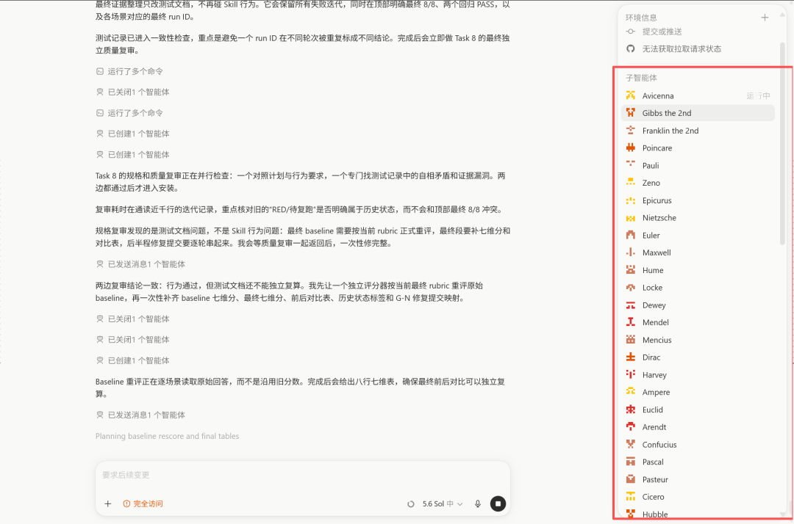

# 筹备新项目（Skill）

> 最近在筹划一个新项目。

最近在筹划一个新项目。
这个新项目是一个skill，已经耗费了我大概30亿左右Token吧，目测要消耗到100亿左右。
大家可以看我的Codex智能体，拉爆了，大概有一百多个。

这个skill有很强的答疑属性和专业属性。
我准备学习下dont哥的方法，通过开源skill，拍摄视频做营销，然后通过答疑群进行收费。
最近回归拍视频的节奏了，每天都拍几条，不管有没有灵感。
日更是很必要的，不仅是为了流量，主要是保持拍摄手感和题材敏锐度。
