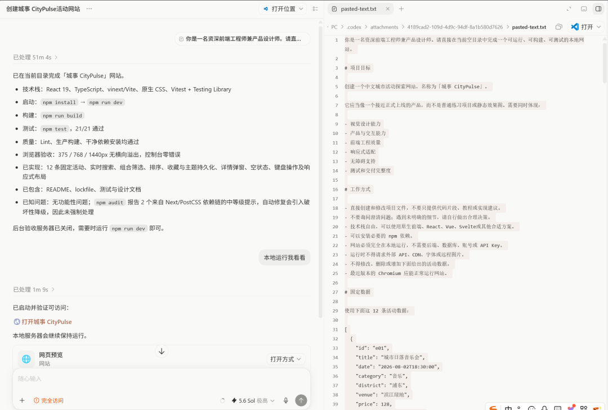
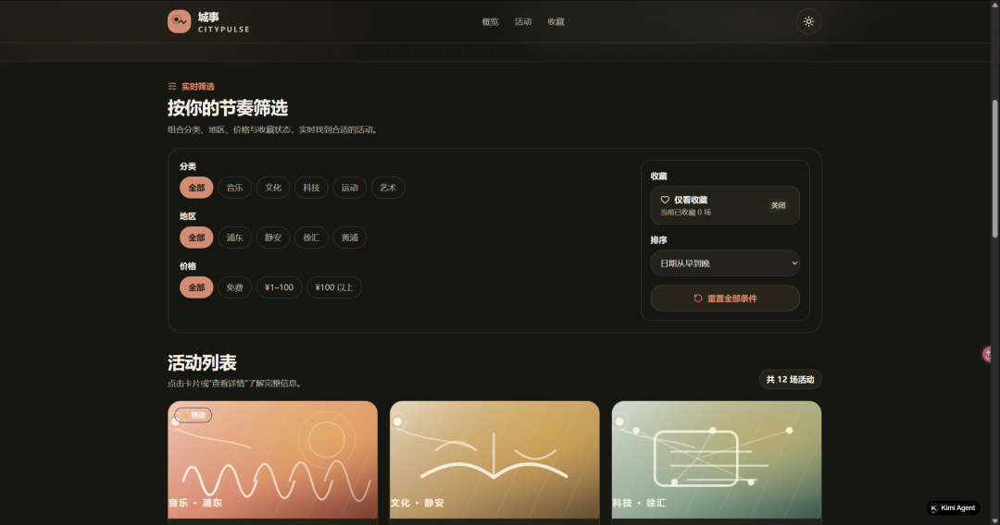
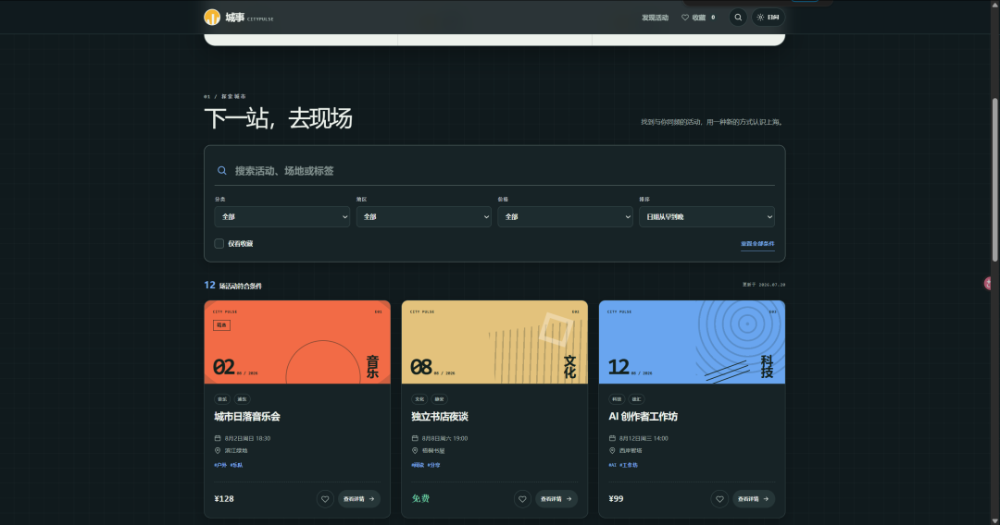
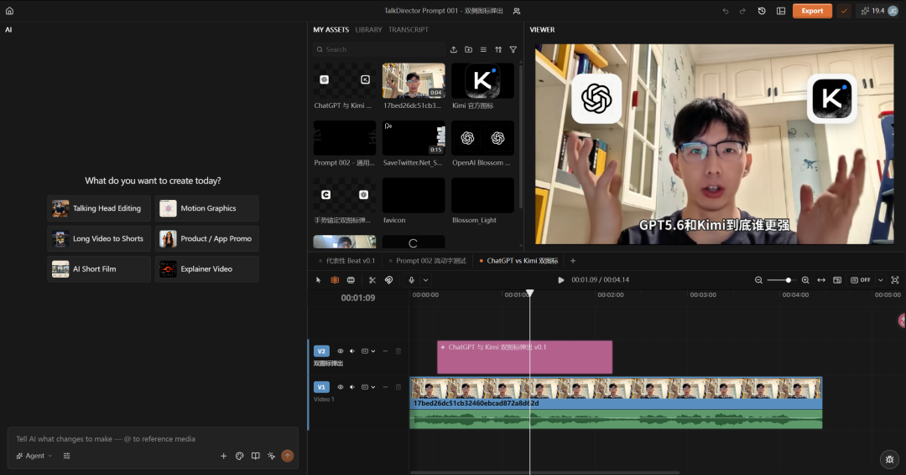
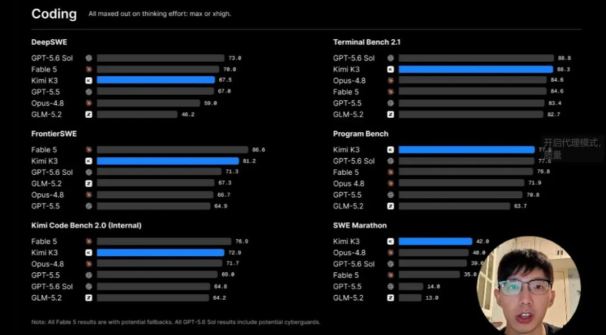
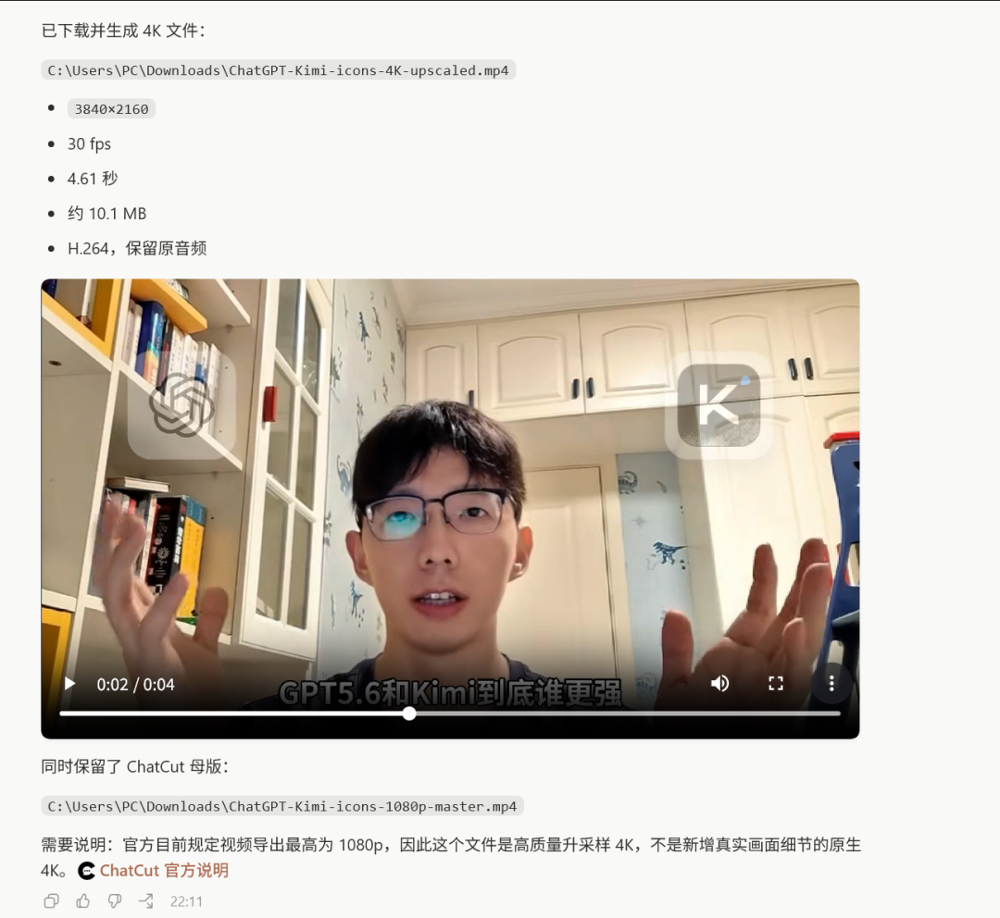

# Codex + ChatCut剪辑心得

> 这是方鑫一人公司的第143天！

这是方鑫一人公司的第143天！
昨天看世界杯看到太晚了，早上才睡，今天下午两点多才起床。
之前说过，我最近一直在研究ChatCut，然后我今天也在做Kimi k3和GPT的测评。
我用同一个提示词，测试了kimi k3和gpt5.6 sol的做网站能力。

目前看是相差无几。
给大家看看首页的效果。
以下是Kimi

以下是GPT5.6 sol

个人感觉是差不多的。
通过这些素材，然后我利用ChatCut进行剪辑。

这些图标动态弹出都是我自己优化了一套固定模版的提示词。
我做了一个开源项目，以后准备每天分享一个我自己做的ChatCut提示词放进去，这样可以弥补一些我们剪辑能力上的不足。
还有一个提示词是自动把我们的人物放在画面的右下角。

我知道，这些靠剪映蒙版其实就可以做了。
但是剪辑这个东西，自己迭代一些提示词，相当于保留你自己剪视频，做特效的一个复利工程。
Codex会越来越熟悉你的剪辑风格，剪辑内容，慢慢效率就上去了。
当我创作到20个的时候，我会专门录一期视频来开源分享我的提示词。
最后给大家分享一个小技巧。
ChatCut网页端最高上限导出的是1080p，如果你想导出4k，需要直接要Codex通过CLI帮你导出。

