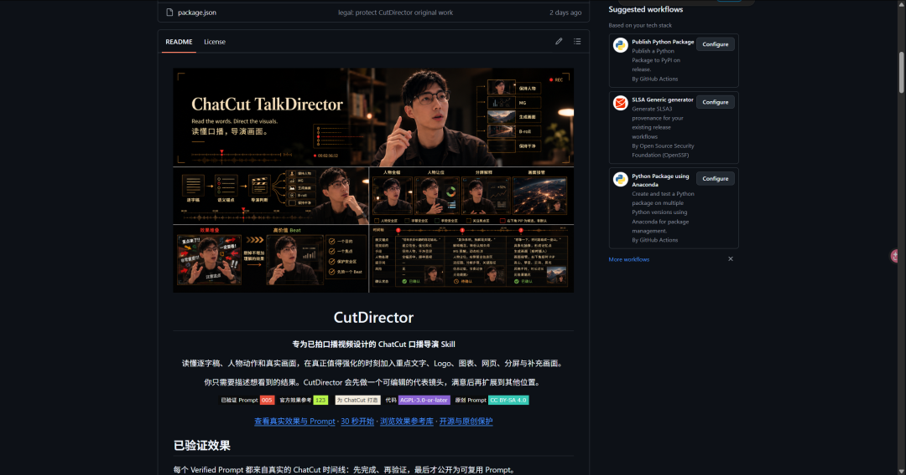
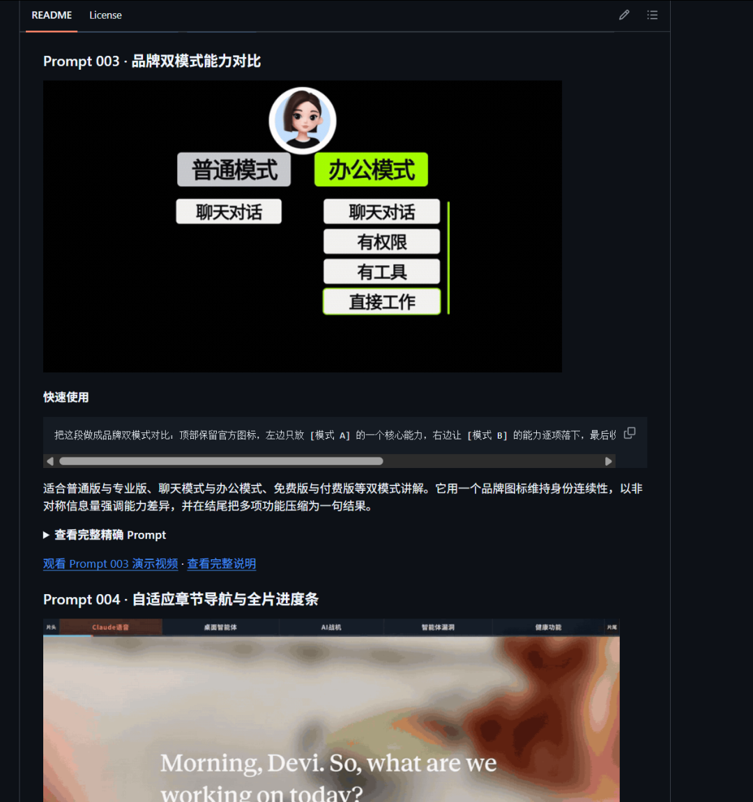

# 持续开源Cut-Director

> 这是方鑫一人公司的第145天！

这是方鑫一人公司的第145天！
这周竟然被禁了两篇帖子，怎么感觉束缚越发沉重，感觉也没说啥啊。
Anyway，无所谓了，本来我就是把公众号当树洞养。
给大家分享一下我的剪辑导演开源项目，地址：https://github.com/Fangx-AI/cut-director

现在我更了5个Prompt吧，然后把官方的Prompt库全部导入进去了，后续还会增加很多功能。

欢迎大家使用或者提交你在AI剪辑中比较用的比较好的Prompt。
我自己是每天都在琢磨和提交新的Prompt。
我还制作了很多成片Prompt，比如AI信息差，拆书动画，插图风格视频等等。
但是这些我还没直接开源，被抄袭怕了，反正后续慢慢公开在内部吧。
我现在每天自动化可以产出很多视频，然后我分了很多小号，现在都有一些流量，这些号加起来不一定赚多少钱，但是我感觉给我积累了很多经验。
复利起来！
