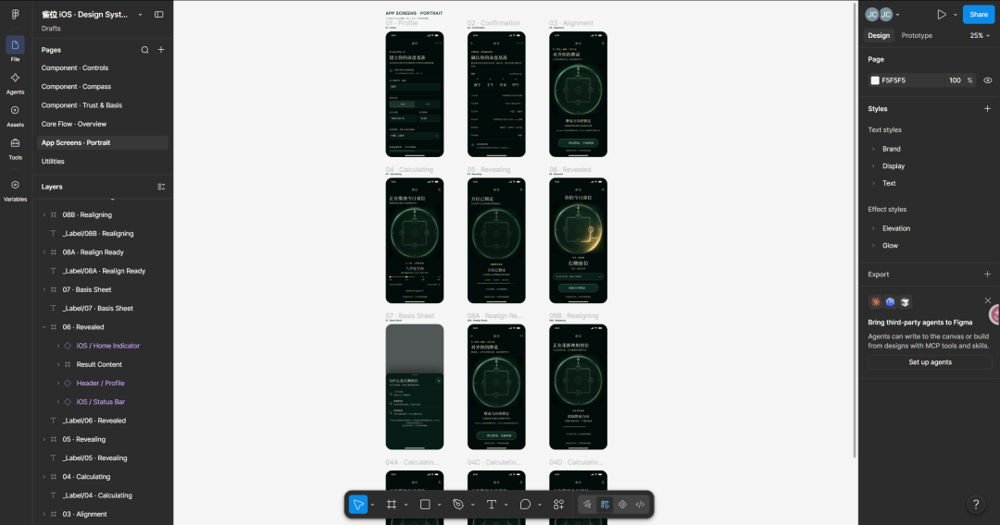
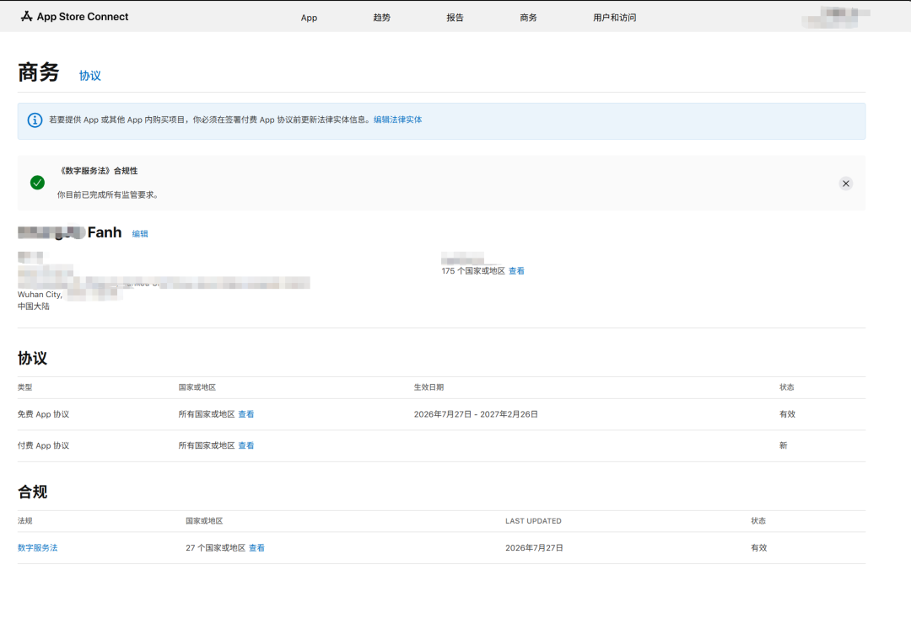
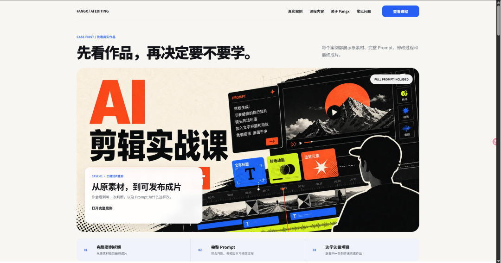
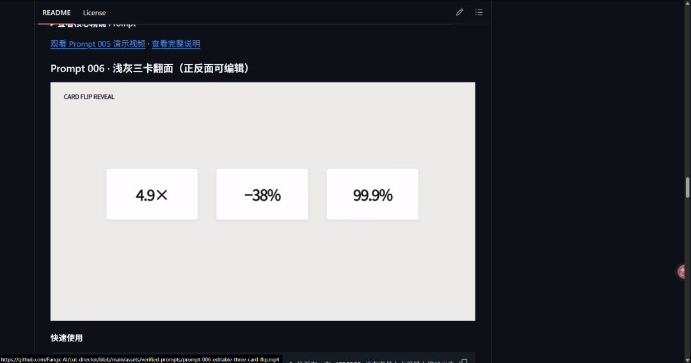
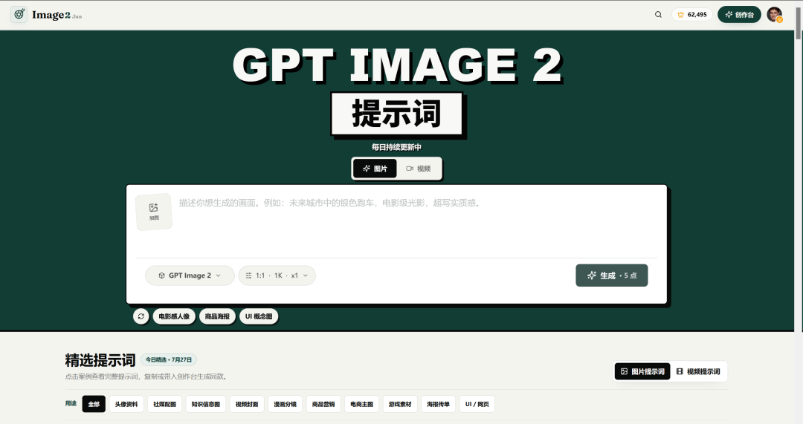
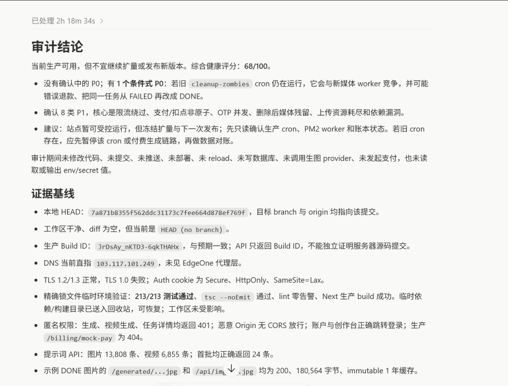
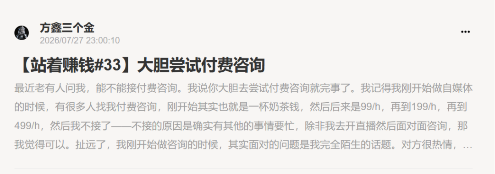

# ios产品开发 | AI剪辑课程 | Cut-Director更新

> 这是方鑫一人公司的第146天！

这是方鑫一人公司的第146天！
1、通过Figma搞定Ios产品原机模型
这是最近做的，一个有关八字和紫微算盘的产品。
计划是本周内发布出去。

2、更新App Developer的协议
如果要开发App Developer，费用是99美元一年，大家注意时限就好了。

3、制作AI剪辑课程的卖课网站
我会先做一系列的AI剪辑的免费课程吧，然后后续引入付费课程
这个网站相当于先打个底，做个准备。

4、Cut-Director更新
更新了3个剪辑特效，感兴趣的可以看看

直通地址：https://github.com/Fangx-AI/cut-director

5、修复Image2.fun网站

利用Gpt 5.6-Sol-xhigh对网站进行了一个全面体检，花费了2个多小。
整体只有68分，然后我就让他疯狂的去修复了，估计又得花几亿Token了

6、小报童更新
关于我做咨询的经历以及建议。

