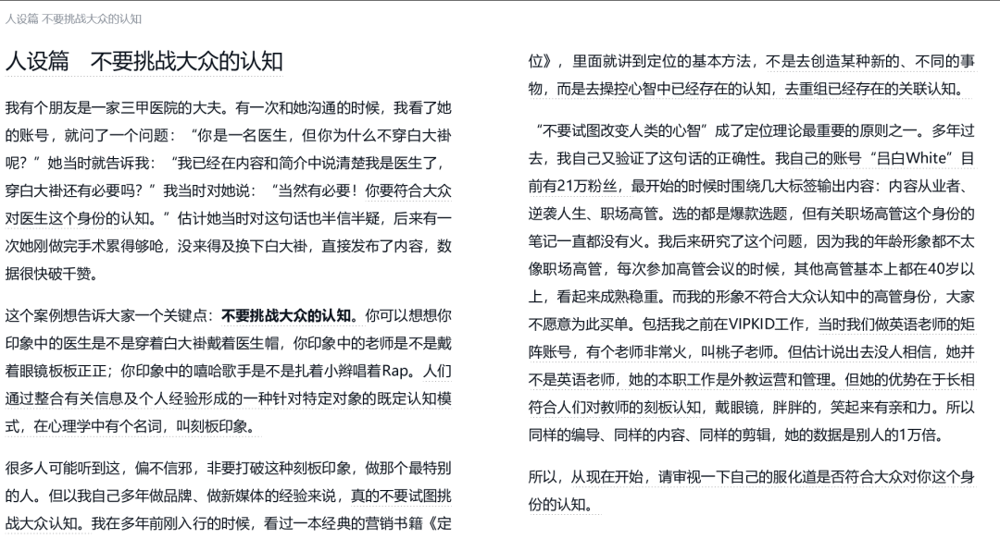
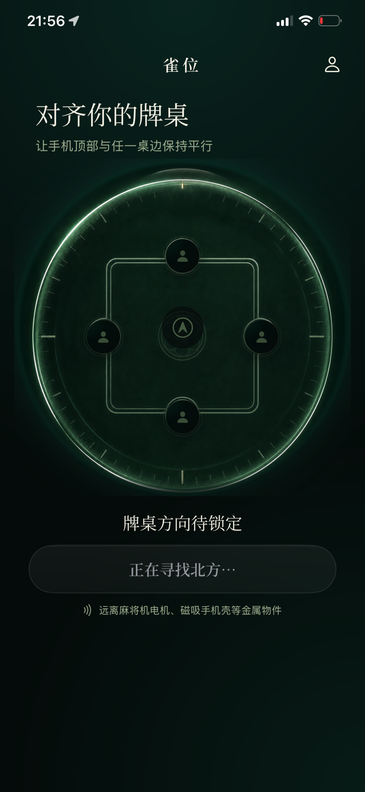
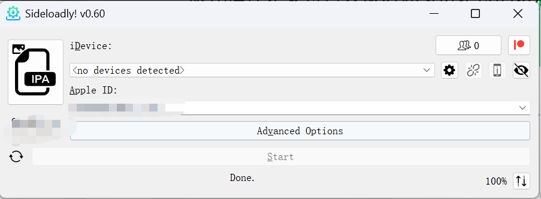
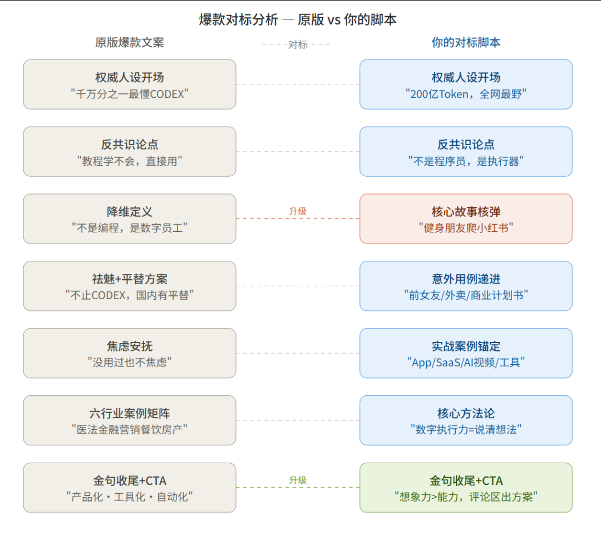
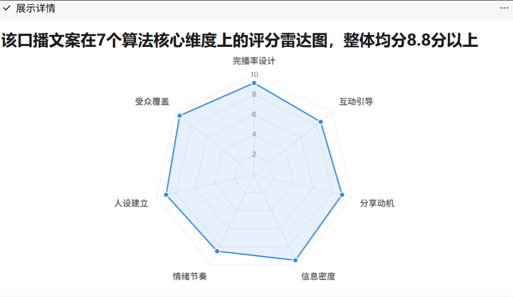
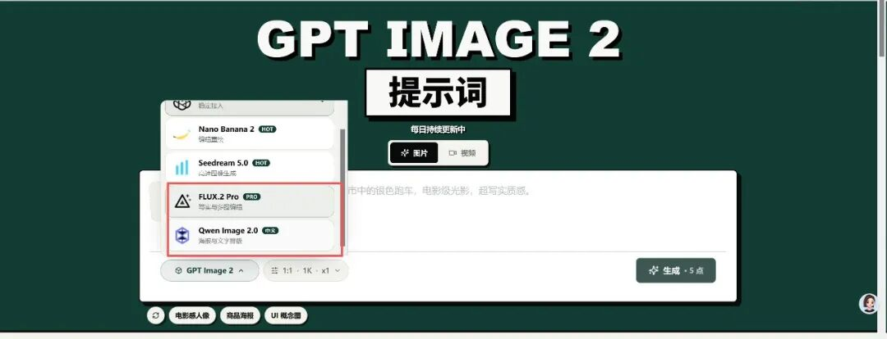
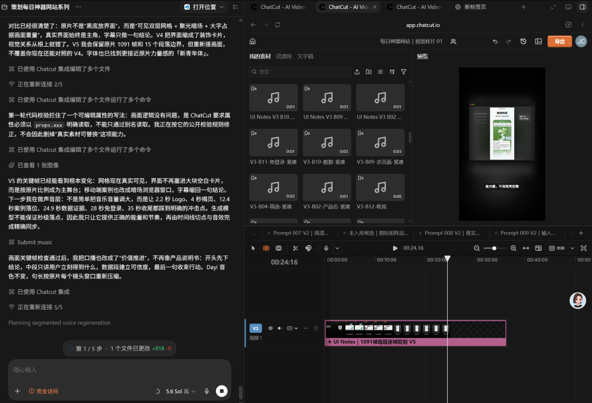

# 小红书爆款规律 | ios实机测试 | 对标爆款短视频拍摄 | 网站更新 | 迭代AI剪辑成片技巧

> 这是方鑫一人公司的第147天

这是方鑫一人公司的第147天

1、看书
最近买了一本在网上口碑较好的做自媒体的书——《小红书爆款规律》。

我其实以前不愿意看这类书籍的，我觉得没什么营养。
现在看来我太武断了，里面的内容我觉得还是非常有价值的，信息密度也很高。
人还是要保持一颗谦逊的心，持续学习的心。
例如：第一章内容——不要挑战大众的认知。
我直接上原文大家看一看吧。

我自己其实就有这方面的毛病吧，作为一个AI科技类博主，我确实没有在场景上，背景上下很大的功夫。
我一直觉得内容才是王道，其他一切都是浮云，现在看来还是有些偏激，服化道还是要符合大众对你身份定位的认知。
2、ios实机器测试

继续优化我的ios产品，今天推进到了真机测试的阶段。

通过Sideloadly可以直连想要测试的App软件。
Sideloadly 是一款免费且跨平台的 iOS 应用侧载工具，支持在 Windows 和 macOS 系统上运行。

它允许用户在无需越狱的情况下，将未上架 App Store 的 IPA 文件 安装到 iPhone 上。

3、短视频拍摄
我对标爆款拍摄了一个口播视频。

我是怎么做的呢？
我找了一个100W播放量左右的对标文案，然后进行学，拆，改。
整体逻辑是：
权威人设开场

反共识论点

核心故事核弹

意外用例递进

实战案例锚定

核心方法论

金句收尾+CTA

具体效果行不行明天就知道了。
4、继续优化image2.fun网站
添加了FLUX2 Pro和Qwen Image2.0模型。

优化了服务器，纯正的服务器果然是不需要配菜的。
我现在的服务器一个月一千块，我之前的Edgeone和阿里云的加速都没关。
结果今天Codex给我测速的时候，说关了这些东西快了好几倍！！！！！！
5、继续迭代AI剪辑内容

我开通了一个50刀的会员，琢磨了一天。
我一定要迭代出可以直接产出中等偏上的工作流成片视频。
AI日报我已经迭代出来了，现在迭代的是每天一个神奇工具。
