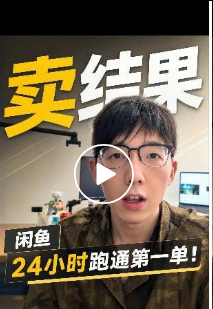

# 保持好状态

> 今天好好把家里收拾了一下

今天好好把家里收拾了一下 
打了个台球，感觉心情非常好~
最近感觉状态在一直变好，慢慢又恢复了日更视频的状态，每天差不多稳定上万流量吧，然后在学习剪辑，看书，跑步，健身。
健康的生活规律带给我的是更好的身体状态，同时好的身体状态又会让我在拍视频的时候呈现良好的精神状态和稳定的情绪。
正向循环的复利。
今天拍摄的视频讲的是关于AI直接卖结果。

简介：
💰AI变现的真相： 用户根本不想学AI，他们只想花钱买结果

📊 2026上半年闲鱼AI服务订单数据： 

• AI服务订单：981.6万单（同比+157%） 

• 付费用户：近500万人 

• AI编程建站：增长1732% 

• AI漫剧：增长1425%

✅ 直接卖具体交付： 

• 需求 → 能访问的网站 

• 故事 → AI漫剧样片 

• 文档 → 能汇报的PPT

卖工具不如卖结果
