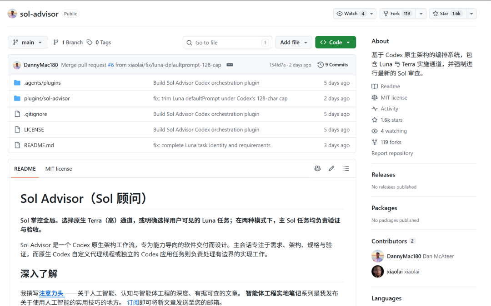

# 如何大幅度降低Token消耗量

> 分享一个我最近觉得特别好用的Github项目

分享一个我最近觉得特别好用的Github项目
很多人包括我，在用Codex做项目的时候，不知道该用Sol，Terra还是Luna哪一款模型。
面对不同的项目也不知道推理强度到底用极高，高还是中。
所以我自己的方法是全部Sol+高。
这样大幅度消耗了我Token的用量，我现在Codex已经用了两百多亿Token。
但是自从我加了这个项目后，我明显感觉Token使用量下降很多了

竟然20x都有点用不完！而且代码质量并没有感觉明显的降低。
