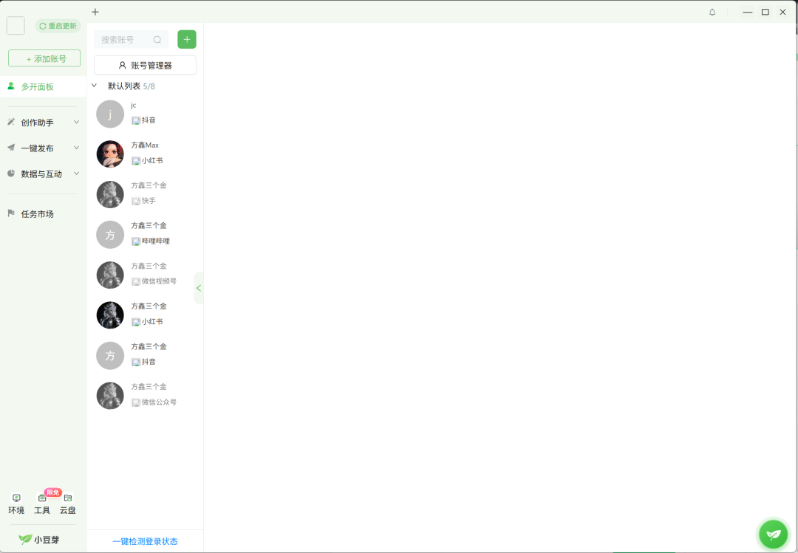

# 自媒体多平台分发很重要

> 我每次做视频都会进行多平台的分发。

我每次做视频都会进行多平台的分发。
分别是抖音，b站，小红书，视频号。
在博主中，我算小体量的，全网也就2W粉左右，我也没有很复杂的视听语言画面，我做的最多的就是口播。
但是最近的几期，其实播放量还算可以，昨天我发布了一个视频。
到现在差不多全网10W的播放量吧。抖音是4.5W，视频号3.5W，其余两个加起来差不多也是2W，预计可能接下来的一周能跑到20W播放量。

那么回到正题，为什么要进行多平台的分发呢？我从我拍视频几个月的经验角度来分享。
1、为什么：因为平台偏好不同
你拍的内容，可能在某一个平台非常爆流量，但是在另一个平台可能反应平平。
如果你视频质量够高，那么分发多平台一定会给你带来同等价值的流量。（如果没有说明你的质量不够高，没有其他原因）
例如：抖音和视频号非常偏向于前几秒钩子的身份认同。小红书的封面决定了你视频的生死，b站你可以娓娓道来，长尾效应非常好。
我亲身实践，我在每视频前面加上一句，我是一名计算机研究生，我每天用研究AI超过十个小时（我也确实如此）。
我实测流量大概会爆出500%的效果，因为用户愿意听你讲话不是让你诉说情绪的，而是真正觉得你这个人是有价值的，能分享干货给他的。
如果你不在开头告诉用户，你是谁，那么他们又凭什么听你讲话呢？
2、怎么做
我自己喜欢用的是小豆芽这个工具，我有差不多七八个号在里面用吧。

直接在里面发布就行了，我建议一个个发，不开通会员。
