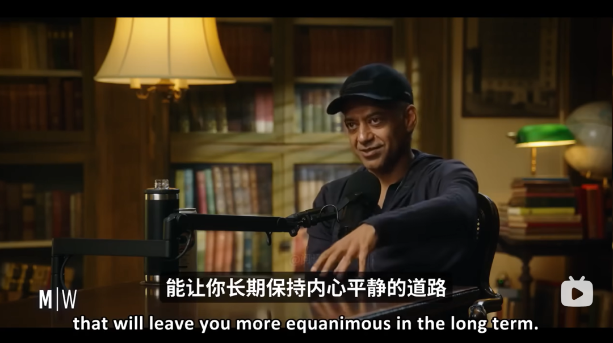
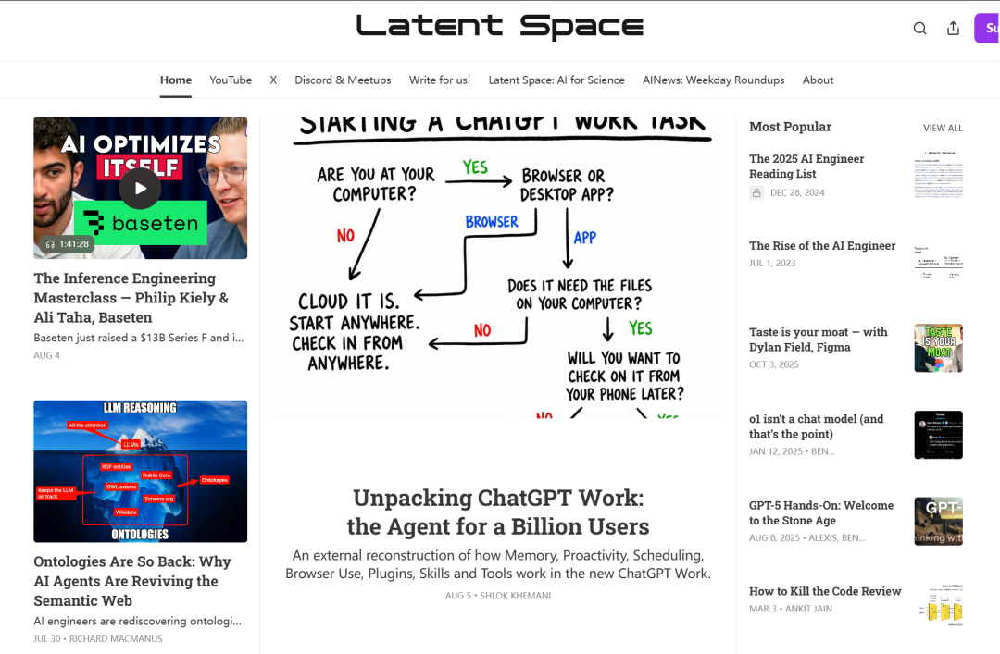
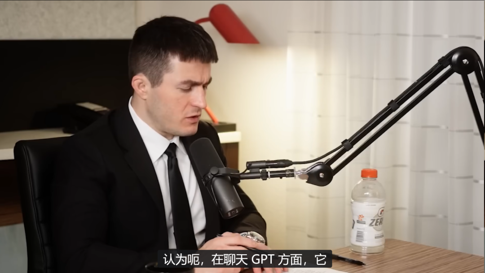
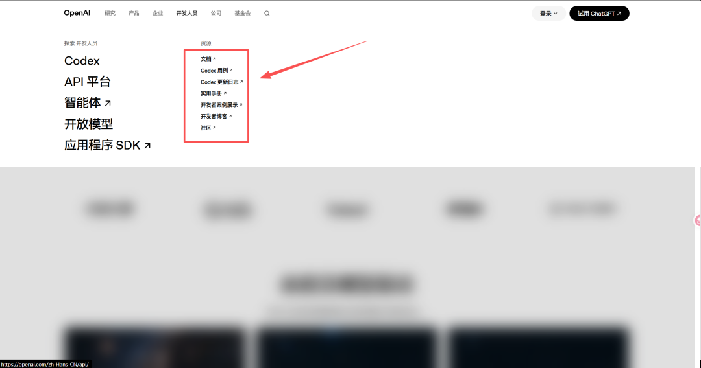
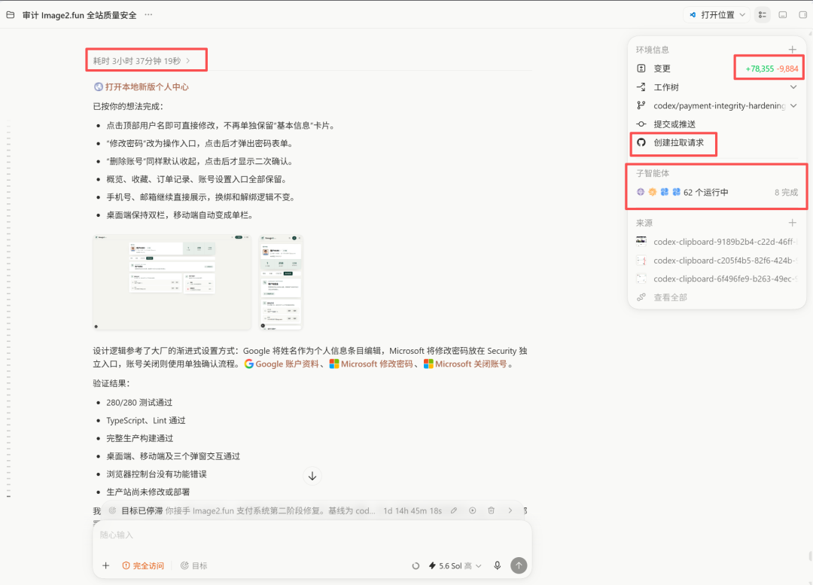

# 如何获取高质量AI信息

> 我每天用AI和学习AI的时间超过十个小时。

我每天用AI和学习AI的时间超过十个小时。

最让我头疼的一件事，就是怎么搞到高质量的信息。

现在网上的东西太杂太乱了。学了跟没学一样，会了跟没会一样。

找高质量信息这条路，我踩了无数坑，分享比较实用的三个方法给大家。

一、高质量的播客和访谈

为什么听播客？

公众号和短视频里的内容，都是被包装过的。

为了完播率，为了流量，为了卖课。

但播客不一样。

播客是两个人聊一两个小时，聊嗨了什么都往外说。你听到的是从业者真实的判断、纠结，甚至是翻车经历。这种未被包装的对话，价值密度极高。

国内我喜欢听的，有两个。

Whynot TV，何泰然主持。

他是 OpenAI 的技术人员，CMU 机器人博士。

这档播客主打 2 到 4 小时的超长深度对话，嘉宾全是 AI/机器人领域的华人顶级学者或创业者。陈天奇讲机器学习系统，杨硕讲人形机器人，胡渊鸣讲图形学。硬核到底，技术细节拆得很透。

听不懂就暂停，反复听，B站、YouTube、小宇宙都有。

张咋啦Zara，这个其实也不算播客了，只是我觉得她做营销和产品很厉害，所以我经常会看一下她的视频，哈佛心理学本科，没技术背景，从记者转岗做了 AI 产品经理。

她的小红书一年从 2 万涨到 18 万粉，发了近 500 篇内容。最打动我的一句话是——「看视频和学习其实是一种懒惰，最好的学习方式是 learn by doing。」她用文科人也能听懂的语言讲 AI，掰开揉碎了讲，我这个理科生听着也蛮亲切。

除此之外，任何播放量高的博客我都会听，不管是心理学，人文学科等等。

听播客已经是我的爱好之一了。

国外推荐两个。

Latent Space，专攻 LLM、Agent、RAG、模型落地。全是一线研究员实战口语，学 AI 技术英语的天花板。

Lex Fridman Podcast，深度长访谈，硅谷顶级大佬聚集地。

我看了里面英伟达黄仁勋的访谈，还有马斯克的。咖位不同，里面更聚焦的是大佬的宏观视角和思维方式、行为模式，我觉得对我个人成长启发非常大。

在吸收方法上，我是从来不听的，就纯当视频看。

中午午休在车上看，下班回家躺床上看，跟刷视频一样。我不会在看的时候做其他事。里面很多内容需要消化，我经常看着看着就开始记笔记。

长播客一周听两到三期，已经很不错了。

绝对比刷一百条短视频强。

二、直接啃一手信息，别吃别人嚼过的

什么是二手信息？

公众号解读、B站讲解、小红书总结、知乎回答。

不是完全没用，但都有损耗。

作者自己懂多少、表达能力怎么样、甚至有没有真懂，全是问号。

看十篇二手解读，不如看一篇一手。

一手信息有哪些？

首先是官方文档和博客。Anthropic、OpenAI、Google DeepMind 这几家官方发的，最权威。

出新模型、新能力，第一时间看官方说明，比看十篇评测强。

其次是大佬的个人博客和 X。

Karpathy（前 OpenAI/前特斯拉）、Jim Fan（NVIDIA）、Simon Willison。这些人自己就在一线搞，写出来的都是一手判断。

一开始看可能吃力。

英文的，术语多的，上下文不全的。

但长期看起来，我发现原来那些公众号解读漏掉的重点、加的私货、甚至理解错的，多得吓人。

人人都想走捷径，想找「五分钟读懂」的内容。

但捷径反而是最大的坑。该啃的硬骨头躲不掉。

三、自己动手做项目，这一条最关键

前两个都是输入，这一条是输出。输出倒逼输入。 

不动手做，看再多都白搭。

为什么？

看的时候你会产生「我懂了」的幻觉。但真让你动手搭一个，立马露馅。哪里报错、哪里调不通、哪里跟教程对不上，全是坑。

怎么做？不用一开始就搞大项目。

第一个项目要小。 用 OpenAI 的 API 做个聊天机器人，或者用 LangChain 搭个最简单的 RAG。一周能跑通就行。目的不是做出什么东西，是跑通「输入→调试→输出」的完整闭环，建立手感。

第二个项目要真实。 解决你自己的一个问题。比如我做过一个帮我读文档的助手、一个帮我写东西的工具。真实需求会逼你查资料、调 bug、看源码。这时候你前面听播客、啃一手信息的积累，才真正派上用场。

第三个项目要公开。 发到 GitHub，或者写篇文章。公开会让你认真，也会收到反馈。有人用、有人提 issue、有人怼你，你的进步会比闷头做快十倍。
