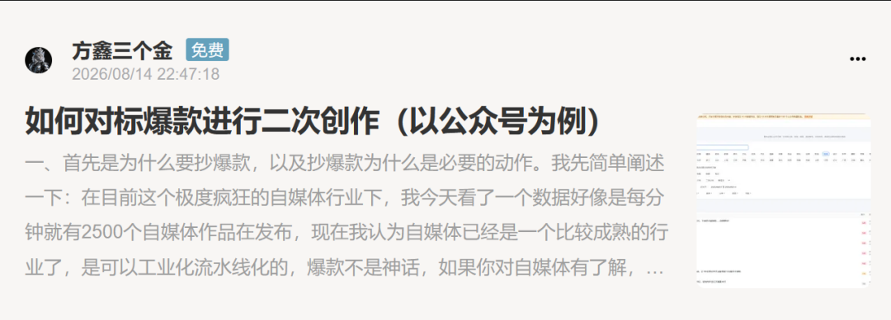
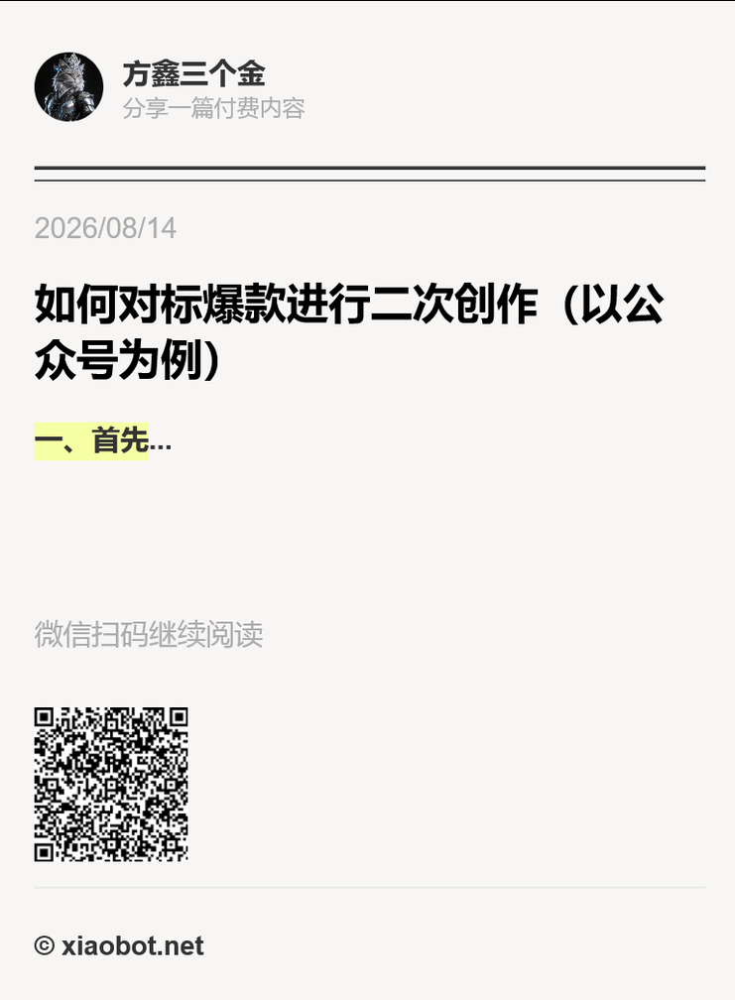

# 如何对标创作爆款文章

> 应一位粉丝的需求，如何利用AI对标创作爆款文章。

应一位粉丝的需求，如何利用AI对标创作爆款文章。
写了一篇长文小报童，暂时免费开放了，感兴趣的可以去看看。

里面写的很详细，共分为了十步。
1、为什么要对标爆款
2、对标与抄袭的本质区别
3、如何找对标账号+低粉爆款文章
4、深度拆解爆款的SOP
5、二次创作的核心Skills与提示词
6、如何排版
7、敏感词与违禁词检查
8、AI率检测与降AI处理
9、封面
10、文章进阶复用与建议

