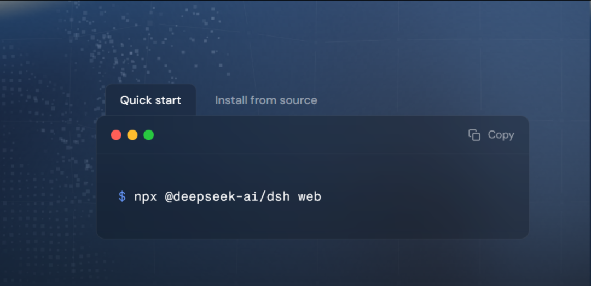
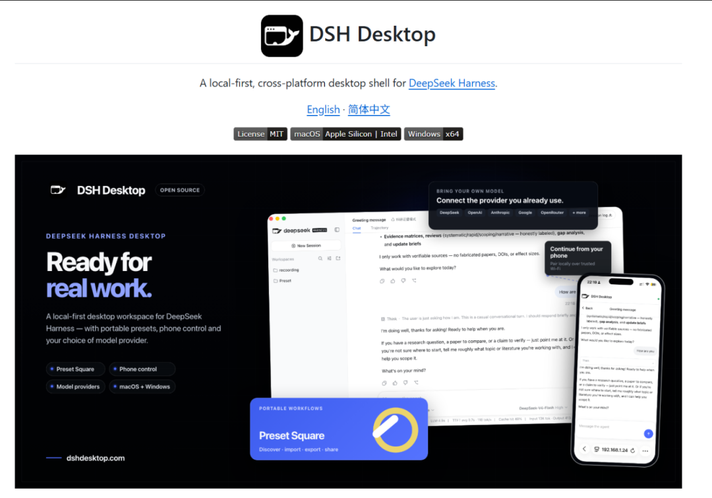
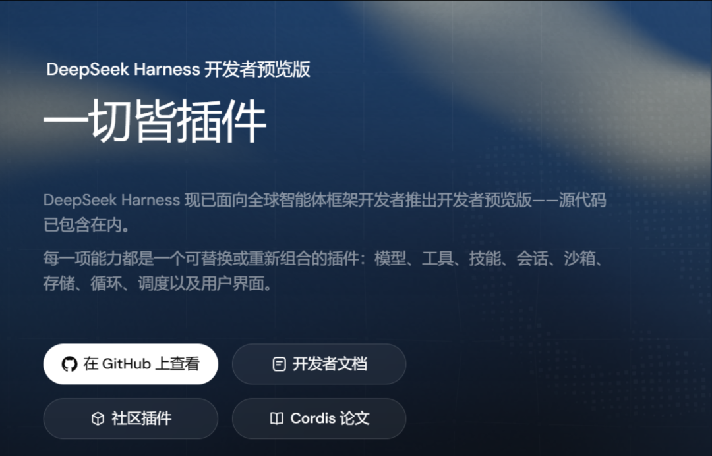
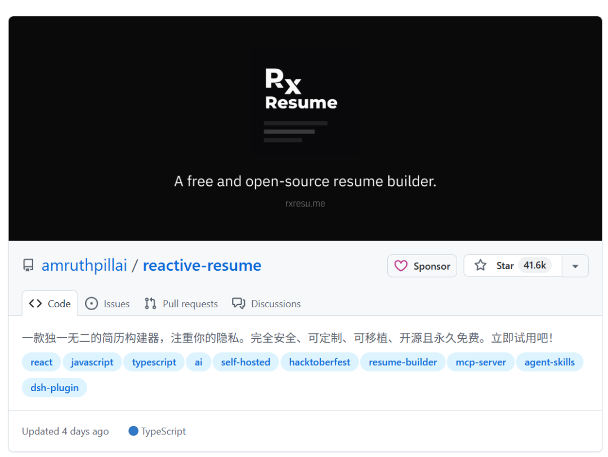
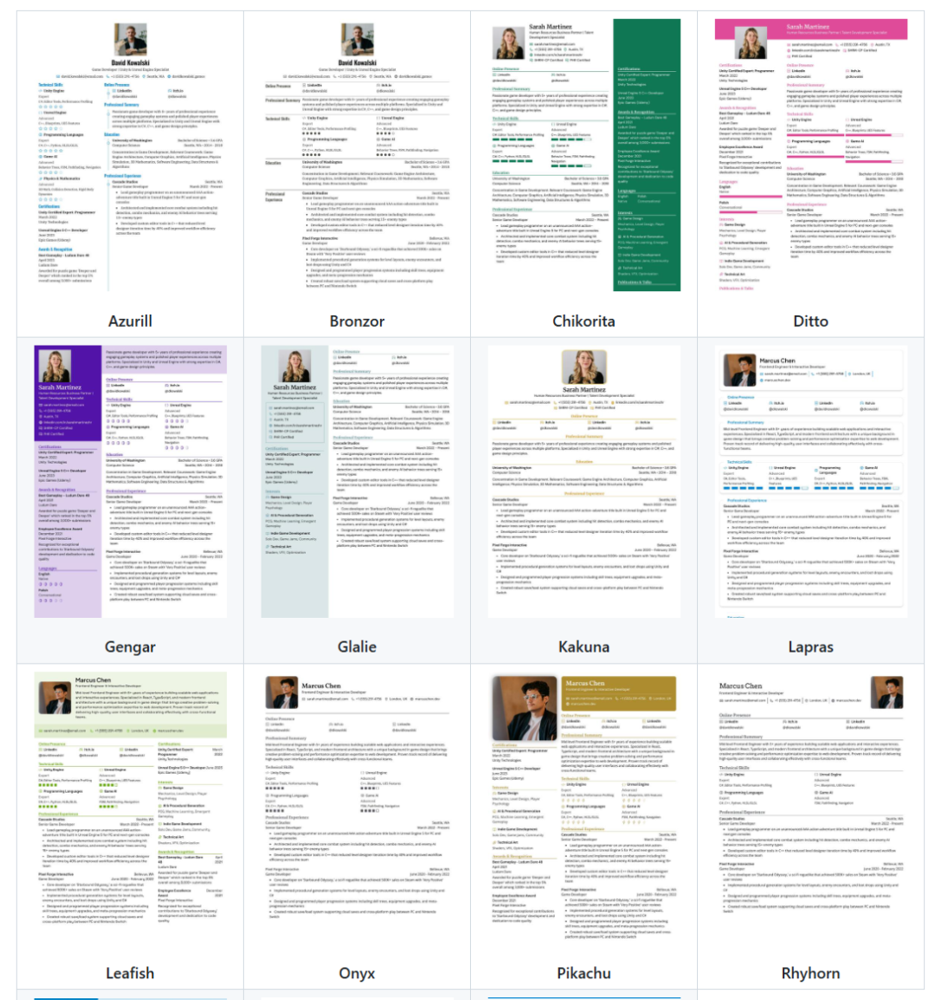
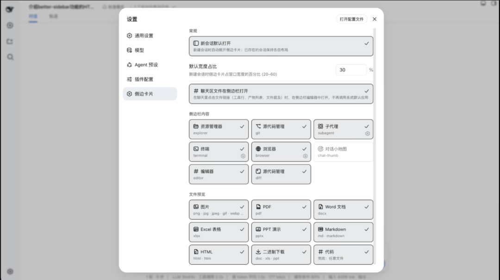
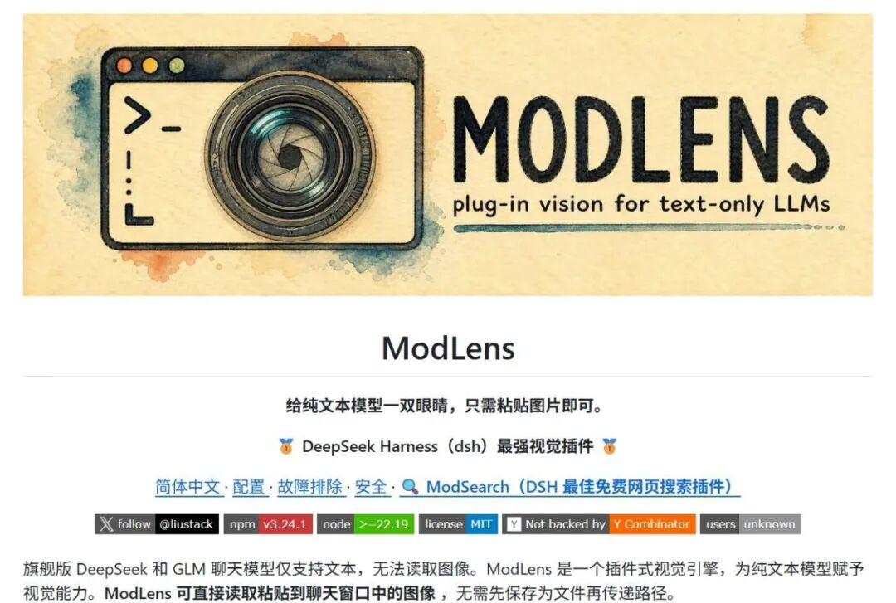
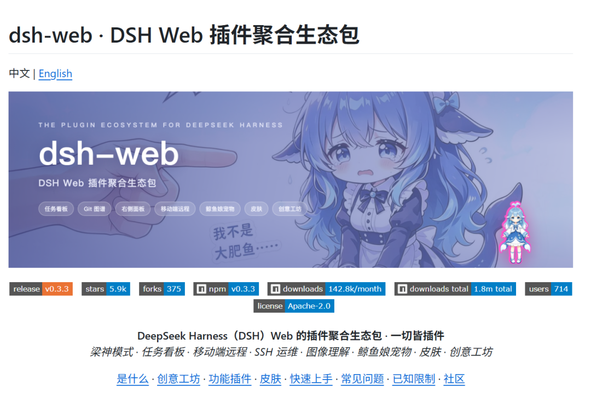
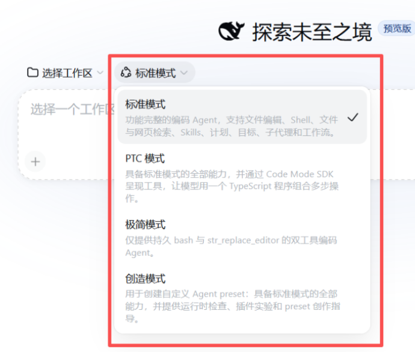
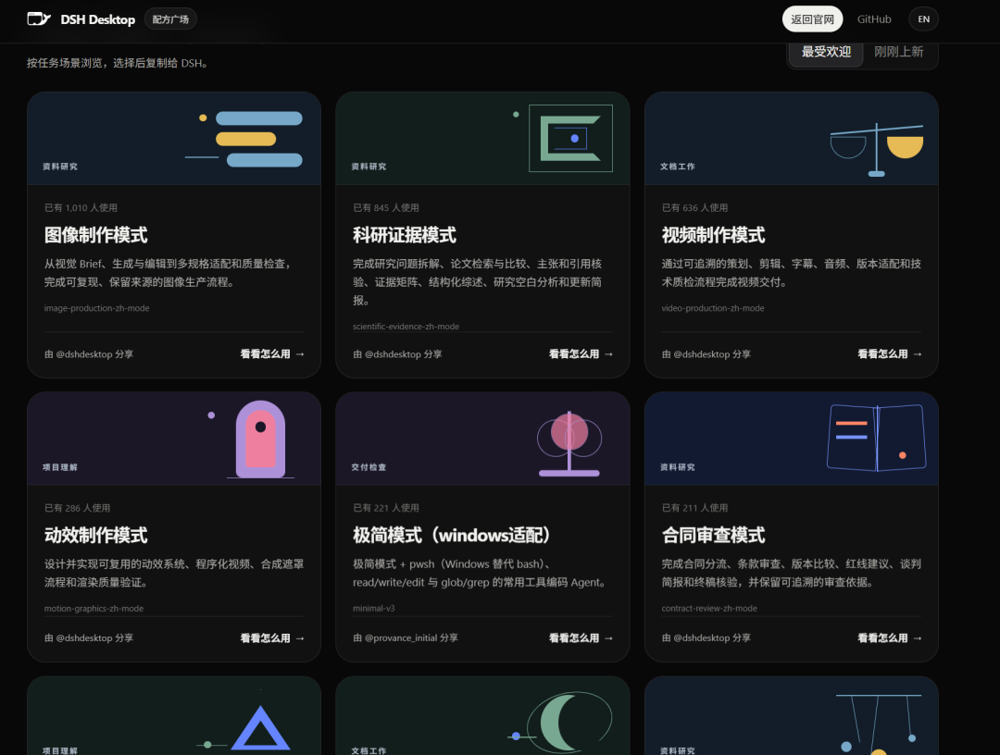

# Deepseek Harness 使用体感

> 这几天我深度用了 DeepSeek Harness，给大家简单分享下。

这几天我深度用了 DeepSeek Harness，给大家简单分享下。

目前使用起来体感和别的AI Agent完全不一样。

别的 AI 工具，CodeX 也好、WorkBuddy 也好，打开就能用，精装房拎包入住。

DSH 不一样，打开就是一个纯网页。

它有点类似于毛坯房，光秃秃的，但是你想装什么都可以，等于给你一堆装修材料，你自己拼，好与坏都是你自己的本事。

先说装的事。官方的办法是终端敲一行命令，然后回车。

虽然很简单，但是其实也是有门槛的，很多人看不懂所以也就干脆懒得装了。

但现在有个省事的——社区有人把 DSH 打包成了桌面安装包，叫 DSH Desktop。

Windows 和 Mac 都有，点击安装包一键安装就好了，非常方便。

当然得说清楚，这是社区做的，不是 DeepSeek 官方客户端。但用下来稳定性还可以，适合不想折腾环境的人。

当然DSH最优秀的的核心逻辑其实就五个字：一切皆插件。

模型是插件，工具是插件，连让 AI 不断思考做事的主循环本身也是插件。所有你不想要的插件能卸。

我用别的工具从来不敢想"把这核心功能给我拆了"，DSH 就敢让你拆。

说几个我自己装了觉得真香的插件。

第一个就是目前排名第四的简历插件，这个对于大家来说应该比较实用的

选择一个模板，填写你的详细信息，其中支持，实时预览，多种导出格式（PDF、JSON、DOCX），拖拽式板块排序，自定义板块修改，各种各样的字体，富文本，非常好用。

第二个，better-sidebar。

装完侧边栏直接起飞：文件树、代码编辑器、终端、Git 面板全有了。没装这个之前，你想看生成的文件还得跳到别的应用，装完直接在 DSH 里看，体验一个档次一个档次地涨。

第三个，ModLens（视觉插件）——几乎必装。

这个插件的作用是给模型（DeepSeek 主力模型）装上“眼睛”。

DeepSeek 模型本身是个瞎子，看不了图。但装个 vision 相关的插件，它能自动把图丢给模型去识别。你截图圈个 bug 发给它，它直接帮你定位改掉。这个我觉得是刚需。

第四个：dsh-web。

任务看板、Git 图谱、右侧面板（文件/终端/预览）、移动端远程控制、实时 Token 统计、皮肤中心、鲸鱼娘宠物等。

官方默认 UI 较简陋，这个装完看着舒服多了。

最让我感兴趣的是Deepseek的创造模式。

你可以自己造一个新的工作模式出来。

我看网上有个很有意思的玩法，直接把模式干成饥荒生存模式，血条蓝条显示 token 消耗，没血没蓝就生存失败。

虽然就是玩，但你可以用你自己喜欢的方式去玩AI还是一件非常有意思的事情。

当然未来DSH肯定会慢慢地越来越容易上手，就跟Workbuddy一样。

其实现在就已经有预设广场了，就是别人配好的插件组合，比如做图片的、做科研的、审合同的，一键导入就能用。懒得自己拼的可以直接抄作业。

但是说实话，就目前使用体感而言，如果你不是极客、AI爱好者或者有一些自己配置插件的需求。我还是更推荐你去用Codex和WorkBuddy，这两者肯定是更省心的。

但如果你喜欢拆东西、喜欢自己拼，DSH 目前独一档。

它才发布两周，GitHub 十八万星，社区一天一个样，彻底火起来只是时间问题。
