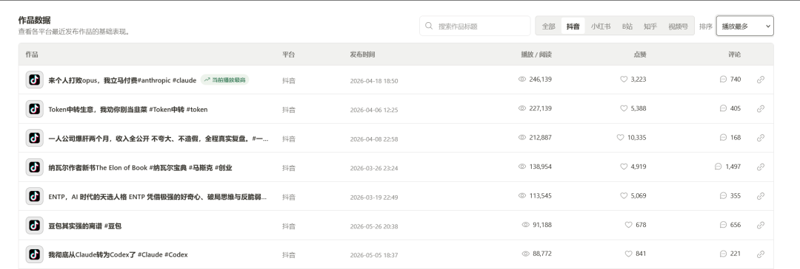
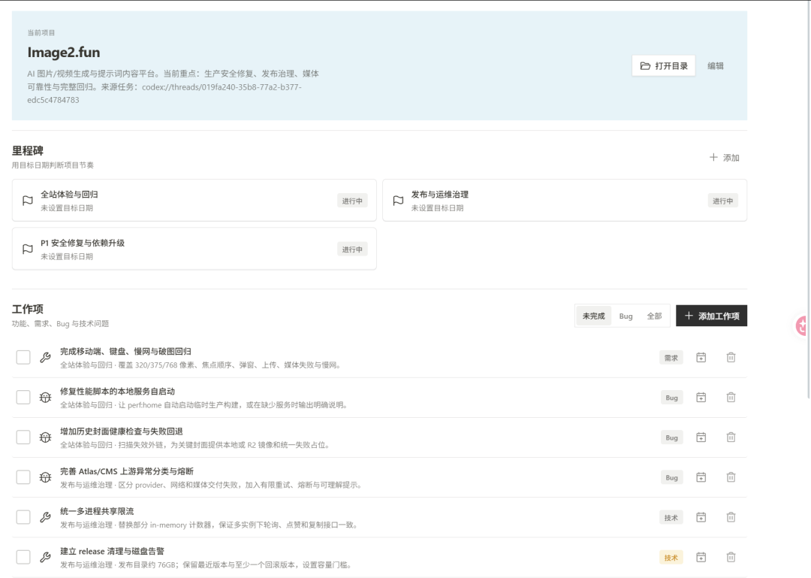
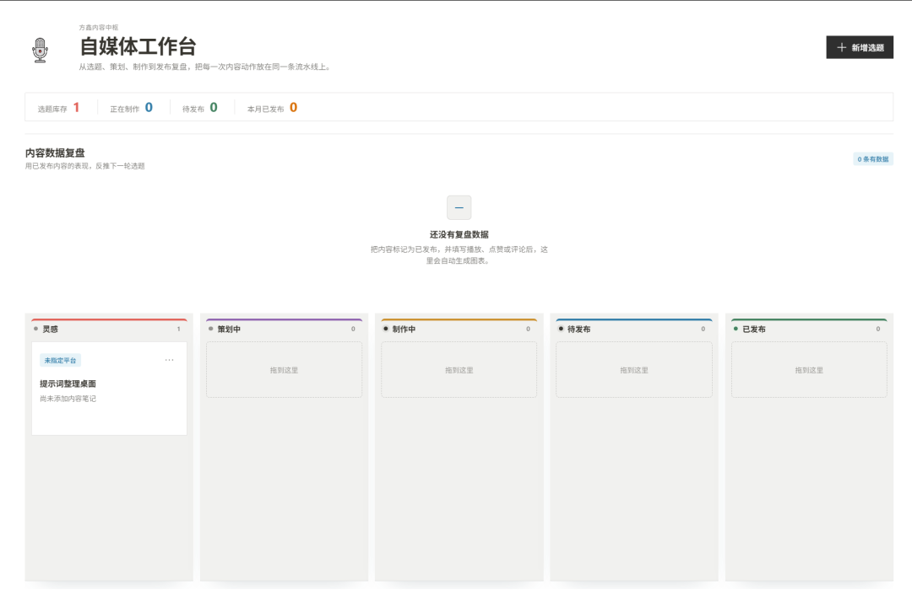
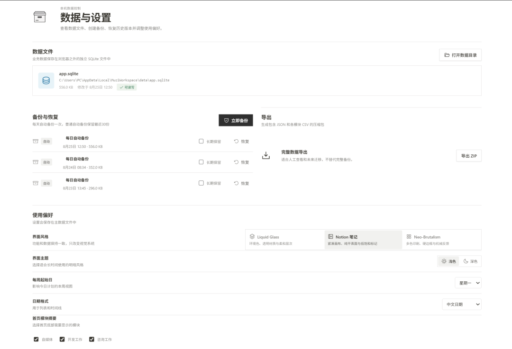

# 搭建自己的自媒体工作台

> 最近我打造了一个自己的自媒体工作台。

最近我打造了一个自己的自媒体工作台。

1、主要目的是用于监控自己发布的作品数据，方便我后续分析

2、通过连接Codex对多项目进展有一个基本把控。

3、对于每日的自媒体选题灵感可以进行一个记录。

除此之外，还有一些风格的设置。

今天还看到一段话，其实还蛮感悟的，
做自媒体，永远要教小白做事，反复讲入门级的内容。

不要认为你讲的东西太浅了，别人已经讲过了。

信息差永恒存在

大家都在AI圈子的时候，仿佛觉得全世界都用了Codex和ClaudeCode，Workbuddy，是个人都能随便搭个网站跑起来。

其实就是一种内行自嗨的视角。

工具是服务于人和业务的，不要本末倒置。
一针见血的讲了我的毛病。
1、我不愿意做太重复的题材 。
2、不愿意做太简单的东西（例如概念讲解，基本工具使用）。
我也在反思，持续地在反思。
