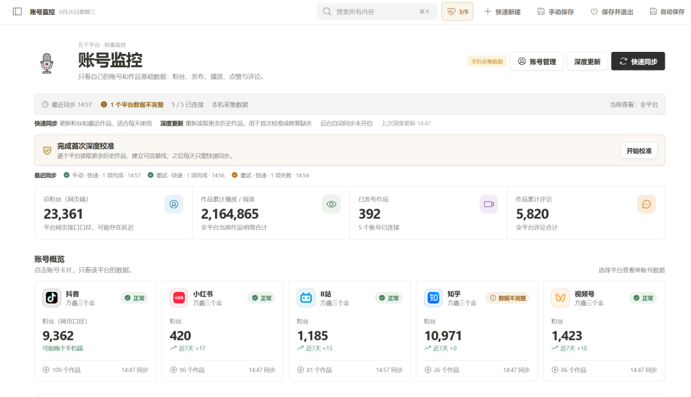
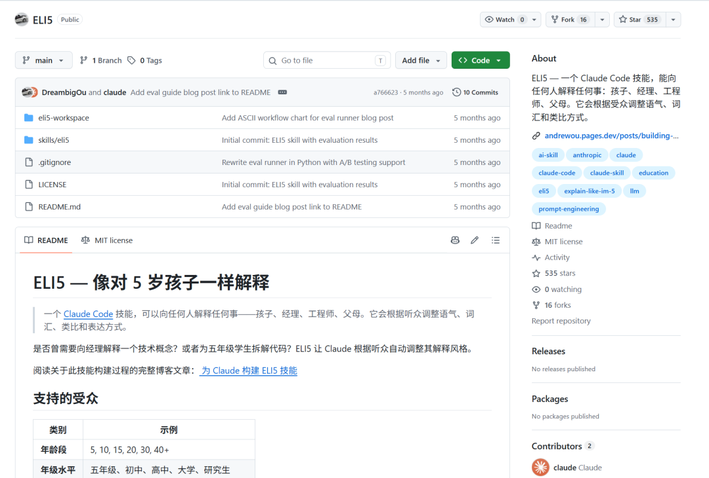
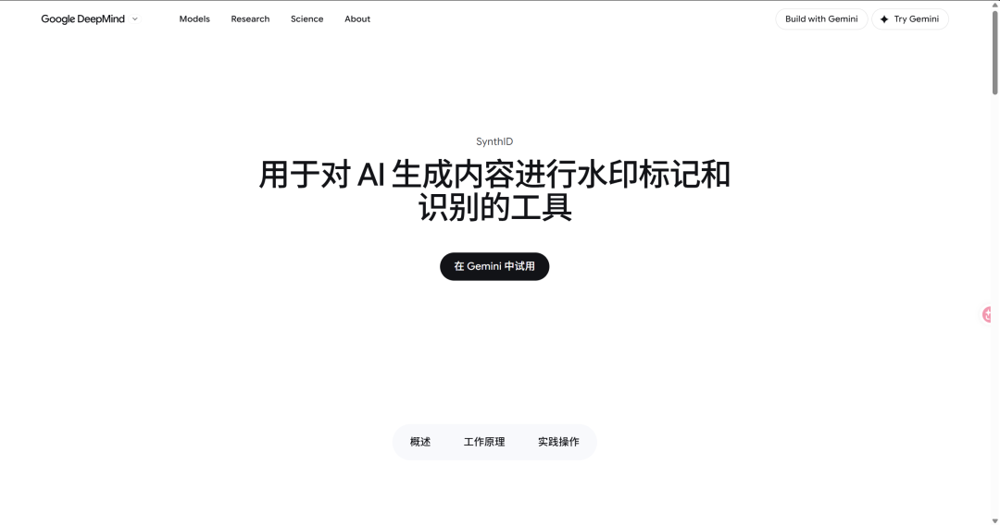
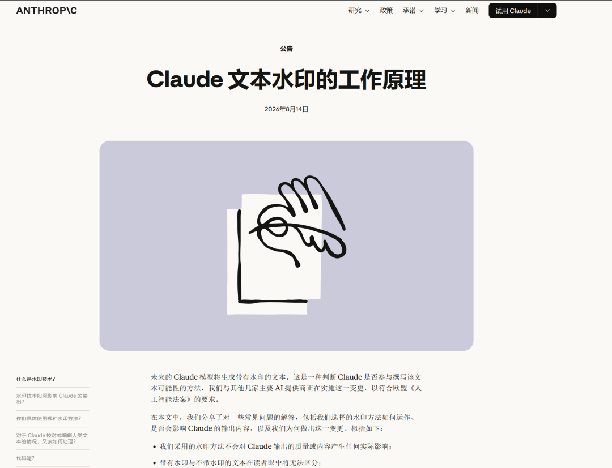
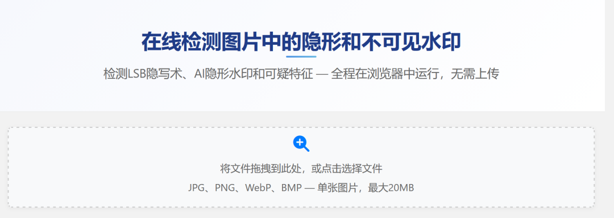
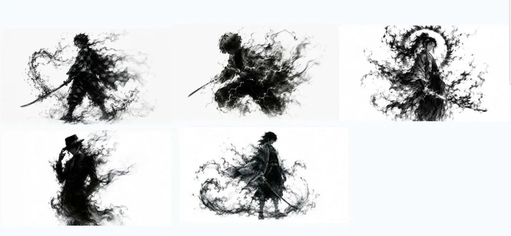

# ELI5 | AI隐形水印 | 水墨风Agent测试 | 整理桌面Prompt | 自媒体工作台更新

> 大家好，我是方鑫，今天是一人公司第 158 天。

大家好，我是方鑫，今天是一人公司第 158 天。

今天主要做了 5件事：

自媒体工作台、ELI5、AI 隐形水印、水墨风 Agent 测试、还有一个整理桌面的 Prompt。

1. 自媒体工作台：五个平台的数据终于能集中看了

现在这个自媒体工作台已经能接入 5 个平台：抖音、小红书、B 站、知乎、视频号。

目前聚合出来的数据是：

总粉丝：23,361

作品累计播放 / 阅读：2,164,865

已发布作品：392

作品累计评论：5,820

已连接平台：5 个

今天重点不是把页面做得多花，而是把“每天能不能稳定用”这件事往前推了一步。

我主要修了几块：

快速同步：每天点一下，更新最近作品、粉丝、评论。

深度更新：第一次接入账号，或者数据缺失时，用它重新拉历史作品。

自动更新：后台每天自动抓一次，不靠人工记。

异常提示：哪个平台数据不完整，直接在页面上标出来。

数据口径：比如抖音粉丝数，网页端可能比手机端慢，所以我直接标成“网页口径”，不再假装它是实时准确数据。

这里有个小坑：我一开始以为抖音粉丝数不一致是程序采错了。后来排查才发现，网页端接口返回的数据本身就可能延迟。这个问题如果不标清楚，后面所有增长判断都会被带歪。

所以数据产品里有个很朴素的原则：不确定的数据，不要装成确定。

2. ELI5：一个把复杂概念画出来的 Skill

今天还看了一个 Claude Code Skill，叫 ELI5。

ELI5 是 Explain Like I’m 5，意思是“像给 5 岁孩子解释一样”。它不是普通总结工具，而是把复杂概念做成一个 HTML 页面，用大图、箭头、少量文字讲清楚。

仓库在这里：

DreambigOu/ELI5

Anthropic community plugin mirror: eli5

我觉得它有用的地方在于：很多技术概念不是大家不想学，而是第一次看到时太抽象了。你直接丢一堆协议、上下文、工具调用、返回结果，普通读者很快就退出了。

ELI5 的做法更像是：先画一张简单结构图，再用一个生活类比把概念钉住。

比如解释 MCP，不一定先讲协议细节，可以先讲成：

“你向一个管家提出需求，管家去工具房找合适的工具，工具执行完再把结果交回来。

读者先知道“这东西在系统里负责什么”，再往下看技术细节，接受度会高很多。

这类 Skill 很适合做公众号、短视频、教程。尤其是现在 AI 领域新词太多，谁能把复杂概念讲清楚，谁就更容易被记住。

3. AI 图片和文本，可能有隐藏水印

第三个知识点：AI 内容的水印，不一定看得见。

很多人以为水印就是右下角一个 logo，或者图片上有一行小字。但现在很多 AI 水印是藏起来的。

人眼根本无法分辨，都是嵌入进图片的。

图片里的隐藏水印可能在这些地方：

元数据：比如 C2PA / Content Credentials。

像素层：比如 LSB 隐写，把信息藏在像素最低有效位。

频域层：比如 FFT 频谱里出现异常模式。

压缩痕迹：比如 ELA 分析可以看到局部处理痕迹。

模型专用水印：比如 Google DeepMind 的 SynthID。

Google DeepMind 的 SynthID 可以给 AI 生成的图片、音频、文本、视频加入不可见水印。人眼基本看不出来，但检测系统能识别。

文本也一样。

Anthropic 在 Claude text watermark 里解释过 Claude 文本水印的机制：不是塞隐藏字符，也不是额外加 token，而是在模型选择词语时调整随机性。普通读者看不出来，但有检测密钥时，可以判断一段文本是否很可能由 Claude 参与生成。

这里要注意三点：

水印不等于个人追踪。Anthropic 说 Claude 文本水印不携带个人、组织或具体对话身份信息。

水印不等于铁证。样本太短、翻译过、改写过、二次生成过，检测可靠性都会下降。

不同模型、不同平台、不同产品，水印策略不一样。

今天我还看到一个工具：ROCKIMG 隐形水印检测器。

它可以在浏览器本地检测 LSB、AI 隐形水印、元数据、ELA、FFT 等异常，不需要把图片上传到服务器。这个点很重要，因为很多素材本身就不适合上传到第三方网站。

但这类检测结果只能当线索，不能当最终证据。比如 PNG / WebP 的 ELA 结果可能天然偏高；频域水印如果没有原始密钥，也很难做最终确认。

做图片站、素材库、广告图、商业海报，以后不能只看“图片干不干净”，还要看它有没有隐藏标记、来源信息、版权数据。

4. 水墨风 Agent：把模型的不稳定变成风格

今天还测试了一组水墨风格图。

我最近很喜欢这种黑白水墨人物：主体轮廓很清楚，边缘像烟、墨、水一样散开。静态图已经有张力，下一步想把它做成 5-8 秒的视频。

大概方向是：

人物不做大幅度动作，保持站姿或慢动作。

衣服和背景像墨一样往外扩散。

刀光不做金属光，改成一道墨线。

转场不用硬切，改成墨雾吞没再重组。

背景尽量留白，把注意力集中在人物轮廓和墨迹流动上。

这个风格有个好处：AI 视频的很多缺陷会被风格吸收。

如果你做真人写实，手指变形、衣服抖动、边缘糊掉，观众一眼就能看出来。但水墨风本来就是破碎、流动、边界不清的，模型的不稳定反而能变成画面语言。

5. 一个可以直接用的桌面整理 Prompt

最后分享一个很实用的 Prompt：让 Agent 整理桌面。

但我建议先让它给计划，不要直接移动文件。桌面里经常有项目快捷方式、临时素材、重要文件，文件移动属于真实操作，别一上来就全自动。

可以这样写：

请帮我整理当前桌面（Desktop）文件夹。

要求：
1. 先扫描桌面上的所有文件和文件夹，列出清单。
2. 按类型自动分类并移动到对应文件夹（如果没有就新建）：
   - 文档（.pdf .doc .docx .txt .md .xlsx .pptx 等）→ 文档
   - 图片（.jpg .png .gif .webp .svg 等）→ 图片
   - 视频（.mp4 .mov .avi 等）→ 视频
   - 压缩包（.zip .rar .7z 等）→ 压缩包
   - 安装包/软件（.dmg .exe .pkg .app 等）→ 安装包
   - 其他杂项 → 其他
3. 超过30天未修改的文件，额外移到「归档」文件夹。
4. 空文件夹直接删除。
5. 整理完后告诉我移动了哪些文件，并给出最终的文件夹结构。
更安全的版本是在最前面加一句：

先不要移动文件。请先扫描并给出整理计划，等我确认后再执行。
这个小提示词看起来不起眼，但很适合处理低风险、重复性强、规则明确的本地任务。

今天就先记录到这里。

没有什么大功能上线，但自媒体数据、知识解释、图片检测、视频风格、长内容 Skill、人物 Skill、文件整理，都往前推了一点。对我来说，这些东西最后都会变成日常工作里的基础设施。
