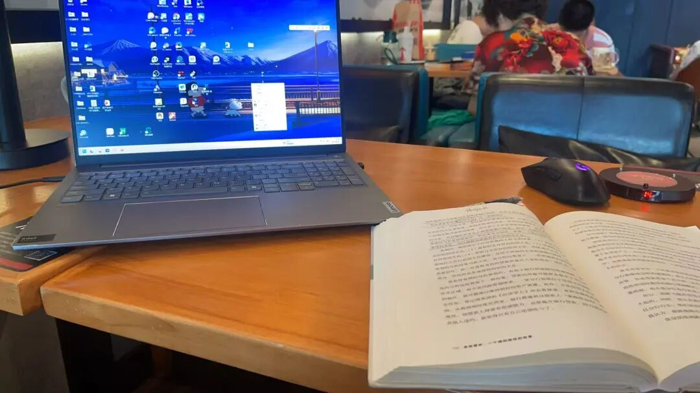
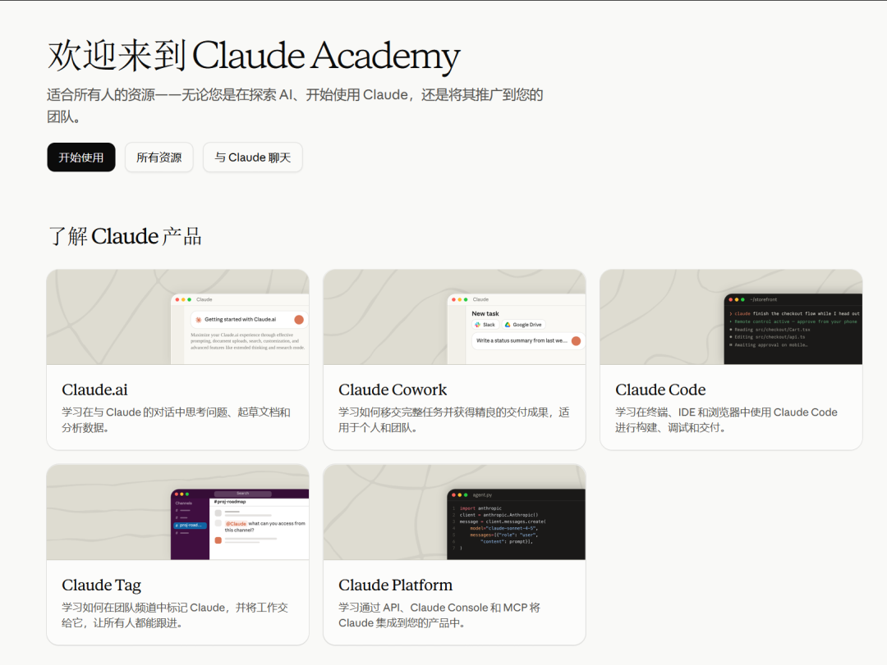
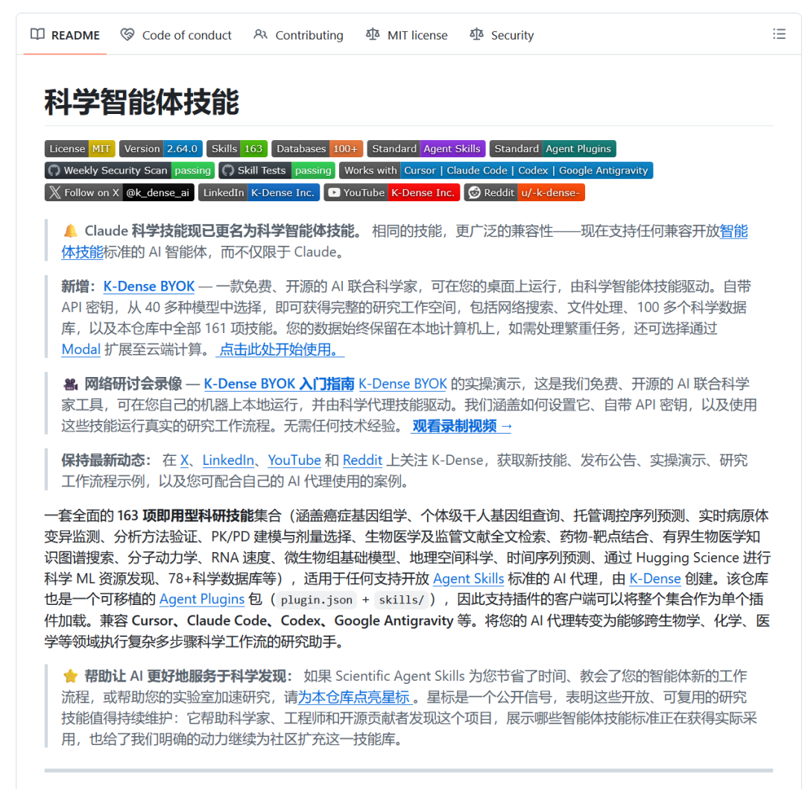
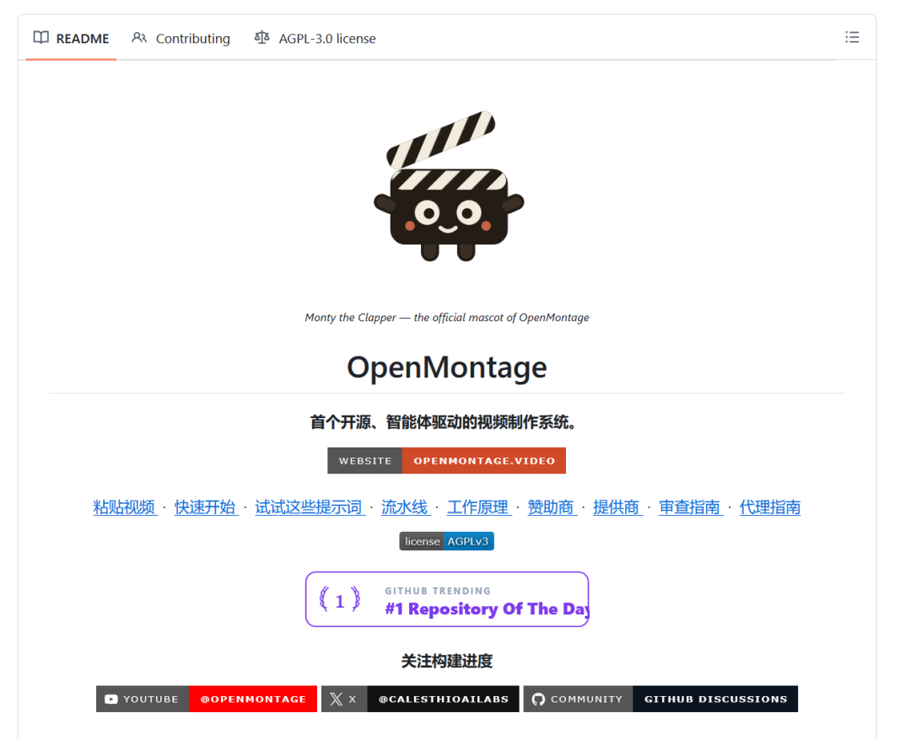

# 持续不断的学习和进步

> 今天在咖啡馆坐了大概五个小时，一口气看完了单伟健的《金钱博弈：一个峰回路转的故事》。

今天在咖啡馆坐了大概五个小时，一口气看完了单伟健的《金钱博弈：一个峰回路转的故事》。

单伟健是我这几年非常喜欢的一个人，他的三本书我都看了（走出隔壁、金钱博弈一、金钱博弈二），均在豆瓣都有9分以上。

如果只从知识和写作质量来说，我不敢说每一本都特别精彩。

但它们有一个共同的地方：作者总是在处理很复杂的问题。

复杂的环境，复杂的人，复杂的交易，还有很多当时看起来根本解决不了的难题。

但我很少看到作者抱怨，他只是一味地去解决问题。

遇到问题，就继续找办法；一个办法不行，就换一个办法；事情看不到出口，就先把眼前能做的事情做好。

这种感觉比书里的具体知识更打动我。

很多书看完之后，你可能只记得几个概念、几句话，过几天也就忘了。

但有些人做事的方式，会在你身上留下更久的影响。

单伟健给我的就是这种影响。

我每次在做一件我觉得难的事情，我就想，我这点难对于单老师所面临的困境和困难来说，又算得了什么呢？仅仅是这种难度我都无法克服吗？那我还怎么成就更大的事业，成为更好的自己呢？

人还是可以改变很多事情

我们经常说：

“谋事在人，成事在天。

这句话当然有道理，但我觉得生活里很多事情，其实还没有走到“成事在天”的阶段，就先被自己放弃了。

项目没做成，可能不是市场不行，而是做了几天就没继续；文章没写出来，可能不是没有时间，而是一直在等一个更好的状态；产品没有用户，可能也不是方向完全错误，而是还没真正把问题解决好。

人经常把“暂时没有结果”，误认为“这件事做不到”。

书里那些经历不断提醒我：只要事情还没有彻底结束，就还有继续想办法的空间，有时候看似黑暗的时刻，其实光明就在背后了。

很多时候，人并不是靠一次正确的判断走到最后，而是在不断修正中走到最后。

AI 越强，越不能把自己交出去

今天还看到一些关于 AI 编程和 Agent 的讨论。

AI 现在可以帮我们写代码、查资料、做研究，甚至把一整套视频生产流程跑起来。它会让很多事情变得更快，但也可能让人失去亲自思考和试错的机会。

尤其是刚开始学习的人，如果每一个问题都直接让 AI 给答案，最后得到的可能只是一个能运行的结果，而不是解决问题的能力。

这里有一个很现实的悖论：

你需要经验，才能判断 AI 写得对不对；

但如果所有工作都交给 AI，你又很难获得经验。

所以我现在用 AI 的时候，会提醒自己：能交给 AI 的事情尽量交，但必须保留判断、复核和承担结果的能力。

工具可以替我加速，但不能替我成长。

我看到的那篇分析，把这个问题说得更彻底：代码对程序员来说，不只是产品，也是训练材料。

新人写代码、改 Bug、处理线上故障，看起来低效，实际上是在形成技术直觉。AI 如果直接把这些过程拿走，新人也许能快速交付，却未必真正获得能力。

更麻烦的是，监督 AI 并不是低门槛工作。

你得先有经验，才能判断它的方案有没有隐患；但如果所有任务都交给 AI，又很难获得经验。企业短期可能用少量 Senior 管理大量 Agent，长期却是在消耗过去培养出来的人才存量。

AI 会把标准化工作做得越来越便宜，真正稀缺的会是定义问题、接入真实业务、处理异常，以及为最终结果负责的人。

最近看到的三个 AI 项目

1. Claude Academy

Anthropic 最近推出了免费的 Claude Academy学习资源库，内容包括 Claude 使用、AI 素养和 Agent 开发。

2. Scientific Agent Skills

Scientific Agent Skills 把科研、工程、分析和写作流程封装成 Skills，当前仓库展示了 138 个技能，覆盖基因组学、药物发现、临床研究和数据分析等方向。

3. OpenMontage

OpenMontage 是一个开源的 Agent 视频生产系统，把研究、脚本、素材、剪辑和合成拆成 12 条流水线，让 Claude Code、Cursor、Codex 等工具参与完整的视频制作。

它不是简单的“一键生成视频”，而是把视频生产过程拆成了 Agent 可以执行的系统。

