# 小白必看的AI热门49词

> AI 领域最烦人的地方，不是工具难用，而是名词太多。

AI 领域最烦人的地方，不是工具难用，而是名词太多。

你只是想用 AI 写点东西，结果教程里开始讲 Prompt、Token、上下文窗口。你只是想做一个知识库，又突然冒出 RAG、Embedding、向量数据库。你只是想接一个 API，结果又要理解 API Key、并发、延迟、算力。

所以这篇不写成论文，也不写成技术百科。

我按中文小白最常遇到的场景，整理了 49 个 AI 热词。每个词只讲两件事，并配一张图：

一句话解释：先用人话说清楚。

你会在哪遇到：放进真实使用场景。

一、最基础的 7 个词

这组词先回答一个问题：你面前那个 AI 聊天框，背后到底是什么。

1. AI

一句话解释：AI 就像一个会学习的电子助手，能帮你写字、看图、听声音、写代码、整理资料。

你会在哪遇到：ChatGPT、Claude、Gemini、DeepSeek、豆包、Kimi、AI 生图、AI 剪辑、AI 客服。

2. AIGC

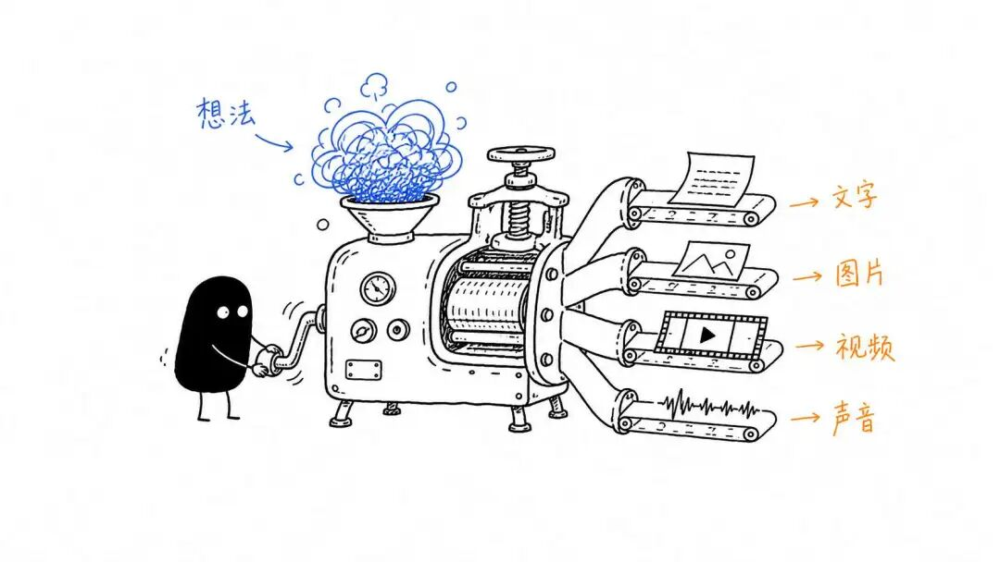

一句话解释：AIGC 就是 AI 生成内容。以前内容是人写、人画、人剪，现在 AI 也能生成文字、图片、视频、音乐。

你会在哪遇到：AI 写公众号、AI 生成海报、AI 做短视频、AI 写脚本、AI 生成商品图。

3. 大模型

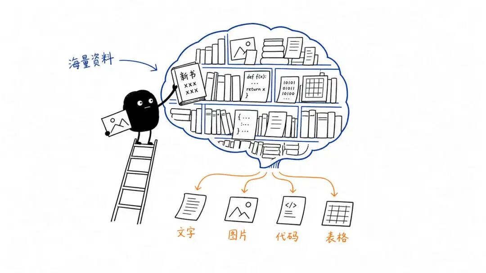

一句话解释：大模型像一个读过海量资料的超级大脑，不只会一个任务，而是能处理很多任务。

你会在哪遇到：GPT、Claude、Gemini、DeepSeek、通义千问、Kimi、豆包。

4. LLM

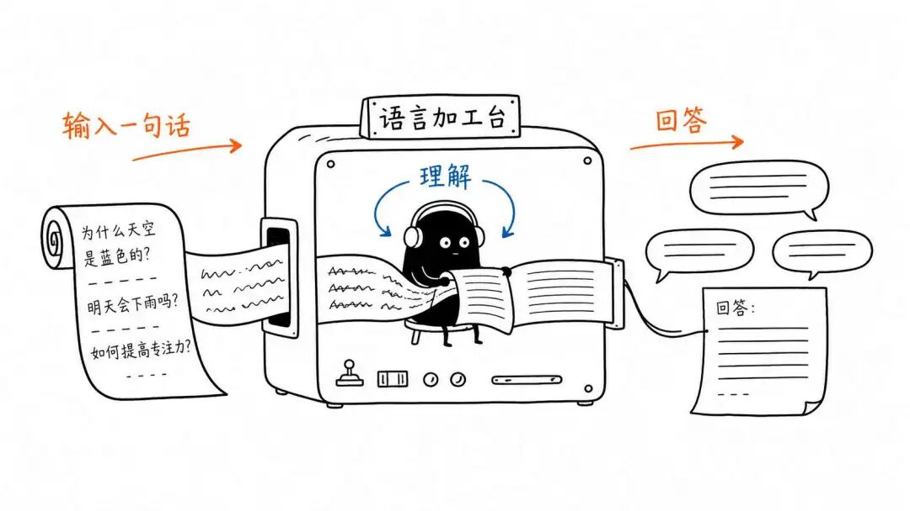

一句话解释：LLM 是大语言模型，重点是“语言”。你输入一句话，它理解后再用语言回答你。

你会在哪遇到：聊天机器人、AI 写作、AI 翻译、AI 总结、AI 代码助手。

5. 模型

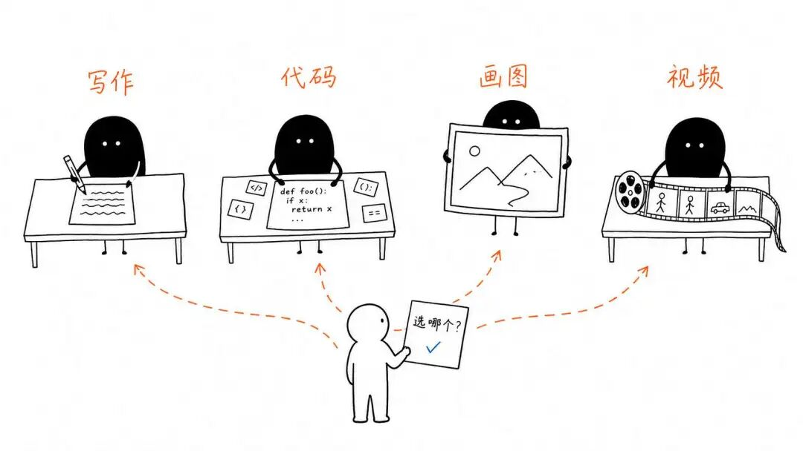

一句话解释：模型就是 AI 的“脑子”。不同模型像不同员工，有的擅长写作，有的擅长代码，有的擅长画图。

你会在哪遇到：选择 GPT、Claude、DeepSeek、Qwen、Gemini，或者在生图工具里选择不同图片模型。

6. 参数

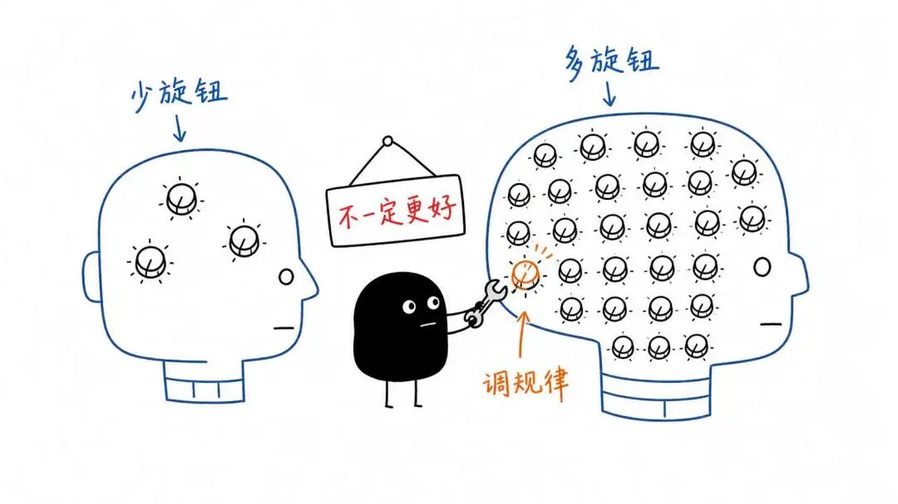

一句话解释：参数像模型脑子里的小旋钮。旋钮越多，模型能记住和组合的规律通常越复杂。

你会在哪遇到：“7B 模型”“70B 模型”“千亿参数模型”这类说法。

7. Token

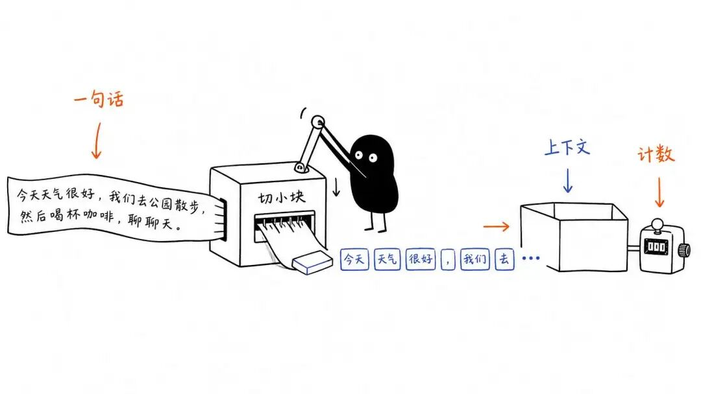

一句话解释：Token 是 AI 眼里的文字小块。AI 会把一句话拆成小积木来处理。

你会在哪遇到：API 计费、上下文长度、一次能输入多少字、一次回答能写多长。

二、普通人用 AI 最常遇到的 7 个词

这组词回答的是：你怎么和 AI 说话，它才更靠谱。

8. Prompt

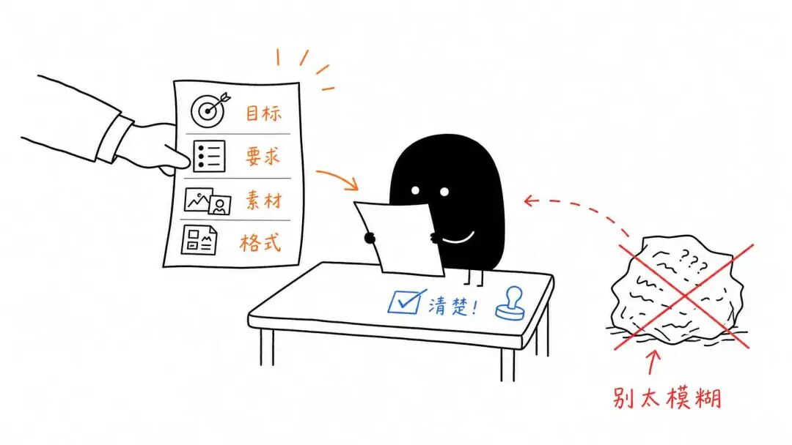

一句话解释：Prompt 就是你给 AI 的任务说明。你说得越清楚，它越知道该怎么做。

你会在哪遇到：让 AI 写文章、改图片、生成视频、整理资料、写代码时。

9. 提示词工程

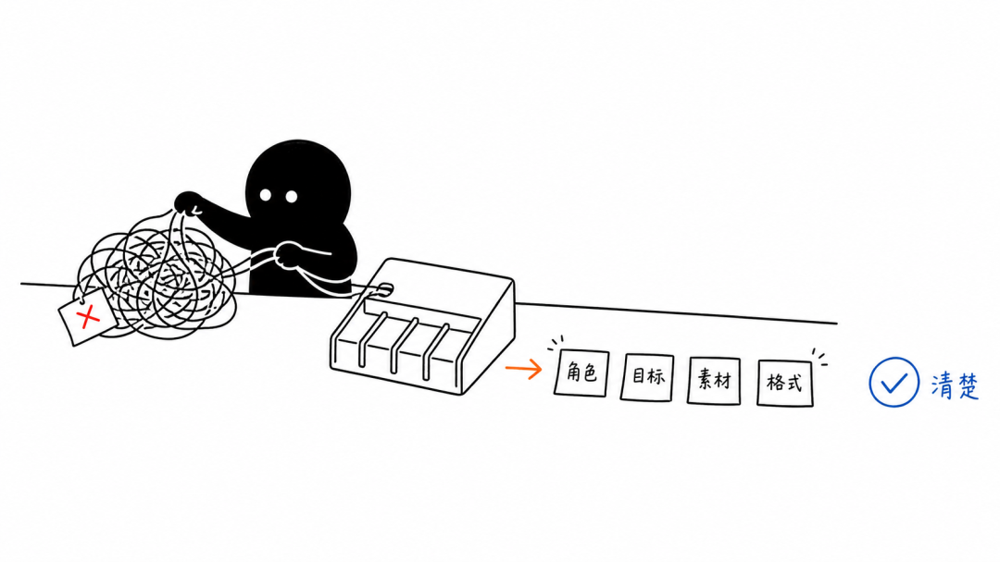

一句话解释：提示词工程不是玄学，而是把任务说清楚的能力。它像给员工安排工作：目标、材料、标准、交付格式都要说明白。

你会在哪遇到：AI 写作模板、Midjourney 提示词、短视频脚本提示词、Agent 工作流提示词。

10. System Prompt

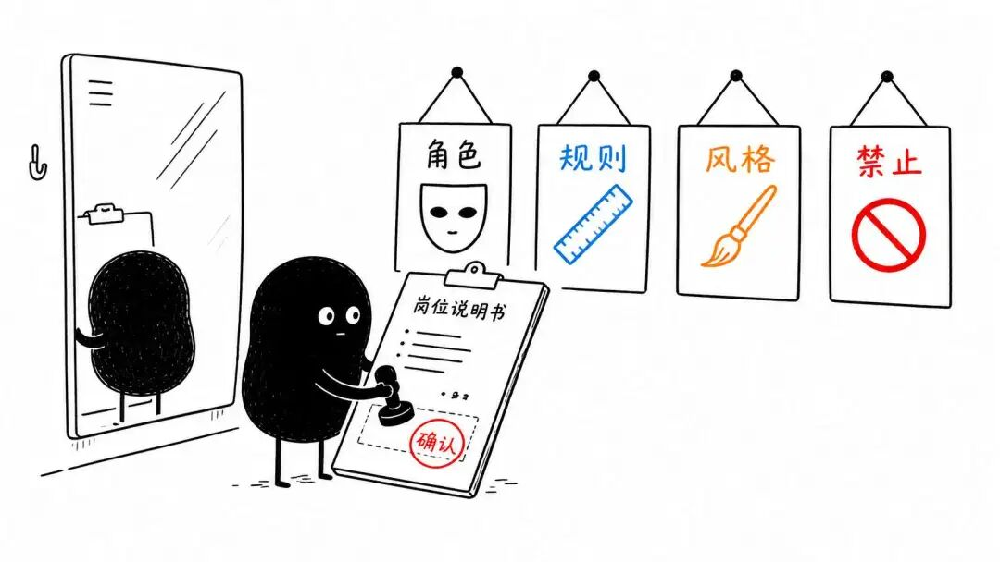

一句话解释：System Prompt 像 AI 的岗位说明书，规定这个 AI 扮演什么角色、遵守什么规则、不能做什么。

你会在哪遇到：客服机器人、写作助手、AI 私人秘书、AI 编程助手。

11. 上下文

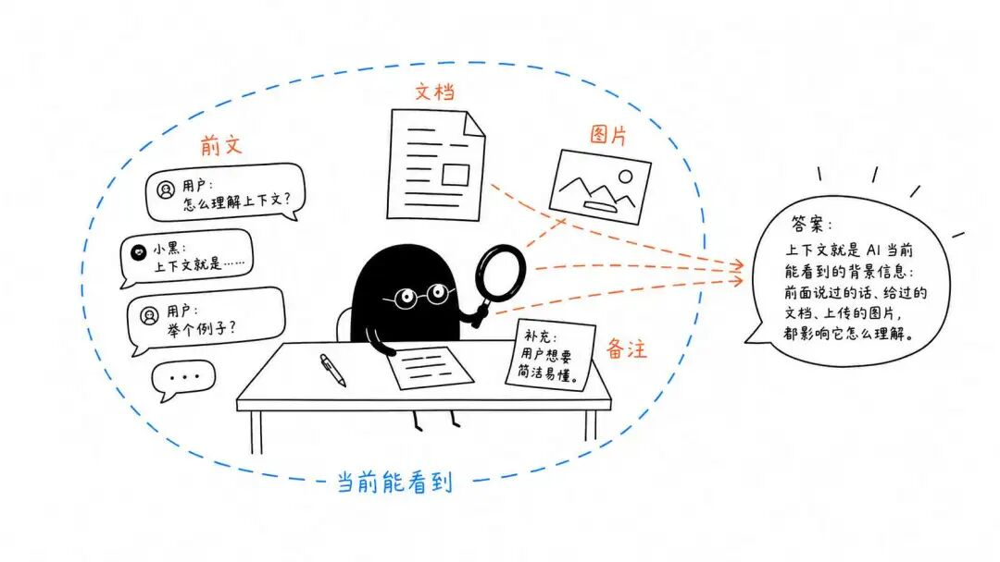

一句话解释：上下文就是 AI 当前能看到的背景信息。你前面说过什么、给了什么资料，它都靠上下文来理解。

你会在哪遇到：连续聊天、让 AI 读文档、让 AI 根据前文继续写。

12. 上下文窗口

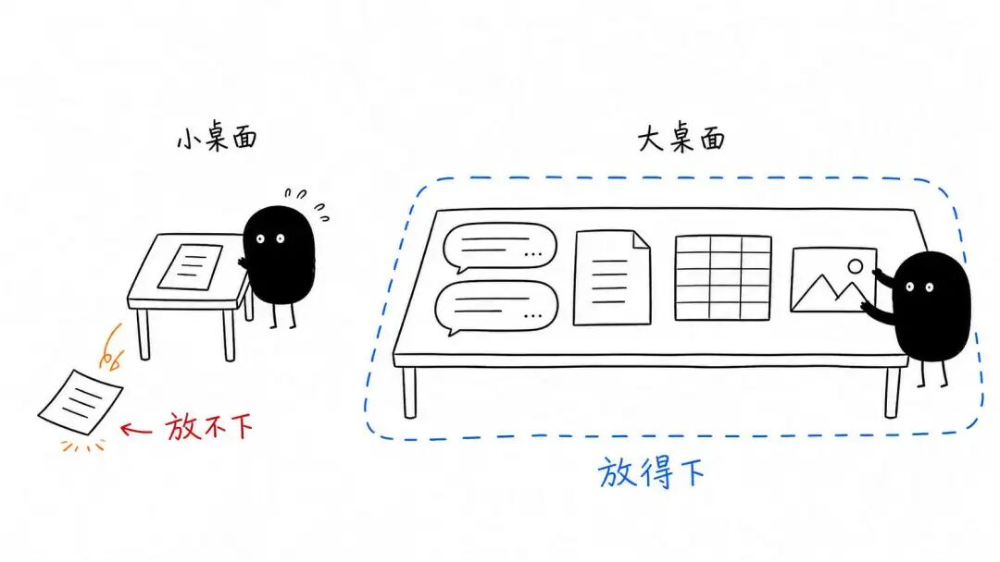

一句话解释：上下文窗口像 AI 的临时桌面。桌面越大，能同时放下的资料越多。

你会在哪遇到：“支持 128K 上下文”“可以读长文档”“一次能塞很多资料”。

13. 记忆

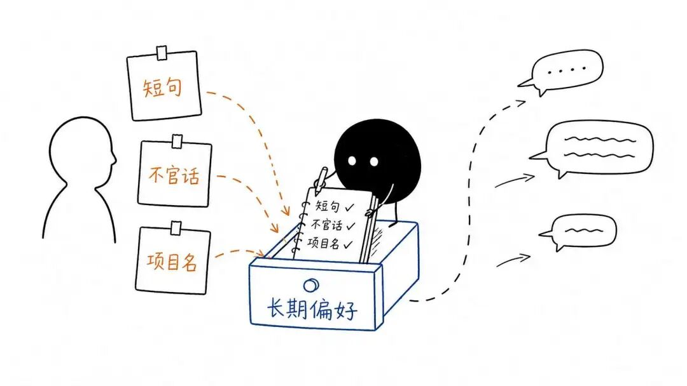

一句话解释：记忆是 AI 长期记住你的偏好，比如你喜欢什么写作风格、你的项目叫什么、你常用哪些规则。

你会在哪遇到：ChatGPT 记忆、私人助理、长期陪伴型 AI、个人工作流 Agent。

14. 幻觉

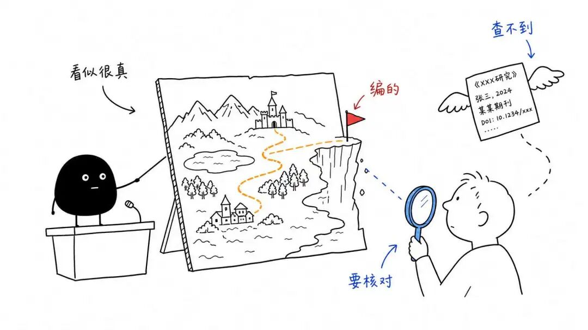

一句话解释：幻觉就是 AI 一本正经地编。它说得很像真的，但内容可能是错的。

你会在哪遇到：AI 编造论文、编造链接、编造政策、编造名人说过的话。

三、AI 能力相关的 7 个词

这组词回答的是：AI 除了聊天，还能生成哪些内容。

15. 多模态

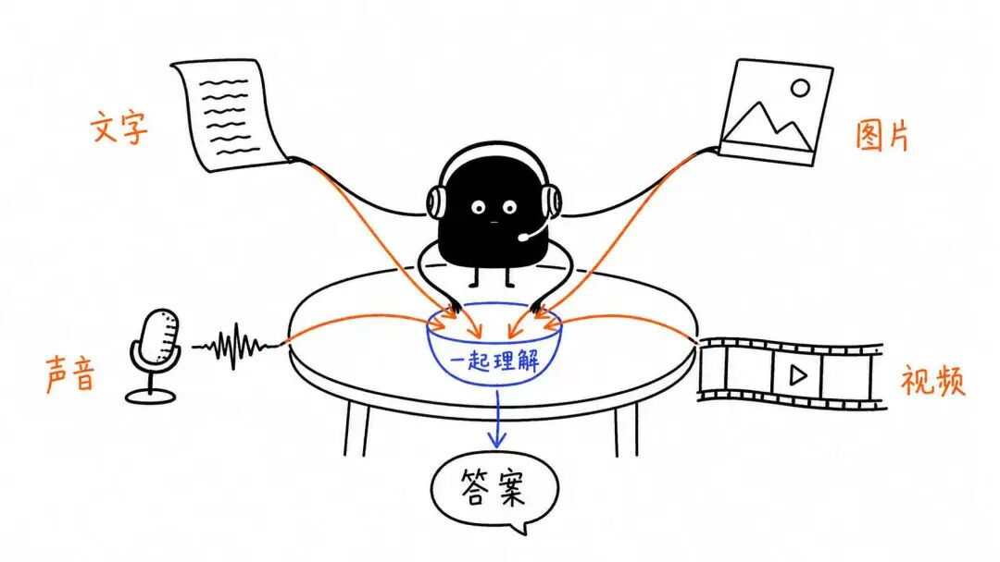

一句话解释：多模态就是 AI 不只会看文字，还能看图、听声音、看视频。

你会在哪遇到：上传截图让 AI 分析、上传图片让 AI 改图、上传音频让 AI 转文字。

16. 文生图

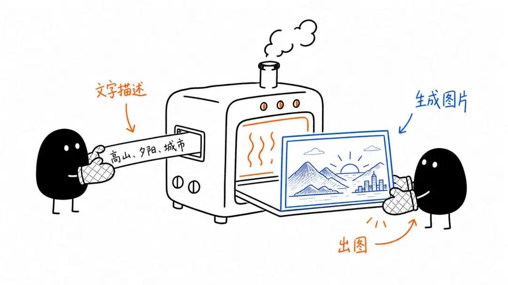

一句话解释：文生图就是你用文字描述画面，AI 根据描述生成图片。

你会在哪遇到：Midjourney、即梦、豆包生图、可灵图片、海报生成工具。

17. 图生图

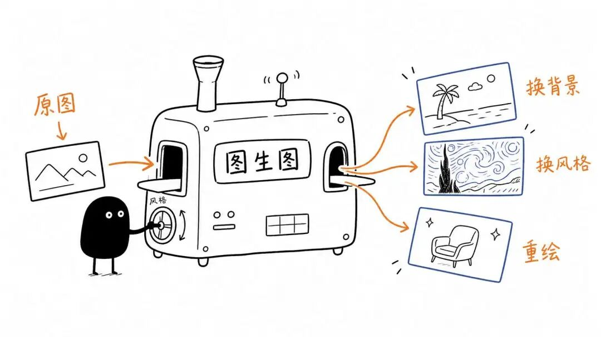

一句话解释：图生图就是拿一张已有图片，让 AI 按你的要求改成另一张图。

你会在哪遇到：换风格、换背景、产品图重绘、人物写真、服装试穿。

18. 文生视频

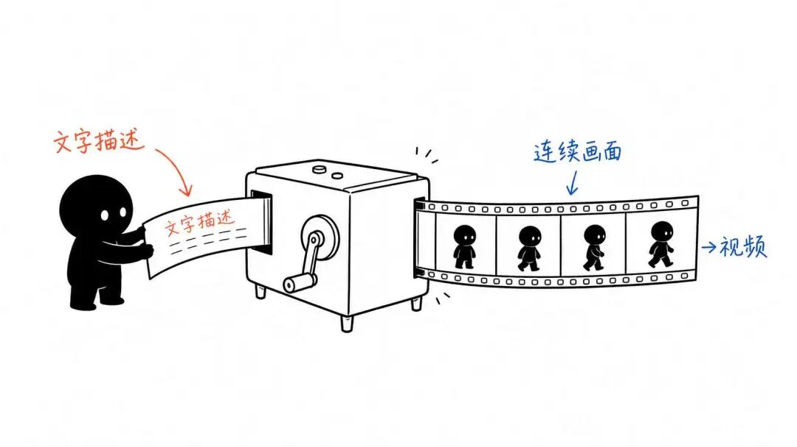

一句话解释：文生视频就是你写一段画面描述，AI 生成一段视频。

你会在哪遇到：可灵、Sora、Runway、Pika、Seedance 这类视频工具。

19. 语音识别 ASR

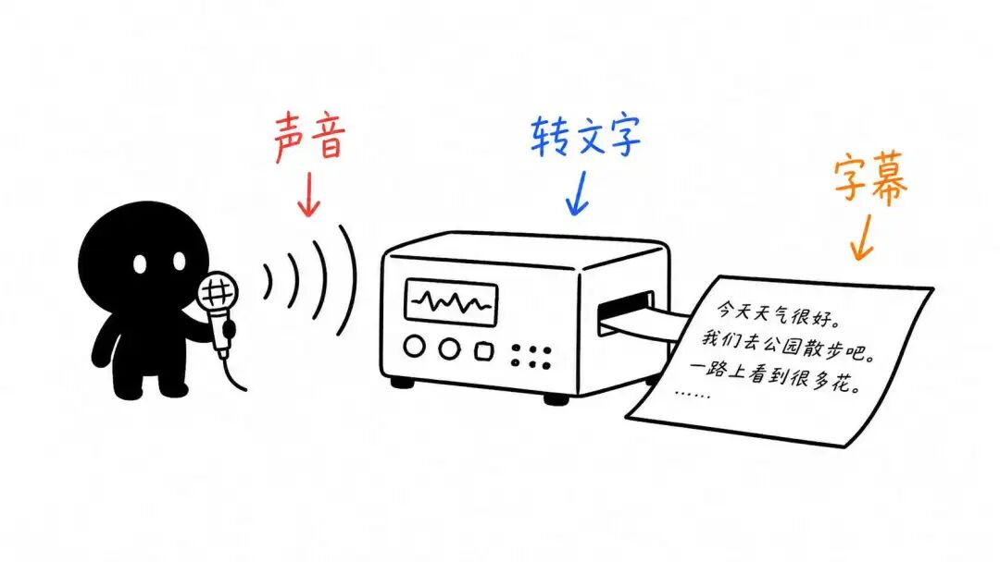

一句话解释：ASR 就是把人说的话变成文字。

你会在哪遇到：会议纪要、录音转文字、视频字幕、播客转写。

20. 文字转语音 TTS

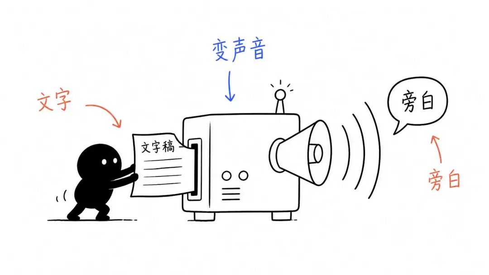

一句话解释：TTS 就是把文字读成声音。

你会在哪遇到：AI 配音、小说朗读、短视频旁白、数字人口播。

21. 数字人

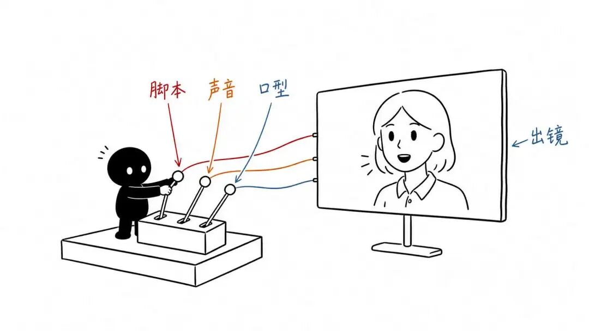

一句话解释：数字人就是一个会说话、会动嘴、像真人出镜的虚拟人。

你会在哪遇到：AI 口播视频、直播带货、课程讲解、品牌客服。

四、Agent 和自动化相关的 7 个词

这组词回答的是：AI 怎么从“会说”变成“会干活”。

22. Agent

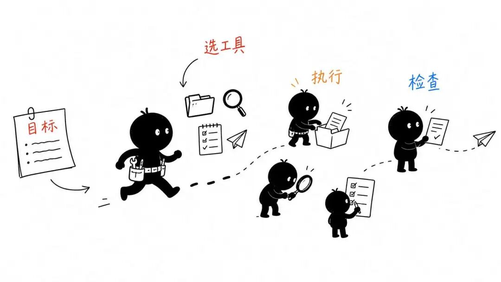

一句话解释：普通 AI 像聊天对象，Agent 更像会干活的助理。它不只是回答你，还会调用工具、执行步骤、检查结果。

你会在哪遇到：Codex、Claude Code、Manus、浏览器 Agent、自动整理文件的 AI。

23. AI 工作流

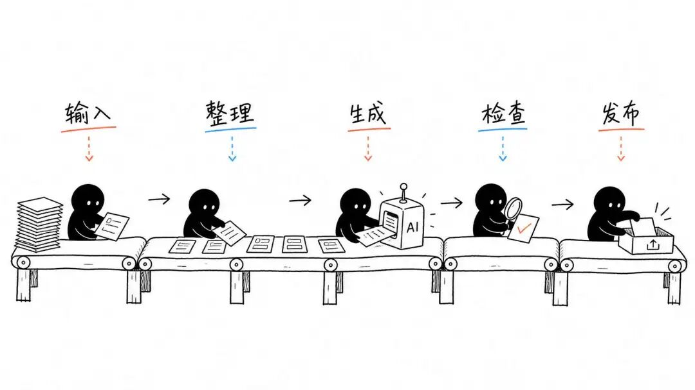

一句话解释：AI 工作流就是把一件事拆成固定步骤，让 AI 按流程做。

你会在哪遇到：自动写文章、自动剪视频、自动同步数据、自动生成日报。

24. Tool Use

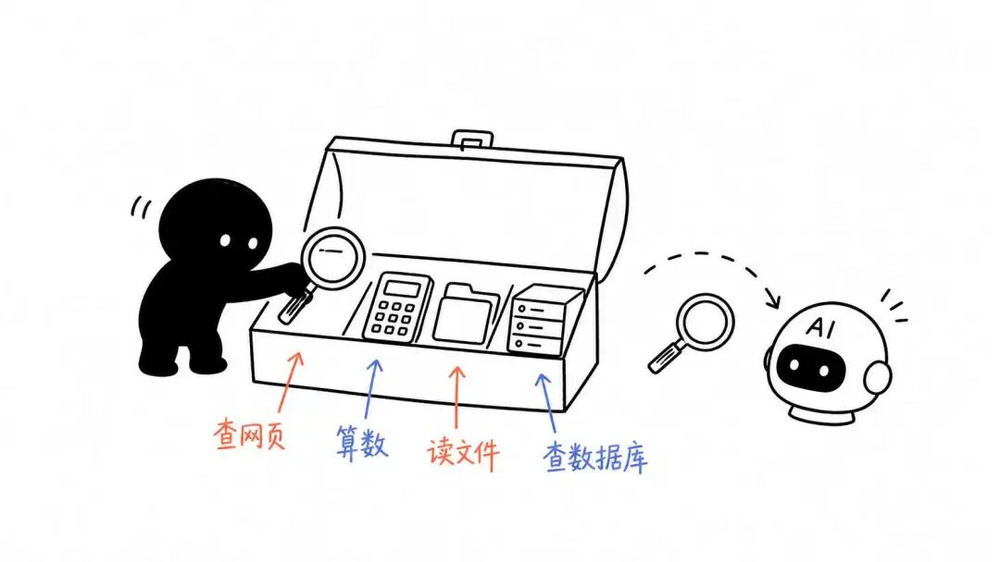

一句话解释：Tool Use 就是 AI 会用工具。它不会只靠脑子猜，而是可以打开网页、查数据库、跑代码。

你会在哪遇到：AI 帮你搜索、读取文件、调用接口、打开浏览器操作网页。

25. Function Calling

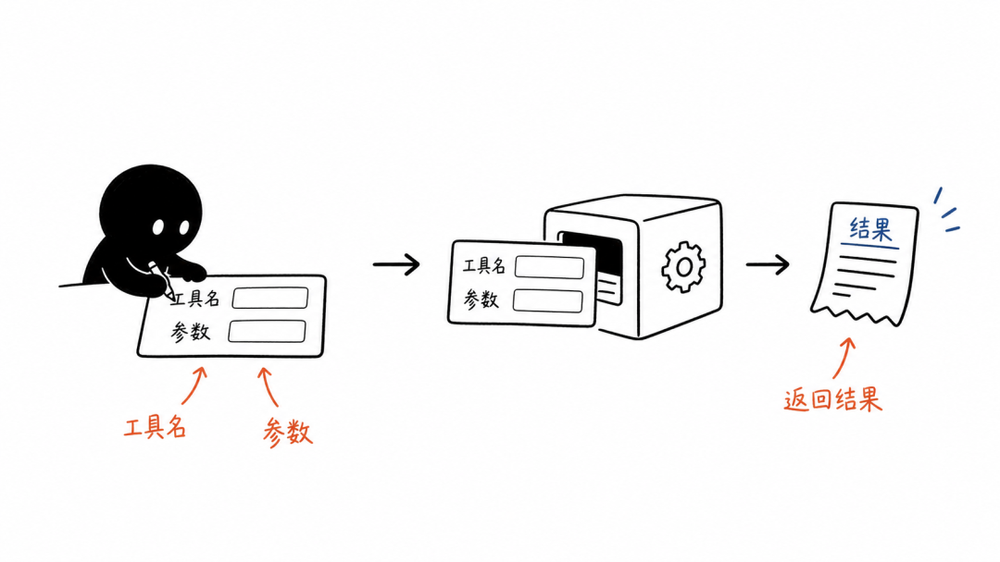

一句话解释：Function Calling 就是 AI 按固定格式调用一个功能。比如你说“查天气”，它知道要把城市名填进天气接口。

你会在哪遇到：AI 订票、查订单、调用支付、调用数据库、企业内部机器人。

26. MCP

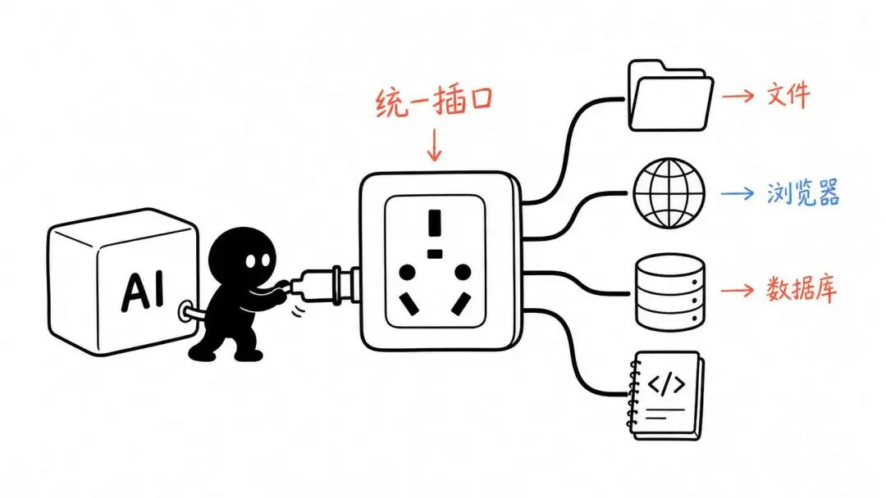

一句话解释：MCP 像 AI 工具世界的通用插座。以前每个工具都要单独接线，现在可以按一套标准接。

你会在哪遇到：Claude、Cursor、Codex、各种 MCP Server、数据库连接、浏览器连接。

27. Skill

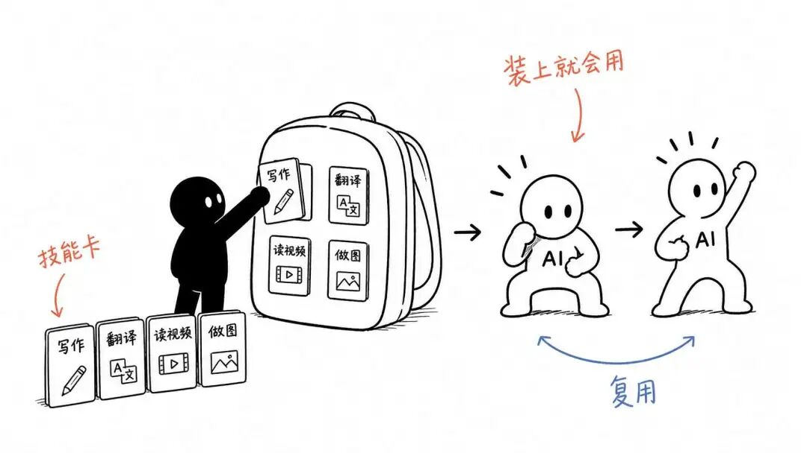

一句话解释：Skill 就像给 AI 装一个专门技能包。装上以后，它就知道某类任务应该怎么做。

你会在哪遇到：Codex Skill、Claude Skill、写作 Skill、读播客 Skill、整理知识库 Skill。

28. API

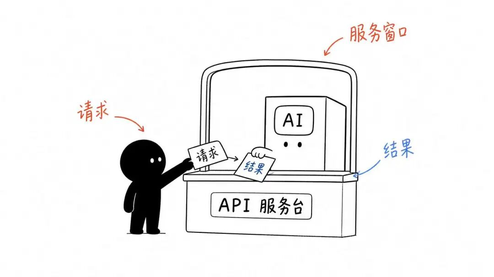

一句话解释：API 像软件之间的服务窗口。你按规定格式提需求，另一个软件把结果返回给你。

你会在哪遇到：调用 AI 模型、接支付、接短信、接地图、接图片生成服务。

五、知识库和 RAG 相关的 7 个词

这组词回答的是：AI 怎么读你的资料，而不是只靠它自己的记忆。

29. 知识库

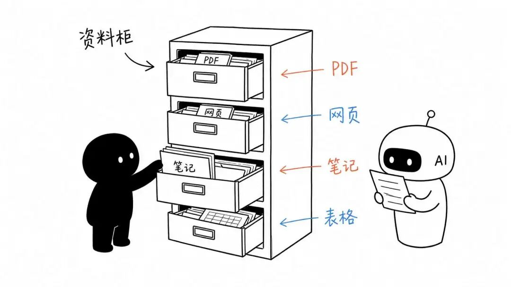

一句话解释：知识库就是给 AI 准备的一柜子资料。它回答问题时，可以先去柜子里找。

你会在哪遇到：企业文档问答、个人笔记问答、客服知识库、产品说明书问答。

30. RAG

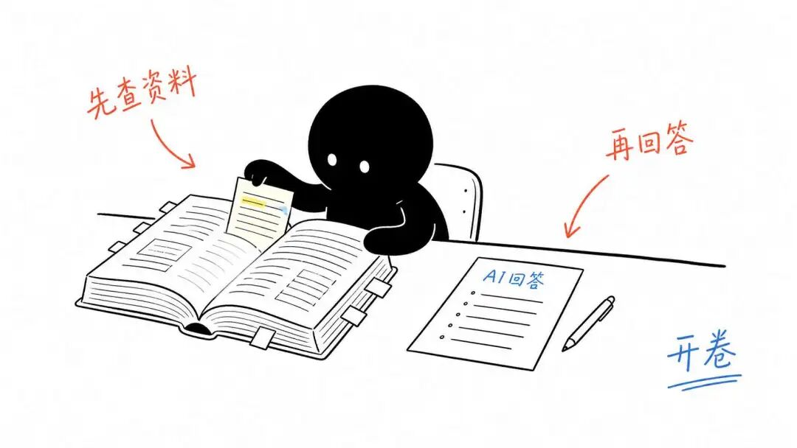

一句话解释：RAG 像开卷考试。AI 不是只靠记忆回答，而是先查资料，再根据资料回答。

你会在哪遇到：私有知识库问答、企业客服、论文问答、长文档分析。

31. 向量

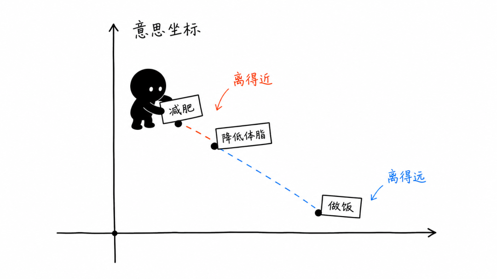

一句话解释：向量可以理解成“意思的坐标”。两句话意思越接近，它们在坐标图上就越靠近。

你会在哪遇到：语义搜索、推荐系统、知识库检索、相似图片搜索。

32. Embedding

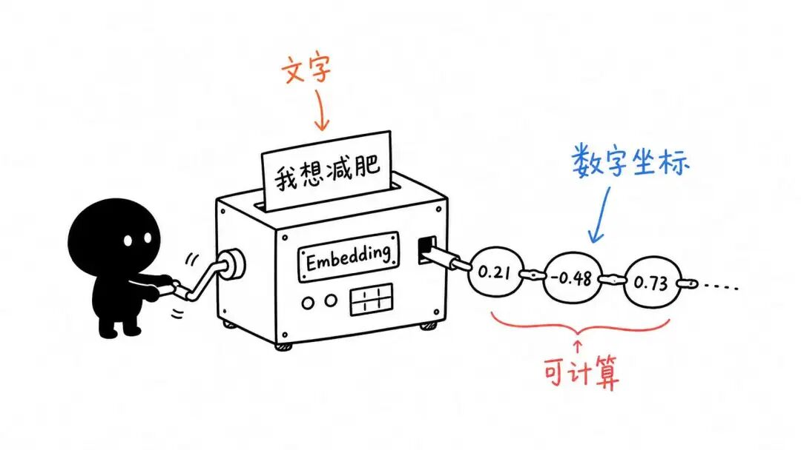

一句话解释：Embedding 就是把文字、图片变成 AI 能计算的数字坐标。

你会在哪遇到：搭知识库、做语义搜索、做推荐、做相似内容匹配。

33. 向量数据库

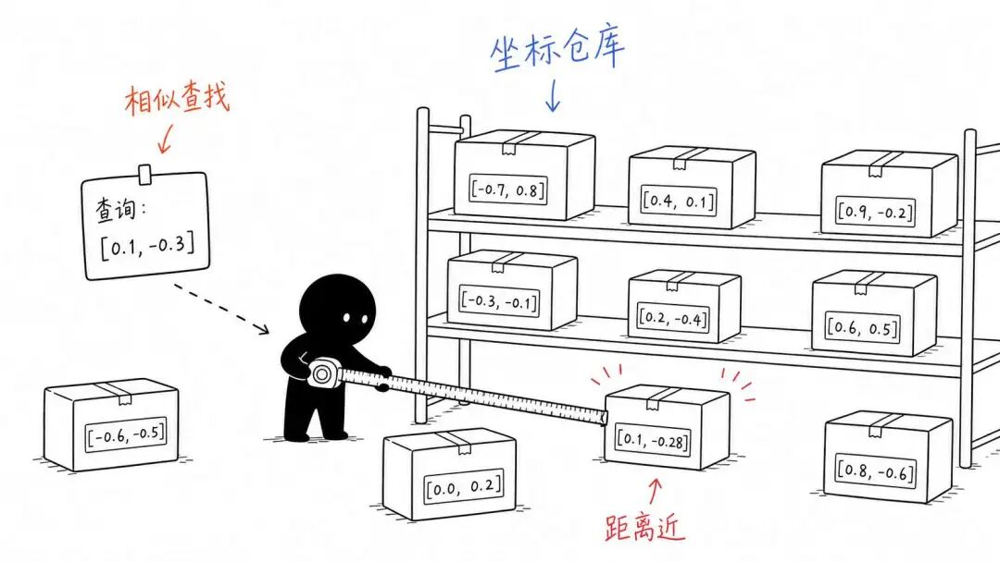

一句话解释：向量数据库就是专门存这些“意思坐标”的仓库。

你会在哪遇到：Pinecone、Milvus、Weaviate、Chroma、企业知识库系统。

34. 语义搜索

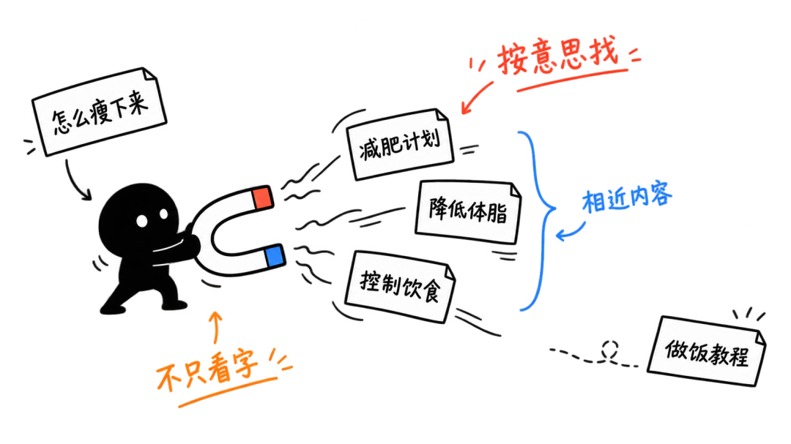

一句话解释：语义搜索不是只找同样的字，而是找意思接近的内容。

你会在哪遇到：你搜“怎么睡得更好”，系统也能找到“改善睡眠质量的方法”。

35. Chunk 分块

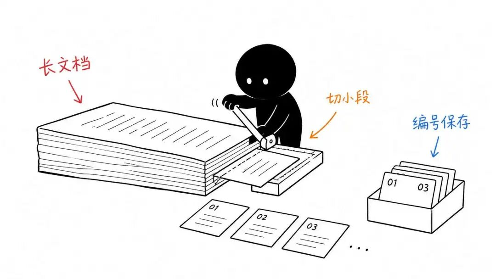

一句话解释：Chunk 分块就是把长文档切成小段，让 AI 更容易查找和引用。

你会在哪遇到：把 PDF 放进知识库、让 AI 阅读长文章、搭建 RAG 系统。

六、模型训练和优化相关的 7 个词

这组词回答的是：模型是怎么被训练、压缩、改造和部署的。

36. 训练

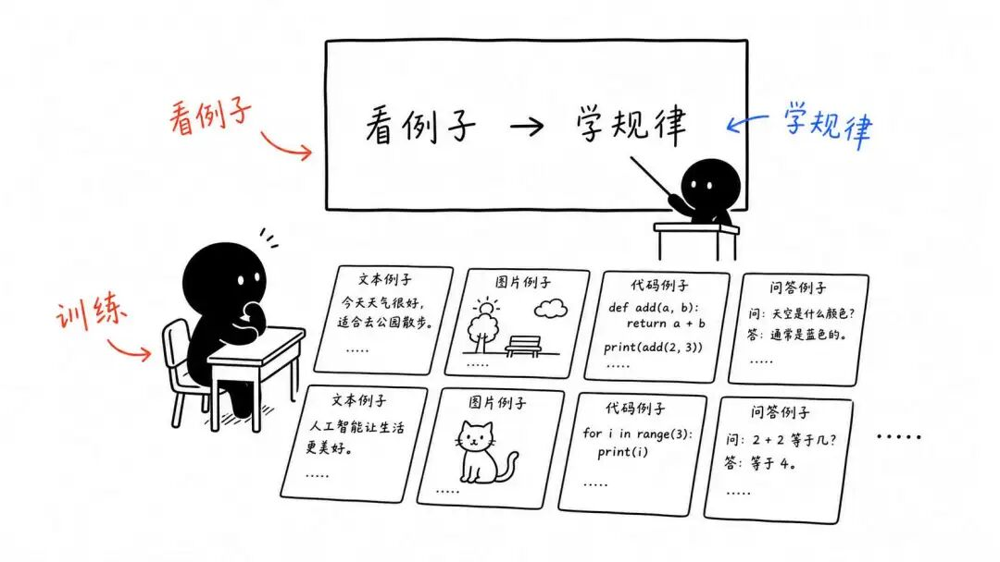

一句话解释：训练就是让 AI 看大量例子，慢慢学会规律。

你会在哪遇到：“训练大模型”“训练图片模型”“训练一个自己的小模型”。

37. 推理

一句话解释：训练像上学，推理像考试。AI 每次回答你，就是在推理。

你会在哪遇到：调用 API、聊天回答、生成图片、生成视频，都是推理阶段。

38. 微调

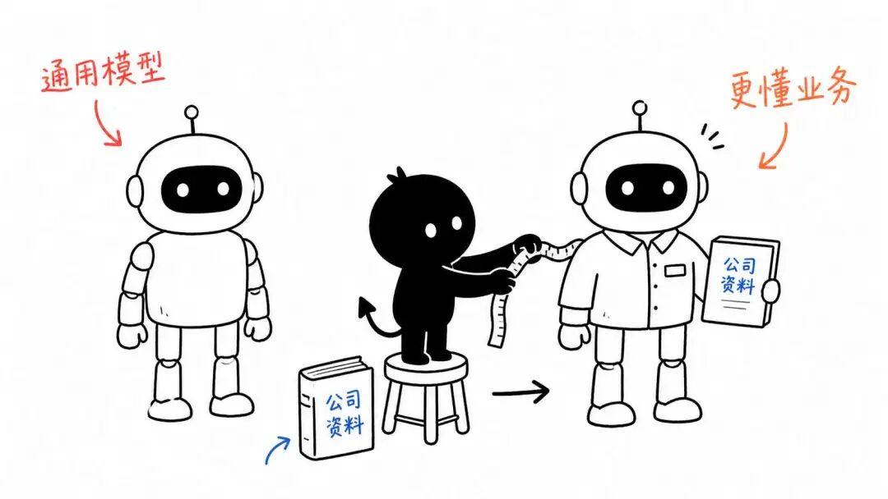

一句话解释：微调就是让一个通用 AI 去学你的专业资料和说话方式。

你会在哪遇到：客服模型、行业模型、企业内部模型、特定写作风格模型。

39. LoRA

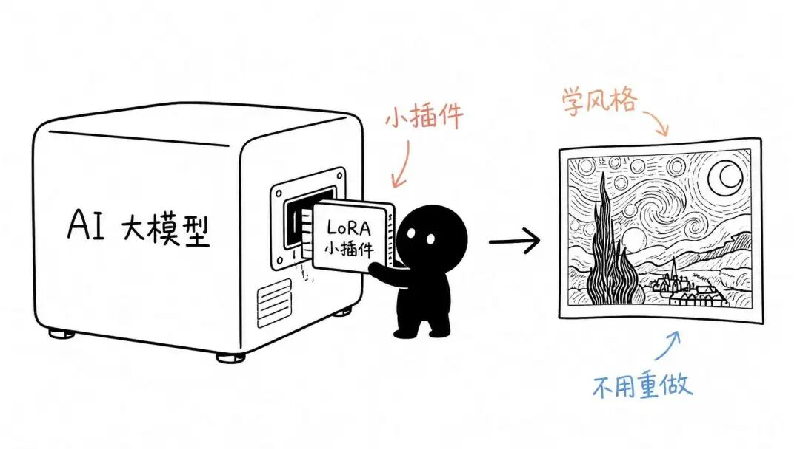

一句话解释：LoRA 像给模型外挂一个小插件，不用重做整个模型，也能学会某种风格或能力。

你会在哪遇到：Stable Diffusion 人物 LoRA、风格 LoRA、产品图 LoRA。

40. 蒸馏

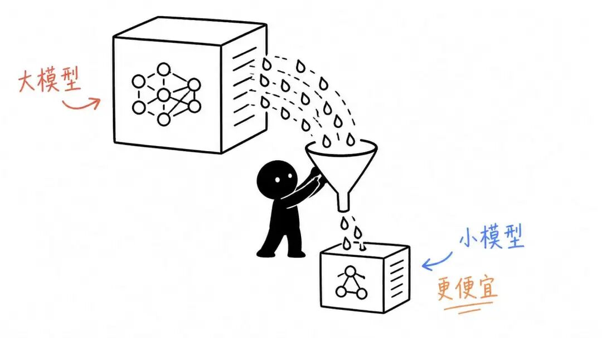

一句话解释：蒸馏像大老师教小学生。大模型把能力教给小模型，小模型就能更便宜、更快地做一部分事。

你会在哪遇到：小模型、端侧模型、本地模型、低成本 AI 服务。

41. 量化

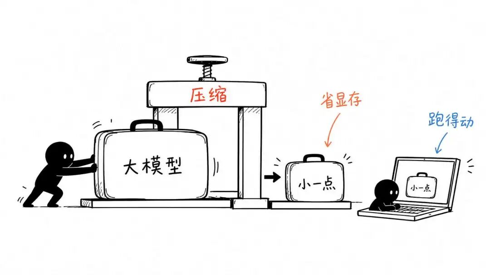

一句话解释：量化像把一张高清大图压缩一下，尽量少损失效果，但文件更小、运行更快。

你会在哪遇到：本地部署模型、4bit、8bit、手机端模型、低显存运行模型。

42. 开源模型

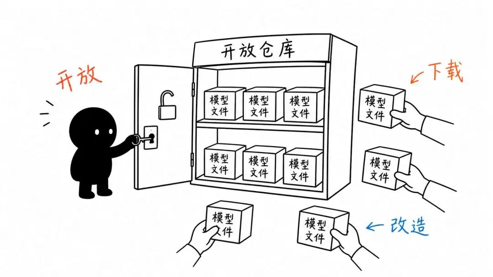

一句话解释：开源模型就是模型权重或代码开放出来，别人可以下载、研究、部署、改造。

你会在哪遇到：DeepSeek、Qwen、Llama、Mistral、Hugging Face。

七、产品和商业使用相关的 7 个词

这组词回答的是：AI 从工具变成产品时，会遇到哪些现实问题。

43. API Key

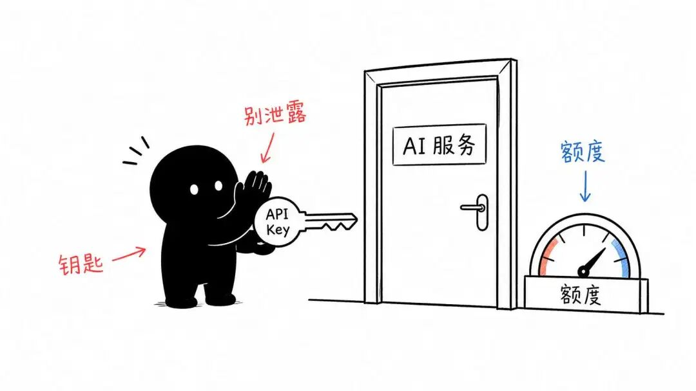

一句话解释：API Key 像你调用 AI 服务的钥匙。谁拿到这把钥匙，谁就可能花你的额度。

你会在哪遇到：接 OpenAI、Claude、Gemini、DeepSeek、图片生成 API。

44. 算力

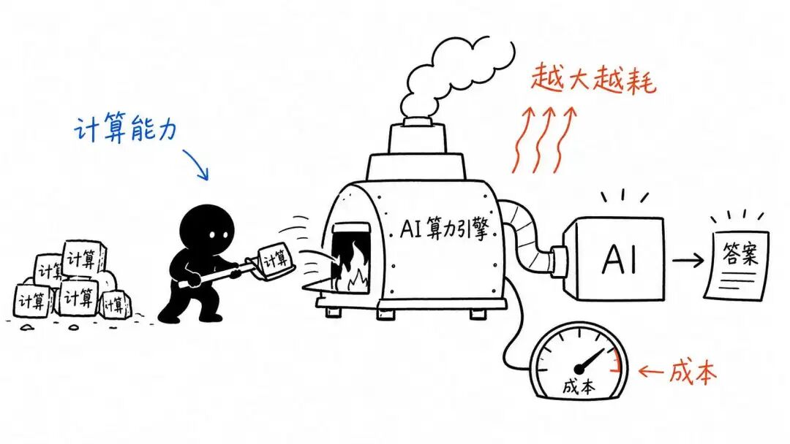

一句话解释：算力就是 AI 干活需要的计算能力。模型越大、任务越复杂，越吃算力。

你会在哪遇到：GPU、服务器、推理费用、训练成本、排队生成。

45. GPU

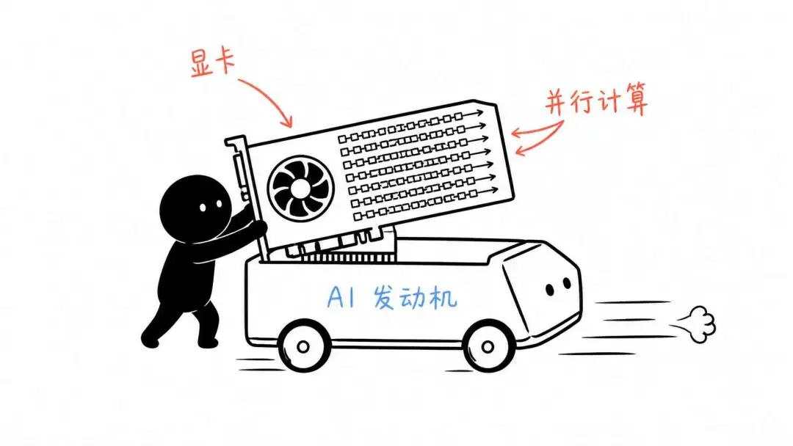

一句话解释：GPU 像 AI 的发动机。它特别适合同时做大量计算，所以大模型很依赖它。

你会在哪遇到：NVIDIA 显卡、A100、H100、4090、本地跑模型。

46. 并发

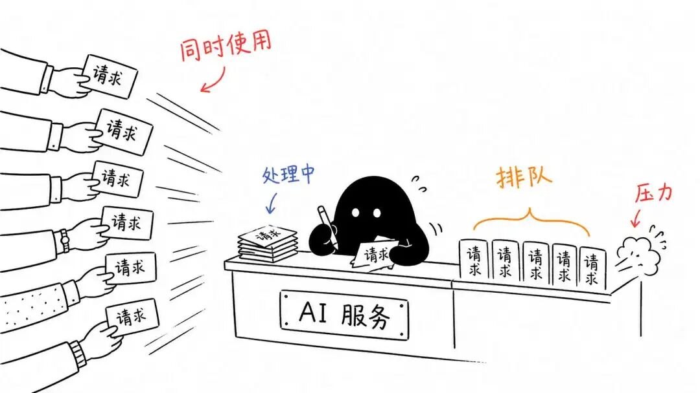

一句话解释：并发就是同一时间有多少人一起使用你的 AI 服务。

你会在哪遇到：网站访问量、API 限流、排队生成、服务器压力。

47. 延迟

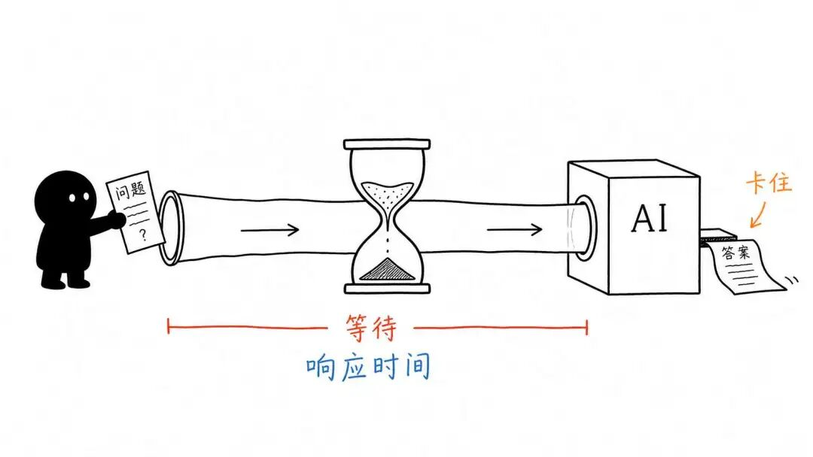

一句话解释：延迟就是你发出请求后，等 AI 回答的时间。

你会在哪遇到：聊天卡顿、图片生成慢、视频生成排队、语音助手反应慢。

48. AI 水印

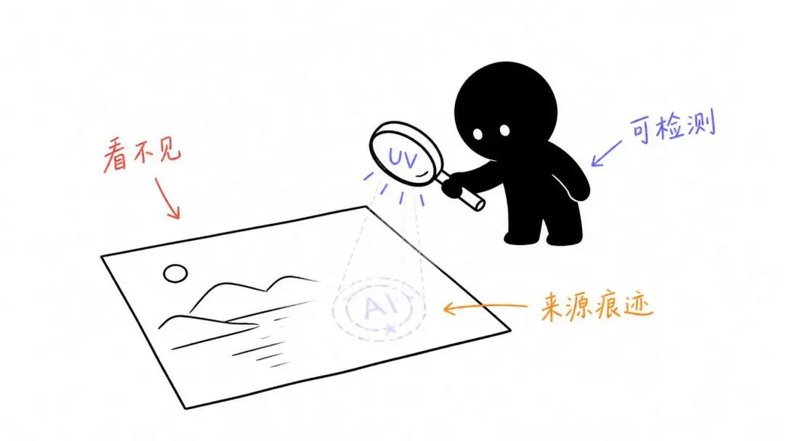

一句话解释：AI 水印像给 AI 内容盖一个看不见的小章。人眼可能看不出来，但专门工具能检测。

你会在哪遇到：AI 图片检测、平台审核、版权标记、素材来源确认。

49. Benchmark / 跑分

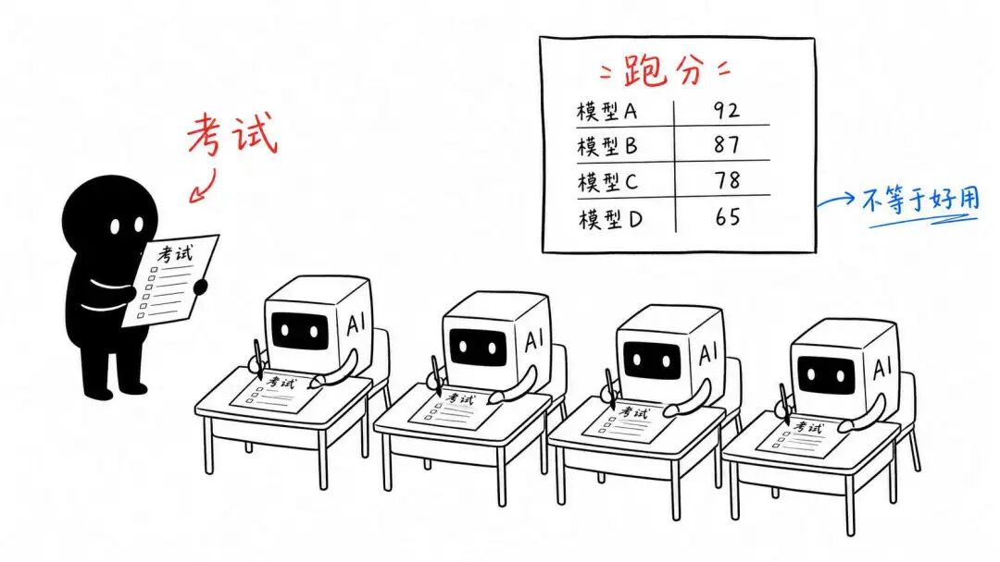

一句话解释：Benchmark 就像给 AI 考试。跑分高，说明它在某些题目上表现好。

你会在哪遇到：模型排行榜、评测文章、“某模型超过 GPT”“数学能力第一”。

最后：这 49 个词怎么记

不用硬背，按场景记就行。

你想知道 AI 是什么，就看：AI、AIGC、大模型、LLM、模型、参数、Token。

你想知道怎么和 AI 沟通，就看：Prompt、提示词工程、System Prompt、上下文、上下文窗口、记忆、幻觉。

你想做内容，就看：多模态、文生图、图生图、文生视频、ASR、TTS、数字人。

你想让 AI 干活，就看：Agent、AI 工作流、Tool Use、Function Calling、MCP、Skill、API。

你想做知识库，就看：知识库、RAG、向量、Embedding、向量数据库、语义搜索、Chunk 分块。

你想理解模型怎么来的，就看：训练、推理、微调、LoRA、蒸馏、量化、开源模型。

你想把 AI 做成产品，就看：API Key、算力、GPU、并发、延迟、AI 水印、Benchmark / 跑分。

AI 名词看起来很多，本质上就这几类：它是什么、怎么沟通、能做什么、怎么干活、怎么查资料、怎么训练、怎么产品化。

先把这张地图记住，再遇到新词，就不会被吓住。

参考：

Anthropic：Model Context Protocol

Anthropic：Tool use with Claude

OpenAI：Structured Outputs

IBM：Retrieval-Augmented Generation

IBM：Vector Database

Google DeepMind：SynthID
