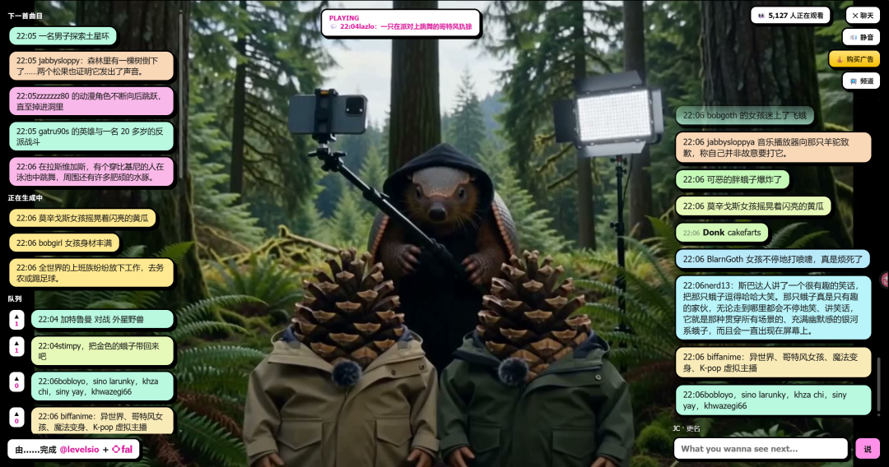

# MiniMax H3可能是新一轮AI视频革命

> 最近有一个大多数人没有关注的AI信息差，但是在我们计算机业内已经引起轩然大波了，就是最近出来了一个叫 MiniMax H3的视频生成模型。

最近有一个大多数人没有关注的AI信息差，但是在我们计算机业内已经引起轩然大波了，就是最近出来了一个叫 MiniMax H3的视频生成模型。

这个模型超级牛逼，为什么呢？

就是就是它的生成速度实在太快了。

快到什么程度呢？比大多数人打字可能还要快。

我刚刚测试，生成五秒的视频只要三秒钟，大家能意识到这是一件多么恐怖的事情啊！

这意味着如果你的提示词喂的足够快，理论上你可以视频不间断的生成的。

现在国外已经有人上线了一个 24 小时 AI 直播网站。

网站首页只有一条很简单的规则：聊天区决定接下来播放什么内容。

观众在聊天室里输入内容，AI 尝试把新的要求和上一段画面接起来，再生成下一段视频。

在这座只有几秒库存的微型电视台里，直播可能突然从动画切到真人访谈，再跳进某个荒诞广告。

观众的下一句话，就会把故事带到另一个方向。

我已经让Codex今晚帮我给Image2网站接入Minimax H3视频了。

我这两天想尝试下是否能接入B站直播，但是成本有点贵，暂时也是小试一下吧。
