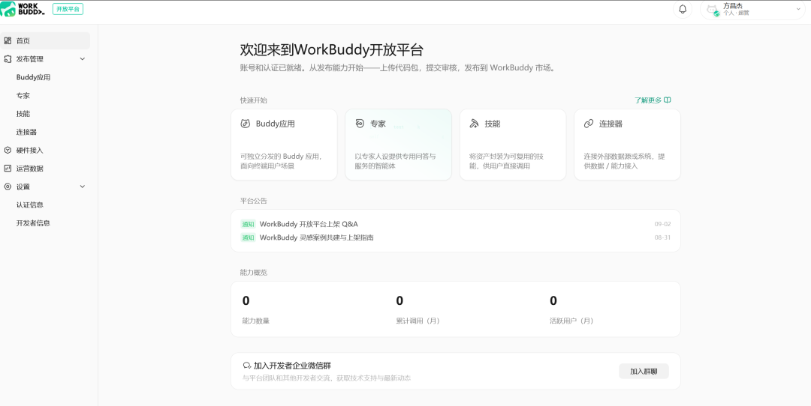
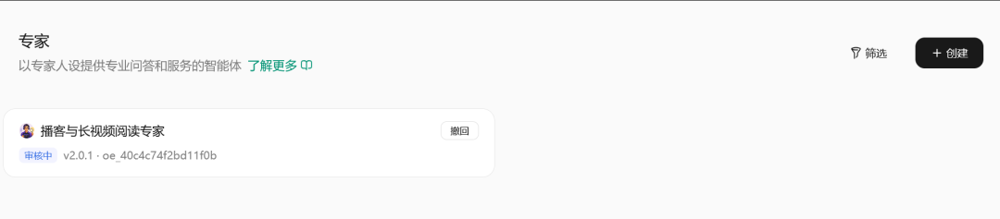

# WorkBuddy 开放平台上线

> 分享一个消息

分享一个消息

腾讯 WorkBuddy 开放平台于 2026 年 9 月 2 日正式上线，开发者可以在平台内管理并接入技能、专家、连接器和外部应用。

我自己测了一下，目前注册分个人和公司。

个人注册只需要姓名，身份证，手机号，邮箱即可，不需要多余的信息。可以发布专家、skill，连接器等。

公司则需要营业执照之类的文件，可以在个人发布基础上发布Buddy应用和硬件接入。

我自己发布了一个我正在用的播客skill，还在审核中。

根据群友的反馈，审核时间大概1-2天。

接下来明天我准备把我手上现有的skill全部扔上去，扔个十几个再说。

Workbuddy从目前来看我仍然认为是蓝海，不仅是目前国内办公使用率最高的Agent，而且付费意愿远远高于豆包，在这上面深耕我觉得是非常有前景的。
