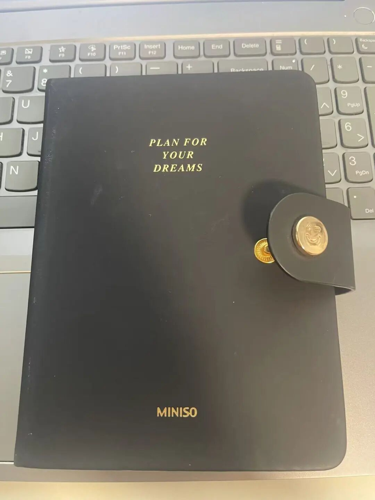
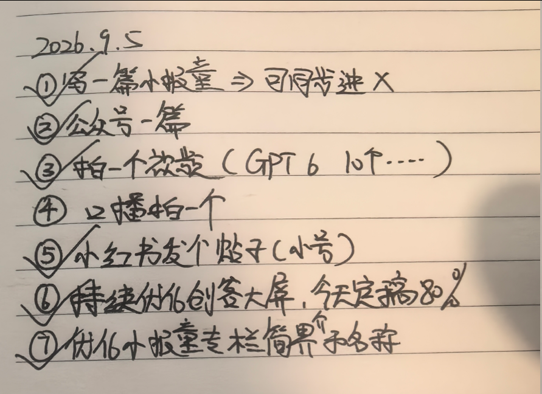
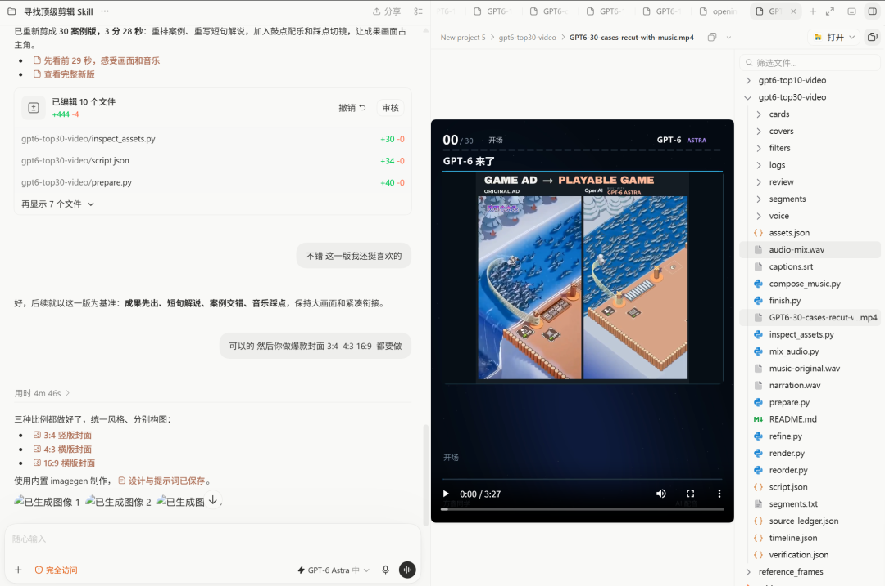

# 习惯的变化

> 因为我有主业和副业，所以经常会忘记自己每天到底要做什么。
这些年我试过很多记录待办的工具：Hermes、飞书、小龙虾、桌面端应用、手机端应用，甚至还自己开发过一款完全按照我习惯设计的桌面待办软件。

因为我有主业和副业，所以经常会忘记自己每天到底要做什么。
这些年我试过很多记录待办的工具：Hermes、飞书、小龙虾、桌面端应用、手机端应用，甚至还自己开发过一款完全按照我习惯设计的桌面待办软件。

结果最后真正一直用下来的，还是我随身带着的那本小笔记本。

它很小，很漂亮，摸起来手感也很好，上写着一句话：plan for your dreams

这句话有时候比一个功能复杂的待办软件更能让我打开它。

给第二天留一张纸

我现在每天晚上做一件固定的事：写下第二天要完成的事情。

不是想到什么记什么，也不是把所有任务都堆进去，而是给明天的自己留一张相对清楚的路线图。

我越来越觉得，这个动作很有必要。

人是很善变的，尤其是在现在这个 AI 信息爆炸的环境里。

今天刚想做一个产品，刷到一个新工具，马上又想去做视频；看到别人做了一个项目，又觉得自己的方向是不是应该调整。

如果每天都被新信息牵着走，最后就会一直在开始新的事情，却没有一件真正完成。

我以前就有这个毛病。晚上觉得明天要做 A，早上起来看到一个新想法，变成做 B；中午又被一条信息带去做 C。

一天过去，确实忙了很久，但最重要的事情没有推进多少。

所以，晚上提前写下计划，本质上是在信息进入之前，先做一次决定。

我的问题不是工作时间不够

当然，计划写下来，也不代表事情就一定能做完。

比如昨天的口播视频没有完成，另一个视频《一口气看完 GPT-6 的 30 个最佳案例》，也是早上七八点才勉强赶出来的。

我每天的工作时间其实不算短，基本已经到了自己能控制的最大值，大约 10 到 12 个小时。现在更应该解决的，可能不是继续增加工作时间，而是提高这段时间的有效产出。

有些重复工作，我已经开始尽量交给 AI。

比如我先写了一篇公众号文章——《GPT-6 能替你干什么？看这 10 个最佳案例》，然后直接让 GPT 把文章改造成视频内容。

这种方式就很高效：核心观点只生产一次，后面再转换成不同的内容形式。

封面因为我之前已经调教过了，所以生成出来的效果我也很满意，各个比例的封面图都有。

本周试试早起写日报

我最近又有一个想法。

我每天都在写一人公司纪实，但大多数时候是在晚上写。工作日我通常 7 点 20 分左右起床，如果当天事情比较多，日报就会被推迟，甚至拖到很晚。

下周我准备改成 6 点 30 分起床，拿出 50 分钟左右完成前一天的一人公司复盘，然后顺手规划今天要做的事情。

也就是把现在的流程从：

“
白天工作 → 晚上回忆和写作

改成：

“
早上复盘昨天 → 规划今天 → 白天执行

这样可能会好很多。

早上的好处是，昨天发生的事情还没有完全忘掉，今天的任务也还没有被各种消息污染。用 50 分钟把昨天收尾、把今天开头，剩下的时间只需要照着计划推进。

当然，早起本身不是答案。如果只是把写日报的时间从晚上挪到早上，却没有减少无效工作，也没有提高专注度，那只是换了一个时间段忙碌。

我想测试的是：固定的早间复盘，能不能帮我减少每天的摇摆。

先执行一周，再看结果。
