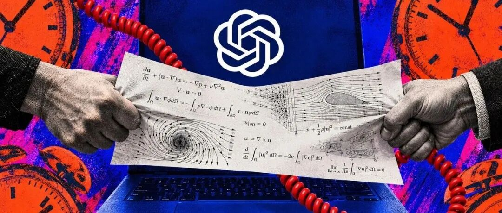
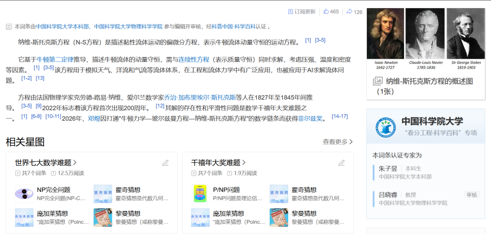
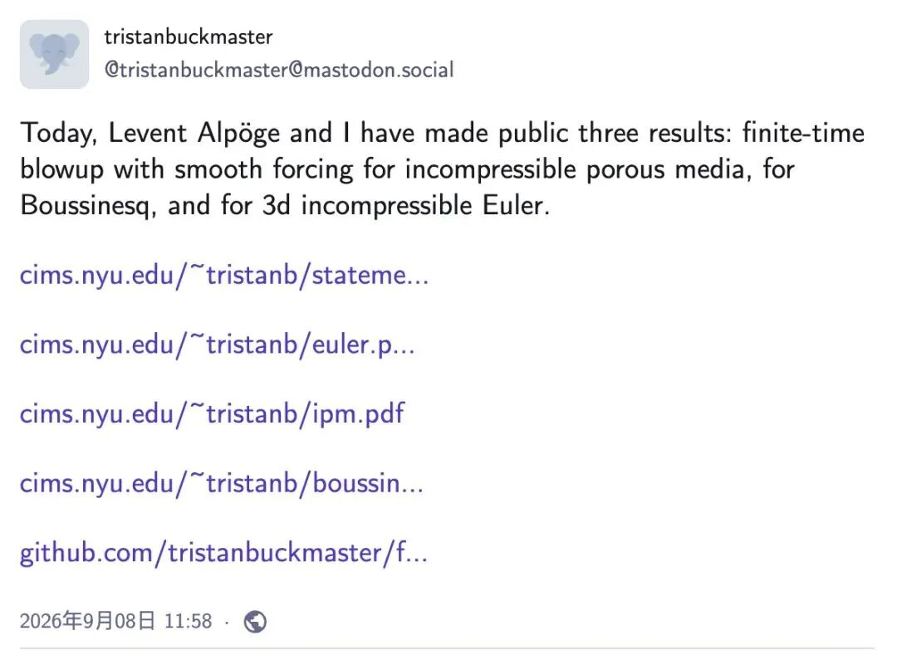
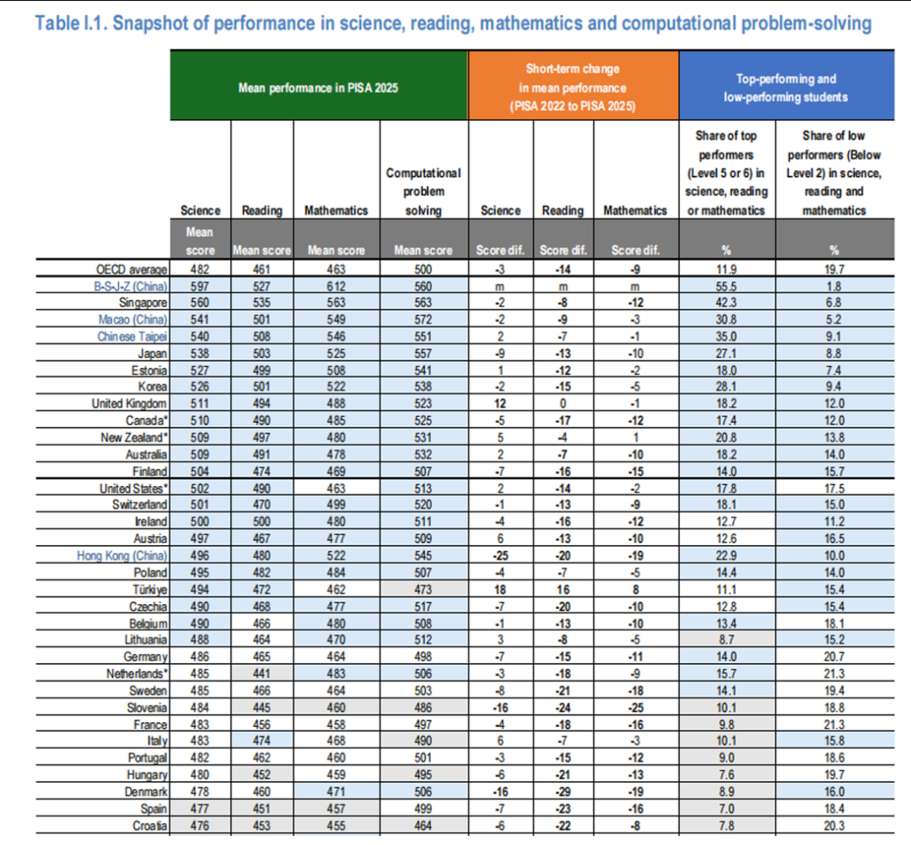

# 数学与AI

> 家好，我是方鑫，今天是一人公司第 166 天。

家好，我是方鑫，今天是一人公司第 166 天。

最近 AI 和数学的新闻特别多。

今天我在语鲸里看到一条很夸张的消息：纽约大学数学家 Tristan Buckmaster 和合作者 Levent Alpöge，借助 AI 推进了几项很难的流体数学研究。

很多标题直接写成：AI 解决了千禧年数学难题。

我一开始也被这个标题吸引了。但仔细看完之后，事情没有那么简单，反而更有意思。

AI与流体方程研究
到底是在研究什么

我们平时看到水流、风、飞机周围的气流，背后都有一套数学规则。Navier–Stokes 方程，就是描述这些流体怎么运动的一组方程。

它已经被写出来一百多年了，但数学家到现在还没有彻底证明：在三维世界里，流体的运动是不是永远平稳，还是可能在某个时刻突然“失控”。

这就是著名的千禧年数学难题之一，答对可以拿一百万美元。

这次研究并不是直接解决了 Navier–Stokes，而是研究了几个和它很像、但稍微简单一点的方程。研究者证明，在某些条件下，原本很平滑的流体运动，确实可能在有限时间内变得极其剧烈。

可以把它想象成：一把锁还没有打开，但有人先打开了几把结构非常接近的锁。这说明方向可能走得通，但不能直接说原来的那把锁已经打开了。

Clay 数学研究所目前仍把 Navier–Stokes 列为未解决问题。

AI在里面干了什么

最值得注意的不是“AI 算出了答案”，而是进入了数学研究的中间过程。

这两位研究者沿着前人的思路研究了一年。到了关键阶段，他们使用 Claude、Codex 等工具，反复尝试推导、修改复杂细节，再把部分证明交给 Lean 检查。

Lean 可以理解成数学证明的自动验收器。

你把一大段证明翻译成它能读懂的代码，它会逐步检查：前一步能不能推出后一步，有没有明显的逻辑漏洞。它不会因为你写得很有气势就放行。

但 Lean 也不是数学家。它只能检查你提交的命题和步骤是否严密，不能替你判断：你证明的到底是不是那个真正重要的问题。

研究者还提到，AI 生成的第一版证明非常难看。他们不得不重新整理，把机器写出来的东西变成同行能够读懂的数学证明。

Tristan Buckmaster公开研究成果
这反而让我觉得很真实。

AI 很擅长不停试错，却不一定擅长把事情讲清楚。数学家目前还不能只拿着一份 AI 生成的证明就宣布胜利，还需要自己理解每一步为什么成立。

另外，研究者后来公开的声明里，还提到了和 OpenAI 围绕发布顺序、署名产生的争议。这个部分目前主要是单方陈述，相关 OpenAI 研究人员已经否认部分指控，所谓的另一份证明也没有公开给外界检查。

所以这件事里，论文进展和“截胡”争议要分开看。前者值得研究，后者还需要更多证据。

更巧的是，数学成绩正在下降

同一天，OECD 发布了 PISA 2025 的结果。

过去十年，OECD 国家和地区的数学平均分从 485 分降到了 463 分，少了 22 分。现在，大约五分之一的 15 岁学生，在科学、数学和阅读三项中都属于低表现者。

这并不能证明是 AI 导致了数学成绩下降，OECD 也没有这么说。

但把这条消息和前面的研究放在一起，还是会让人产生一种很奇怪的感觉：AI 已经开始帮助数学家研究很难的问题，可很多普通人可能越来越不愿意花时间，慢慢解决一道自己不会的题。

我为什么会对这件事有感觉

我自己每天也在用 AI 做产品。

让 GPT 生成一个页面、修改一段代码、把一篇公众号文章改成视频，现在都很快。真正难的是：它生成以后出了问题，我能不能看出来；它给的方案看起来很漂亮，我能不能发现里面少考虑了一个情况。

数学也是这个问题，只是要求更严格。

AI 可以帮你快速找到一条可能的路，但你还得知道这条路通向哪里，中间有没有走错，最后是不是到了你原本要去的地方。

所以我现在对 AI 和数学的判断很简单：

AI 会让“得到一个答案”越来越便宜，但“理解这个答案为什么成立”不会同步变便宜。

参考资料：

Tristan Buckmaster 的公开声明

Terry Tao：Finite-time blowup

Clay Mathematics Institute：Navier–Stokes Equation

OECD：PISA 2025 学生阅读与数学表现
