# GPT Image2.5的十个新玩法

> OpenAI在最近发布了GPT Image2.5图像模型。

OpenAI在最近发布了GPT Image2.5图像模型。

我还挺好奇的，Image2已经很强了，2.5能具体加强在哪些方面呢？

仔细研究了一下，Image 2.5 这次真正加强的，不是“画风更多”，而是参考图更稳、局部修改更准、复杂要求更容易执行，改很多轮之后不容易崩。

我也把它接进了自己的网站。

下面是我整理的十个加强玩法，每个玩法都给出操作方法和提示词。

1. 参考图换衣服，人物还得是原来的人

这是最直观的加强。

官方示例里，输入是一张孩子穿红衣服的肖像，输出换成了白色礼服，但姿势、脸、蓝色背景和照片感觉都保留了。

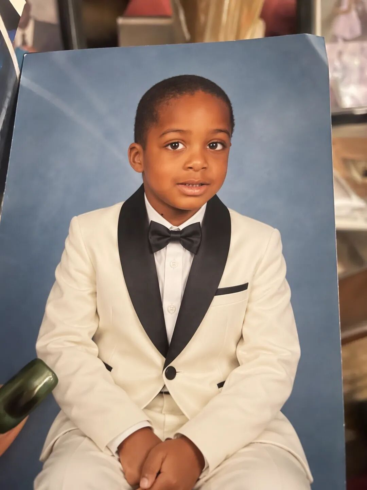
Image 2.5 参考图编辑后的肖像
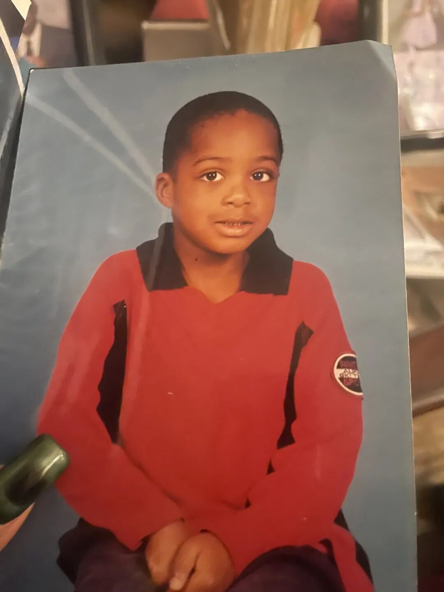
Image 2.5 参考图原图
提示词：

“
保留照片中孩子的脸、发型、姿势、年龄感、蓝色背景和原有光线，只把红色上衣改成象牙白色礼服，黑色翻领和黑色领结，像正式摄影棚肖像。不要改变人物身份，不要改变构图。

用法：换衣服、换发型、换背景都可以，但要写清楚“保留什么”。

Image 2.5 的优势，就是更适合做这种参考图驱动的变化。

2. 人物换场景，脸和身份不丢

Image 2.5 比 Image 2 更适合把同一个人带到不同场景里。

比如把自己的照片做成一组个人品牌图，而不是每次生成一个“长得差不多的人”。

参考照：

提示词：

“
以这张照片中的人物为唯一参考。保留脸部特征、发型、年龄感和体型不变，只把场景改成晚上 10 点的书房。人物坐在书桌前写作，暖色台灯，真实摄影，画面左侧留白用于放公众号标题，不要添加其他人物。

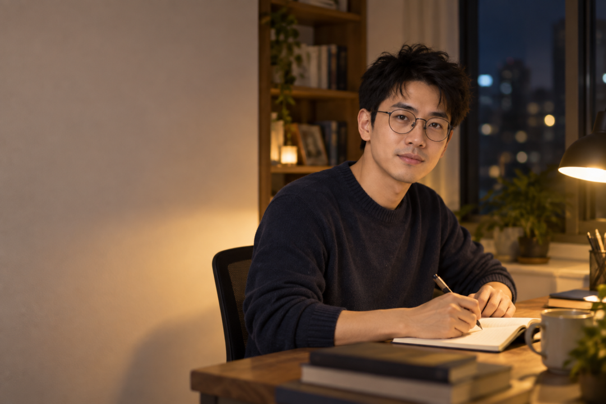

方法：第一轮先把人物和场景做对，第二轮再改光线，第三轮再改构图。不要每一轮都重新上传照片。

3. 只改局部，不要整张图跟着变

这次官方重点强调了精准编辑：只更新产品、背景或一小段文字，同时尽量保留主体、构图和品牌处理。

下面这张官方示例是一个带邮戳的老邮票，适合拿来理解“细节很多时，只改一个地方”。

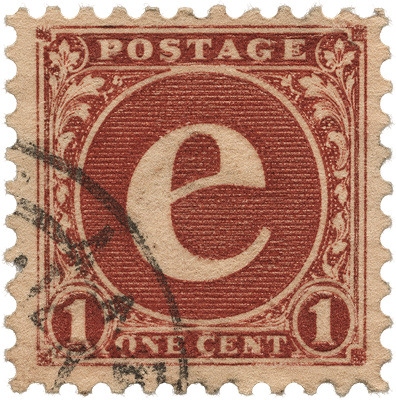
Image 2.5 官方邮票细节示例
提示词：

“
只修改邮票中央的字母 e，把它改成字母 f。保留邮票边缘、纸张纹理、红色印刷、数字 1、POSTAGE 文字和黑色邮戳不变，不要改变图片比例。

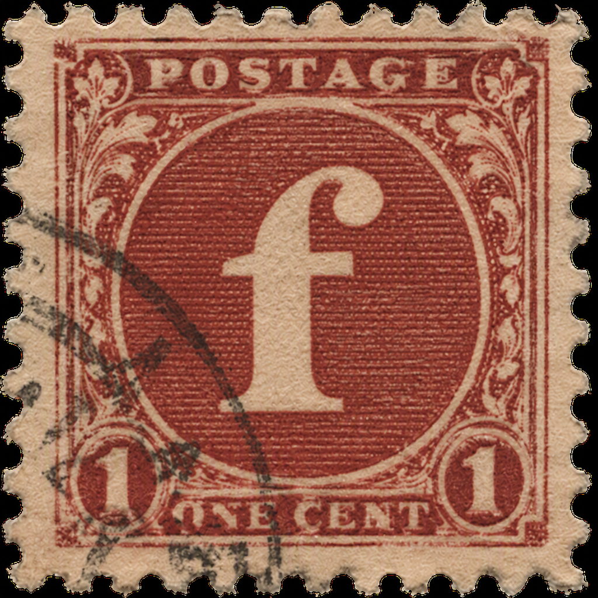

这个玩法很适合修产品图、改海报中的一个对象、删掉背景路人，省掉重新生成整张图的时间。

4. 同一个主体，连续改五六轮

Image 2 做一张图没有问题，真正麻烦的是后面反复修改：人物动一下，背景变了；背景改一下，产品又变了。

Image 2.5 对多轮编辑的一致性更好，可以这样用：

第一轮：

“
生成一张人物在书店写作的照片，人物在右侧，左侧留白，暖色灯光，写实摄影。

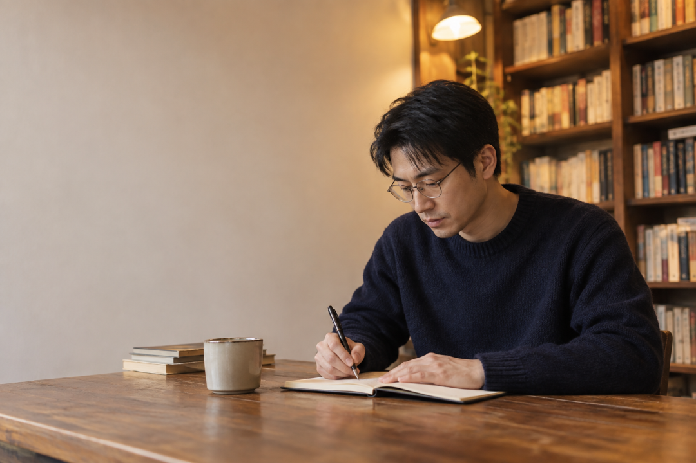

第二轮：

“
只把人物向右移动 10%，脸、发型、衣服和书店保持不变。

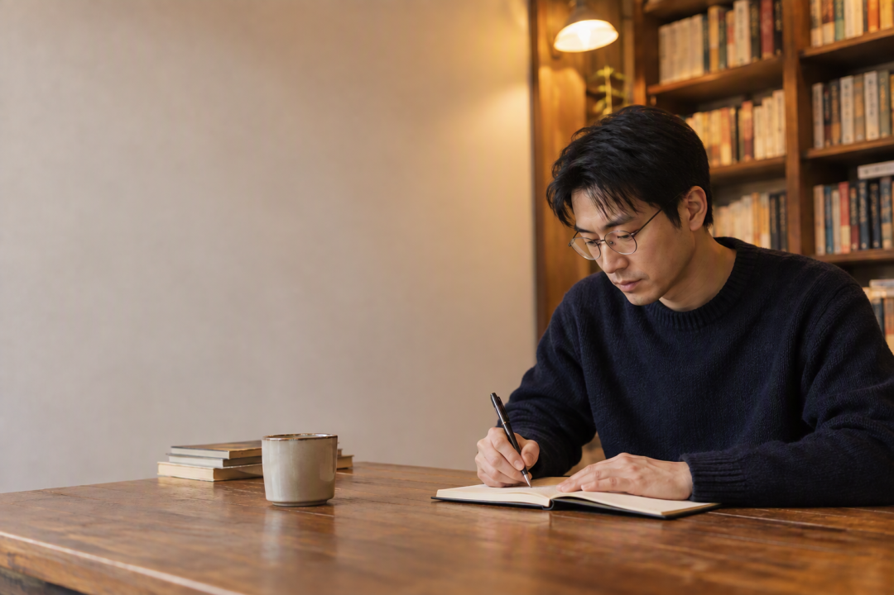

第三轮：

“
只把灯光改成黄昏色，保持人物、构图、镜头角度和背景物体不变。

第四轮：

“
只扩大左侧留白，用来放标题，不要改变人物和书架。

关键动作：在同一个对话里继续编辑，不要每次从零开始。这才是 2.5 相比 2 更适合进入工作流的地方。

5. 同一个字母，换成不同材质

Image 2.5 对材质、光线和风格的理解更细。官方示例里，同样是字母 G，可以做成珠宝、霓虹灯、金属、玻璃等完全不同的东西。

提示词：

“
生成一个立体字母 G。字母结构必须清晰可读，整体造型保持不变，只把材质做成镶满钻石的黄金珠宝，摄影棚灯光，透明背景，细节丰富。

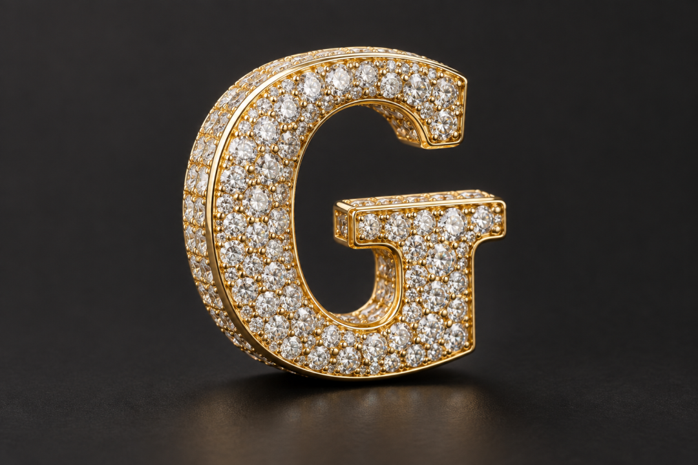

然后只替换最后一句：

“
只把材质改成彩色霓虹灯管，发光边缘，深色背景，其他字母结构保持不变。

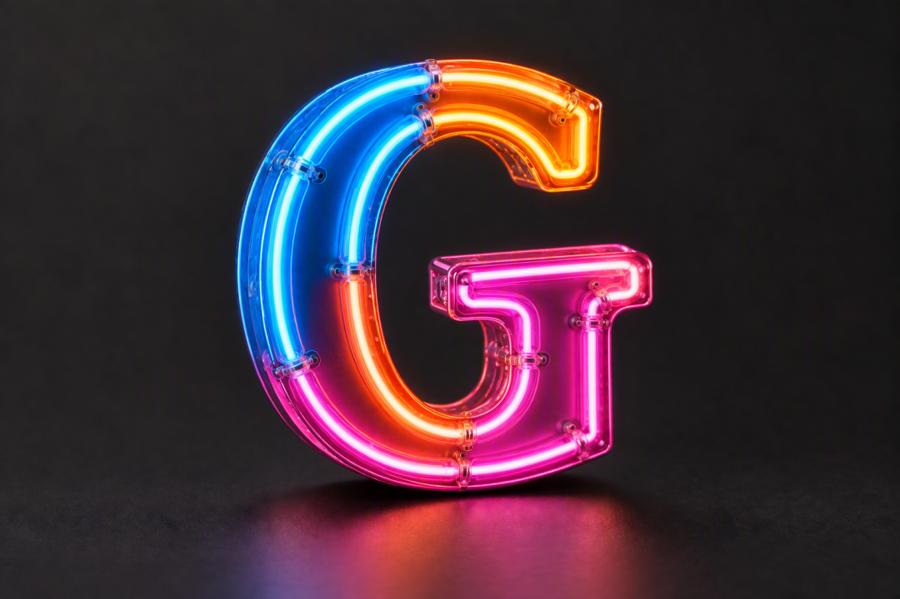

这可以用来做品牌字母、活动主视觉、头像、栏目 Logo 和视频片头。

6. 复杂纹理也能保留下来

相比只追求“好看”，2.5 更适合做材质明确的物体。下面这个字母 P 是彩色玻璃和金属拼接的效果，花纹、边框和透光感都比较具体。

提示词：

“
生成一个大写字母 P，结构清晰，做成手工彩色玻璃窗：蓝色、绿色、琥珀色玻璃拼接，金属边框，背后有柔和透光，透明背景，正面视角，细节真实。

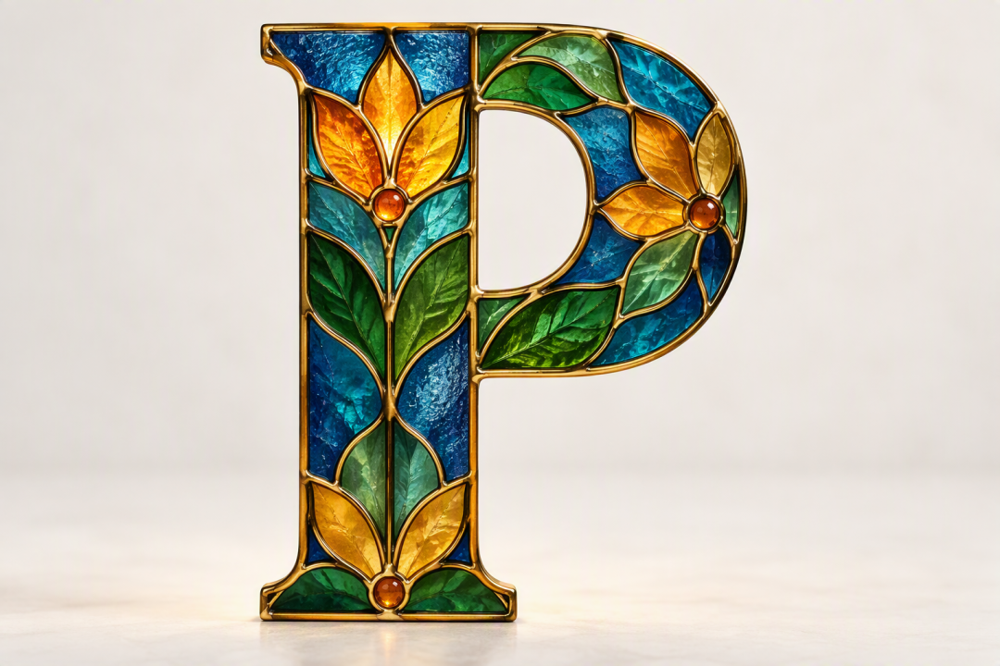

同一个方法也可以做皮革、木头、陶瓷、刺绣、纸张和冰块。提示词里要同时说“材质、光线、视角”。

7. 透明背景素材，可以直接进入设计流程

这一类非常适合一人公司。官方示例里的狗是完整主体，背景透明，边缘和毛发细节都保留了。

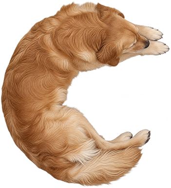
Image 2.5 透明背景主体示例
提示词：

“
把图中的狗完整抠出来，生成透明背景 PNG。保留毛发边缘、耳朵、爪子和原有颜色，不要添加阴影、文字或新元素，不要裁掉身体边缘。

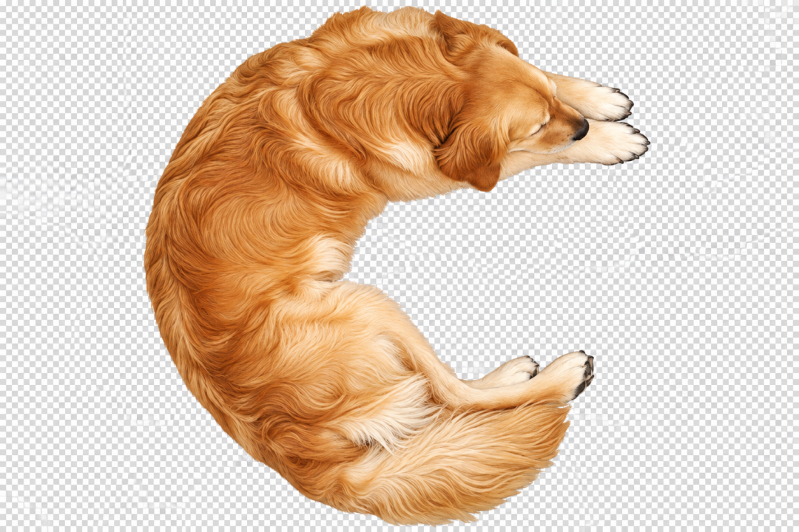

用途：公众号配图、网站素材、PPT、商品详情页、视频封面。

相比 Image 2，我更愿意把这类输出直接放进后续设计流程，但重要素材仍然要人工检查边缘。

8. 真实世界的字、数字和纹理

Image 2.5 还加强了对真实信息和复杂视觉细节的处理。数字不只是平面字体，还可以放进 LED、涂鸦、气球、棒球等真实物体里。

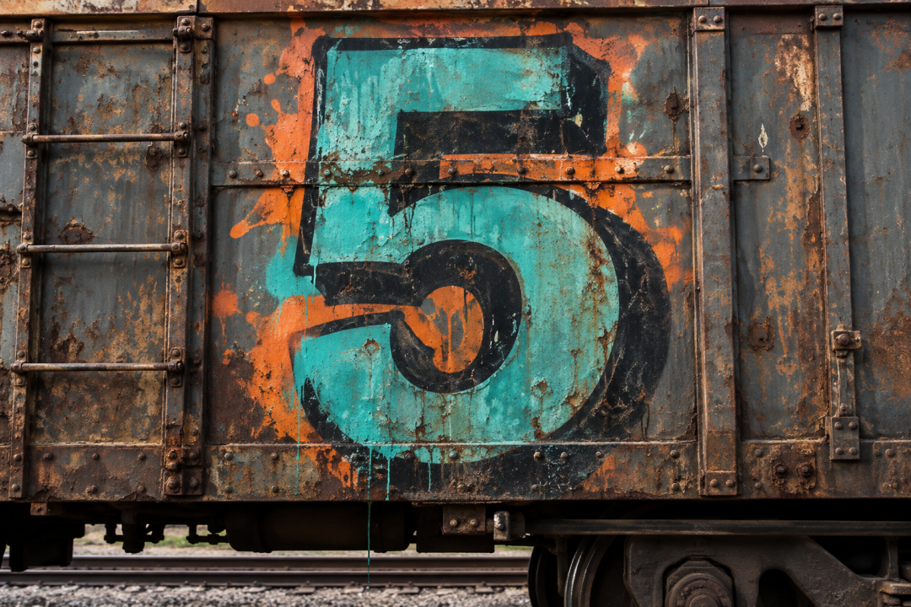

Image 2.5 涂鸦数字 5 示例
提示词：

“
生成数字“5”，数字必须清晰可读，把它做成一面旧火车车厢上的街头涂鸦。保留金属车厢的锈迹、喷漆颗粒和环境光，正面视角，不要出现其他数字。

适合做：课程封面、活动编号、数据卡片、数字海报、品牌视觉。数字和文字越重要，生成后越要放大检查。

9. 同一个构图，换成完全不同的风格

Image 2.5 对风格指令的执行更稳定。

下面两个官方示例都是字母 P，但一个像花朵标本，一个像彩色玻璃窗；主体轮廓仍然清楚，材质和颜色完全换了一套。

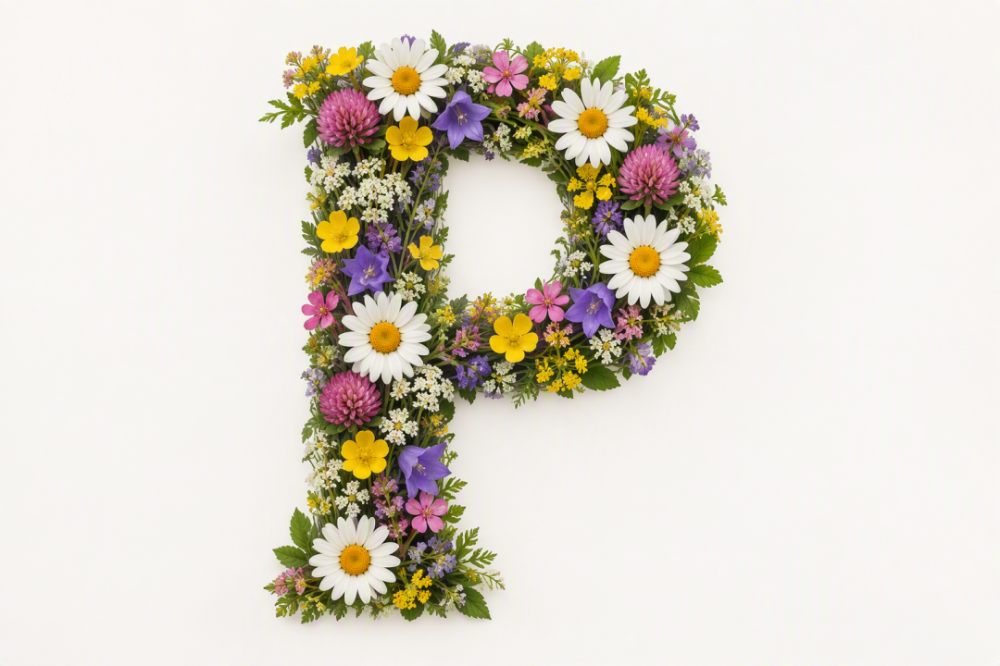

提示词：

“
保持字母 P 的轮廓、比例和正面构图不变，只把风格改成彩色玻璃窗。蓝色、绿色和琥珀色玻璃拼接，金属边框，背后有柔和透光，透明背景，细节真实。

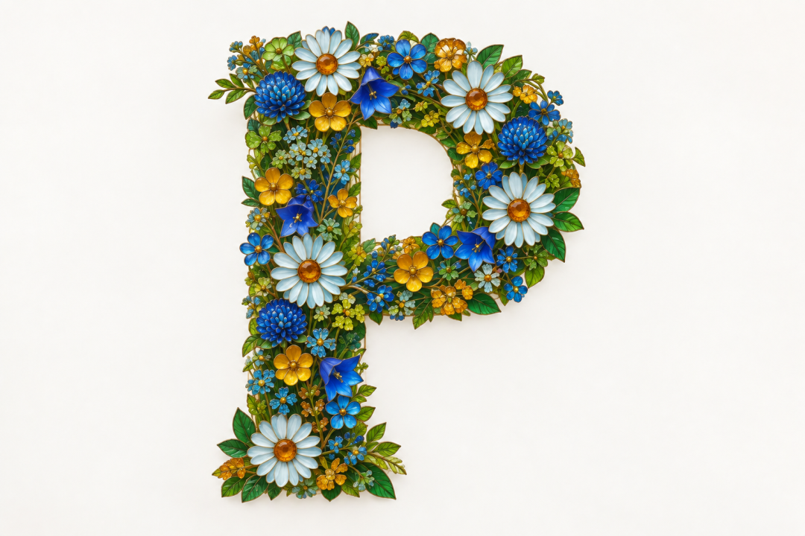

方法：先把构图和主体锁定，再替换“材质、色彩、光线”三项。这样很适合做同一个品牌的多套视觉方案。

10. 把加强能力做成网站按钮

我今天把 Image 2.5 接进自己的网站，最大的感受是：用户不应该先学会提示词，才有资格使用模型。

网站可以把上面的能力做成十个按钮：

换衣服、换场景、局部修改、多轮精修、材质变换、透明背景、数字海报、商品图、封面图、批量生成。

以“换背景”为例，后台提示词可以写成：

“
只改变背景为【用户输入的场景】，保留主体的脸、形状、颜色、比例、光线和原有构图不变。不要添加多余人物、文字或品牌。

以“商品图”为例：

“
保留产品的颜色、形状、LOGO、材质和比例不变，只更换背景为【用户输入的场景】，产品位于画面中央，光线自然，背景干净，不添加其他品牌。

API 里，GPT-Image-2.5 Flare 适合网站实时预览、批量生成和快速试错；GPT-Image-2.5 Sunburst 适合最后精修和正式广告图。

我觉得 Image 2.5 的核心升级

Image 2 的玩法，很多在 2.5 里都不是“第一次出现”。但 2.5 把几个决定能不能干活的地方补上了：

参考图中的人、宠物、产品更容易保持一致。

只改一个局部时，对其他内容的破坏更少。

多轮编辑时，前面的修改更容易保留下来。

材质、光线、纹理和复杂视觉指令更容易落地。

透明背景、复杂布局、真实信息和风格变体更适合接进生产流程。

官方称，相比 Images 2，Images 2.5 的生成延迟最多降低 50%。

所以我现在更愿意把 Image 2.5 当成一个“图片修改器”和“素材生产工具”，而不只是一个生图玩具。
