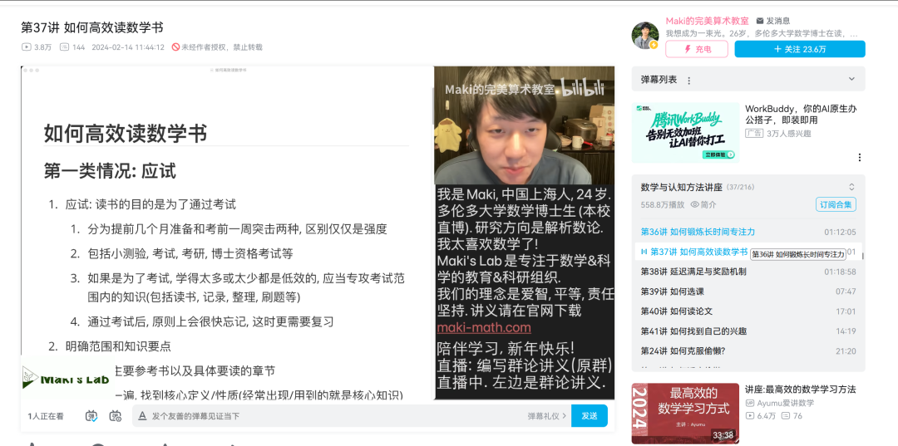

# 近期事项

> 最近有很多想干的事，也干了很多事，具体列一下吧

最近有很多想干的事，也干了很多事，具体列一下吧

1、接了一个企业宣传片的单子，报价是8000，谈价到6000,10分钟的视频，GPT Astra 6直接把pro 20x额度全部跑空，两天完成任务

2、我感觉我一直有想做AI讲座的想法，就是闲聊天，具体形式有点类似于这样的，但是我一直没有做起来，可能我自己的知识底蕴也不够，但我还是想尝试一下。

3、我一直在尝试手机直接录屏，然后AI进行剪辑我的录屏，然后自己做动画，就可以做出比较顶级的视频效果。

4、我尝试把生活中非常多的东西都进行自动化，但是目前收效甚微，甚至于在变现上也收效甚微，我近期有点沮丧，我在寻求破局的方法，或许是我太过于专注于变现。

5、尝试商单视频。最好是能批量快速制作。
