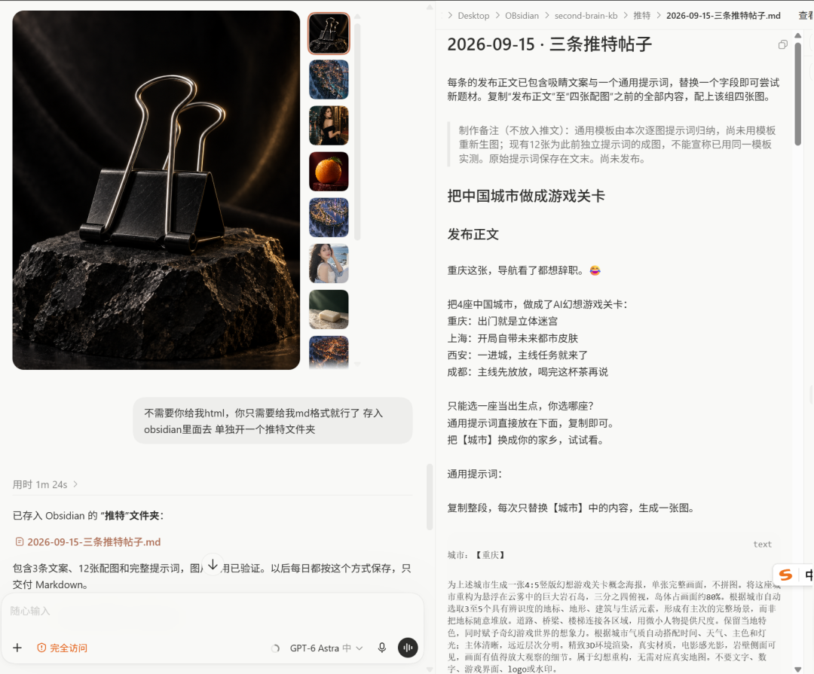
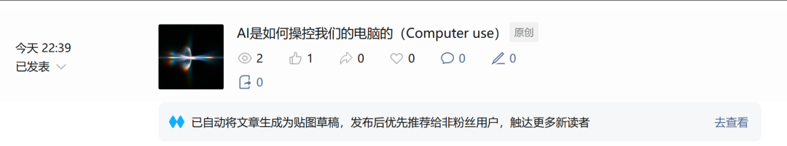
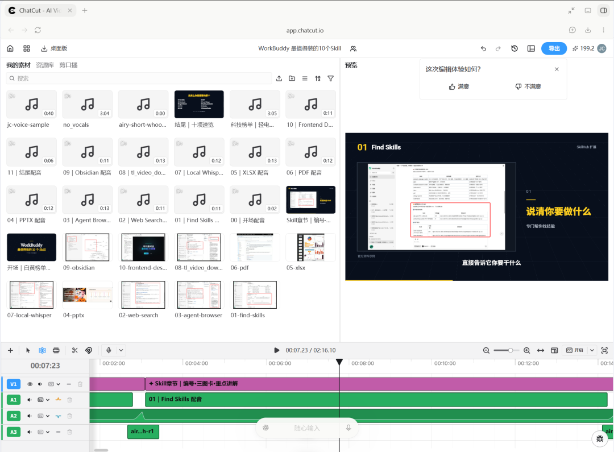
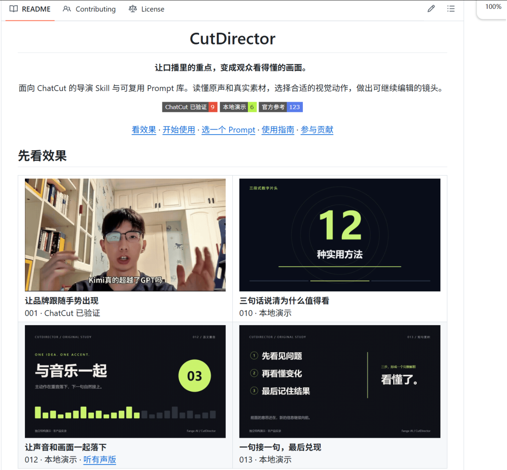
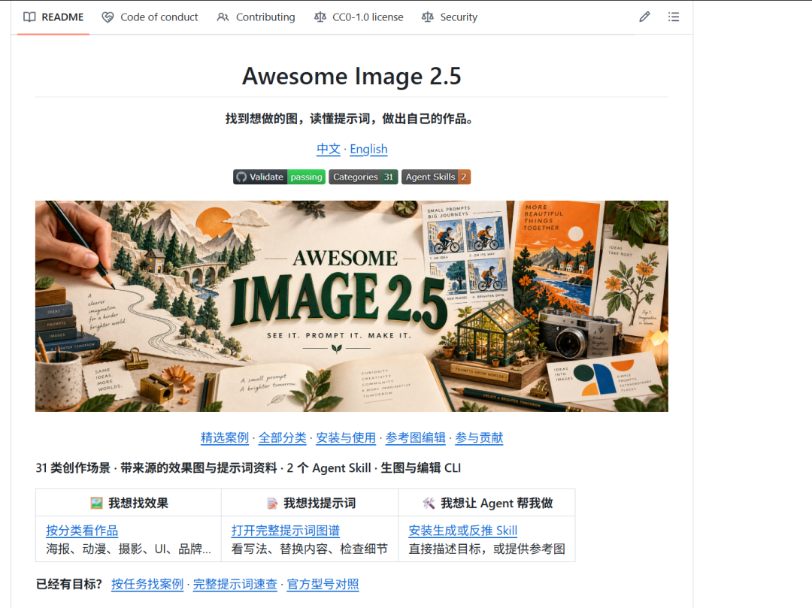

# 简洁明了

> 1、自动化流程——X图文。

1、自动化流程——X图文。

城市游戏关卡、日用品广告、电影人像，共12张图。

我以后准备让Codex自动帮我制作X图片提示词和文案，每天发布10个左右，为Image2网站跑流量。

2、整理了《AI到底是怎么操控你的电脑的？》

AI是如何操控我们的电脑的（Computer use）

初稿和6张配图，用“看屏幕—判断—操作—检查结果”解释原理，已存入Obsidian。

3、利用ChatCut做视频《Workbuddy最值得装的十个Skill》，明天做完。

4、推进cut-director开源项目。

从最近做的商业宣传片参考视频里提取通用Prompt，加入到开源项目中，然后优化了一下项目。

5、设置了每晚22:30自动生成日报，汇总当天工作和AI资讯，保存到Obsidian，人工审核修改后再发布。

6、利用Gpt 6 Astra全面审查了我的Image2网站，花掉了大概20x pro 15%的额度。

7、给Mac电脑装了个win的双系统。

8、持续优化我的AweSome Image2.5

